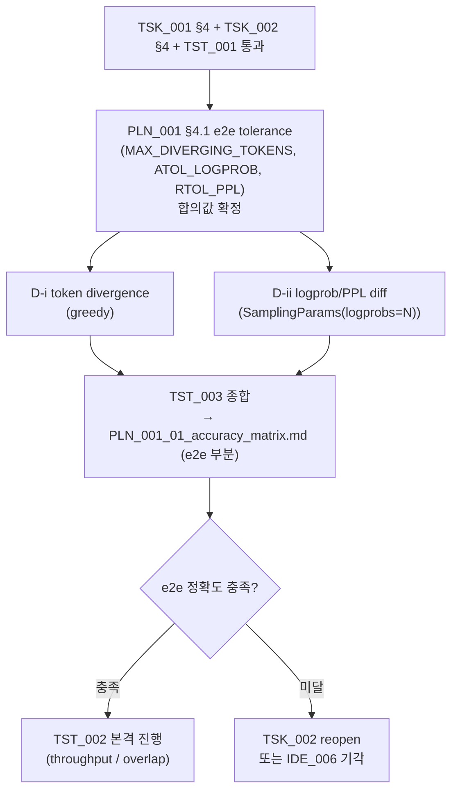

**↑ 부모**: [`PLN_001`](PLN_001.md) · **← 이전 형제**: [`TST_001`](TST_001.md) · [`TST_002`](TST_002.md) · [`TST_004`](TST_004.md) · **↟ 조부**: [`IDE_006`](README.md) · **검증 대상**: [`TSK_001`](TSK_001.md) · [`TSK_002`](TSK_002.md)

---

# TST_003 — Cold-KV CPU Partial Attention e2e 통합 정확도 검증

| 항목 | 값 |
|---|---|
| ID | `TST_003` |
| 상태 | `대기` (`TSK_002` 완료 후 `활성`) |
| 부모 PLN | [`PLN_001`](PLN_001.md) |
| 조부 IDE | [`IDE_006`](README.md) |
| 자매 TST | [`TST_001`](TST_001.md) (TSK_001 kernel 정확도) · [`TST_002`](TST_002.md) (throughput / overlap) · [`TST_004`](TST_004.md) (TSK_003 prod SIMD cross-check) |
| 검증 대상 | **[`TSK_001`](TSK_001.md) + [`TSK_002`](TSK_002.md)** 통합 vLLM forward 경로 |
| 매핑 IDE_006 진입 조건 | **(c)** tolerance(rtol/atol) 의 **e2e 측** — `enable_hot_cold_split=True` 의 모델 출력이 split-off 의 출력과 사전 합의 임계 내 일치 |
| 후속 | [`TST_002`](TST_002.md) (throughput 본격 진행) · `FEA_###` (통합 기능) |
| ID 넘버링 출처 | [`shadow_assists/id_registry.md`](../../id_registry.md) |

> **책임 분리**: `TST_001` 은 TSK_001 단독 (kernel + KVViewAdapter + wrapper) 의 정확도. **본 TST_003 은 TSK_002 통합 후의 e2e 정확도** — vLLM model_runner 수준에서 split-on / split-off 의 모델 출력 일치 여부. 두 TST 는 검증 대상 / 의존 / 활성화 시점이 다름.

> **단계 주의**: 본 파일은 PLN 임계 충족 후의 **검증 작업 단위 (pre-FEA)**. 실제 e2e 테스트 코드는 `tests/v1/cpu_partial_attention/test_e2e_accuracy.py`. 결과 산출물은 `IDE_006/` 디렉토리에 `PLN_001_TST_003_NN_*.md` 로 평탄 적재. PLN_001 §7 의 `PLN_001_01_accuracy_matrix.md` (PoC 의사결정 문서) 가 본 TST + TST_001 의 결과를 함께 집계.

---

## 1. 목적과 범위

### 1.1 · 목적

`enable_hot_cold_split=True` 로 활성된 e2e 경로 (TSK_002 의 model_runner dispatcher → flash_attn(hot) + cpu_partial_attention(cold) → merge_attn_states) 가 **split-off baseline 과 모델 출력이 일치** 함을 검증해 IDE_006 §9 진입 조건 **(c) 의 e2e 측** 충족 여부를 결정.

- 충족 → IDE_006 진입 허용 (PLN_001 §8 분기 입력)
- 미달 → TSK_002 reopen 또는 IDE_006 기각

### 1.2 · 검증 매트릭스 (두 metric 분리)

PPL 은 token id 만으로 계산 불가하므로 e2e 검증을 **두 metric 으로 분리**:

| 단계 | 내용 | 입력 경로 |
|---|---|---|
| **D-i** | Generated **token divergence** — split-on 의 generated token id sequence 가 split-off 와 사전 합의 divergence 임계 이내 (greedy decoding 기준, BF16 비결정성 허용) | `LLM.generate(...)` 의 `output.outputs[0].token_ids` 만 |
| **D-ii** | Logprob / PPL diff — split-on 의 per-token logprob 분포가 split-off 와 tolerance 내 일치. PPL relative diff 도 logprobs 로부터 계산 | `LLM.generate(..., SamplingParams(logprobs=N))` 로 수집 |

**구분 의도**: D-i 는 user-facing 출력의 동등성 (greedy 생성 결과 자체), D-ii 는 internal logits 의 정확성 (수치 일치). D-ii 가 더 엄격하지만 logprobs 수집 비용 (sampling 시 상위 K 저장) 을 요구. 둘 다 통과해야 e2e 정확도 충족.

### 1.3 · 비범위

- kernel 단독 정확도 (A·B·C) — [`TST_001`](TST_001.md) 가 담당
- throughput / overlap — [`TST_002`](TST_002.md) 가 담당
- multi-GPU / TP > 1 — FEA 단계
- prefill chunked attention — TSK_002 §8 Q5 의 deferred 항목 (decode-only first)

---

## 2. 사전 조건

- [`TSK_001`](TSK_001.md) Phase 1 dev 완료 + [`TST_001`](TST_001.md) A·B(i)·C 통과 (kernel 정확성 보장)
- [`TSK_002`](TSK_002.md) §4.1 ~ §4.7 단계 완료. `enable_hot_cold_split=True` 옵션이 e2e 경로 (model_runner dispatcher) 에서 동작
- [`PLN_001`](PLN_001.md) §4.1 accuracy matrix 의 e2e tolerance 합의값 (`MAX_DIVERGING_TOKENS`, `ATOL_LOGPROB`, `RTOL_PPL`) 결정 완료
- [`PLN_001`](PLN_001.md) §3 Scope Lock 유지: BF16/FP16, non-FP8, non-MLA, full attention, 단일 KV group, Qwen2.5-7B-Instruct
- 하드웨어:
    - dev (RTX 3090 + 12900KF): 모델 8K 컨텍스트 fit, 짧은 prompt smoke + 긴 prompt 여러 cell. portable C++ kernel 호출 (TSK_001 §4.2c)
    - prod (Xeon SPR+ + H100×8): AMX/AVX-512 native 경로로 동일 e2e 측정. 다중 GPU 는 FEA 단계 (본 TST 범위 외)

---

## 3. 검증 차원

### 3.1 · Sweep 차원

| 차원 | 값 |
|---|---|
| dtype | BF16, FP16 |
| context length | 짧은 (smoke) / 8K (long-context, cold KV 실 발생 영역) |
| cold ratio | OffloadingConnector 의 자연스러운 분할 (외부 강제 X) |
| batch | 1, 2 (Phase 1 dev) / 1, 2, 4 (prod) |
| greedy params | `temperature=0`, `top_p=1.0`, `seed` 고정 |
| ISA path (kernel side) | dev: portable / Python ref / AVX-512 BIOS-on / prod: + AMX |

### 3.2 · Prompt 셋

- **짧은 prompt** (smoke, 1~2 sample): eval baseline 과 정합. cold KV 미발생 영역 동등성 (split-on 도 cold 가 비어 있으므로 split-off 와 정확히 일치해야).
- **긴 prompt** (cold KV 실 발생, 본 TST 의 main): context ≥ 8K, multi-turn 또는 large-prefix prompt. cold tier 가 자연스럽게 채워지는 영역.
- **비결정성 회피**: greedy + `seed` 고정. FlashAttention 자체의 BF16 비결정성은 tolerance 안에 흡수.

---

## 4. 테스트 코드 구조

### 4.1 · 디렉토리 / 파일

```
tests/v1/cpu_partial_attention/
└── test_e2e_accuracy.py        # D-i (token divergence) + D-ii (logprob/PPL)
```

베이스 TST_001 의 `conftest.py` 에 e2e fixture 추가 또는 별도 `conftest_e2e.py`. 모델 로딩은 vLLM 의 standard `LLM(model=...)` 경로.

### 4.2 · 단계별 outline

#### D-i — `test_e2e_token_divergence`

```python
@pytest.mark.parametrize("prompt", LONG_CONTEXT_PROMPTS)
def test_e2e_token_divergence(
    prompt, model_with_hot_cold_split, model_baseline
):
    """split on/off 의 generated token sequence divergence 가 임계 이내."""
    sp = SamplingParams(temperature=0.0, max_tokens=N, seed=0)
    out_baseline = model_baseline.generate([prompt], sp)
    out_split    = model_with_hot_cold_split.generate([prompt], sp)
    n_div = count_token_divergence(
        out_baseline[0].outputs[0].token_ids,
        out_split[0].outputs[0].token_ids,
    )
    assert n_div <= MAX_DIVERGING_TOKENS  # PLN §4.1 결정값
```

#### D-ii — `test_e2e_logprob_diff`

```python
@pytest.mark.parametrize("prompt", LONG_CONTEXT_PROMPTS)
def test_e2e_logprob_diff(
    prompt, model_with_hot_cold_split, model_baseline
):
    """split on/off 의 per-token logprob 분포 + PPL diff 가 tolerance 내."""
    sp = SamplingParams(
        temperature=0.0, max_tokens=N, seed=0, logprobs=20
    )
    lp_baseline = model_baseline.generate(
        [prompt], sp
    )[0].outputs[0].logprobs
    lp_split = model_with_hot_cold_split.generate(
        [prompt], sp
    )[0].outputs[0].logprobs
    max_abs, ppl_rel = logprob_ppl_diff(lp_baseline, lp_split)
    assert max_abs < ATOL_LOGPROB  # PLN §4.1 결정값
    assert ppl_rel < RTOL_PPL
```

### 4.3 · Helper

- `count_token_divergence(token_ids_a, token_ids_b)` — D-i 전용. greedy 의 token id sequence 두 개를 받아 발산 토큰 수 반환. logprobs 불필요.
- `logprob_ppl_diff(logprobs_a, logprobs_b)` — D-ii 전용. `SamplingParams(logprobs=N)` 으로 수집된 per-token top-K logprobs 두 set 을 받아 `(max_abs_diff, ppl_relative_diff)` tuple 반환.
- `model_baseline` / `model_with_hot_cold_split` — pytest session 단위 fixture. eval/envs 의 두 env 와 정합 (`vllm_original.env` / `ide006_cold_kv.env`).

---

## 5. 실행 / CI 통합

```bash
# Phase 1 dev (TSK_002 후)
/workspace/vllm_dev_prj/bin/python -m pytest tests/v1/cpu_partial_attention/test_e2e_accuracy.py -v
```

CI 환경별:

| 환경 | 활성 | skip |
|---|---|---|
| dev (12900KF) | D-i + D-ii (portable kernel side) | 없음 |
| prod (Xeon SPR+ + H100×8) | D-i + D-ii (AVX-512 + AMX kernel side) | 없음 |

결과:
- raw 결과: `tests/v1/cpu_partial_attention/results/TST_003/<hw_tag>_<timestamp>/`
- 분석 산출물: `shadow_assists/features/IDE_006/PLN_001_TST_003_NN_*.md`

---

## 6. Pass / Fail 기준

| 단계 | 기준 | 미달 시 영향 |
|---|---|---|
| D-i | `n_div ≤ MAX_DIVERGING_TOKENS` (PLN §4.1 결정값, greedy 기준) | scheduler/metadata 통합 결함 → TSK_002 reopen 또는 IDE_006 §9 (c) 미달 → IDE_006 기각 |
| D-ii | `max_logprob_abs_diff < ATOL_LOGPROB` AND `ppl_relative_diff < RTOL_PPL` | 수치 정확성 결함 (kernel 또는 통합) — TSK_001 / TSK_002 진단 후 reopen 또는 IDE_006 기각 |

**전체 게이트**: D-i 와 D-ii 모두 통과해야 e2e 정확도 충족 으로 간주. 둘 다 다른 각도 (user-facing 출력 동등성 vs internal logits 수치 일치) 의 검증.

---

## 7. 산출물 (Deliverables)

| 파일 | 내용 |
|---|---|
| `PLN_001_TST_003_01_token_divergence_results.md` | D-i 결과 sweep |
| `PLN_001_TST_003_02_logprob_ppl_diff_results.md` | D-ii 결과 sweep + PPL relative diff 분포 |
| raw JSON / CSV | `tests/v1/cpu_partial_attention/results/TST_003/<hw_tag>_<timestamp>/` |

각 분석 md 는 측정 환경 (dev / prod, ISA path), pass/fail 매트릭스, 실패 prompt 의 분석을 포함.

---

## 8. 의존성·일정



D-i 와 D-ii 는 동일 prompt 셋에서 병렬 실행 가능 (D-i 는 logprobs=None, D-ii 는 logprobs=20). 비용 차이 약간.

---

## 9. Open Questions

1. **e2e tolerance 임계값 결정**: `MAX_DIVERGING_TOKENS`, `ATOL_LOGPROB`, `RTOL_PPL` 운영 후보값 — 첫 sweep 결과를 보고 PLN §4.1 산출과 합의.
2. **logprobs=N 의 N 값**: top-K logprobs 수집 깊이. K=10 이면 충분한지, K=20 이상 필요한지 — Qwen2.5-7B 의 logit 분포 특성 검토.
3. **`enable_hot_cold_split` 활성 조건**: cold KV 가 자연 발생하는 long-context 만에서 활성, 그 외는 split-off 와 동일 경로 사용 — TSK_002 의 dispatcher logic 확인.
4. **OffloadingConnector partition 의 타이밍 의존성**: 동일 prompt 에 대해 split-on 의 hot/cold 분할이 매 step 동일하게 결정되는지 (deterministic) — 비결정 시 D-i / D-ii 의 baseline 도 흔들림.

---

## 10. References

### 부모·연계 문서

- 부모 PLN: [`PLN_001`](PLN_001.md)
- 조부 IDE 상세: [`IDE_006`](README.md)
- 검증 대상: [`TSK_001`](TSK_001.md), [`TSK_002`](TSK_002.md)
- 자매 TST: [`TST_001`](TST_001.md) (TSK_001 kernel 정확도), [`TST_002`](TST_002.md) (throughput), [`TST_004`](TST_004.md) (TSK_003 prod SIMD)
- ID 넘버링 출처: [`shadow_assists/id_registry.md`](../../id_registry.md)

### 코드 인용

- `vllm/v1/attention/backends/flash_attn.py:967`, `:1214` (LSE merge)
- `vllm/v1/attention/ops/cpu_partial_attention.py` (TSK_001 산출물)
- `vllm/distributed/kv_transfer/kv_connector/v1/offloading_connector.py` (cold-tier)
- `eval/envs/vllm_original.env`, `eval/envs/ide006_cold_kv.env` (e2e baseline)

---

## 11. Change Log

| 날짜 | 변경 | 사유 |
|---|---|---|
| 2026-04-25 | TST_003 초안 작성 | TST_001 의 책임 재구조화 결과 — TSK_002 통합 e2e 정확도 검증 (D-i token divergence + D-ii logprob/PPL diff) 만 분리 적재. TSK_001 단독 검증은 [`TST_001`](TST_001.md) 가 담당. IDE_006 §11 표 step 6 으로 추가. |
| 2026-04-25 | 자매 TST 갱신 (TSK_003/TST_004 분리 반영) | TSK↔TST 1:1 재매핑 (TSK_001↔TST_001 / TSK_003↔TST_004 / TSK_002→TST_003) 결과 — meta header / §10 자매 TST 항목에 [`TST_004`](TST_004.md) (TSK_003 prod SIMD cross-check) 추가. 본 TST_003 의 검증 대상 (TSK_001+TSK_002 e2e) / D-i / D-ii 기준은 변경 없음. |
| 2026-04-26 | 구현 적재 (orchestration 스크립트 형태) + dev 통과 | TSK_002 Phase 4c 가 land 한 직후의 e2e 정확도 게이트 운영. **구현 형태 변경 사유**: §4.1 spec 의 두 LLM 인스턴스 동시 fixture (`model_baseline`, `model_with_hot_cold_split`) 가 dev RTX 3090 24 GB 에 Qwen-7B BF16 두 개 (28 GB) 가 안 들어가서 비현실적. 대신 단일 orchestration 스크립트 [`eval/run_e2e_accuracy.py`](../../../../eval/run_e2e_accuracy.py) 가 두 config 를 *순차* 로 띄우고 (사이에 `gc.collect() + cuda.empty_cache()` 로 메모리 회수) 두 set 의 generated token id + per-token chosen logprobs 를 JSON 으로 저장한 뒤 D-i / D-ii 를 한 번에 산출. helper `count_token_divergence(...)` / `logprob_ppl_diff(...)` 는 §4.4 spec 그대로. prod 에서는 두 모델 동시 로딩 가능하지만 동일 스크립트로 호환. **첫 dev smoke** (Qwen2.5-7B-Instruct, 4 prompts × 32 tokens, hardcoded `--gpu-memory-util 0.85`, atol=0.5/rtol=0.1/MAX=10): worst diverging tokens=0 / worst max abs logprob=0.0848 / worst PPL rel=0.0087 — D-i/D-ii 모두 PASS. PLN_001 §4.1 의 운영 임계값은 본 결과 + prod 결과를 보고 추후 tighten 예정 (현재 spec 기본값은 dev smoke 가 통과하도록 보수적으로 잡음). [`eval/run_prod_smoke.sh`](../../../../eval/run_prod_smoke.sh) 에 `[5/5] e2e accuracy` step 추가 — Llama-3.3-70B-Instruct + TP=8 로 prod 머신에서 실행. |
| 2026-04-26 | env-driven 리팩토링 + dev 에서 prompt 2 발산 발견 | 사용자 검토에서 `[5/5]` step 만 hardcoded CLI args 였던 inconsistency 지적 — 다른 시나리오는 `eval/envs/*.env` single source of truth 인데 e2e accuracy 만 동떨어짐. `run_e2e_accuracy.py` 를 `--baseline-env` / `--split-on-env` 두 path 받는 형태로 리팩토링. env 파일 (bash source 후 `env -0` parse) 에서 MODEL / TENSOR_PARALLEL_SIZE / GPU_MEMORY_UTIL / MAX_MODEL_LEN / EXTRA_SERVE_ARGS (안 의 `--kv-transfer-config={...}` JSON) 추출. 두 env 의 MODEL / TP / max_model_len 일치 강제. **GPU_MEMORY_UTIL harmonisation**: baseline env (`vllm_original*.env`) 가 0.9, split_on env (`ide006_cold_kv_split_on*.env`) 가 0.85 로 다르면 num_gpu_blocks 불일치 → 동일 greedy decoding 도 batch / scheduling 패턴 차이로 token 단위 발산 가능. 알고리즘 변화와 메모리 budget noise 를 분리하기 위해 *둘 중 더 작은 값* 으로 baseline 을 클램프. `run_prod_smoke.sh` 의 `[5/5]` 도 env 두 개 받도록 변경. **dev re-run (env-driven, 동일 prompt set, 동일 max_tokens=32 / logprobs=10)**: prompts 0 · 1 · 3 은 div=0, lp ≤ 0.11 — 이전 PASS 와 동일. **prompt 2** (Python LIS function 코드 생성) 만 `div=32` (전체 발산) / `max_abs_lp=1.10` / `ppl_rel=0.099` — D-i / D-ii 둘 다 FAIL. seed=0 / seed=1 모두 *deterministic* 하게 동일 수치 재현. 첫 PASS run 은 cold path 가 거의 활성되지 않은 lucky case (eviction 적게 발생) 였고, env-driven 으로 fair 비교가 되자 cold path 가 실제 활성된 path 의 numerical / 알고리즘 차이가 드러남. 단순 BF16 floor 만으로는 lp=1.10 차이가 설명 안 되므로 **알고리즘적 검토 필요** — 후속 작업 (TST_003 의 prod 결과 + 진단 후 Phase 4c 의 cold path / LSE merge / KVViewAdapter split-K/V 중 어디서 발생하는지 isolate). PLN_001 §4.1 합의값 확정도 본 finding 해소 후로 미룸. |

---

**↑ 부모**: [`PLN_001`](PLN_001.md) · **← 이전 형제**: [`TST_001`](TST_001.md) · [`TST_002`](TST_002.md) · [`TST_004`](TST_004.md) · **↟ 조부**: [`IDE_006`](README.md) · **검증 대상**: [`TSK_001`](TSK_001.md) · [`TSK_002`](TSK_002.md)
