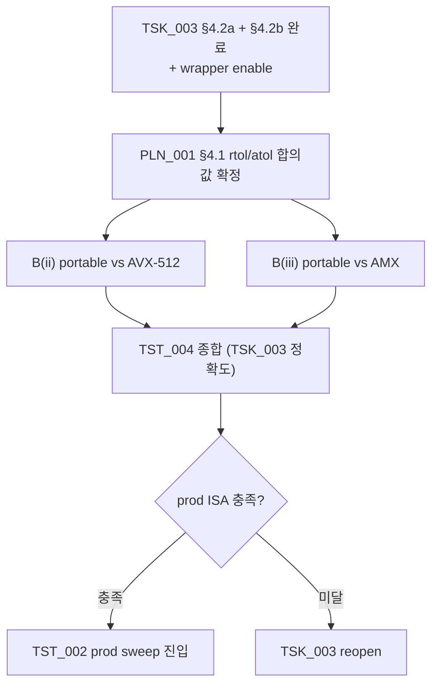

**↑ 부모**: [`PLN_001`](PLN_001.md) · **← 이전 형제**: [`TST_001`](TST_001.md) · [`TST_002`](TST_002.md) · [`TST_003`](TST_003.md) · **→ 다음 형제**: [`TST_005`](TST_005.md) · [`TST_006`](TST_006.md) · [`TST_007`](TST_007.md) · [`TST_008`](TST_008.md) · [`TST_009`](TST_009.md) · [`TST_010`](TST_010.md) · **↟ 조부**: [`IDE_006`](README.md) · **검증 대상**: [`TSK_003`](TSK_003.md)

---

# TST_004 — TSK_003 prod SIMD cross-check

| 항목 | 값 |
|---|---|
| ID | `TST_004` |
| 상태 | `완료` (152 passed @ prod simd_verify `eval/results/20260427_044407_Intel_Xeon_Platinum_8480+x2_H100_80GB_HBM3x8_simd_verify/tst004_pytest.log` — BF16 ~5e-3 / FP16 ~1e-3 tolerance 통과) |
| 부모 PLN | [`PLN_001`](PLN_001.md) |
| 조부 IDE | [`IDE_006`](README.md) |
| 자매 TST | [`TST_001`](TST_001.md) (TSK_001 검증) · [`TST_002`](TST_002.md) (throughput) · [`TST_003`](TST_003.md) (e2e) |
| 검증 대상 | **[`TSK_003`](TSK_003.md) 단독** (AVX-512 + AMX C++ kernels) |
| 단계 | **B(ii)** portable vs AVX-512 · **B(iii)** portable vs AMX |
| Reference baseline | [`TSK_001`](TSK_001.md) §4.2c portable C++ kernel ([`TST_001`](TST_001.md) B(i) 통과로 algorithm 검증 완료) |
| 매핑 IDE_006 진입 조건 | (c) tolerance 의 **prod ISA 측** — AVX-512 / AMX kernel 결과가 portable 과 BF16 tolerance 내 일치 |
| ID 넘버링 출처 | [`shadow_assists/id_registry.md`](../../id_registry.md) |

> **단계 주의**: 본 TST 는 **prod 머신 (Xeon Sapphire Rapids 이상) 에서 실행**. dev 머신 (Core i9-12900KF) 은 AMX hardware 미지원 / AVX-512 BIOS 의존이라 본격 검증 불가. 결과는 `eval/results/<TS>_<HW_TAG>_prod_smoke/` 또는 `tests/v1/cpu_partial_attention/results/TST_004/<hw_tag>_<TS>/` 에 저장.

---

## 1. 목적과 범위

### 1.1 · 목적

[`TSK_003`](TSK_003.md) 가 작성·빌드한 **AVX-512 + AMX C++ kernel** 의 numerical 정확성을 [`TSK_001`](TSK_001.md) 의 portable C++ kernel (Python reference 와 [`TST_001`](TST_001.md) B(i) 로 검증된 baseline) 과 cross-check 해 IDE_006 §9 (c) 의 prod ISA 측 충족 여부 결정.

- 충족 → TSK_003 완료 → TST_002 prod sweep 진입
- 미달 → TSK_003 reopen 또는 IDE_006 기각

### 1.2 · 범위

| 단계 | 비교 |
|---|---|
| **B(ii)** | portable C++ (TSK_001 §4.2c) **vs** AVX-512 C++ (TSK_003 §4.2a) — BF16 tolerance |
| **B(iii)** | portable C++ vs AMX C++ (TSK_003 §4.2b) — BF16 tolerance |

### 1.3 · 비범위

- TSK_001 의 dev kernel 정확도 — [`TST_001`](TST_001.md) 가 담당 (A · B(i) · C)
- e2e 통합 정확도 (TSK_002 후) — [`TST_003`](TST_003.md)
- throughput / overlap — [`TST_002`](TST_002.md)

---

## 2. 사전 조건

- [`TSK_001`](TSK_001.md) Phase 1 dev 통과 + [`TST_001`](TST_001.md) A·B(i)·C 통과 (portable kernel 이 numerical baseline 으로 검증됨)
- [`TSK_003`](TSK_003.md) §4.2a (AVX-512) + §4.2b (AMX) C++ kernel 작성·빌드·wrapper enable 완료
- prod 머신: Xeon Sapphire Rapids 이상 (`amx_bf16`, `amx_tile`, `avx512bf16`)
- [`PLN_001`](PLN_001.md) §3 Scope Lock 유지

---

## 3. 검증 차원

| 차원 | 값 |
|---|---|
| dtype | BF16, FP16 |
| context length | 512, 2048, 8192, 16384 |
| cold ratio | 0.25, 0.5, 0.75 |
| batch | 1, 2, 4 |
| variable length | 균등 / 비균등 cu_seqlens_q |
| layout | dense / GQA(Q=32, KV=4) |
| ISA path | portable (baseline) vs `_force_path=ISAPath.AVX512` vs `_force_path=ISAPath.AMX` |

---

## 4. 테스트 코드

### 4.1 파일

```
tests/v1/cpu_partial_attention/
├── test_avx512_cross_check.py   # B(ii) portable vs AVX-512
└── test_amx_cross_check.py      # B(iii) portable vs AMX
```

기존 `test_portable_cross_check.py` 의 sweep 패턴 그대로 복제 + `_force_path` 만 변경 + `pytest.mark.skipif(not _has_<isa>_kernel(), ...)` 가용성 마커.

### 4.2 단계별 outline

#### B(ii) — `test_avx512_cross_check.py`

```python
pytestmark = pytest.mark.skipif(
    not _has_avx512_kernel(),
    reason="AVX-512 C++ kernel not built in this environment (TSK_003)",
)

@pytest.mark.parametrize("ctx_len", [512, 2048, 8192])
@pytest.mark.parametrize("cold_ratio", [0.25, 0.5, 0.75])
@pytest.mark.parametrize("batch", [1, 2, 4])
def test_portable_vs_avx512(kv_dtype, head_dim, num_kv_heads,
                             ctx_len, cold_ratio, batch):
    inputs = make_inputs(...)
    O_por, LSE_por = forward_partial_with_lse(**inputs, _force_path=ISAPath.PORTABLE)
    O_avx, LSE_avx = forward_partial_with_lse(**inputs, _force_path=ISAPath.AVX512)
    atol = 5e-3 if kv_dtype is torch.bfloat16 else 1e-3
    torch.testing.assert_close(O_avx, O_por, atol=atol, rtol=atol)
    torch.testing.assert_close(LSE_avx, LSE_por, atol=1e-3, rtol=1e-3)
```

#### B(iii) — `test_amx_cross_check.py` (동일 패턴, `ISAPath.AMX`)

---

## 5. 실행 / 결과 저장

```bash
# prod 머신:
python -m pytest tests/v1/cpu_partial_attention/test_avx512_cross_check.py -v \
    --junit-xml=eval/results/${TS}_${HW_TAG}_prod_smoke/TST_004_avx512_junit.xml \
    2>&1 | tee eval/results/${TS}_${HW_TAG}_prod_smoke/TST_004_avx512.log

python -m pytest tests/v1/cpu_partial_attention/test_amx_cross_check.py -v \
    --junit-xml=eval/results/${TS}_${HW_TAG}_prod_smoke/TST_004_amx_junit.xml \
    2>&1 | tee eval/results/${TS}_${HW_TAG}_prod_smoke/TST_004_amx.log
```

또는 `eval/run_prod_smoke.sh` 가 자동 실행 (TSK_003 완료 후 활성화).

---

## 6. Pass / Fail

| 단계 | 기준 | 미달 시 |
|---|---|---|
| B(ii) portable vs AVX-512 | 모든 sweep cell 에서 `max_abs_diff < atol`, `max_rel_diff < rtol` | TSK_003 §4.2a reopen |
| B(iii) portable vs AMX | 동일 | TSK_003 §4.2b reopen |

---

## 7. 산출물

| 파일 | 내용 |
|---|---|
| `PLN_001_TST_004_01_avx512_cross_check_results.md` | B(ii) sweep 결과 |
| `PLN_001_TST_004_02_amx_cross_check_results.md` | B(iii) sweep 결과 |
| raw JSON / CSV | `tests/v1/cpu_partial_attention/results/TST_004/<hw_tag>_<TS>/` |

---

## 8. 의존성·일정



---

## 9. References

- 부모 PLN: [`PLN_001`](PLN_001.md)
- 조부 IDE: [`IDE_006`](README.md)
- 검증 대상: [`TSK_003`](TSK_003.md)
- Reference baseline: [`TSK_001`](TSK_001.md) §4.2c portable C++ + [`TST_001`](TST_001.md) B(i)
- 자매 TST: [`TST_001`](TST_001.md), [`TST_002`](TST_002.md), [`TST_003`](TST_003.md)

---

## 10. Change Log

| 날짜 | 변경 | 사유 |
|---|---|---|
| 2026-04-25 | TST_004 초안 작성 | TSK_003 신규 발급에 따라 검증 게이트 1:1 매핑 — 본 TST_004 = **TSK_003 단독 검증** (B(ii) AVX-512 + B(iii) AMX cross-check). 기존 TST_001 의 B(ii)/B(iii) 단계를 본 TST 로 이관. portable C++ kernel (TSK_001) 이 reference baseline. |

---

**↑ 부모**: [`PLN_001`](PLN_001.md) · **← 이전 형제**: [`TST_001`](TST_001.md) · [`TST_002`](TST_002.md) · [`TST_003`](TST_003.md) · **→ 다음 형제**: [`TST_005`](TST_005.md) · [`TST_006`](TST_006.md) · [`TST_007`](TST_007.md) · [`TST_008`](TST_008.md) · [`TST_009`](TST_009.md) · [`TST_010`](TST_010.md) · **↟ 조부**: [`IDE_006`](README.md) · **검증 대상**: [`TSK_003`](TSK_003.md)
