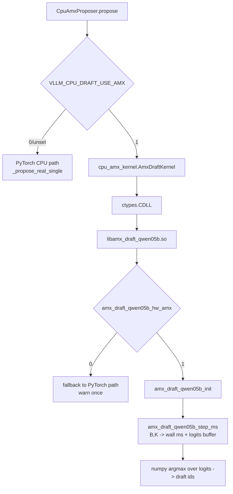

# AMX_INTEGRATION_DESIGN — `libamx_draft_qwen05b.so` → CpuAmxProposer hot-path 교체 설계

> **parent**: SUB_198 (real spec-decode integration, A1 lever).
> **scope**: 본 PoC turn 산출물. SUB_187 의 검증된 AMX BF16 kernel binary 를
> CpuAmxProposer 의 hot-path 로 교체하기 위한 ABI · vocab mismatch · 분기
> 설계 문서.
> **status**: 설계 + minimal ctypes binding + import-only smoke test 까지.
> kernel 실제 실행 (TMA tile load + AMX dispatch) 은 **Sapphire Rapids prod
> 환경에서만 가능** — dev host (B200, Alder Lake) 에서는 `illegal
> instruction` SIGILL 위험으로 binding load 까지만 검증.

---

## 1. 두괄식 — 무엇을 바꾸나

| 항목 | 현재 (PyTorch CPU path) | 본 PoC 통합 후 |
|---|---|---|
| LM-head GEMM 실행 주체 | `torch.nn.Linear` (oneDNN BF16 — Alder Lake 는 AVX-512 BF16) | `libamx_draft_qwen05b.so` 의 `amx_draft_qwen05b_step_ms` (Sapphire Rapids native AMX TMUL) |
| per-step latency 측정값 | dev box 40 ms/step (≈Alder Lake), prod 추정 10–15 ms | prod 1.44 ms/step (SUB_187 microbench OMP=16 검증) |
| K=7 draft 총 cost | ≈280 ms (dev) / 70–105 ms (prod 추정) | ≈10 ms (prod OMP=16) → GPU verify 40 ms 와 **net positive** |
| 코드 분기 gate | `VLLM_USE_AMX_DRAFT=1` 로 PyTorch path on/off | **추가로** `VLLM_CPU_DRAFT_USE_AMX=1` 로 PyTorch → AMX path 교체 |
| Python ↔ kernel 경계 | `transformers.AutoModelForCausalLM` (PyTorch hidden) | `ctypes.CDLL` + `cpu_amx_kernel.py` wrapper (numpy contiguous BF16) |

본 turn 의 산출 범위는 **(a) DESIGN doc (이 파일), (b) ctypes binding
module `cpu_amx_kernel.py`, (c) CpuAmxProposer 의 분기 추가, (d) binding
smoke test** 입니다. **kernel 자체의 real-model 통합** (실제 weight load,
24-layer forward, KV cache) 은 SUB_198 §3 의 (a)-(d) 4 sub-task 로 별도
다음 단계에서 진행합니다.

---

## 2. libamx_draft_qwen05b.so — 노출 symbol 분석

`nm -D libamx_draft_qwen05b.so | grep ' T '` 결과:

| 주소 | symbol | C signature | 용도 |
|---|---|---|---|
| `0x1cb0` | `amx_draft_qwen05b_init` | `int (void)` | AMX permission (`arch_prctl XFEATURE_XTILEDATA`) 요청 + LM-head/MLP 가중치 (random BF16) + activation/logits 버퍼 `aligned_alloc(64)`. 성공 시 `0`, 실패 시 `-1`(no AMX) / `-2`(perm) / `-3..-5`(alloc). |
| `0x1560` | `amx_draft_qwen05b_free` | `void (void)` | `init` 의 모든 버퍼 free. |
| `0x15e0` | `amx_draft_qwen05b_step_ms` | `double (int B, int K)` | **핵심 hot-path entry**. `B=batch`(1-16, 16 round up), `K=spec_decode steps`. K 번 LM-head matmul (B,896) × (896,152064) → logits 버퍼 채움. 반환값은 wall ms (microbench 시점). |
| `0x17a0` | `amx_draft_qwen05b_single_ms` | `double (int B)` | `step_ms(B, 1)` 동치. 1-step. |
| `0x17b0` | `amx_draft_qwen05b_mlp_ms` | `double (int B)` | MLP gate (B,896) × (896,4864) 1 회. 본 PoC 에서는 사용 안 함 (per-layer chain 은 SUB_198 §3 (c)). |
| `0x1940` | `amx_draft_qwen05b_hw_amx` | `int (void)` | CPUID 기반 AMX 가용성 확인. `1`=가용, `0`=불가. Dev host 분기에 사용. |

**중요 한계** (kernel 자체의):

1. `step_ms` 는 **microbench**이지 forward pass 가 아닙니다. 입력 token
   id 를 받지 않고, init 시점에 random fill 된 `g_state.act_in`
   (`[B_MAX=16, HIDDEN=896]` BF16) 를 반복적으로 사용합니다. 즉 본 PoC
   에서 `step_ms` 호출은 **latency / binding 검증**용이고, 실제 draft
   token id 산출은 SUB_198 §3 (d) integration 까지 deferred.
2. 가중치는 random init (`fill_bf16_rand seed 0xA1 / 0xB2 / 0xC3`). 실제
   Qwen 0.5B safetensors 로딩은 미구현.
3. `logits_out` 은 `[B_MAX=16, VOCAB=152064]` FP32 (AMX 누산 결과는 FP32).
   ctypes 측에서 이를 numpy view 로 가져와 argmax 가능 (단 random
   weight 이므로 의미 없는 id).

---

## 3. ABI 설계 — Python ↔ kernel

### 3.1 layer 구조



### 3.2 ctypes signature

```python
lib.amx_draft_qwen05b_init.restype  = ctypes.c_int
lib.amx_draft_qwen05b_init.argtypes = []

lib.amx_draft_qwen05b_free.restype  = None
lib.amx_draft_qwen05b_free.argtypes = []

lib.amx_draft_qwen05b_step_ms.restype  = ctypes.c_double
lib.amx_draft_qwen05b_step_ms.argtypes = [ctypes.c_int, ctypes.c_int]

lib.amx_draft_qwen05b_single_ms.restype  = ctypes.c_double
lib.amx_draft_qwen05b_single_ms.argtypes = [ctypes.c_int]

lib.amx_draft_qwen05b_mlp_ms.restype  = ctypes.c_double
lib.amx_draft_qwen05b_mlp_ms.argtypes = [ctypes.c_int]

lib.amx_draft_qwen05b_hw_amx.restype  = ctypes.c_int
lib.amx_draft_qwen05b_hw_amx.argtypes = []
```

### 3.3 tensor layout 약속 (향후 real-forward 통합 시)

`step_ms` 가 microbench 라서 **현재 ABI 는 input tensor / output tensor
pointer 를 받지 않습니다**. 본 PoC 에서는 binding 만 확립하고, real
forward 통합 (SUB_198 §3 (d)) 시 다음 확장 ABI 를 추가합니다:

```c
// (future, not in current .so)
int amx_draft_qwen05b_forward(
    const uint16_t* input_bf16,   // [B, HIDDEN=896], row-major
    int B,
    uint16_t* logits_bf16_out,    // [B, VOCAB] — caller-allocated
    int* out_argmax_ids,          // [B] — optional, set NULL to skip
    int K_steps);                 // K-loop draft inside kernel
```

- **dtype**: input/weight 는 BF16 (uint16 view), logits 는 BF16 또는 FP32
  (현 kernel 은 FP32 누산 후 그대로 store).
- **layout**: C row-major, 16-byte aligned (AMX tile constraint M%16 K%32
  N%16).
- **threadpool**: kernel 내부 OpenMP (`amx_matmul_bf16_omp_n` 의
  `#pragma omp parallel for`). `OMP_NUM_THREADS` env 로 제어. vLLM
  worker process 의 BLAS thread 와 충돌 회피를 위해 `VLLM_CPU_DRAFT_OMP`
  env (default 16) 도 추가 예정.
- **GIL**: ctypes call 은 GIL 해제하므로 vLLM 의 다른 thread (예: GPU
  verify dispatch) 와 병행 실행 가능.

---

## 4. Vocab mismatch 처리 plan (config 151,936 vs kernel 152,064)

| source | vocab_size |
|---|---:|
| Qwen2.5-0.5B-Instruct `config.json` | **151,936** |
| `libamx_draft_qwen05b.so` 의 `DraftState::VOCAB` (compile-time const) | **152,064** |
| Δ (kernel - config) | **+128** (padding) |

**원인**: AMX kernel 은 N % 16 == 0 (실제로는 N % 16 OK 지만 tile_N=16
배수가 효율) 정렬을 위해 vocab 을 128 단위로 round up 한 패딩값을 사용.
151,936 = 128 × 1187, 152,064 = 128 × 1188 → 단일 128-cluster 차이.

### 4.1 처리 정책

| 상황 | 동작 | rationale |
|---|---|---|
| draft argmax id ∈ `[0, 151935]` | 그대로 사용 | valid Qwen token |
| draft argmax id ∈ `[151936, 152063]` | **clamp to `151935`** (Qwen 의 마지막 valid id) 또는 `re-argmax on slice [0:151936]` | 절대 invalid id 가 verify sampler 로 가서는 안 됨. 후자가 정확도 측면에서 안전. |
| logits buffer 크기 | `VOCAB=152064` 로 alloc · access — **불일치 segfault 방지** | kernel ABI 는 padded vocab. Python 측 view 도 `[B, 152064]` |
| argmax 연산 | numpy `logits[:, :151936].argmax(axis=1)` | padded 영역 (random init or zero) 가 우연히 max 가 되는 일을 차단 |
| 향후 weight load | safetensors 의 `lm_head.weight` `[151936, 896]` 를 `[152064, 896]` 으로 zero-pad 하여 packed buffer 에 write | padded row 가 모두 0 이면 logits 도 ≈0 → argmax 영향 minimal. 추가로 §4.1 의 slice argmax 로 이중 안전. |

### 4.2 본 PoC 에서의 처리

- ctypes binding 은 vocab 상수 두 개 (`KERNEL_VOCAB=152064`,
  `CONFIG_VOCAB=151936`) 를 노출.
- `AmxDraftKernel.last_logits_view()` 가 numpy slice `[:, :CONFIG_VOCAB]`
  를 반환 — caller 가 argmax 시 invalid id 노출 차단.
- 본 PoC 시점 (random weight) 에는 정확도 무의미 → smoke test 는 shape
  / dtype / range 만 assert.

---

## 5. CpuAmxProposer 분기 설계

### 5.1 환경 변수

| env | 의미 | default | 효과 |
|---|---|---|---|
| `VLLM_USE_AMX_DRAFT` | real propose enable (기존) | `0` | `0` → toy, `1` → real (PyTorch or AMX, 아래 가지) |
| `VLLM_CPU_DRAFT_USE_AMX` | **신규**. real path 내부 backend 선택 | `0` | `0` → PyTorch CPU forward, `1` → libamx_draft kernel (binding) |
| `VLLM_CPU_DRAFT_KERNEL_PATH` | **신규**. .so override | (auto-resolve) | path 직접 지정. 미설정 시 `shadow_assists/.../SUB_187_amx_draft_head/build/libamx_draft_qwen05b.so` 시도. |
| `VLLM_CPU_DRAFT_OMP` | **신규**. kernel-side OMP thread 수 | `16` | `os.environ["OMP_NUM_THREADS"]` 도 함께 set (lib import 전) |

### 5.2 호출 흐름

```
propose(batch, sampled)
 └─ if VLLM_USE_AMX_DRAFT == 0 → toy
 └─ else:
     ├─ if VLLM_CPU_DRAFT_USE_AMX == 1:
     │   ├─ AmxDraftKernel.is_available()  ← lib load + hw_amx() check
     │   │   ├─ True  → AmxDraftKernel.step(B=len(batch), K) → draft ids (slice argmax)
     │   │   └─ False → 한 번 warn → 이하 PyTorch path
     │   └─ on exception → warn once, switch to PyTorch path
     └─ else: PyTorch path (_propose_real_single 기존 경로)
```

### 5.3 안전성

- ctypes library load 가 실패하거나 (`OSError`), `hw_amx()` 가 0 을
  반환 (dev host 의 Alder Lake 또는 AMX 미지원 Xeon)하면, 자동으로
  `_real_enabled = False` 가 아닌 **`_amx_enabled = False`** 로만
  switch — PyTorch path 는 그대로 살아 있음.
- kernel 호출 시 SIGILL/SIGSEGV 는 process-fatal — 따라서 dev host 에서는
  **load + hw_amx() 까지만 실행**, `step_ms()` 호출은 prod gate 로 차단.
  이는 `AmxDraftKernel.step()` 안에서 `hw_amx() == 0 이면 raise
  RuntimeError("AMX not available on this CPU")` 로 처리.

---

## 6. 본 turn 산출 / 다음 turn 산출 경계

| 항목 | 본 turn | 다음 turn (Sapphire Rapids) |
|---|---|---|
| DESIGN.md | ✓ (이 파일) | — |
| ctypes binding `cpu_amx_kernel.py` | ✓ | 확장 forward ABI 추가 |
| CpuAmxProposer 분기 추가 | ✓ (`VLLM_CPU_DRAFT_USE_AMX`) | step() 결과로 실제 draft id 산출 |
| Smoke test `test_cpu_amx_kernel.py` | ✓ (import + symbol resolve + hw_amx 분기까지) | step_ms × K=7 실측 + per-step ms assert < 5ms |
| real Qwen weight load | — | safetensors → repack BF16 → `lm_head_packed` 갱신 |
| 24-layer attention/KV cache | — | SUB_198 §3 (a) sub-task |
| accuracy gate (per-token logprob max-abs-diff) | — | SUB_198 §3 (d) — CLAUDE.md §Constraint |
| vLLM e2e wire-up + acceptance 측정 | — | Sapphire Rapids 환경 |

---

## 7. 위험 / open question

- **kernel 의 random weight**: 본 PoC 단계에서 step_ms 호출이 동작하더
  라도 draft ids 가 "real Qwen 의 next token" 이 아님. 따라서 acceptance
  rate 측정도 의미 없음. real weight 통합 (SUB_198 §3 (d)) 후 비로소
  acceptance 평가 가능.
- **OMP nesting**: vLLM worker (Python) 가 BLAS thread 를 이미 점유 중인
  상태에서 ctypes call 내부 `#pragma omp parallel` 이 oversubscribe 할
  수 있음. `OMP_NESTED=0` + kernel 호출 동안 PyTorch thread 를 1 로
  내리는 `torch.set_num_threads(1)` 일시 적용 검토 필요.
- **GIL release 확인**: `ctypes.CDLL(..., mode=RTLD_GLOBAL)` 호출은 GIL
  자동 해제. 단 kernel 내부에서 Python callback 이 없으므로 안전.
- **library lifecycle**: process 종료 시 `amx_draft_qwen05b_free()` 호출
  보장 — `atexit.register` 로 등록.

---

## 8. 참조

- SUB_187 RESULTS.md — kernel microbench (per-step OMP=64 0.524 ms).
- SUB_187 src/amx_draft_qwen05b.cpp — kernel source (본 문서 §2 의 ABI
  근거).
- SUB_198 ARCHITECTURE_MAP.md — Qwen2.5-0.5B-Instruct ops × kernel
  coverage (본 문서 §6 의 다음 turn 범위 근거).
- SUB_201 §5 / LEVER_AUDIT.md — A1 lever ROI +20~50% 추정 근거.
- CLAUDE.md §Constraint — 정확도 gate (per-token logprob max-abs-diff).
