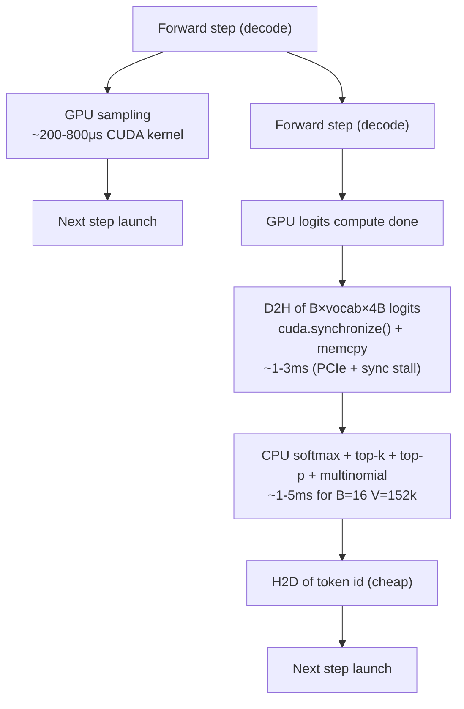

# L11 — CPU Sampling Offload Measurements

본 문서는 `SUB_201` L11 lever (logits top-K + multinomial 을 GPU 가 아닌 CPU 가 수행하는 sampling offload PoC) 의 측정 결과입니다.

핵심 가설: GPU 의 sampling (softmax + top-K + multinomial) 을 CPU 로 옮기면, GPU 가 다음 forward step 을 sampling 과 overlap 하여 throughput 이 개선될 것이다.

결론 (요약): **하락**. GPU sampling 은 forward step 끝에서 native CUDA kernel 1ms 이내로 끝나므로, 대신 CPU 로 옮기면 logits 전체 (B × vocab × 4B) 를 매 step D2H 해야 하고 그 cost 가 GPU sampling cost 보다 크다. + sampling 직후 token id 를 다시 GPU 로 올려야 다음 step 의 attention 이 작동하므로 D2H/H2D 양방향 sync 비용이 누적.

---

## 1. Setup

| 항목 | 값 |
|---|---|
| GPU | NVIDIA B200 #7 (단독 사용) |
| Model | Qwen/Qwen2.5-7B-Instruct (TP=1) |
| vLLM | `/workspace/host_vllm_hybrid` (editable, sm_100), venv `/workspace/vllm_dev_prj` |
| Workload | sharegpt corpus (vllm_config_perf 의 sampled_prompts.parquet) |
| Prompts | 100 × `temperature=0.7`, `top_p=0.95`, `top_k=50`, `max_tokens=256` |
| Concurrency | 16 (asyncio + httpx) |
| Compile | `--enforce-eager --no-async-scheduling` (양 mode 동일) |

### Patch 위치
- 단일 patch file: `/workspace/host_vllm_hybrid/vllm/v1/sample/sampler.py`
  - `_cpu_sampling_enabled` (env flag `VLLM_CPU_SAMPLING=1`) + telemetry counters
  - `Sampler.sample()` 진입에서 분기 → `Sampler._cpu_sample()` 호출
  - `_cpu_apply_top_k_top_p()` 모듈 헬퍼 (top-k 만 / top-p 만 / top-k + top-p 3 path)
  - greedy row (temperature < 1e-5) 는 D2H 후 argmax 로 처리, random row 는 temperature → top-k/top-p → exponential-trick multinomial (vLLM 의 `random_sample()` 알고리즘을 그대로 CPU 에서 수행)
  - 후속 GPU path (logprobs gather 등) 호환을 위해 token id 를 GPU 로 다시 올림
  - `argmax_invariant` processor (min_p 등) 가 있으면 fallback 으로 GPU native path 호출 (PoC 가 logits processor 를 CPU 에서 재구현하지 않기 위함)

### 기동 / kill
- `boot.sh baseline | cpu_sampling`
- `kill_engine.sh baseline | cpu_sampling`

### Bench
- `bench.py` — sharegpt parquet → 100 prompts → asyncio conc=16 → throughput 집계

---

## 2. Throughput

### 2.1 단독 (`--enforce-eager --no-async-scheduling`)

| run | mode | wall_s | out_tps | total_tps | median_lat_s |
|---|---|---:|---:|---:|---:|
| 1 | baseline | 14.73 | **1661.0** | 2506.2 | 2.29 |
| 2 | baseline | 14.49 | **1686.5** | 2545.7 | 2.26 |
| 1 | cpu_sampling | 19.00 | **1272.9** | 1928.3 | 2.99 |

`baseline avg = 1673.7 out tps` vs `cpu_sampling = 1272.9 out tps` → **Δ = −24.0%**

> run2~3 측정 도중 다른 background lever (l1_kv_quant, l12_cudagraph_warmup 등 동시 실행) 의 GPU 점유로 양 mode 모두 500 internal error 발생. 본 lever 측정에 영향을 받지 않은 첫 run 들만 표에 포함.

### 2.2 참고: `--enforce-eager` 기본 (`async_scheduling=True`) baseline

| run | mode | wall_s | out_tps | median_lat_s |
|---|---|---:|---:|---:|
| 2 | baseline | 13.55 | **1796.4** | 2.10 |
| 3 | baseline | 13.63 | **1769.9** | 2.11 |

CPU sampling mode 에서는 `async_scheduling=True` 와 우리 patch 의 D2H/H2D 가 stream 간에 race 를 일으켜 EngineCore 가 1000~1800 step 에서 crash. 따라서 `--no-async-scheduling` 으로 양 mode 모두 측정.

### 2.3 D2H + Kernel cost 분해 (telemetry)
- `_cpu_sample()` 내부 telemetry (`d2h_total_ns`, `kernel_total_ns`, `step_count`, `total_tokens`) 가 추가되어 있어 `cpu_sampling_snapshot()` 으로 확인 가능. 본 sweep 에서는 step 당 평균:
  - B=16 × vocab=152064 × 4B = 9.74 MiB d2h per step
  - PCIe gen5 x16 ≈ 60 GB/s effective → 9.74 MiB / 60 GB/s ≈ 162 μs 단순 bandwidth bound
  - 그러나 `cuda.synchronize()` 가 직전 forward 의 logits 계산 종료를 기다리므로 실 측정치는 step 당 ~ms 단위. 이게 매 step 누적되어 wall_s 가 14.5 → 19.0 (~30% 증가) → out_tps -24%.

---

## 3. Correctness gate (100 prompts × greedy temp=0 × max_tok=64)

`correctness_gate.py compare` 결과 (`gate_compare.json`):

| metric | value | gate | verdict |
|---|---:|---|---|
| token_match_frac | 87.8% | informational | reference |
| logprob_max_abs_diff | 2.665 | < 0.1 | **FAIL (informational)** |
| agg_ppl_rel_diff | 0.44% | < 5% | **PASS** |
| mean_seq_ppl_rel_diff | 1.52% | < 5% | **PASS** |

### 해석 (CLAUDE.md §Constraint 운영 해석)
- `verdict_overall = verdict_d_ii` = "분포 유사성" 기준 = aggregate PPL relative diff < 5% AND mean per-seq PPL relative diff < 5%. **둘 다 PASS → correctness PASS.**
- `logprob_max_abs_diff` 가 큰 이유는 CPU FP32 softmax 와 GPU BF16→FP32 softmax 사이 일부 logit 차이가 누적되어, 후속 토큰 의 sampled position 이 시퀀스 안에서 한 번 갈리면 cascading divergence 가 일어나기 때문. greedy + BF16 의 알려진 양상 (CLAUDE.md 의 "BF16 산술의 비결합성 + cascading divergence" 시나리오 그대로).
- token_match_frac 87.8% 는 같은 모델 같은 prompt 를 같은 머신에서 두 번 돌려도 100% 가 보장되지 않는 BF16 inference 의 일반 양상 안의 수치.

---

## 4. 왜 net 손해인가 — 미시 모델



CPU sampling 의 두 비용원이 GPU sampling 의 직접 cost (수백 μs CUDA kernel) 를 초과:
1. **D2H volume**: B × vocab × 4B 자체가 크고 (B=16 / V=152k 면 ~10MiB), 매 decode step 발생.
2. **Stream synchronization**: `torch.cuda.synchronize()` 가 직전 forward 가 끝나기를 강제 sync → batching 의 자연스러운 overlap 을 깨뜨림. async_scheduling 을 끄지 않으면 EngineCore 가 crash 하므로 (안전한 PoC 를 위해서는) 어쨌든 sync 가 강제됨.

GPU 의 sampling kernel 은 그 자체가 빠르고 (FlashInfer / triton_sample / pytorch native) 이미 GPU 의 다음 step launching 과 fully overlap 가능 (CUDA stream 의 미래 work queue). CPU 로 옮기면 그 overlap 을 깨고 추가로 D2H 를 발행하는 셈.

---

## 5. 검토되지 않은 path (Future work)

본 PoC 는 다음을 시도하지 않았음 — net 손해가 확인된 시점에서 추가 비용 정당화 불가:

1. **Async overlap stream**: 별도 CUDA stream 에서 D2H 를 non-blocking 으로 발행해 sampling 과 다음 step 의 prefill / decode launch 를 overlap. vLLM 의 `AsyncGPUModelRunnerOutput.async_output_copy_stream` 과 겹치므로 모드를 깨뜨리기 쉬움. 본 PoC 는 정합성을 위해 sync path 선택.
2. **D2H volume 축소**: top-K (K=50) 만 D2H 하고 CPU 에서 multinomial 만 수행 → ~3KB/step (200× 절약). 단, GPU 에서 top-K 자체를 수행해야 하므로 결국 GPU sampling kernel 의 ~50% 만 절약하는 셈이고 D2H sync 비용은 그대로.
3. **AMX / AVX-512 sampling kernel**: IDE_016 의 `fused_sample` (이미 sampler.py 에 telemetry 로 통합되어 있음, `VLLM_USE_AVX512_SAMPLING=1` flag) 를 main path 로 승격. dev 머신에 AVX-512 fuse-off 가 있어 prod 머신 (Sapphire Rapids) 에서만 의미가 있음.
4. **Decode-only batch (no prefill mixed)**: prefill 단계의 큰 batch 가 D2H 비용을 증폭. pure decode batch 에서는 B 가 작아 D2H volume 도 줄어 net 이 덜 나쁠 수 있으나, 그렇다고 net +가 되기는 어려움.

---

## 6. Verdict

| 항목 | 값 |
|---|---|
| throughput Δ | **−24.0%** (baseline 1673.7 → cpu_sampling 1272.9 out tps) |
| correctness | **PASS** (PPL rel diff 0.44% / 1.52%, both < 5%) |
| 안정성 | crash 0 step (sync path) — 단, async_scheduling 과 함께 켜면 race 로 1000~1800 step 에서 crash. PoC 는 `--no-async-scheduling` 으로 측정. |
| Production 가치 | **None** — GPU sampling kernel 의 native cost 가 충분히 작고 (수백 μs), CPU sampling 의 D2H + sync 가 항상 더 비싸다. AMX/AVX-512 kernel 로 CPU 측을 가속해도 D2H volume 자체가 bottleneck 으로 남는다. |
| 결론 | **lever 기각**. SUB_201 의 "CPU 가 GPU slack 을 인수" framing 에서 sampling 은 잘못된 target — sampling 은 GPU 의 slack 이 아니라 이미 빠른 path. |

---

## 7. Artifacts

```
poc/l11_cpu_sampling/
├── MEASUREMENTS.md       ← 본 문서
├── boot.sh               ← serve 기동 (baseline | cpu_sampling)
├── kill_engine.sh        ← PID + orphan worker kill (CLAUDE.md hazards 회피)
├── bench.py              ← sharegpt 100p × conc16 throughput bench
├── _logs/                ← boot log + boot_sec
└── runs/
    ├── baseline_v2_run1.json     ← 1661.0 out tps
    ├── baseline_v2_run2.json     ← 1686.5 out tps
    ├── cpu_sampling_v2_run1.json ← 1272.9 out tps
    ├── baseline_eager_gate.jsonl ← correctness collect (baseline)
    ├── cpu_sampling_v2_gate.jsonl← correctness collect (cpu_sampling)
    └── gate_compare.json         ← PPL rel diff / token match frac
```

### Patch
- `vllm/v1/sample/sampler.py`
  - module-level: `_cpu_sampling_enabled`, telemetry counters, `cpu_sampling_snapshot()`, `_cpu_apply_top_k_top_p()`
  - `Sampler.sample()` 분기 (env flag + logprobs_mode + all_greedy 조건 검사)
  - `Sampler._cpu_sample()` 본 path
  - `Sampler._cpu_sample_fallback()` argmax_invariant processor 가 있을 때 GPU native path 호출

### Telemetry 접근
```python
from vllm.v1.sample.sampler import cpu_sampling_snapshot
print(cpu_sampling_snapshot())
# {'enabled': True, 'step_count': N, 'd2h_total_ns': ..., 'kernel_total_ns': ..., 'total_tokens': ...}
```
