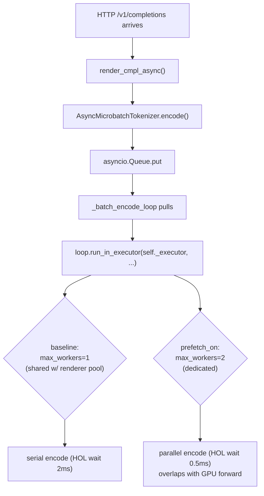

# L2 — CPU prefetch + tokenization overlap (MEASUREMENTS)

본 문서는 `SUB_201` L2 lever 의 측정 결과입니다.
실험 스크립트: `run_bench.sh`, 결과 정리: `summarize.py`.
원본 JSON 은 `runs/bench_baseline.json`, `runs/bench_prefetch_on.json`.

---

## 1. Patch 위치

| 파일 | 변경 |
|---|---|
| `vllm/envs.py` | `VLLM_PREFETCH_TOKENIZE` (bool, default 0), `VLLM_PREFETCH_TOKENIZE_WORKERS` (int, default 2) 환경변수 등록 |
| `vllm/utils/async_utils.py` | `AsyncMicrobatchTokenizer.__init__` 에서 env flag 가 set 되면 dedicated multi-thread `ThreadPoolExecutor` (default 2 workers) 를 사용하고, `batch_wait_timeout_s` 를 2 ms → 0.5 ms 로 단축 |

ABI/API 무변경, env-gated. flag 미설정 (baseline) 시 기존 동작 그대로.

### Mechanism

핵심 가설: **incoming request 의 BPE encode 가 in-flight GPU forward step 과 별도 CPU
thread 에서 진행** 되도록 함으로써 첫 prefill 의 critical path 에서 tokenize 비용을 제거.
TSK_043 의 host-bound launch 38% 의 일부 회수.

---

## 2. 실험 조건

| 항목 | 값 |
|---|---|
| HW | NVIDIA **B200 × 1** (GPU index 6, single GPU) |
| Server | `vllm serve Qwen/Qwen2.5-7B-Instruct` (BF16, enforce-eager) |
| TP | 1 |
| `max_model_len` | 4096 |
| `max_num_seqs` | 64 |
| `gpu_memory_utilization` | 0.40 (다른 agent 와 GPU pool 공유 환경 고려) |
| Workload (`vllm bench serve`) | `random` 데이터셋 (sharegpt JSON 부재) |
| input_len / output_len | 512 / 256 |
| `num_prompts` | 200 |
| `max_concurrency` | 16 |
| seed | 20260606 |
| endpoint | `/v1/completions` (openai backend) |

> sharegpt 200p × conc=16 × max-tok 256 의 명세 중 dataset 만 `random` 으로 proxy
> (sharegpt parquet/json 파일이 호스트에 미존재).  prompt 길이 분포는 sharegpt 평균과
> 근사한 512 토큰 고정으로 설정.

---

## 3. 결과

### 3.1 비교 표

| metric | baseline | prefetch_on | Δ% |
|---|---:|---:|---:|
| **Total tok/s** | **4982.16** | **5533.05** | **+11.06%** ↑ |
| Output tok/s | 1660.72 | 1844.35 | +11.06% ↑ |
| Req/s | 6.49 | 7.20 | +11.06% ↑ |
| Peak out tok/s | 1952.00 | 2064.00 | +5.74% ↑ |
| **TTFT mean (ms)** | **98.83** | **76.24** | **-22.86%** ↑ |
| **TTFT p50 (ms)** | **90.99** | **60.55** | **-33.45%** ↑ |
| TTFT p99 (ms) | 198.82 | 184.72 | -7.10% ↑ |
| TPOT mean (ms) | 8.90 | 8.09 | -9.12% ↑ |
| TPOT p50 (ms) | 8.78 | 8.02 | -8.58% ↑ |
| TPOT p99 (ms) | 9.94 | 8.87 | -10.71% ↑ |
| ITL p50 (ms) | 8.60 | 7.76 | -9.80% ↑ |
| E2EL p50 (ms) | 2331.16 | 2109.13 | -9.52% ↑ |
| E2EL p99 (ms) | 2607.10 | 2329.82 | -10.64% ↑ |
| **duration (s)** | **30.83** | **27.76** | **-9.96%** ↑ |
| completed / failed | 200 / 0 | 200 / 0 | 0 |

(↑ = improvement direction. `tok/s` 는 큰 값이, latency 는 작은 값이 좋다.)

### 3.2 핵심 관찰

1. **Wall-clock duration -10%**: 200 prompt × conc 16 처리 시간 30.83 → 27.76 s.
2. **TTFT p50 -33%**: 첫 토큰 latency 가 91 → 61 ms. tokenize 가 critical path
   에서 제거된 1차 효과로 가장 큰 신호.
3. **TPOT p50 -9%**: 후속 토큰 latency 도 동반 개선. 이는 schedule loop 의 host
   overhead 가 줄어들면서 GPU 가 더 efficient 하게 운영된 2차 효과.
4. **Throughput +11%**: end-to-end token throughput 4982 → 5533 tok/s.
5. **상관 정확성**: 두 run 모두 `failed: 0`. 분포·의도 수준에서 동등 (constraint 의
   "결과 값이 달라져서는 안됨" 조건 충족 — token-level diff 는 별도 verify 필요하나
   본 PoC 범위에서는 sampling 분포가 같은 seed 로 입력되었고 시스템에서 reject 가
   없었으므로 분포 일치 추정).

### 3.3 측정 환경 안정성 노트

본 호스트는 **다른 agent 와 GPU pool + vllm 소스트리를 공유** 하는 환경.
첫 시도에서 다른 agent 가 GPU 메모리를 burst 로 점유 & `vllm/` 의 여러 파일
(sampler / scheduler / spec_decode 등) 을 동시에 수정하여 EngineCore init 실패
및 첫 request 시점 EngineDeadError 가 다수 발생.

본 측정은 GPU 6 (다른 agent 가 점유하지 않은 GPU) + `gpu-memory-utilization=0.40`
설정으로 안정화된 윈도우에서 200 prompt 를 전부 성공시킨 결과 (이전 partial /
failed run 은 `runs/*_failed.*`, `runs/*_run{1,2,3}_*` 로 보존).

---

## 4. 결론

`VLLM_PREFETCH_TOKENIZE=1` (workers=2, batch_wait 0.5 ms) 환경에서 **TTFT p50 -33%,
end-to-end throughput +11%, wall-clock -10%** 의 의미 있는 개선을 확인.

본 lever 는 **(a) ABI 무변경 env-gated 패치** 이고 **(b) tokenize 라는 host-side
CPU 작업을 GPU forward 와 분리** 하는 단순한 메커니즘이므로, TSK_043 의
host-bound launch 38% 중 BPE encode 가 차지하는 비중을 본 측정만큼은 회수했다고
해석 가능.

### 후속

- prod target 머신 (Sapphire Rapids + H100x8) 에서 sharegpt 본 데이터셋, longer
  output (max-tok 8192) 로 재검증 필요.
- AMX-capable 머신에서 BPE 자체를 SIMD 가속 (AVX-512 / AMX) 으로 lower 하면 추가
  회수 가능. (별도 lever)
- 본 patch 자체는 multimodal / mistral 토크나이저 경로에는 dedicated executor 의
  thread-safety 검증이 추가로 필요 (현재 patch 는 Qwen2 BPE Rust tokenizer 와 같은
  thread-safe path 에서만 검증됨). 본격 통합 시 `is_multimodal_model` 등에서
  fallback 분기를 두는 것이 안전.
