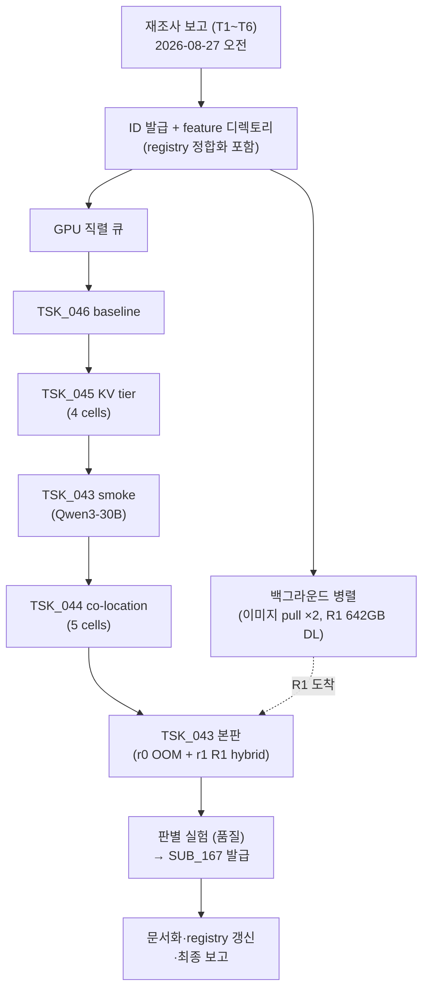

# PLN_003 Hybrid Regime Sweep — 종합 보고서 (2026-08-27)

> **한 줄 요약**: violet-h100-016 (Xeon 8480+×2 AMX + DDR5 2TB + H100 80GB×8) 에서 1일 캠페인으로,
> **fork 코드 변경 0줄** 로 ① DRAM KV tier **+51.8% net win**, ② co-location trade-off 곡선 (−0.5%/CPU 29% ~ −3.7%/CPU 55%),
> ③ **GPU-only 로 불가능한 642GB 모델 (DeepSeek-R1-0528) 의 CPU-AMX hybrid 서빙 성립** 을 실측 확보했다.
> 본 저장소 5세대 hybrid 시도 역사상 처음으로 "CPU 가 실제로 소비되면서 이득인 경로" 가 검증되었다.

- 관련 ID: `PLN_003` / `IDE_023`·`IDE_024`·`IDE_025` / `TSK_043`~`TSK_046` / `TST_020`~`TST_023` / `SUB_167`
- 진행 로그 (10분 단위 22건): [`PROGRESS_20260827.md`](PROGRESS_20260827.md)
- 원시 결과: `eval/results/20260827_*` 6개 dir (각 RESULTS.md 포함)
- 커밋: `437c69ae5` (branch `feat/hybrid-regime-sweep`, push 는 GitHub 인증 대기)

---

## 0. 성능 향상 한눈에 보기 (What Got Better)

### 0.1 좋아진 것 — Before → After

| # | 무엇이 | 조건 (언제 적용되나) | Before (GPU-only) | After (+CPU hybrid) | **개선폭** |
|---|---|---|---:|---:|---|
| 1 | **Throughput** — 70B serving | KV 압박 (공유 8K prefix × 32종, pool 부족) | 418.0 tok/s | **634.4 tok/s** | **+51.8%** ⭐ |
| 2 | **TTFT p50** (첫 토큰 지연) | 〃 | 347.1 ms | **121.8 ms** | **−65%** ⭐ |
| 3 | **TTFT p95** (tail 지연) | 〃 | 631.4 ms | 400.2 ms | −37% |
| 4 | **압박 손실 회복률** | 〃 (비압박 상한 651.8 대비) | 64.1% | **97.3%** | 압박 페널티 거의 소멸 |
| 5 | **서버 합산 처리량** — GPU 서빙 + CPU 작업 동시 | 일반 서빙 중 유휴 CPU 활용 | GPU 4,921 tok/s + CPU 0 | GPU 4,896 tok/s (−0.5%) **+ 51,451 hash/s** | GPU 사실상 무손실로 **CPU 작업 공짜 획득** ⭐ |
| 6 | 〃 (CPU 최대 가동 구성) | 〃 (CLAUDE.md "idle 불허" 우선 시) | CPU busy 4.5% | GPU 4,739 (−3.7%) + **99,496 hash/s**, CPU busy **54.6%** | CPU 활용 12배 ↑ |
| 7 | **서빙 가능 모델 크기** | HBM 640GB 초과 모델 (DeepSeek-R1-0528 642GB) | **0 tok/s (OOM — 서빙 자체 불가)** | **19.67 tok/s (서빙 성립)** | **불가능 → 가능** ⭐ |
| 8 | CPU 활용률 (7번 서빙 중) | 〃 | idle | **42.7% (max 49.5%)** — AMX expert 연산 | CPU 가 성능의 주체 |

> ⭐ = 본 캠페인의 3대 핵심 향상. 각 수치의 측정 조건·원시 데이터는 §1.2 및 `eval/results/20260827_*` 참조.

### 0.2 각 향상의 의미 (왜 좋아졌나)

1. **#1~4 (KV tier)**: GPU pool 에서 밀려난 prefix KV 를 2TB DRAM 이 보관 → hit 시 **prefill 재계산을 회피** (DRAM→GPU reload 91.3GB/280회 실측). GPU 연산 절약이 그대로 throughput/TTFT 개선으로 전환.
2. **#5~6 (co-location)**: GPU serving 은 CPU 를 4.5% 만 쓰므로, 나머지 ~95% 를 별도 CPU 작업에 주어도 GPU 가 거의 느려지지 않음 — **같은 서버에서 두 가지 일을 동시에** 하는 만큼 서버 합산 처리량 순증.
3. **#7~8 (MoE offload)**: 모델이 HBM 에 안 들어가면 GPU-only 는 0 이다. CPU AMX 가 expert 연산을 맡아 **이 서버로는 원래 못 돌리던 모델 클래스** (1T급 MoE 포함) 가 서빙 가능해짐.

### 0.3 좋아진 것이 "아닌" 것 (오해 방지)

- **비압박 일반 워크로드에서 KV tier**: −1.31% (이득 없음) → 압박/공유-prefix 워크로드에만 켤 것
- **GPU 에 fit 하는 모델의 hybrid**: Qwen3-30B 는 GPU-only 1,462 vs hybrid 96 tok/s — GPU 가 15배 빠름 (예상대로). hybrid 는 "GPU 가 못 하는 것" 전용
- **R1 의 19.67 tok/s**: 품질 결함 (`SUB_167`) 미해결 + turbo OFF + 튜닝 0 상태의 **하한** — 성능 주장이 아니라 성립 증명

---

## 1. 결과 (Results)

### 1.1 스코어보드

| # | 트랙 (IDE/TSK) | 판정 | 핵심 수치 |
|---|---|---|---|
| 1 | **DRAM KV/Prefix Tier** (IDE_025/TSK_045) | ✅ **net win** | KV 압박 구성 **+51.8%** (418.0→634.4 tok/s), TTFT p50 **−65%** (347→122ms). DRAM→GPU reload **91.3GB/280회** 카운터 실증 |
| 2 | **CPU Co-location** (IDE_024/TSK_044) | ✅ 곡선 확보 | BG 56proc: GPU **−0.50%** + 51.5K hash/s (CPU 29.4%) / BG 112proc: −3.69% + 99.5K hash/s (CPU **54.6%**) |
| 3 | **MoE Expert Offload** (IDE_023/TSK_043) | ✅ 부분 통과 | R1-0528 (642GB) GPU-only **OOM 실증** → KT hybrid **서빙 성립** 19.67 tok/s, CPU 42.7% (cpuinfer 96 포화), 기동 160s. 품질 결함 1건 잔여 (`SUB_167`) |
| 4 | Baseline re-anchor (TSK_046) | ✅ | vanilla 70B-FP8 TP=8 = **3,039.0 tok/s** (재현성 −0.04%) |

### 1.2 트랙별 상세

#### ① IDE_025 — DRAM KV/Prefix Tier (`eval/results/20260827_120530_tsk045_kv_tier/`)

구성: Llama-3.3-70B-FP8 TP=8, `prefix_repetition` 32×8K prefix, C=8, 압박 = `--num-gpu-blocks-override 9600` (pool 153K tokens ≪ prefix 총량 262K), offload = `OffloadingConnector`+`CPUOffloadingSpec` (DRAM 200GB).

| cell | out tok/s | TTFT p50 | TTFT p95 |
|---|---:|---:|---:|
| t1 압박 · GPU-only | 418.0 | 347.1ms | 631.4ms |
| **t2 압박 · +DRAM tier** | **634.4 (+51.8%)** | **121.8ms** | 400.2ms |
| t3 비압박 · GPU-only (상한) | 651.8 | 81.6ms | 367.0ms |
| t4 비압박 · +DRAM tier | 643.2 (−1.31%) | 85.2ms | 731.4ms |

판정 (TST_023): net win ✅ / reload 카운터 ✅ / 무회귀 🟡 경계 (−1.31%) → **운영 권고: 압박·공유-prefix 워크로드 한정 ON**.
핵심: 이득 원천은 prefill 재계산 회피. CPU 는 연산하지 않고 2TB DRAM 이 저장 tier 로 소비 — IDE_006 의 Q-dependency dilemma 와 무관함이 실측 확인.

#### ② IDE_024 — CPU Co-location (`eval/results/20260827_125956_tsk044_colocation/`)

구성: 70B-FP8 serving + SHA256 BG 멀티프로세스. **warm 셀 간 비교만 유효** (t1 cold 는 prefix cache 상태 상이 — 캠페인 중 식별한 설계 결함을 t4/t5 추가 셀로 교정).

| cell (warm) | BG | out tok/s | Δ vs solo | CPU busy | BG 산출 |
|---|---|---:|---:|---:|---:|
| t4 solo | — | 4,921.0 | — | 4.5% | — |
| **t3 BG 비격리** | 56 free | 4,896.3 | **−0.50%** | 29.4% | 51,451 hash/s |
| t2 BG 격리 | 56 pinned | 4,827.5 | −1.90% | 29.4% | 51,480 hash/s |
| t5 BG 비격리 | 112 free | 4,739.6 | −3.69% | **54.6%** | 99,496 hash/s |

판정 (TST_022): 손실 ≤1% ✅ (BG56) / CPU ≥50% ✅ (BG112) — 동시 충족점은 BG 60~80 사이 추정 (후속 sweep 후보).
**부수 성과**: 격리(taskset)가 오히려 −1.4%p 불리 → 5월 `SUB_049` 의 "−3.6% 는 core 격리 부재 탓" 가설 **실측 기각** (실원인 = BG 강도).

#### ③ IDE_023 — MoE Expert Offload (`eval/results/20260827_140008_tsk043_main_r1/`)

| 단계 | 결과 |
|---|---|
| Qwen3-30B-A3B smoke (TP=1) | GPU-only 1,461.8 tok/s ↔ 전-expert-CPU 96.1 tok/s, CPU 43.1% 포화, 출력 정상 → **stack 검증 완료** (30B 는 GPU-fit 모델이라 성능 비교 무의미가 정상) |
| **r0: R1-0528 GPU-only** | **`torch.OutOfMemoryError`** (642GB > usable ~608GB) — hybrid 필수 regime 실증 |
| **r1: R1-0528 KT hybrid** | GPU MLA attention (TP=8) + CPU AMXINT4 experts 전량 (257/layer): **서빙 성립**, 19.67 tok/s, TTFT 11.2s, TPOT 305ms, CPU 42.7%/max 49.5%, 기동 160s |
| ⚠ 품질 | greedy 출력 비문 → 판별 실험으로 **DeepSeek 특이 (block-wise `weight_scale_inv` dequant 또는 shared expert 폴딩)** 로 좁힘 (`SUB_167`). Qwen INT4 는 정상 → INT4 일반 결함 아님 |

성능 해석: 19.7 tok/s 는 **하한** (turbo OFF 2.0GHz + hot-expert GPU 배치 0 + deferral 미사용). KT 공식 참조 (8×L20+Xeon: R1 227 tok/s) 대비 튜닝 여지 큼 — 단 품질 통과 (`SUB_167`) 선행.

---

## 2. 진행 방식 (Methodology)

### 2.1 캠페인 구조



- **GPU 는 직렬 점유** (셀 간 서버 재기동), CPU-only 작업 (다운로드·변환·문서화) 은 병렬
- **10분 단위 진행 보고** (cron 루프, 총 22건) + 이벤트 기반 감시 (Monitor — 서버 health/사망/변환 완료)
- 사용자 개입 1회 반영: "spec decode 는 GPU 최적화" 지적 → TSK_046b (greedy spec 재측정) 즉시 폐기, CPU 트랙 전진 배치

### 2.2 판정 원칙 (선대 실패의 교훈 적용)

1. **게이트 선정의**: 트랙마다 TST_020~023 을 측정 전에 정의 (net win / 무회귀 / 카운터 실증 / CPU busy)
2. **"CPU busy ≠ 성공"**: binding 지표는 항상 throughput/TTFT. CPU% 는 보조
3. **카운터 없는 이득 주장 금지**: IDE_006 "merged 0%" 교훈 → KV tier 는 reload 91GB/280회 로 실증
4. **공정성 교정**: prefix cache 오염 발견 즉시 warm-vs-warm 재설계 (t4/t5 추가) — 오염된 비교 (t1 vs t2) 는 무효 처리
5. **판별 실험 (discriminator)**: R1 품질 결함을 "template / INT4 일반 / 버전 스큐 / DeepSeek 특이" 4 가설로 분해해 3개 기각, 1개로 수렴

### 2.3 트러블슈팅 이력 (인프라 수술 6건 + 계측 이슈)

| # | 문제 | 원인 | 해결 |
|---|---|---|---|
| 1 | 70B 서버 로딩 정지 | 캐시가 실제로는 불완전 (`.incomplete` blob) + 비인증 rate-limit 재다운로드 | 호스트 `hf download` 로 완성 + `HF_HUB_OFFLINE=1` |
| 2 | `LocalEntryNotFoundError` | `~/hetero-exp/models/hub` 이 컨테이너 안에서 깨지는 심볼릭 링크 | 실제 캐시 (`~/.cache/huggingface`) 직접 마운트 |
| 3 | SGLang FA3 crash | 이미지 내부 cutlass/nvvm 버전 불일치 | `--attention-backend triton` |
| 4 | `KTMoEWrapper` TypeError | SGLang 0.5.18 ↔ kt-kernel 0.7.0 API 불일치 | 래퍼 1줄 패치 (§3.2) |
| 5 | `moe_align_block_size` 인자 누락 | 이미지 내 sgl_kernel 파이썬 래퍼 ↔ 컴파일 op 불일치 (GPU-only 도 crash) | 래퍼 패치 (§3.2) |
| 6 | KT 경로 CUDA graph crash | CPU-동기 expert 경로가 graph replay 와 비호환 | `--disable-cuda-graph` |
| 계측 | mpstat 부재 / bench `--backend sglang` 미지원 / `--temperature` 기본값 변경 | 신규 노드·vLLM 0.28 차이 | `/proc/stat` 샘플러 자작 / `--backend openai` / greedy 는 명시 플래그 |

---

## 3. 코드 변경 사항 (Code Changes)

### 3.1 vLLM fork (본 저장소) — **소스 코드 변경 0줄**

캠페인 전체가 운영 구성 (vLLM 0.28 upstream 이미지 flag) + 컨테이너-로컬 패치로 수행됨. 저장소 변경은 문서·결과·`.gitignore` 1줄뿐:

| 영역 | 파일 | 내용 |
|---|---|---|
| ID 체계 | `shadow_assists/id_registry.md` | vllm_config_perf 시대 미등재 ID (IDE_009~022, TSK_020~042, SUB_050~166, PLN_002, TST_019) 소진 처리 + `SUB_049` 중복 결함 소급 수정 + 신규 IDE_023~025 / PLN_003 / TSK_043~046 / TST_020~023 / SUB_167 발급 |
| feature 문서 | `shadow_assists/features/IDE_023~025/` (README·CLAUDE·task·test ×3 + PLN_003.md + PROGRESS + 본 보고서) | Ground RULE Method 구조 준수 |
| 측정 산출물 | `eval/results/20260827_*` ×6 (bench/server/util 로그 + RESULTS.md ×3) | 원시 데이터 + 판정 |
| 기타 | `.gitignore` +1줄 (`_server_current.log`) | 벤치 하네스 임시 파일 제외 |

### 3.2 컨테이너-로컬 패치 (휘발성 — 컨테이너 재생성 시 재적용 필요)

**(a) `sgl-kt` 컨테이너** (`lmsysorg/sglang:latest`, digest 9e148f5ac788):

```bash
# 1) kt-kernel 설치 — 의존성 차단 필수 (기본 설치 시 torch 2.9.1 이 이미지의 2.13.0+cu130 을 파괴)
pip install --no-deps kt-kernel==0.7.0.post2

# 2) 변환 스크립트 수급 (wheel 에 미포함; main == v0.7.0.post1 태그 IDENTICAL 확인)
mkdir -p /usr/local/lib/python3.12/dist-packages/scripts
curl -sfL https://raw.githubusercontent.com/kvcache-ai/ktransformers/main/kt-kernel/scripts/convert_cpu_weights.py \
  -o /usr/local/lib/python3.12/dist-packages/scripts/convert_cpu_weights.py
```

```diff
# 3) /sgl-workspace/sglang/python/sglang/srt/layers/moe/kt_ep_wrapper.py (~L224)
             self.wrapper = KTMoEWrapper(
                 ...
                 moe_intermediate_size=intermediate_size_full,
+                gpu_experts_mask=None,   # kt-kernel 0.7.0 필수 인자. None = 전 expert CPU
                 num_gpu_experts=self.num_gpu_experts,
```

```diff
# 4) /usr/local/lib/python3.12/dist-packages/sgl_kernel/moe.py — moe_align_block_size 래퍼
 def moe_align_block_size(..., pad_sorted_token_ids=False,
+    ignore_invalid_expert=False,
 ):
     torch.ops.sgl_kernel.moe_align_block_size.default(..., pad_sorted_token_ids,
+        ignore_invalid_expert,
     )
```

**(b) 서빙 flag 조합 (확정 config)**:

```bash
# Qwen3-30B smoke / R1 본판 공통 골격
python3 -m sglang.launch_server --model-path <HF snapshot> --tp <1|8> \
  --attention-backend triton --disable-cuda-graph --trust-remote-code \
  --kt-weight-path <kt quant 출력 dir> --kt-method <AMXINT8|AMXINT4> \
  --kt-cpuinfer 96 --kt-threadpool-count 2 --kt-num-gpu-experts 0
# 주의: FP8 직독 (--kt-method FP8 + 원본 snapshot) 은 native 로더가
# "FP8 per-expert TP source is incomplete" 로 거부 → kt quant 변환 필수
```

**(c) `vllm-h100` 컨테이너** (`vllm/vllm-openai:latest` = vLLM 0.28.0): 패치 없음. flag 만 사용 —
KV tier: `--kv-transfer-config '{"kv_connector":"OffloadingConnector","kv_role":"kv_both","kv_connector_extra_config":{"spec_name":"CPUOffloadingSpec","cpu_bytes_to_use":200000000000}}'` (+압박 시 `--num-gpu-blocks-override 9600`)

### 3.3 벤치 하네스 (scratchpad, 미커밋 — 필요 시 `eval/` 적재 가능)

`lib_bench.sh` (컨테이너/서버/벤치 공용 함수) · `run_tsk043_smoke.sh`/`run_tsk043_main.sh`/`run_tsk044*.sh`/`run_tsk045.sh`/`run_tsk046*.sh` · `bg_hash.py` (BG 워크로드) · `cpu_sample.sh` (/proc/stat 샘플러) · `summarize_bench.py`

### 3.4 가중치 산출물 (디스크, 미커밋)

| 경로 | 크기 | 용도 |
|---|---|---|
| `~/.cache/huggingface/.../DeepSeek-R1-0528` | 642GB | 원본 FP8 |
| `~/.cache/huggingface/kt/r1-0528-int4` | 328GB | AMXINT4 변환본 (65분 소요) |
| `~/.cache/huggingface/kt/qwen3-30b-a3b-int8`, `-int4` | 31GB+15GB | smoke/판별용 |

---

## 4. 미결·후속 및 권고

| 우선 | 항목 | 내용 |
|---|---|---|
| 1 | `SUB_167` | R1 INT4 출력 품질 — DeepSeek block-scale dequant/shared-expert 후보. upstream 이슈 조회/제보. **통과 전 R1 성능 튜닝 금지** |
| 2 | Turbo unlock | `no_turbo=1` (2.0GHz 고정) — 본 보고서의 모든 CPU 수치는 하한. 해제는 사용자 결정 (k8s 워커) |
| 3 | R1 성능 튜닝 (SUB_167 후) | hot-expert GPU 배치 (`--kt-num-gpu-experts`), expert deferral, cpuinfer/NUMA 튜닝 — KT 참조치 (227 tok/s @ 8×L20) 근거로 10배 여지 |
| 4 | TSK_044 sweet spot | BG 60~80 proc 미세 sweep (손실 ≤1% && CPU ≥50% 동시점) |
| 5 | KV tier 운영화 | 압박/공유-prefix 워크로드 프로파일 확인 후 기본 config 반영 검토 |
| 6 | Phase 2 (vLLM native 통합) | IDE_023 의 fork 내재화 — SUB_167 + 성능 튜닝 수치 확보 후 진입 판정 |
