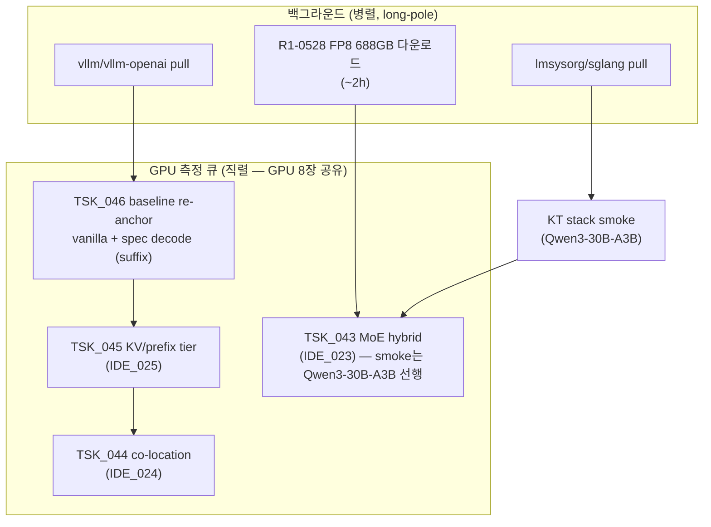

# PLN_003 — Hybrid Regime Sweep 캠페인 (violet-h100-016, 2026-08-27)

> parent: `IDE_023` / `IDE_024` / `IDE_025`. 진행 로그 (10분 단위): [`PROGRESS_20260827.md`](PROGRESS_20260827.md)

## 1. 목표

사용자 지시: "가능한 모든 경우 다 해서 성능 향상을 만들어." 직전 재조사 보고 (2026-08-27) 의 T1~T6 중 이 노드에서 즉시 실행 가능한 전 트랙을 병렬/직렬 조합으로 실행한다.

## 2. 노드 사실 (측정 전제)

- violet-h100-016: Xeon 8480+ ×2 (112C/224T, AMX native), DDR5 2TB, H100 80GB ×8 NVLink, 전 GPU 유휴
- **기존 측정 노드와 별개** — vLLM 컨테이너/이미지 부재 (cuda-base 만 존재) → baseline re-anchor (`TSK_046`) 필수
- CPU turbo OFF (2.0GHz 고정, `no_turbo=1`) — **turbo unlock 은 사용자 결정 대기** (T6)
- k8s 워커 — 컨테이너는 nerdctl `default` namespace, `--net host`
- 인터넷 ~105MB/s (70B 68GB 11분 실측)

## 3. 트랙 구성과 순서

- GPU 측정은 직렬 (동시 점유 금지). CPU-only 작업 (다운로드, 문서, 분석) 은 병렬.
- 각 측정 산출물: `eval/results/<TS>_tsk0XX_*/` (기존 규약 유지).

## 4. 성공 판정 (트랙별 게이트 = TST_020~023)

| 트랙 | binding 지표 | 게이트 |
|---|---|---|
| TSK_046 | 본 노드 vanilla/spec tps | 재현성 (jitter ≤3%) |
| TSK_045 | 압박 구성 TTFT/tps + hit 카운터 | net win && 비압박 무회귀 |
| TSK_044 | 합산 (GPU tps 불변 + BG 처리량) | 손실 ≤1% && CPU ≥50% |
| TSK_043 | R1-0528 hybrid tok/s | GPU-only OOM 실증 + 서빙 성립 |

## 5. 하지 않는 것

- dense decode attention CPU offload 재시도 (SUB_036/040/041/042 재실증 기각)
- same-request lookahead 계열
- "CPU busy%" 를 성공 지표로 쓰는 것
