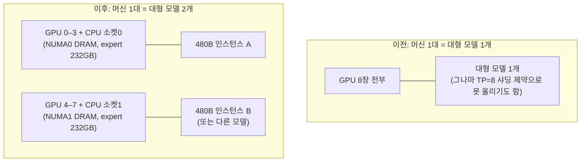

# 한 대의 머신에서 대형 모델 두 개 서빙하기 — CPU-expert 오프로드에 의한 GPU 통합(consolidation)

> 작성 2026-08-29. 근거 실험: `TSK_047` (`eval/results/20260829_105722_tsk047_qwen480b/`)
> 요지: **480B급 MoE 모델은 GPU 4장으로는 서빙이 불가능(OOM 실측)하지만, 같은 4장에 CPU와 DRAM을 더하면 품질 손실 없이 서빙된다. 따라서 GPU 8장짜리 머신 한 대가 "대형 모델 1개"가 아니라 "대형 모델 2개"를 감당할 수 있다.**

---

## 1. 이론 — 왜 가능한가

### 1.1 MoE 모델의 구조적 희소성

Qwen3-Coder-480B 같은 MoE 모델은 전체 가중치 480GB 중 대부분(약 95%)이 expert 층이다. 그러나 토큰 하나를 처리할 때 실제로 계산에 참여하는 expert는 160개 중 8개뿐이다(활성 파라미터 35B). 즉 **가중치의 대부분은 "그 순간에는 저장만 되어 있으면 되는 데이터"**다.

### 1.2 자원 등식 — 저장은 DRAM이, 계산 밀도는 GPU가

이 머신의 자원 비대칭:

| 자원 | GPU 8장 | CPU 2소켓 | 비율 |
|---|---|---|---|
| 메모리 용량 | HBM 640GB | **DRAM 2TB** | CPU가 3.1배 |
| 메모리 대역폭 | 26.8TB/s | ~0.6TB/s | GPU가 45배 |
| 행렬 연산(AMX 포함) | ~7.9PF | ~0.2PF | GPU가 수십 배 |

계산 밀도가 높은 부분(attention, 공유층, KV 캐시)은 GPU에 두고, **용량만 큰 부분(expert 가중치)은 DRAM에 두고 CPU의 AMX 명령어로 그 자리에서 계산**하면, 각 자원이 자기가 유리한 일만 맡는다. expert 가중치를 GPU로 실어 나르는 방식(PCIe 64GB/s 병목)이 아니라 CPU가 자기 메모리에서 직접 계산하므로 전송 병목이 없다.

### 1.3 왜 이것이 "머신 1대 = 모델 2개"가 되는가

hybrid 서빙에서 GPU가 실제로 담당하는 것은 attention·공유층(수십 GB)과 KV 캐시뿐이다. 480B 모델도 GPU 4장이면 충분하다. 남는 GPU 4장은 완전히 자유이므로:



DRAM 관점에서도 480B의 INT4 expert 세트는 232GB이므로 **두 벌을 올려도 464GB — 2TB의 4분의 1**이다.

### 1.4 성립 조건 (우리 atlas 의 판정 규칙과의 정합)

이 방식이 이기는 이유는 "CPU가 GPU를 도와서"가 아니라 **"GPU 혼자서는 원리적으로 불가능한 일(용량 초과)을 CPU가 메우기 때문"**이다. 반대로 GPU에 여유가 있는 모델(예: 30B)을 이 방식으로 돌리면 15배 느려진다는 것도 같은 실험 계열에서 실측했다. 즉 적용 조건은 명확하다: **모델(또는 모델 조합)이 배정된 GPU의 HBM을 초과할 때만 쓴다.**

---

## 2. 방식 — 어떻게 돌리는가

### 2.1 가중치 준비 (1회)

```
kt quant <FP8 모델 스냅샷> -m int4 -i fp8 -o /models/kt/qwen3-480b-int4 \
        --cpu-threads 96 --numa-nodes 2 -y
# 480GB FP8 → 232GB AMXINT4 (67 shards), 소요 약 40분 (96스레드, NUMA 2풀)
```

### 2.2 서빙 기동 (인스턴스 1개 기준, 실측 검증된 구성)

```
CUDA_VISIBLE_DEVICES=0,1,2,3 python3 -m sglang.launch_server \
  --model-path <FP8 스냅샷> --tp 4 \
  --attention-backend triton --disable-cuda-graph \
  --mem-fraction-static 0.80 --max-total-tokens 131072 \
  --kt-weight-path /models/kt/qwen3-480b-int4 --kt-method AMXINT4 \
  --kt-cpuinfer 96 --kt-threadpool-count 2 --kt-num-gpu-experts 0
```

- 스택: SGLang 0.5.18 + kt-kernel 0.7.0.post2. 이 이미지에는 호환 패치 4건이 필요하다(패치 원문: `COMPREHENSIVE_REPORT_20260827.md` §3.2 — kt 래퍼 인자 1건, sgl_kernel 인자 1건, kt-kernel `--no-deps` 설치, 변환 스크립트 수급)
- 역할 분담: GPU 4장 = attention·공유층·KV(TP=4) / CPU = router가 고른 expert의 FFN을 DRAM 상주 INT4 가중치로 AMX 계산
- 토큰당 흐름: GPU(attention+router) → 선택된 8개 expert 입력을 CPU로 → CPU AMX 계산 → 결과만 GPU로 반환

### 2.3 2-인스턴스 구성 (제안 — 간섭 최소화 설계)

| | 인스턴스 A | 인스턴스 B |
|---|---|---|
| GPU | `CUDA_VISIBLE_DEVICES=0,1,2,3` | `CUDA_VISIBLE_DEVICES=4,5,6,7` |
| CPU 스레드 | 소켓0 물리코어(0–55)에 pin, cpuinfer 48 | 소켓1 물리코어(56–111)에 pin, cpuinfer 48 |
| DRAM | NUMA0 (expert 232GB) | NUMA1 (expert 232GB) |
| 포트 | 30000 | 30001 |

GPU 0–3은 소켓0에, 4–7은 소켓1에 물려 있으므로(실측 토폴로지) 이 분할은 하드웨어 경계와 일치한다. 공유 자원은 사실상 없어지고, 간섭은 LLC·메모리 컨트롤러 수준의 잔여분만 남는다.

---

## 3. 실험 방법

### 3.1 완료된 검증 (TSK_047, 2026-08-29)

| 셀 | 목적 | 방법 |
|---|---|---|
| r0 | "GPU 4장으로는 불가능"의 실증 | GPU-only TP=4 기동 시도 → OOM 로그 채증 |
| r1 | hybrid 서빙 성립 + 품질 + 처리량 | hybrid TP=4 기동 → greedy 고정 프롬프트 4종 품질 확인 → sonnet 512/128, 64요청, 동시 16으로 벤치, CPU/GPU 사용률 병행 기록 |
| r2 | GPU-only 기준선 확보 시도 | GPU-only TP=8 기동 시도 (결과: 엔진의 FP8 블록 양자화 제약으로 샤딩 불가 — 기준선 미확보를 한계로 기재) |

품질 판정 방식: 정답이 자명한 프롬프트(수도, fibonacci, 등차수열 합, 문자열 뒤집기)에 temperature 0으로 생성해 출력의 정확성을 직접 확인. (R1-0528은 같은 지점에서 기호 스팸으로 깨졌으므로, 이 스모크가 방법 건전성의 판별점이다)

### 3.2 "모델 2개 동시" 실증 — **완료 (당일)**

| 셀 | 구성 | 측정 |
|---|---|---|
| t1 | A 단독 (NUMA0 구성, cpuinfer 48) | 처리량·TTFT — cpuinfer 96→48 및 pin 의 영향 분리 |
| t2 | B 단독 (NUMA1 구성) | 좌동 (대칭성 확인) |
| t3 | **A+B 동시** (각자 벤치 동시 실행) | 인스턴스별 처리량 — t1/t2 대비 하락률 = **간섭 비용** |
| (선택) t4 | NUMA pin 없이 A+B | pin 의 효과 분리 |

**결과 (2026-08-29, `eval/results/20260829_124321_k2_dual480b/RESULTS.md`)**: 동시 실행 30.59/30.58 tok/s — 단독(30.4/31.0) 대비 간섭 ≈0% (**강한 성립**). 합산 61.2 = 전체-머신 단독 44.5 대비 +37%.
**필수 절차 발견**: kt CPUInfer 가 numactl 을 무시하고 절대 코어 0 부터 pin 하므로(미격리 시 115× 붕괴), 인스턴스별 컨테이너 + cgroup cpuset(cpus+mems) 격리가 필수다. 이 결함은 upstream 제보 대상.

변형: B를 480B 대신 70B GPU-only(TP=4)로 두면 "대형 코드모델 + 범용 챗모델 동시 운영"이라는 현실 시나리오 검증이 된다.

---

## 4. 관련 데이터 (전부 이 머신 실측)

### 4.1 TSK_047 본 실험 (Qwen3-Coder-480B-A35B-Instruct-FP8)

| 항목 | 값 |
|---|---|
| 모델 크기 | FP8 원본 450GB → AMXINT4 변환 **232GB** (변환 ~40분) |
| r0: GPU-only TP=4 | **OOM 사망 45초** (`memory allocation failed with OOM on device 1`) |
| r1: hybrid TP=4 부팅 | 90초 (expert 232GB → DRAM) |
| r1: 품질 | **4/4 정상** — "Paris, which is…", 올바른 fibonacci, 1..100 공식, `s[::-1]` |
| r1: 처리량 | 44.5 tok/s (64요청, 동시 16), TTFT p50 8.5s, TPOT p50 287ms |
| r1: 자원 사용 | CPU busy 평균 41.9% (cpuinfer 96 기준), GPU 4장만 점유 |
| r2: GPU-only TP=8 | 부팅 불가 — `output_size 320 not divisible by block_n 128` (FP8 블록 양자화 제약) |

### 4.2 같은 방법의 교차 검증 데이터

| 실험 | 결과 |
|---|---|
| Qwen3-30B-A3B (INT8·INT4, 8-27/28) | 품질 정상 — 방법 자체의 1차 검증 |
| DeepSeek-R1-0528 642GB (8-27) | 서빙 성립(19.7 tok/s, TP=8, CPU 42.7%)하나 **출력 깨짐** → TSK_047로 **DeepSeek-계열 특이 변환 결함으로 확정** (`SUB_167`, upstream 제보 대상) |
| AMX microbench (E1) | expert당 처리 토큰 1→512에서 토큰당 비용 **43~53배 하락** — CPU expert 연산이 배치에서 급격히 싸지는 물리적 근거 |
| spec decode 결합 (E3) | CPU-expert 서빙에 speculative decoding을 얹으면 **+45~55%** — 아래 개선 레버 중 하나로 즉시 적용 가능 |

### 4.3 수치 해석 시 주의

- 모든 CPU 수치는 **turbo OFF(2.0GHz 고정)** 상태의 하한이다
- 44.5 tok/s는 무튜닝 값 — 개선 레버(미적용): turbo 해제, hot-expert GPU 배치, spec decode(+45~55% 실증), cpuinfer/NUMA 튜닝
- GPU-only 처리량 기준선이 없으므로(r2 한계) 속도 비교 주장은 하지 않는다. 이 문서의 주장은 속도가 아니라 **용량**이다: "불가능 → 가능", 그리고 "1대 = 2개"
