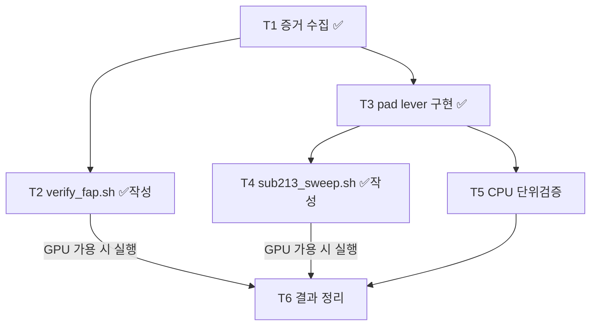

# SUB_213 — task.md

## T1. 증거 수집 (✅ 완료, 2026-06-11)

- [x] TSK_042 boot log 에서 `cudagraph_mode=PIECEWISE` 확인
- [x] SUB_212 boot log 에서 `cudagraph_mode=FULL_AND_PIECEWISE` 확인 (`sweep_corpus.sh:120`)
- [x] `/sys/bus/dsa/devices/wq0.0/clients = 0` — vanilla 측정 중 WQ 미사용 확인
- [x] `/etc/ld.so.preload` 부재 / DTO·DML 미설치 / uptime 16.1일 (리부트 confounder 배제)
- [x] README.md §1 증거 표 7행 정리

## T2. 검증 실험 스크립트 (✅ 작성 완료, 실행 대기)

- [x] `../SUB_212_optimal_dsa_6point/verify_fap.sh` — E1 vanilla+PIECEWISE, E2 suffix+PIECEWISE
- [ ] **실행** — GPU 가용 시 (현재 다른 실험 점유 중, 사용자 지시로 보류)

## T3. Uniform Draft Padding lever 구현 (✅ 완료)

- [x] `vllm/v1/spec_decode/suffix_decoding.py` — `propose()` 에 pad/truncate 추가
  - env `VLLM_SUFFIX_PAD_UNIFORM=1` (flag file `/tmp/vllm_l3_VLLM_SUFFIX_PAD_UNIFORM.flag` fallback)
  - 기본 OFF = upstream 동일
  - pad 토큰 = 마지막 sampled token (어떤 id 든 rejection sampler 가 기각 → 출력 동등)
  - `max_model_len` 경계에서 truncate (`target = min(K, max_model_len - num_tokens - 1)`)

## T4. P1~P4 sweep 스크립트 (✅ 작성 완료, 실행 대기)

- [x] `sub213_sweep.sh` — P1 (K8/pad/FaP), P2 (K15/pad/FaP), P3 (K8/nopad/FaP), P4 (K8/nopad/PW)
  - pad 셀: env + flag file 둘 다 세팅 / nopad 셀: 둘 다 제거 (오염 방지)
- [ ] **실행** — E1/E2 후 chain (GPU 가용 시)

## T5. CPU 단위검증 (GPU 불필요 — GPU 점유 중 진행 가능)

- [ ] test.md U1: pad 로직 단위 테스트 (mock proposal → 길이 정확히 target 확인)
- [ ] test.md U2: env/flag OFF 시 upstream 동일 (no-op) 확인

## T6. 결과 정리 (측정 후)

- [ ] `MEASUREMENTS.md` — E1/E2 + P1~P4 결과 vs 사전 예측
- [ ] E1 ≈ 8,850 적중 시: SUB_212 문서 정정 (README.md, FULL_MATRIX_6point.md,
      OPTIMAL_DSA_70cells_flat.md, id_registry SUB_212 행) — "+36% = host DSA" → "FaP" 재귀속
- [ ] id_registry SUB_213 상태 갱신 (활성 → 완료 or 기각)

## 의존성

