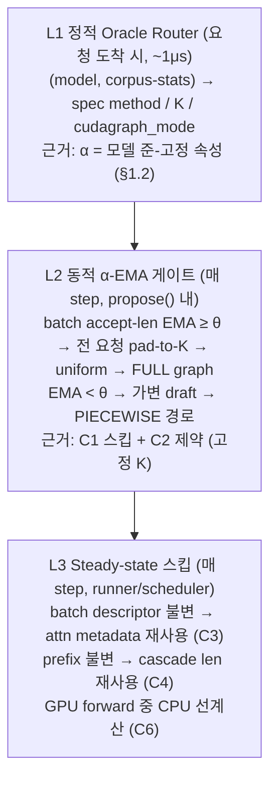

# IDE_024 — Workload-Adaptive Composite Optimization

> **status**: 활성 (2026-06-11 신설)
> **parent**: `TSK_020/SUB_072` (idea backlog)
> **선행**: `IDE_022` (α 측정), `IDE_023` (HW lever), `SUB_212` (70-cell 6-point), `SUB_213` (uniform padding)
> **자식 TSK**: `TSK_046`

기존 lever 답습이 아닌, **하드웨어 전수 분석 × 워크로드 공통 특성 × 코드 스킵 지점**의
3중 분석에서 출발해 슈퍼컴퓨팅/SW 공학 방법론을 매핑한 복합 최적화 설계.

---

## 1. 3중 분석 종합 (2026-06-11, 읽기 전용 분석)

### 1.1 하드웨어 인벤토리 — 무엇이 놀고 있는가

| 자원 | 상태 | 유휴 정도 |
|---|---|---|
| 2× Xeon Platinum 8570 (EMR, 112C/224T) | loadavg **0.93** | **~99.6% 유휴** |
| AMX (tile/bf16/int8), AVX-512 전체 (+fp16/vnni/vbmi2) | 모두 present | 추론 경로 미사용 (cpu_amx draft 만 옵션) |
| DSA ×2 (소켓당 4 engine, 8 WQ enabled) | **clients=0 전부** | 완전 유휴 (~240 GB/s 이론 memmove) |
| 메모리 2.06 TB (NUMA 2 노드) | 대부분 page cache | KV CPU-tier 여력 거대 |
| HugePages | 0 할당, THP=madvise | TLB 손실 ~5-10% 가능성 |
| IAA / QAT | **하드웨어 부재** | 압축/암호 lever 는 기각 |
| enqcmd/movdir64b/cldemote/waitpkg | present | DSA user-space submit + cache 제어 가능 |

### 1.2 워크로드 공통 특성 — 무엇이 예측 가능한가

| 특성 | 증거 (SUB_212 70-cell + IDE_022 프로파일) | 활용 |
|---|---|---|
| **α(draft 수락률)는 모델 구조의 준-고정 속성** | 동일 모델의 corpus 간 α 편차 < 0.1 (Llama-8B sharegpt 0.851 vs wildchat 0.857) | ~1 μs lookup 으로 spec ON/OFF 라우팅 |
| suffix 승패는 α≈0.5 임계로 분리 | 성공군 α 중앙값 0.684 / 실패군 0.374, 정확도 78.6% (55/70) | 정적 oracle 게이트 |
| 병목 유형 = f(모델크기, TP) | 7B=launch-bound (trace 36%) / 70B=memcpy-bound (80%) / MoE-671B=둘 다 (각 35%) | lever 선택 (FULL graph vs KV tiering) |
| 출력 길이 = 2-모달 (8192 상한 / 조기종료 16%) | per_request_raw 분석 | 벤치 한정 — per-request 길이 예측은 **불가** (미측정) |
| MoE 는 suffix 치명 (−49~−64%) | R1-671B 전 corpus 음수 | oracle 게이트의 최대 가치 셀 |
| per-request 동적 α / batch shape | **미측정** | 동적 게이트는 런타임 관찰 (accept-len EMA) 필요 |

### 1.3 코드 스킵 지점 — 어디를 건너뛸 수 있는가

| # | 지점 | 파일:행 | 성격 |
|---|---|---|---|
| C1 | FULL cudagraph dispatch — uniform decode 시 CPU launch 경로 전체 스킵 | `gpu_model_runner.py:3993` (`_is_uniform_decode`) | **최대 단일 lever** (vanilla +33~36% 기측정) |
| C2 | `uniform_decode_query_len = 1 + num_spec_tokens` **init 고정** | `gpu_model_runner.py:908`, `cudagraph_dispatcher.py:37` | **제약**: 적응형 K 불가 → 고정 K + pad ON/OFF 만 가능 |
| C3 | attention metadata 빌드 — batch 구성 동일 시 재계산 불필요 | `gpu_model_runner.py:2372-2700` (부분 캐시 존재) | memoization 후보 (+2~5% est) |
| C4 | cascade prefix len — prefix block 수 불변 시 재계산 불필요 | `gpu_model_runner.py:2663-2763` | incremental 후보 |
| C5 | sync points `.item()`/`.tolist()` 다수 | `gpu_model_runner.py:363,1908,2408,...` | critical-path 단축 후보 |
| C6 | ngram precompute / broadcast / thread cap | `ngram_proposer.py` (env 게이트 기구현) | GPU forward 중 CPU 선계산 |
| C7 | NEO swap-out → DSA lane (유일한 진성 DSA 발화점) | `neo_cpu_kv_buffer.py:467-518` | KV-heavy regime 에서만 의미 |
| C8 | grammar bitmask / prompt-logprobs / mrope — 조건부 스킵 기존재 | `structured_outputs.py` 등 | 이미 최적 (확인 완료) |

---

## 2. HPC / SW 공학 방법론 카탈로그 → 매핑

| 방법론 (출처 분야) | 원리 | 본 환경 매핑 | 채택 |
|---|---|---|---|
| **Autotuning** (ATLAS/FFTW/OpenTuner, HPC) | 설정 공간을 측정으로 탐색, 워크로드별 최적 config 테이블 | SUB_212 의 70-cell 데이터 = 이미 완성된 탐색 결과 → (model,corpus)→{method,K,cudagraph} oracle | ✅ T1 |
| **Value speculation + 적응 게이팅** (DISCO/SpecDec++, arch) | 수락률 신호로 speculation 강도 동적 조절 | per-step batch α EMA → pad ON/OFF 게이트 (C2 제약 하 유일한 적응형) | ✅ T2 |
| **Memoization / Incremental computation** (SE) | 입력 불변 시 재계산 스킵 | C3 attention metadata 캐시, C4 cascade incremental | ✅ T3 |
| **Critical-path 분석** (CPM/PERT, OR→HPC) | 경로상 stall 제거 | C5 sync point 통합·지연 | ✅ T3 부속 |
| **SMT co-scheduling / work stealing** (Tullsen/Cilk) | 유휴 HW thread 에 보조 작업 | GPU forward 동안 ngram/suffix/prefix-hash 선계산 (C6) | ✅ T4 |
| **Backfilling / SJF** (슈퍼컴 배치 스케줄링, EASY) | 짧은 작업 끼워넣기 | burst-aware admission (SUB_201 기구현) 활성 검증; per-request 길이 예측 불가로 SJF 는 보류 | ⚠️ T5 (보류) |
| **STREAM/LogGP 모델링** (HPC) | 전송량 ≥ 임계일 때만 오프로드 | DSA min 64KB 게이트 (기구현) + KV-heavy regime 한정 (C7) | ✅ T6 |
| **Loop perforation / approximate computing** (MIT SE) | 일부 반복 생략 | **기각** — 출력 등가 제약 위반 |  ❌ |
| **압축 오프로드** (IAA/QAT) | 압축을 가속기로 | **기각** — 하드웨어 부재 (§1.1) | ❌ |
| **Belady/oracle eviction** (메모리 계층) | 미래 참조 기반 교체 | KV CPU-tier eviction 힌트 — KV-heavy 검증(T6) 후 후속 | 🔜 |

**채택 기준**: (a) 출력 분포 등가 유지 가능, (b) 본 HW 에 실재, (c) 기측정 데이터로 사전 예측 commit 가능.

---

## 3. 복합 알고리즘 설계 (3-layer)

- **출력 등가**: L1/L2 는 rejection sampling 의 등가성에 기댐 (pad 토큰은 항상 기각).
  L3 은 수치 경로 자체를 바꾸지 않음 (동일 입력 → 동일 metadata).
- **CPU 활용 (Objective)**: L2 의 EMA 추적 + L3 의 선계산이 유휴 224 thread 를 사용.
- C2 제약으로 **다중 K capture (FULL graph 를 여러 query-len 에 캡처)** 는 Tier-3
  대수술로 분리 (cudagraph_dispatcher 키 구조 변경 필요).

## 4. 코드 실현성 점검 결과 (2026-06-11 확정)

| 체크포인트 | 결과 |
|---|---|
| `uniform_decode_query_len` 가변화 가능? | ❌ init 고정 (`gpu_model_runner.py:908`) — L2 는 고정 K + pad ON/OFF 로 설계 |
| pad ON/OFF 를 propose() 한 곳에서 제어 가능? | ✅ `suffix_decoding.py:424` (SUB_213 lever) — per-step 분기로 확장 가능 |
| FULL graph capture size 에 32×(1+8)=288 존재? | ✅ (SUB_212 boot log) |
| accept-len 신호를 CPU 에서 싸게 얻을 수 있나? | ✅ `suffix_decoding.py` L3 instrumentation 이 이미 per-req accept_len 부기 |
| attn metadata 캐시 키 존재? | 부분 — `cached_attn_metadata` (ubatch 내) 존재, batch-단위 키 확장 필요 |
| oracle 라우터 주입점? | serve 옵션 레벨 (L1 은 부팅 config) + regime_detector (런타임) 재활용 |

## 5. 산출물

- `task.md` — 재정리된 할 일 목록 (TSK_046 = Tier-1)
- `test.md` — 검증 게이트
- 분석 원본: 본 README §1 (3 에이전트 보고 요약)
