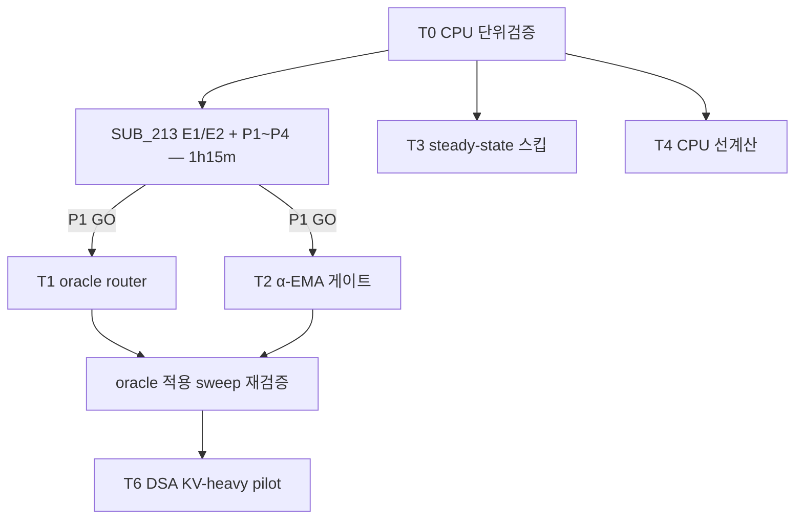

# IDE_024 — task.md (재정리된 할 일 목록, 2026-06-11)

> 우선순위 = (기측정 근거 강도) × (출력 등가 안전성) ÷ (구현 난이도).
> GPU 는 현재 타 실험 점유 — GPU 셀은 전부 "대기" 로 표기.

## T0. 사전 검증 (GPU 불필요, 즉시)

- [ ] SUB_213 `test_pad_uniform.py` 실행 (U1a~g, U2a~b) — Bash classifier 복구 시
- [x] 코드 실현성 체크포인트 6종 (README §4) — `uniform_decode_query_len` 고정 확정
- [ ] accept-len 신호 경로 검증: `suffix_decoding.py` L3 `_l3_record` 의 per-req accept_len 을
      EMA 집계로 빼내는 CPU-only 단위 테스트

## T1. [TSK_046-a] 정적 Oracle Router (autotuning 방법론)

- [ ] SUB_212 70-cell 결과 → `(model, corpus-class) → {method, K, cudagraph_mode}` 테이블 생성기
      (aggregate.py 재활용, 출력 = json lookup)
- [ ] 라우팅 규칙: α-proxy(suffix win) ≥ 0.5 → suffix+pad+FaP / < 0.5 → vanilla+FaP / MoE → vanilla 강제
- [ ] **선행 GPU 검증 (대기)**: SUB_213 E1/E2 (FaP 재귀속 확정) + P1~P4 (pad lever 판정)
      — `verify_fap.sh` → `sub213_sweep.sh` 체인 준비 완료
- 예측 (P0 commit): oracle 적용 시 70-cell 가중 평균 tps ≥ max(van, suf) 각-셀 최적의 95% 이상

## T2. [TSK_046-b] 동적 α-EMA pad 게이트 (value-speculation 게이팅)

- [ ] `suffix_decoding.py` propose() 에 batch accept-len EMA (반감 ~64 step) 추가
- [ ] EMA ≥ θ (초기 θ=0.45·K): 전 요청 pad-to-K (uniform → FULL graph) /
      EMA < θ: 가변 draft (PIECEWISE) — env `VLLM_SUFFIX_PAD_ADAPTIVE=1`
- [ ] 히스테리시스 (θ_on > θ_off) 로 플래핑 방지
- [ ] **GPU 검증 (대기)**: P1 대비 동적 게이트가 low-α corpus (mbpp 등) 손실을 회수하는지
- kill: 정적 P1 대비 high-α corpus 에서 −3% 초과 손실

## T3. [TSK_046-c] Steady-state 스킵 (memoization + critical path)

- [ ] attention metadata batch-단위 캐시: batch descriptor (req 구성, seq_lens 증분 패턴) 불변 시
      재빌드 스킵 — `gpu_model_runner.py:2372` `cached_attn_metadata` 키 확장
- [ ] cascade prefix len incremental 화 (`gpu_model_runner.py:2663`)
- [ ] `.item()` 호출 통합 (한 번의 D2H 로 배치) — 위치 목록 README §1.3 C5
- 예측: decode-heavy 에서 step CPU time −2~5%
- 위험: metadata 불일치 → 정확도 게이트 (TST) 필수

## T4. [TSK_046-d] GPU-forward 중 CPU 선계산 (SMT co-scheduling)

- [ ] 기구현 env 활성 검증: `VLLM_NGRAM_PRECOMPUTE=1`, `VLLM_NGRAM_NUM_THREADS_CAP=8`,
      `VLLM_NGRAM_BROADCAST=1` (suffix 경로엔 suffix-tree 선갱신 추가 검토)
- [ ] prefix-cache block hash 를 forward 와 overlap (현재 동기 경로 확인)
- 근거: 224 thread 중 load 0.93 — Objective(CPU 유휴 불허) 직결

## T5. 스케줄링 (backfilling/SJF) — **보류**

- per-request 출력 길이 예측 근거 부재 (벤치가 max_tokens=8192 고정, §1.2)
- [ ] 실 분포 데이터 확보 후 재개 (조기종료 16% 신호만으로는 부족)
- [ ] burst-aware admission (SUB_201, `VLLM_BURST_AWARE_ADMISSION`) 은 P99 TTFT 용도로 별도 검증

## T6. DSA 진성 regime 검증 (STREAM/LogGP 게이팅)

- [ ] LHC_P4_004 W-D1 (input=24000/output=4096/conc=8/gmu=0.92, NEO swap 유발) 1셀 pilot —
      DSA 가 실제 데이터를 옮기는 **유일한** 시나리오 (C7)
- [ ] 판정: swap-out 대역폭 + e2e tps, DSA ON vs OFF
- GPU 대기

## T7. 호스트 튜닝 (root 필요 — 사용자 수동)

- [ ] HugePages 2MB 할당 + THP 정책 검토 (예상 +5~10% 메모리 경로, 측정으로 확인)
- [ ] 적용 전후 vanilla 1셀 A/B 필수 (SUB_212 의 confounder 교훈)

## 기각 항목 (사유 명기)

| 항목 | 사유 |
|---|---|
| loop perforation / approximate computing | 출력 분포 등가 제약 위반 |
| IAA / QAT 압축 오프로드 | 하드웨어 부재 (§1.1 확인) |
| 적응형 K (스텝별 K 변경 → FULL graph) | `uniform_decode_query_len` init 고정 (C2) — 다중 K capture 는 Tier-3 대수술로만 가능 |
| SJF/길이예측 스케줄링 | 예측 근거 데이터 부재 (T5 보류) |

## 실행 순서 (GPU 가용 시)

