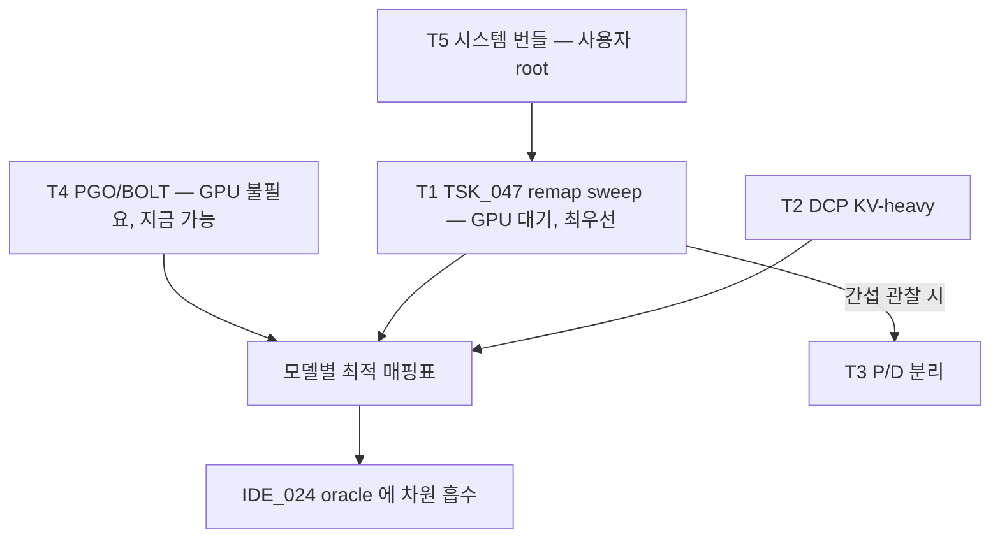

# IDE_025 — task.md (TSK_047 중심)

## T1. [TSK_047] Parallelism remap sweep (Tier-1, 플래그만으로 측정)

### 셀 매트릭스 (mix corpus, 총 부하 동일 원칙)

| 모델 | 구성 | conc (총 부하 동일) | 사전 예측 (cluster tps) |
|---|---|---:|---|
| Llama-8B | TP8/DP1 (기준) | 32 | 27,851 (suf) / 12,089 (van FaP) |
| Llama-8B | **TP1/DP8** | 256 (32×8) | **≥ 2× 기준** (per-GPU 3,481 → 7,000+) |
| Llama-8B | TP2/DP4 | 128 | 중간점 (KV 용량 vs 통신 트레이드 확인용) |
| Qwen-32B | TP8/DP1 (기준) | 32 | SUB_212 값 |
| Qwen-32B | TP4/DP2 | 64 | +30~80% |
| Qwen-32B | TP2/DP4 | 128 | KV 용량 한계 확인 |
| Llama-70B | TP8/DP1 (기준) | 32 | SUB_212 값 |
| Llama-70B | TP4/DP2 | 64 | +20~50% (memcpy 80% 근거) |

- [ ] `sweep_remap.sh` 작성 (sweep_corpus.sh harness 재사용, `-dp` + `--data-parallel-hybrid-lb`)
- [ ] throughput_runner 의 conc 파라미터화 확인 (이미 `--concurrency` 존재)
- [ ] **실행 — GPU 가용 대기**

### 증분 A/B (각 모델 winner 구성 위에서)

| 증분 | 플래그 | 적용 대상 | 사전 예측 |
|---|---|---|---|
| +FP8 KV | `--kv-cache-dtype fp8` | 전 winner | decode tps +10~30%, **분포 게이트 필수** |
| +DBO | `--enable-dbo` | TP≥2 winner | +0~10% (decode threshold 32 충족 시) |
| +SP/comm fusion | `--compilation-config '{"pass_config":{"enable_sp":true,"fuse_gemm_comms":true}}'` | TP≥2 winner | +3~15% (memcpy-bound) |
| +compile_sizes | `'{"compile_sizes":[288,512]}'` | 전 winner | +0~5% |

판정: 모델별 최적 (TP,DP,kv,overlap) 매핑표 → IDE_024 oracle 의 라우팅 차원으로 흡수.
kill: TP1/DP8 (8B) 이 기준 대비 +20% 미만이면 N1 기각 (통신이 병목이 아니었다는 뜻 — 프로파일 재해석 필요).

## T2. DCP 검증 (N5) — KV-heavy 전용

- [ ] LHC_P4_004 W-D1 (input 24k) 워크로드에서 `--decode-context-parallel-size 2` A/B
- T1 과 독립, GPU 대기

## T3. P/D 분리 in-node (N7) — T1 결과 후 판단

- [ ] NIXL connector 로 8 GPU 를 prefill 4 + decode 4 분할, KV NVLink 전송
- [ ] 진입 조건: T1 에서 chunked-prefill 간섭이 TTFT/TPOT 에 보이는 경우만
- 예측 commit 은 진입 시점에

## T4. 호스트 PGO/BOLT (N8) — GPU 불필요, 병행 가능

- [ ] perf 프로파일 (CAP 제약 시 py-spy) 로 host 핫스팟 상위 10 확보
- [ ] vLLM C-ext + CPython 을 `-fprofile-use` 재빌드, BOLT 적용 가부 조사
- [ ] scheduler 핫루프 (schedule() O(n) 부분) Cython/C++ 화 타당성 메모
- 게이트: host-bound 셀 (8B 급) 에서 step CPU time −5% 이상

## T5. 시스템 번들 (N10) — root 필요, 사용자 수동

- [ ] GPU clock lock (`nvidia-smi -lgc`) + persistence mode
- [ ] NCCL 스레드 NUMA 고정, NIC/IRQ steering 점검
- [ ] 적용 전후 1셀 A/B (confounder 수칙)

## T6. MLFQ 선점 스케줄링 (N9) — 보류 (tput 중립, p99 용)

## T7. persistent megakernel / conditional graph node (N11) — Tier-3 연구 백로그

- CUDA 12.8 conditional node 로 가변 길이 spec-decode 를 graph 내 분기 처리하는 설계 메모만 유지.
  (SUB_213 pad 방식의 근본 대안 — 착수는 T1~T3 판정 후)

## 우선순위 그래프

