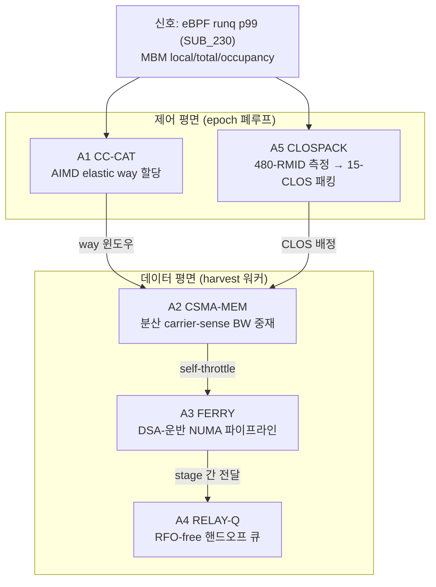

# IDE_026 — ALGORITHMS.md (신규 설계 알고리즘 5종)

> 2026-06-12 설계. **기존 기법의 적용이 아니라 본 머신 실측 특성에서 유도한 신규 알고리즘.**
> 설계 원칙: 실측된 HW 비대칭·제약을 *재료* 로 쓴다 —
> ① 모니터링(480 RMID) ≫ 제어(15 CLOS) 비대칭 → 측정-주도 패킹
> ② CAT mask 연속 제약 + 즉시 재기록 가능 → 한쪽 끝에서만 자라는 elastic 윈도우
> ③ tpause(≤100k TSC)·umonitor·movdiri·cldemote → 트래픽-제로 동기화 프리미티브
> ④ DSA read buffer(96) = 디바이스 메모리 동시성의 *유일한* 상한 노브 → UPI 셰이핑
> 범위: §0 (RESEARCH_DIRECTIONS.md) — 전부 비-GPU. 전부 GPU 불요 검증 가능.

## 구성도 — 5 알고리즘이 만드는 guarded-harvest 런타임 스택



---

## A1. CC-CAT — Congestion-Controlled Cache Allocation (AIMD elastic way 윈도우)

**한 줄**: TCP 혼잡제어 (AIMD) 를 LLC way 할당에 이식 — harvest 의 way 윈도우가
"혼잡 신호 없으면 +1 way, SLO 위반이면 ½" 로 숨쉰다.

**HW 유도 (실측)**:
- CAT mask 는 **연속 필수** (`sparse_masks=0`) → 윈도우는 한쪽 끝 (way 0) 에서만
  자랄 수 있음 = AIMD 의 cwnd 와 동형 (스칼라 하나로 상태 표현 가능)
- schemata 재기록은 파일 write 1회 (µs~ms) → epoch (10 ms) 마다 조정 가능
- **shrink 의 비대칭**: CAT 축소는 "신규 할당 금지" 일 뿐 기존 라인은 잔존 —
  점유는 시상수 τ 로 자연 감쇠. 따라서 MD (multiplicative decrease) 직후
  **cldemote 스윕** (harvest 가 자기 버퍼를 강등) 으로 τ 를 인위 단축.

**알고리즘**:
```
상태: w ∈ {1..W_max}   # harvest way 수. W_max = 16 (way 18-19 DDIO 비침범 + serving 최소 2)
신호: congested = (runq_p99 > L*) OR (serving_occ 가 자기 way 용량의 90% 도달)
epoch 10 ms:
  if not congested for K_ai(=5) consecutive epochs:
      w = min(w+1, W_max)                    # Additive Increase
  elif congested:
      w = max(⌈w/2⌉, 1)                      # Multiplicative Decrease
      harvest_workers.cldemote_sweep()        # 점유 감쇠 가속 (τ 단축)
  write schemata:
      harvest: L3 = (1<<w)−1                  # way 0..w−1
      serving: L3 = (0xFFFFF >> ?) ... = 0xFFFFF & ~((1<<w)−1)  # 나머지 (18-19 포함)
```

**안정성 논거**: AIMD 는 단일 자원·단일 조정자에서 수렴 (TCP 와 달리 경쟁 플로우가
없어 진동원은 measurement noise 뿐) → K_ai 히스테리시스로 억제. 최악 케이스에도
MD 1회로 serving 용량이 즉시 ½ 회복되며, cldemote 스윕이 회복 시간을 τ→τ/α 로 단축.

**신규성**: CAT 동적 재할당 연구는 있으나 (i) AIMD 의 cwnd-동형성을 연속-mask 제약과
연결한 것, (ii) **MD+cldemote 페어링으로 "축소가 즉효가 아닌" CAT 의 약점을 보정**한
것이 새로움. 측정 부산물 = "CAT 축소 후 점유 감쇠 시상수 τ" 자체가 신규 데이터.

**게이트**: 정상상태 w 진동 ≤ ±1 way, 외란 (aggressor 급증) 후 3 epoch 내 SLO 복귀,
정적 최적 way 대비 harvest 처리량 ≥ 90% (elastic 이 정적 oracle 에 근접하는가).

---

## A2. CSMA-MEM — Carrier-Sense Memory Arbitration (분산 BW 중재)

**한 줄**: 메모리 버스를 공유 매체로 보고, 각 harvest 스레드가 **자기 probe load 의
지연으로 혼잡을 감지 (carrier sense)** 해 randomized exponential backoff (tpause) —
중앙 제어자 없는 CSMA/CA.

**HW 유도 (실측)**:
- `rdtscp` 로 단일 load 의 지연을 ~수십 cycle 정확도로 측정 가능
- `tpause` C0.2: backoff 중 **트래픽·전력 모두 0** (spin-wait 와 달리 매체를 점유 안 함)
  — 1회 ≤ 100k TSC (실측 umwait max) → 긴 backoff 는 체인
- iMC 큐가 깊어지면 loaded latency 가 단조 증가 — 지연이 곧 carrier 신호

**알고리즘** (harvest 워커마다, 중앙 상태 없음):
```
초기화: probe_buf = 로컬 노드 256 MB (자기 CLOS 점유 회피 위해 prefetchnta 로만 접근)
        L_idle = IDLE 캘리브레이션 p50 (T1 의 IDLE 셀에서 1회 측정)
        bw_window = W_min(=10 µs)
작업 루프 (chunk = 64 KB 단위):
  process(chunk)
  every 100 µs:
      t0=rdtscp; load probe_buf[rand()]; t1=rdtscp     # carrier sense (64 B 1회)
      L_ema = α·(t1−t0) + (1−α)·L_ema
      if L_ema > β·L_idle (β=1.5):                      # 매체 혼잡
          tpause_chain(rand(0, bw_window))              # randomized backoff
          bw_window = min(2·bw_window, W_max=1 ms)      # exponential
      else:
          bw_window = max(bw_window − W_min, W_min)     # 점진 회복 (AIAD)
```

**핵심 성질**:
1. **보수적 안전성**: probe 지연은 *누가* 혼잡을 만들었든 오르므로 — serving 의
   burst 에도 harvest 가 물러난다. guarded-harvest 의 "무해 우선" 에 정확히 부합.
2. **확장성**: 워커 100+ 개도 중앙 락·공유 카운터 없이 동작 (randomization 이
   동기화된 폭주-재개 thundering herd 를 깸 — CSMA/CA 와 동일 원리).
3. probe 비용 = 64 B/100 µs/worker = 워커 100개여도 64 MB/s — 측정 대상 트래픽
   (수십 GB/s) 의 0.1% 미만.

**신규성**: 네트워크 MAC 프로토콜 (CSMA/CA) 의 메모리-컨트롤러 큐 적용. 기존 연구는
중앙 governor (Heracles 류) 또는 HW throttle (MBA) — **분산·자가조직·HW 불요** 조합이
새로움. MBA (10% 입도, socket-로컬 한정) 보다 입도가 곱고 UPI 트래픽에도 동작.

**게이트**: (a) victim p99 보호력이 MBA 20% 셀과 동급 (±10%) 이상, (b) harvest 합산
처리량은 MBA 대비 ≥ +15% (입도 우위 가설), (c) 워커 수 {4,16,64} 에서 公平성
(Jain index ≥ 0.9).

---

## A3. FERRY — DSA-Ferried NUMA Pipeline (코어는 로컬만 만진다)

**한 줄**: 원격-노드 데이터를 처리해야 하는 harvest 를 3-stage 파이프라인으로 —
**UPI 를 건너는 일은 전부 DSA (read buffer 로 셰이핑)** 가, 코어/AMX 는 **로컬
바운스 버퍼만** 접근. "컴퓨트는 로컬, 운반은 디바이스".

**HW 유도 (실측)**:
- MBA 는 socket-로컬만 throttle → 코어가 직접 원격 접근하면 제어 불능 (채널 ④)
- DSA `read_buffers_allowed` (max 96) = 디바이스 in-flight 동시성의 직접 상한 →
  UPI 레그를 **96→N 으로 정밀 셰이핑 가능** (코어 원격 접근에는 이런 노브가 없음!)
- 코어의 원격 load 는 ~310 ns 를 *동기로* 기다리지만 DSA 는 비동기 + batch (1024)

**알고리즘**:
```
구성: bounce[2][CHUNK] — 로컬 노드, 2 MB THP (SUB_234), CHUNK = 4 MB
      wq_ferry = 원격 소켓 데이터 전용 WQ (별도 group, read_buffers_allowed=24)
stage F (ferry-in):  DSA batch descriptor — remote[i] → bounce[i%2]  (ENQCMD, 비동기)
stage C (compute):   bounce[(i−1)%2] 를 코어/AMX 처리 (CSMA-MEM self-throttle 하에)
stage F' (ferry-out): 결과를 DSA 로 원격 반환 (필요 시)
루프: F(i) ∥ C(i−1) 더블버퍼링. 완료 대기는 umonitor/umwait (DSA completion record
      라인에 arm — polling 트래픽 0).
밸런스 조건: T_copy(CHUNK)/N_rb ≤ T_compute(CHUNK) — 미충족 시 read_buffers ↑ or CHUNK ↑
```

**핵심 성질**:
1. **코어 관점 NUMA 소멸**: compute stage 는 100% 로컬 — remote_ratio(코어 RMID) ≈ 0
   → MBA/CAT 의 제어 범위 안으로 워크로드 전체가 들어옴 (채널 ④→① 변환기).
2. **UPI 간섭의 정량 제어**: ferry 트래픽은 read_buffers=N 으로 상한 — SUB_236 의
   셰이핑 곡선이 그대로 SLO 노브가 됨.
3. completion 대기에 umonitor/umwait — poll 루프가 캐시/BW 를 전혀 안 씀.

**신규성**: GPU 의 cudaMemcpyAsync 더블버퍼링과 동형이지만, (i) CPU NUMA 에서
**"원격 접근의 제어 불가능성 (MBA 사각) 을 디바이스로 옮겨 제어 가능하게 만드는
변환"** 이라는 목적 자체가 새로움, (ii) read buffer 셰이핑과 결합해 "운반 대역의
SLO-바운드" 를 주는 것이 새로움.

**게이트**: 동일 원격 데이터 처리량 기준 — (a) 코어 직접 원격 대비 victim p99 영향
≤ ½, (b) harvest 자체 처리량 ≥ 코어 직접의 80% (ferry 오버헤드 한도), (c) N_rb
sweep 으로 "간섭 vs 처리량" frontier 단조성 확인.

---

## A4. RELAY-Q — RFO-free 핸드오프 큐 (movdiri 도어벨 + cldemote/NT 페이로드 + umwait 대기)

**한 줄**: 스레드 간 메시지 전달에서 **캐시라인 소유권 ping-pong (RFO) 을 프로토콜
수준에서 제거** — 페이로드는 cldemote(소형)/NT-store(대형) 로 L3/메모리에 내려놓고,
도어벨은 movdiri 직접 쓰기, 소비자 대기는 umonitor/umwait.

**HW 유도 (실측)**: `movdiri`/`movdir64b` ✓ (RFO 없는 direct store), `cldemote` ✓
(라인을 L3 로 강등 — 소비자가 L2 미스·L3 히트 ~50 ns 에 획득), `waitpkg` ✓
(umonitor: 라인에 arm, 쓰기 발생 시 wake — **소비자 폴링 트래픽 0**).

**알고리즘** (SPSC 링):
```
구조: slots[N] — 슬롯 = 64 B 정렬 (SUB_231 규칙), doorbell — 별도 128 B 정렬 라인
producer.send(msg):
  if len(msg) ≤ 추정 재사용 거리 기준 θ:        # 소형/핫 경로
      일반 store 로 slot 기록 → cldemote(slot)   # 소유권을 미리 L3 로 양도
  else:                                          # 대형/벌크 경로 (D19 와 동일 분기)
      vmovntdq 로 slot 기록                      # LLC 비오염, 메모리 직행
  sfence
  movdiri(doorbell, seq+1)                       # RFO 없는 도어벨 — producer 는
                                                 # doorbell 라인을 자기 캐시로 안 가져옴
consumer.recv():
  umonitor(doorbell); if doorbell==seq: umwait(C0.2, deadline)   # 트래픽-제로 대기
  읽기: 소형 → L3 히트 (~50 ns), 대형 → 메모리 (NT 직행분)
```

**왜 ping-pong 이 사라지나**: 전통 SPSC 는 (1) producer 가 slot 라인 RFO 획득
(consumer 캐시에서 강탈), (2) consumer 가 다시 강탈 — 라인당 2회 소유권 이전.
RELAY-Q 는 producer 가 **소유권을 보유하지 않는 쓰기** (movdiri/NT) 와 **자발 양도**
(cldemote) 만 사용 → 강탈 0회. SUB_231 (false sharing 정량) 의 *구성적 해법*.

**vLLM 적용점**: detok 결과 전달, ngram precompute → proposer 전달, FERRY 의 stage
간 전달 (A3 의 내부 프리미티브로도 사용).

**신규성**: 각 명령의 단독 용법은 Intel 가이드에 있으나, **"소형=cldemote 경로 /
대형=NT 경로 를 메시지 크기로 분기 + movdiri 도어벨 + umwait 대기" 를 하나의 큐
프로토콜로 합성**하고 RFO 횟수 0 을 불변식으로 내건 조합이 새로움.

**게이트**: 표준 SPSC (atomic head/tail) 대비 — (a) 메시지 지연 p99 ≤ 70%,
(b) 동일 처리량에서 두 스레드의 L2 miss (또는 victim p99 영향) ≤ 50%,
(c) 소비자 idle 시 BW 소모 = 0 실측 (umwait 효과).

---

## A5. CLOSPACK — 480-RMID 측정 주도 15-CLOS 패킹 (monitor-rich, control-poor 할당기)

**한 줄**: 제어 자원 (CLOS 15) 보다 **32배 풍부한 모니터링 자원 (RMID 480)** 으로
스레드별 간섭 프로파일을 상시 측정하고, 그 프로파일 공간에서 클러스터링 →
"간섭 동질 그룹" 단위로 CLOS 를 배정하는 온라인 패킹.

**HW 유도 (실측)**: `num_rmids=480` ≫ `num_closids=15` — vLLM 호스트 스레드 ~220개
전부에 **개별 mon_group** 을 줄 수 있다 (CLOS 는 못 줘도). 즉 "측정은 per-thread,
제어는 per-cluster" 가 HW 가 강제하는 구조이고, 이를 명시적 알고리즘으로 만든다.

**알고리즘**:
```
측정 (상시): thread t → mon_groups/<t> → 특징 벡터
    x_t = (bw_local, bw_total−bw_local, occ, occ 변동성)   # 1 s 창
클러스터링 (매 10 s): k-means, k ≤ 13 (serving 고정 1 + harvest 동적 ≤ 12 + 루트)
패킹 (클러스터 → CLOS): 욕심쟁이 — 점수 높은 순으로 way 예산 배분
    score(c) = occ_c / bw_c          # "점유 재사용형" (캐시 가치 높음) 이 높은 점수
    재사용형 클러스터 → 넓은 way·MBA 100% / 스트리밍형 → 좁은 way·MBA 낮춤
      (스트리밍은 way 가 줘봤자 못 쓰고 — occ↑·bw↑·재사용↓ — BW 만 막으면 됨)
    원격형 (bw_total≫bw_local) → CLOS 무용 → FERRY (A3) 로 회부 or DUTY 대상 태깅
히스테리시스: 클러스터 소속 2회 연속 동일할 때만 CLOS 이동 (재배정 thrash 방지)
```

**핵심 통찰**: CAT/MBA 를 "어떻게 나눌까" 의 선행 질문은 "**누가 캐시를 가치 있게
쓰는가**" — 이는 측정 없이 알 수 없고, 480 RMID 가 그 측정을 공짜로 준다.
occ/bw 비율 (≈ 재사용 거리의 역수 proxy) 하나로 streaming vs reuse 를 분리하는
것이 패킹의 결정 변수.

**신규성**: 기존 CAT 파티셔닝 연구는 앱 단위·오프라인 프로파일 기반. **per-thread
RMID 상시 측정 → 온라인 클러스터링 → CLOS 패킹** 의 폐루프 + "원격형은 RDT 무용
이므로 다른 제어기로 회부" 하는 채널-라우팅이 새로움 (간섭 채널 분류학 §2 의
실행기 버전).

**게이트**: (a) 수동 2-CLOS (serving/harvest) 대비 victim p99 동등 이상에서 harvest
처리량 +10%, (b) 클러스터 안정성 (1 시간 내 재배정 ≤ 6회), (c) 측정 오버헤드
(mon_data 판독 220 파일/s) CPU < 0.5%.

---

---

# 2차 설계 (2026-06-12 추가) — 다른 패러다임 5종 (A6~A10)

> A1~A5 가 제어이론(AIMD)·MAC 프로토콜·파이프라인·락프리·클러스터링 계열이라면,
> A6~A10 은 **경제학(가격), 센싱(카나리), 시간 위상(TDM), 분산 복제(RCU), 정보
> 이론(압축)** — 의도적으로 다른 패러다임에서 가져왔다.

## A6. MERCATO — 혼잡 가격 기반 BW 시장 (utility-ordered backoff)

**한 줄**: 메모리 BW 에 **혼잡 가격** 을 매긴다 — governor 가 epoch 마다 가격 p 를
갱신하고, 각 harvest 작업은 자기 **간섭 효율 IE (D14 지표) ≥ p 일 때만** 소비.
혼잡 시 가치 낮은 작업부터 *스스로* 물러난다.

**A2(CSMA) 와의 차이**: CSMA 는 모두가 공평하게 물러남 (fairness). MERCATO 는
**가치 순서로** 물러남 (utility) — harvest 작업이 이질적일 때 (D15 portfolio) 총
유용가치를 극대화. 두 알고리즘은 같은 신호로 다른 목적함수를 푼다.

```
governor (epoch 10 ms):  p ← p · exp(γ·(runq_p99/L* − 1))   # 지수 가격 갱신
                         movdiri(price_line, p)              # RFO-free 게시 (A4 프리미티브)
worker i (작업 등록 시 IE_i 측정값 보유):
    if IE_i ≥ p: 정상 소비 (CSMA-MEM 의 자기 제한 하에)
    else:        tpause 슬립 — 가격이 내릴 때까지 (umonitor(price_line) 으로 대기)
```

**안정성**: 지수 갱신은 가격의 곱셈적 수렴 (tatonnement) — IE 분포가 고정이면
p 는 한계 IE 로 수렴. **신규성**: congestion pricing 을 IE 지표와 결합해 "무엇을
멈출까" 까지 답하는 BW 중재 — 기존 throttle 류는 전부 "얼마나" 만 답한다.
**게이트**: 이질 portfolio (IE 3종) 에서 동일 victim p99 하 **총 유용가치 ≥ CSMA
대비 +20%**. GPU 불요.

## A7. CANARY — 카나리 기반 간섭 센싱 (vLLM 무수정 메모리-지연 SLO 신호)

**한 줄**: serving 을 계측하는 대신, **serving 의 메모리 행태를 흉내내는 초경량
카나리 스레드** 의 p99 를 SLO 신호로 쓴다 — 광산의 카나리아.

**왜 필요한가**: eBPF runq (SUB_230) 는 *CPU 시간* 차원만 본다 — 메모리 지연 악화는
runq 에 늦게 (혹은 안) 나타난다. 카나리는 **간섭의 자원 차원 (loaded latency) 을
직접** 감지하며, serving 프로세스를 전혀 건드리지 않는다.

```
카나리 (소켓당 1, serving CLOS 에 등록 — 같은 way 를 공유해야 대표성):
    ring = serving 파티션 크기에 맞춘 pointer-chase 링 (way 용량 × 0.5)
    duty 1%: 10 ms 마다 1000 회 의존 load → p99_canary 산출 (~10 µs 소요)
신호: S = p99_canary / p99_idle (IDLE 캘리브레이션 1회)
      S > 1.10 → governor 혼잡 판정 (A1 MD 트리거 / A6 가격 인상 / A2 β 보정)
```

**핵심 성질**: (1) serving 무수정 — vLLM 코드 훅 0, (2) CLOS 안에 살므로 "serving
이 실제로 겪는" 파티션-내 지연을 측정 (시스템 전역 지표와 다름), (3) 비용 = 코어
점유 1% 미만. **신규성**: canary 를 *CLOS-내부에 동거시켜* 파티션 관점 SLO 를 만드는
구성. **게이트**: 합성 victim p99 와 카나리 신호의 상관 ≥ 0.9, 간섭 감지 지연
≤ 20 ms. GPU 불요.

## A8. LULL-SURF — serving 트래픽 골(lull) 안티-페이즈 harvest (MBM-위상 TDM)

**한 줄**: serving CLOS 의 **mbm_total 을 1 ms 입도로 관찰해 트래픽 골** 을 감지하고,
harvest burst 를 골에만 집어넣는 시간-분할 (기각된 D13 의 *신호 준수 부활* — GPU
step 신호 대신 **MBM 이라는 비-GPU 신호**).

```
sampler (1 ms): bw_s[t] = Δmbm_total(serving)/Δt
                lull  = bw_s 의 EMA 가 θ_low (예: 시간평균의 50%) 미만 2 샘플 연속
                surge = θ_high (150%) 초과 1 샘플
gate: lull → harvest 토큰 방출 (A2/A6 워커들이 소비)
      surge → 토큰 동결 + 진행 중 chunk 만 완료 (선점 입도 = 64 KB chunk ≈ 수 µs)
```

**물리적 근거**: 간섭 비용은 *순간 합산 BW* 의 볼록 함수 (iMC 큐잉) — 같은 평균
BW 라도 serving 피크와 겹치지 않게 재배치하면 p99 기여가 줄어든다. **신규성**:
TDM 자체는 고전이지만 **위상 신호를 MBM 잔차에서 추출** (앱 신호·GPU 신호 불요)
하는 구성이 새로움. **게이트**: 동일 harvest 평균 BW 에서 상시-균등 대비 victim
p99 영향 ≤ 60%. GPU 불요 (T1 victim 의 자연 버스트로 검증).

## A9. NUMA-MIRROR — 소켓별 복제 + RCU-식 epoch 발행 (읽기-다수 구조의 UPI 소거)

**한 줄**: 양쪽 소켓의 harvest 워커가 공유하는 **읽기-다수 (read-mostly) 핫 구조**
(룩업 테이블, suffix tree 상위 레벨) 를 **소켓별 미러로 복제** — 읽기는 항상 로컬
(UPI 0), 쓰기는 epoch 버전 발행.

```
구조: replica[2] (노드별, MPOL_BIND), version — 128 B 정렬 (A4 규칙)
쓰기 (드묾): 새 버전을 양 노드 replica 에 RELAY-Q(A4) 로 푸시 → 완료 후
            movdiri(version, v+1)
읽기 (다수): v = version 읽기 (로컬 캐시 히트) → replica[my_node] 접근
            — RCU 식: 구버전 읽는 중인 reader 는 grace period (epoch) 동안 유효
일관성: 단조 버전 + 양 미러 발행 완료 후 version bump → reader 는 항상 완전한
        스냅샷을 봄 (torn read 없음)
```

**비용 모델**: 메모리 2배 (DRAM 2 TB — 여유 충분, 실측), 쓰기 2배 (드묾) ↔ 읽기
UPI 트래픽 0 + remote 지연 (~310 ns) → 로컬 (~150 ns). **신규성**: RCU/복제는 고전
이지만, **"MBM remote_ratio 가 높은 구조를 자동 선별해 미러 후보로 올리는"**
(A5 CLOSPACK 의 원격형 클러스터 → MIRROR 회부) 폐루프 결합이 새로움. **게이트**:
원격 읽기 지배 워크로드에서 처리량 ≥ +40%, mbm remote 분 ≥ −80%. GPU 불요.

## A10. IAA-SQUEEZE — 압축 대역 굴절 (bandwidth refraction)

**한 줄**: harvest 의 입력 스트림을 **압축 상태로 저장·운반** 하고 IAA 가 소비
직전에 풀어준다 — DRAM/UPI 를 흐르는 바이트는 압축비 r 로 줄고, 그만큼 **공유
버스에서의 간섭 발자국이 1/r** 이 된다.

**HW 유도 (실측)**: IAA 디바이스 존재 (`iaa_crypto` 로드) — deflate 급 압축/해제를
디바이스가 수행 (코어 사이클 0). IAA 트래픽 자체는 채널 ② → SUB_236 과 동일한
read-buffer 셰이핑 적용 가능.

```
저장: harvest corpus 를 IAA deflate 로 압축 (1회, 오프라인) — 압축비 r 기록
워커 루프: IAA decompress(chunk_c) → bounce (L2 할당 크기 = 512 KB 이하)
           → compute → 폐기 (bounce 재사용, LLC 발자국 고정)
효과: DRAM 읽기 = chunk/r 바이트. r=3 텍스트류면 mbm_total 1/3.
한계: r 낮은 데이터 (이진 행렬) 는 무효 → IE 게이트 (D14) 로 작업별 채택 판정
```

**신규성**: 압축을 *용량* 절약이 아니라 **공유-버스 간섭 절감** 목적으로 쓰고,
그 이득을 MBM 으로 직접 검증하는 프레임. FERRY (A3) 의 ferry-in 단계와 합성 시
UPI 레그도 1/r. **게이트**: 동일 유용 처리량에서 mbm_total ≥ −30% AND victim p99
개선 ≥ 2% (r≥2 데이터 기준). GPU 불요.

---

## 평가 공통 계획

| 알고리즘 | 선행 의존 | 비교 기준선 | 무대 |
|---|---|---|---|
| A1 CC-CAT | T1 (정적 CAT 곡선), SUB_230 (신호) | 정적 best-way oracle | T1 합성판 |
| A2 CSMA-MEM | T1 IDLE 캘리브레이션 | MBA 20%/50%, SUB_224 token-bucket | T1 합성판 |
| A3 FERRY | SUB_236 (read buffer 곡선), SUB_234 (THP) | 코어 직접 원격 접근 | T1+libnuma |
| A4 RELAY-Q | SUB_231 (ping-pong 정량) | atomic head/tail SPSC | 마이크로벤치 |
| A5 CLOSPACK | T2 (vLLM 스레드 프로파일) — 합성판은 T1 | 수동 2-CLOS | T1 → T2 |
| A6 MERCATO | D14 IE 지표, A2 (워커 기반) | A2 CSMA (fairness 기준) | T1 합성판 (이질 portfolio) |
| A7 CANARY | T1 IDLE 캘리브레이션 | eBPF runq (SUB_230) 신호와 상관 비교 | T1 합성판 |
| A8 LULL-SURF | MBM 1 ms 샘플링 검증 | 상시-균등 harvest | T1 (버스트 victim) |
| A9 NUMA-MIRROR | A4 RELAY-Q, A5 (원격형 선별) | 단일 사본 원격 읽기 | T1+libnuma |
| A10 IAA-SQUEEZE | IAA WQ 구성 (SUB_236 류), D14 IE | 비압축 스트리밍 | T1 합성판 |

- 5종 모두 **GPU 불요 검증 가능** (A5 의 vLLM 판만 T2 무대 재사용).
- 논문 위치: A1/A2/A5 = §알고리즘 본문 후보 (제어 기여), A3/A4 = §구현 기법 절
  (시스템 기여). 간섭 채널 분류학 (§2) 과의 호응: A3 = 채널 ④→① 변환기,
  A4 = 채널 ① 내 소유권 경합 제거, A2 = 채널 ①·④ 공용 분산 제어기.
