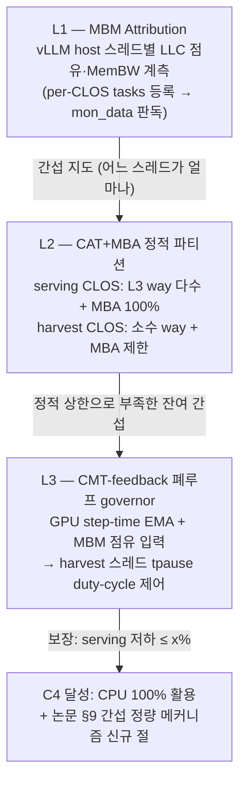

# IDE_026 — RDT-Guarded Slack Harvesting (Harvest-without-Harm)

> 신설 2026-06-11. parent: `TSK_020/SUB_072`. 자식: `TSK_048`.
> 동기: 사용자 지시 "논문을 써야 하니 업스트림에 있는 거를 추가하면 안 돼.
> 다시 한번 전방위쪽으로 제약사항들을 고려해서 방법을 찾아 봐".

---

## 1. 제약사항 (전방위 탐색의 필터)

| # | 제약 | 출처 |
|---|---|---|
| C1 | **upstream vLLM 에 이미 있는 기능 불가** (논문 기여 불인정) | 사용자 2026-06-11 |
| C2 | **기존에 시도한 방법군 전면 제외** (spec-decode 변형 / cudagraph 모드 / DSA·AMX offload / KV tiering / oracle 라우팅 / burst / NUMA·hugepages / MoE offload …) | 사용자 지시 |
| C3 | 출력 분포 등가 (root CLAUDE.md Constraint 운영 해석) | root CLAUDE.md |
| C4 | CPU 활용률 극대화가 Objective (Idle 불허) | root CLAUDE.md |
| C5 | 실 HW: 2× Xeon 8570 (EMR, 224T) + 8× B200, IAA/QAT 부재, DSA 유휴 | IDE_024 HW 전수 |
| C6 | 논문 서사와 정합 — 특히 "0/≥75 lever 기각, T_host ≤ ε" 의 측정된 부정 결과와 모순되지 않을 것. **주의: Metronome(LHC 박자 게이팅) 은 기각된 아이디어 (사용자 판정 2026-06-11) — Metronome 서사에 의존하지 말 것. 본 IDE 는 독립 기여로 성립해야 함** | paper §8 + 사용자 |
| C7 | GPU 는 타 실험 점유 중 — GPU-불요 선행 단계가 있을 것 | 사용자 지시 |

## 2. 전방위 후보 조사 결과 (2026-06-11)

| 후보 | C1 | C2 | C3 | 판정 |
|---|---|---|---|---|
| **A. RDT-guarded harvesting (본 IDE)** | ✓ (vLLM 전체 resctrl/CAT/pqos 실구현 0건) | ✓ (N17 은 플래그 정의만, `envs.py:121` 미구현) | ✓ (수치 무접촉) | **채택** |
| B. Control-plane speculation (스케줄러 다단 run-ahead + rollback) | ✓ (upstream 은 1-step async 만) | ✓ | △ (배치 구성 변화 → BF16 비결합 논증 필요) | **2순위 보류** — host-bound regime 한정 + B200 8B 는 FaP 가 이미 흡수 (T_host ≤ ε 재현 위험 高) |
| C. waitpkg(tpause/umwait) wait-hygiene + HWP 에너지 스티어링 | ✓ | ✓ | ✓ | **A 의 L3 하위 lever 로 흡수** (단독으로는 효과 크기 부족) |
| D. CUDA graph conditional node 가변길이 spec-decode | ✓ | ✓ | ✓ | 기각 — GPU-side 작업 (C4 불부합) + GPU 필요 (C7). IDE_025 T7 백로그 유지 |
| E. 2TB RAM long-context multi-tier KV | ✓ | ✗ (NEO KV tiering = 기시도) | ✓ | 기각 (C2) |
| F. Exact-match 생성 replay cache | △ (semantic cache 문헌 다수) | ✓ | △ (greedy+seed 고정만) | 기각 — hit rate 불확실 + 신규성 약함 |
| G. 모델 다중화 (CPU RAM weight swap) | △ | ✓ | ✓ | 기각 — serving 가정 변경, 논문 축 이탈 |
| H. KV re-rotation 재배치 | — | — | ✗ | 기각 (C3) |
| I. Loop perforation / 근사 | — | — | ✗ | 기각 (C3) |
| J. IAA/QAT 압축 offload | — | — | — | 기각 (C5 — HW 부재) |
| K. TP×DP remap / DBO / SP / FP8 KV / DCP / NIXL | ✗ (전부 upstream) | — | — | 기각 (C1) → IDE_025 는 baseline 강화로 역할 재정의 |

## 3. 이론적 배경

### 3.1 핵심 통찰 — 부정 결과의 구성적 전환

TSK_043 의 측정 결과: B200 + 8B baseline 에서 host-path reclamation lever ≥75 개 중
net-positive **0 개**. 논문 §8 은 이를 hw-gap 물리 (compute 4500× / membw 213×) 로 설명한다.
그러나 음수 lever (예: C-8a detok ThreadPool **−0.35%**) 의 음수 *크기* 는 hw-gap 으로
설명되지 않는다 — harvest 작업이 0 이득이라면 결과는 0% 여야 하는데 음수가 나온 것은
**공유 자원 간섭** (LLC 오염, 메모리 대역폭 경합, 프리페처 트래픽) 이 serving host path 를
느리게 만들었다는 뜻이다. 논문 fig4 (prefetcher contention) 가 정확히 이 메커니즘을
**개념도로만** 담고 있고, §9 mechanism analysis 에는 간섭의 정량 측정이 없다.

본 IDE 의 주장 구조:

1. **간섭은 측정 가능하다** — CMT/MBM (cqm_llc / cqm_mbm_total, HW 확인 완료) 으로
   vLLM host 스레드별 LLC 점유·메모리 대역폭을 per-CLOS attribution.
2. **간섭은 상한을 걸 수 있다** — CAT (L3 way-mask) + MBA (대역폭 throttle) 로
   harvest CLOS 를 serving CLOS 에서 격리.
3. **그러면 C4 (CPU Idle 불허) 가 무조건 달성된다** — "serving 성능 저하 ≤ x% 보장"
   하에 나머지 220+ 스레드를 임의 CPU 작업 (배치 분석·draft 사전계산·co-located job) 으로
   100% 채울 수 있다. 직접 lever 가 0 이득이어도 **co-location 처리량 자체가 이득**이며,
   이는 "0/≥75" 결과와 모순되지 않고 오히려 그것을 전제로 선다.

### 3.2 문헌 (수퍼컴퓨팅/시스템 분야 방법 차용)

- **Heracles** (Lo et al., ISCA'15): latency-critical + best-effort co-location 을
  CAT/DVFS/네트워크 폐루프로 제어 — datacenter 일반론. 본 IDE 는 이를 **GPU-serving
  host path 보호**라는 신규 도메인에 적용 (LLM inference 의 host 스레드는 μs-급
  latency-critical 이고 GPU step 과 동기 결합 — Heracles 의 ms-급 가정과 다름).
- **PARTIES** (Chen et al., ASPLOS'19): 다중 latency-critical co-location 의 자원 파티션 탐색.
- **CoPart/Intel RDT 문헌**: CLOS 별 way-mask 의 격리 효율과 한계 (LLC 만 격리, MLC/프리페처는 불가).

> (기각 이력) Metronome — LHC 박자 기반 harvest 게이팅 — 은 **기각된 아이디어**
> (사용자 판정 2026-06-11). L3 governor 의 GPU step-time EMA 신호는 기존 tempo
> 샘플러 *코드* (`vllm/v1/lhc/metronome/tempo.py`) 를 재사용할 수 있을 뿐,
> Metronome 알고리즘·서사에 의존하지 않는다 — 신호원은 CUDA event 직접 계측으로
> 대체 가능.

### 3.3 HW 확인 (2026-06-11, /proc/cpuinfo 직접 확인)

```
cat_l3 cat_l2 cdp_l3 cdp_l2   ← L3/L2 CAT + code/data prioritization
mba                            ← Memory Bandwidth Allocation
cqm rdt_a cqm_llc cqm_occup_llc cqm_mbm_total cqm_mbm_local  ← CMT/MBM
waitpkg                        ← umonitor/umwait/tpause
cldemote movdiri movdir64b enqcmd  ← (참고) cache hygiene/DSA 제출
```

- Xeon 8570 (EMR): L3 300MB/socket. CAT way 수는 mount 후 `info/L3/cbm_mask` 로 확인.
- **resctrl 미마운트** — `mount -t resctrl resctrl /sys/fs/resctrl` 1줄 (root, TSK_048 (a)).

## 4. 구현 방향 — 3-layer



- 격리 대상 (serving CLOS, 기존 코드의 스레드 실재 확인):
  EngineCore I/O (`core.py:1292,1304`), detokenizer, structured-output pool
  (`structured_output/__init__.py:69,84`), KV copy (`copy_backend.py:50`), GPU worker 본체.
- harvest CLOS: ngram precompute (`ngram_proposer.py:68`), lhc-tempo (`tempo.py:175`),
  AMX draft, 향후 임의 co-located 작업.
- 기존 affinity 인프라와 합성: `gpu_worker.py:202` / `meter.py:69` / `ide023_levers.py:83`
  의 `sched_setaffinity` 패턴 옆에 resctrl `tasks` 등록을 같은 hook 으로 추가.

## 5. 차별점 명시 (선행 ID 와의 경계)

- **N17 (`VLLM_LEVER_N17`, envs.py:121)**: "CMT-driven priority" — 플래그 정의만 존재,
  구현·측정 이력 없음. 또한 N17 은 *우선순위 조정* 발상이고 본 IDE 는 *할당 파티션 +
  무해 보장 프레임워크* — 메커니즘·주장 모두 다름. N17 은 본 IDE 에 흡수 (registry 주석).
- **IDE_020/SUB_165 (cgroup/isolcpus)**: 코어 *개수* 격리 — LLC/MemBW 는 격리 못 함
  (같은 socket 의 모든 코어가 L3 300MB 공유). 본 IDE 는 직교 축 (캐시·대역폭 격리).
- **IDE_023 A5 (SMT pairing)**: 코어 내부 자원 공유 — 본 IDE 는 uncore 자원. 직교.

## 6. 실패 위험 평가 (사전 commit)

| 위험 | 확률 | 노출 시점 | 대응 |
|---|---|---|---|
| R1. 간섭 자체가 측정 불가 수준으로 작음 (음수 lever 의 원인이 간섭이 아니라 GIL/락 등) | 중 | TSK_048 (c) MBM attribution | L1 결과 자체가 논문 §9 의 측정 절로 가치 유지 (음수 원인의 분해) |
| R2. CAT 격리해도 음수 lever 가 양수로 안 바뀜 | 중~高 | TSK_048 (c) 재측정 | 주장을 "lever 회생" 이 아닌 "co-location 무해 보장" 으로 유지 — R2 가 나도 주장 성립 |
| R3. resctrl 컨테이너 권한 문제 (CAP_SYS_ADMIN / /sys 마운트) | 중 | TSK_048 (a) 즉시 | 사용자 root 1줄 (`! sudo mount -t resctrl ...`) 요청 |
| R4. CPU-only PoC 의 합성 부하가 실제 vLLM host path 를 대표 못 함 | 중 | TSK_048 (b)→(c) 전환 | (b) 는 harness 검증용으로 한정, 본판정은 (c) |
| R5. B200 환경에서 serving host path 가 워낙 짧아 (T_host ≤ ε) 보호 효과가 0 | 高 (직접 tps 이득 기준) | (c) | **본 IDE 의 주장은 tps 이득이 아니라 "무해 상한 + CPU 활용률"** — C4 가 binding 지표 |

## 7. 산출물 (논문 매핑)

- §9 mechanism analysis 신규 절: host-thread 간섭의 MBM 정량 지도 (fig4 의 측정판)
- §8 신규 표: CAT ON/OFF × harvest 부하 단계별 (serving tps 저하, harvest 처리량) frontier
- Objective 검증: CPU 활용률 (mpstat) — 격리 하 100% 근접 + serving 저하 상한 동시 제시
- **독립 기여로 기술** — Metronome (기각) 등 다른 알고리즘 서사에 얹지 않는다.
  기여 명제: "GPU-serving host path 의 공유자원 간섭을 RDT 로 계측·상한 보장하여
  serving 무해 조건 하의 CPU 완전 활용 (co-location frontier) 을 달성"
