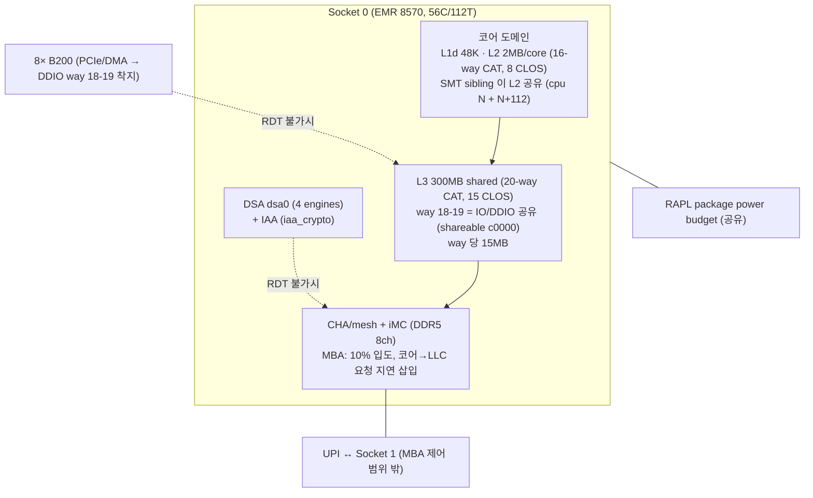
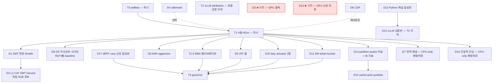

# IDE_026 — RESEARCH_DIRECTIONS.md (TSK_048 심화 + 추가 연구 방향)

> 2026-06-12 작성. 근거 = **호스트 (dgx-b200, 2× Xeon Platinum 8570 EMR) sysfs/cpuinfo 직접 실측**
> + SUB_201/212 측정 데이터. 모든 하드웨어 수치는 본 머신 실측값이며 추정치는 (추정) 표기.

## 0. 범위 선언 (2026-06-12 사용자 확정)

**IDE_026 의 목적 = GPU *이외* 하드웨어의 성능 최적화.** 스펙트럼:
캐시라인·레지스터 단위 마이크로 (cldemote, NT-store, prefetch 거리, L2/L3 way)
→ 코어/SMT (CLOS 배치, duty-cycle) → 소켓 (MBA, uncore freq, RAPL)
→ **NUMA/UPI 매크로** (membind, 원격 트래픽). **GPU 에 결박된 최적화는 범위 밖**
(GPU 전송 성능 측정 목적, GPU 신호 의존 메커니즘 등) → 해당 SUB 는 기각 처리:
`SUB_216`(D3), `SUB_226`(D13). vLLM+GPU 환경은 *최종 검증 무대* 로만 쓰이고
(T2/T3), 최적화 대상·신호·메커니즘은 전부 비-GPU 하드웨어/SW 여야 한다.

---

## 1. 실측 하드웨어 능력 지도 (TSK_048 의 물리적 캔버스)



| 능력 | 실측 | TSK_048 활용 |
|---|---|---|
| L3 CAT | 20-way, 15 CLOS, way=15MB, mask 연속 필수 | L2 정적 파티션 (T1/T3) |
| L2 CAT | 16-way, 8 CLOS, way=128KB, 도메인=물리코어 | **D2 (SMT co-location)** |
| CDP | L2+L3 모두 (`cdp_l2`,`cdp_l3` flag) | **D8 (code/data 분리)** |
| MBA | 10% 입도, linear, `thread_throttle_mode=max` | T1 B2 + **D1 함정 정량화** |
| MBM | total/local/occupancy, **480 RMID** | T2 attribution + **UPI 분해** |
| waitpkg | tpause (C0.2) | T4 governor |
| cldemote | 캐시라인 자발 강등 | **D4 (협조적 aggressor)** |
| AMX | bf16/int8 tile | D5 (현실적 harvest 부하) |
| uncore freq | 0.8–2.4 GHz sysfs | **D7 (전력/주파수 채널)** |
| DSA/IAA | dsa0/dsa1 + iaa, WQ 0666 | §2 불가시 채널 |

---

## 2. 핵심 통찰: 간섭 채널 분류학 (Interference Channel Taxonomy)

**논문의 구성적 기여 후보를 "RDT 적용" 에서 "간섭 채널 분류 + 채널별 제어기 매핑" 으로 격상하는 프레임.**

GPU-가속 LLM serving 호스트의 메모리 계층 간섭은 **RDT 가 보는 것과 못 보는 것**으로
양분된다. 기존 RDT 문헌 (Heracles, PARTIES, Caladan 계열) 은 코어-기원 트래픽만 다루지만,
본 시스템 (DSA/IAA/GPU DMA/UPI 가 모두 활성) 에서는 불가시 채널이 1차 시민이다:

| 채널 | 기원 | MBM 계측 | MBA 제어 | CAT 제어 | 대체 제어 lever |
|---|---|:---:|:---:|:---:|---|
| ① 코어 load/store | serving·harvest 스레드 | ✅ RMID | ✅ | ✅ | resctrl (본론) |
| ② DSA/IAA engine | 디바이스 (descriptor 처리) | ❌ (RMID 미태깅) | ❌ (코어 지연 삽입 무관) | ❌ | WQ size/priority/group, 제출률 (소프트웨어) |
| ③ GPU PCIe DMA | B200 H2D/D2H | ❌ | ❌ | △ (DDIO way 18-19 고정 착지) | way 18-19 비침범 규칙 (방어적 제약만 — 제어/측정은 범위 밖, §0) |
| ④ UPI 원격 | cross-socket 접근 | △ (total−local 로 양만) | **✅ (SUB_219 실측 — raw delay 는 원격도 절단)** | ❌ | MBA 로 흡수 (DUTY 전환 불필요) |
| ⑤ 전력/주파수 | RAPL package budget, uncore freq | ❌ | ❌ | ❌ | cpufreq cap, uncore min/max 고정 |
| ⑥ **SW 런타임** | GIL·allocator 락·run-queue 경합 (in-process harvest) | ❌ (하드웨어 트래픽 아님) | ❌ | ❌ | 프로세스 분리, SCHED_IDLE, free-threaded CPython (D12) |

> 채널 ⑥ 은 본 fork 의 실측 정황 증거가 이미 있다: C-8a detok ThreadPool (−0.35%),
> TSK_044 의 R2 mimalloc/R6 free-threaded 검토 이력 — 모두 메모리 계층이 아닌
> **Python 런타임 공유 상태** 가 의심 지점이었다. RDT 는 이 채널을 원천적으로 못 본다.

**검증 가능한 주장 (T2 에서 측정)**: "vLLM serving 의 p99 악화 중 RDT-제어 가능한
몫은 X% 에 불과하며, 잔여는 채널 ②~⑤" — X 의 실측 자체가 신규 데이터.
SUB_212 의 host-DSA confounder (+36% 소동) 가 채널 ② 의 실존 증거.

> **T4 governor 의 재정의**: 채널 ① 은 CAT/MBA 정적 상한, 채널 ②~⑤ 는 MBM 잔차
> 신호 기반 tpause duty-cycle — 즉 governor 는 "MBA 가 못 막는 것을 막는 폐루프"
> 라는 명확한 존재 이유를 갖는다. (기존 task.md T4 의 막연한 "동적 제어" 보다 강함)

---

## 3. 추가 연구 방향 (D1~D8, SUB 승격 후보)

### D1 [SUB_214]. `thread_throttle_mode=max` 연좌 throttle 정량화 — **위험 제거형, T1 에 합류 권장**

- **실측 사실**: MBA 는 코어 단위 적용이며 SMT sibling 두 스레드가 다른 CLOS 면
  **더 강한 throttle 이 코어 전체에 적용**된다 (`info/MB/thread_throttle_mode=max`).
- **가설**: serving 스레드와 MBA 20% harvest 스레드가 같은 물리 코어에 들어가면
  serving 도 20% 로 연좌 throttle → p99 폭증. 코어 배치가 깨지는 순간 L2 파티션
  전체가 역효과.
- **실험**: victim cpu0 고정 + aggressor 를 {cpu16 (다른 코어), cpu112 (victim 의 sibling)}
  2셀 비교, MBA {100, 20}%. 4셀로 연좌 배율 곡선.
- **게이트/가치**: 연좌 악화 ≥ +20% 면 "vLLM 스레드 배치는 코어-배타 필수" 규칙이
  논문 §9 의 design rule 로 승격. 비용 극소 (T1 인프라 재사용, +30분).

### D2 [SUB_215]. L2 CAT 기반 SMT co-location harvest — **신규축, 효과 크면 독립 SUB**

- **실측 사실**: L2 CAT 16-way/8 CLOS, L2 는 SMT sibling 만 공유 (2MB/core).
  IDE_023 A5 (SMT sibling harvest) 는 L2 오염 때문에 보류됐던 축.
- **가설**: harvest 를 serving 의 sibling HT 에 넣되 L2 를 12-way/4-way 로 분할하면
  sibling 의 L2 오염이 상한되어, "유휴 HT slot" 이라는 최대 미개척 CPU 자원
  (112 thread) 이 열린다. MBA 는 D1 함정 때문에 끄고 CAT(L2+L3) 만 사용.
- **실험**: victim cpu0 + aggressor cpu112 (sibling), {L2 CAT off / 12-4 / 14-2} ×
  pointer-chase victim. p99 vs aggressor 처리량 frontier.
- **게이트**: L2 12-4 에서 victim p99 악화 ≤ 10% AND aggressor ≥ 단독 HT 의 50%.
- **가치**: 성공 시 "코어를 안 뺏고 HT 만 빌리는" harvest — C4 (CPU 활용률) 에
  가장 직접적. 실패해도 "L2 CAT 으로도 SMT 간섭 상한 불가" 는 negative 로 기록 가치.

### D3 [SUB_216]. ❌ 기각 (2026-06-12 범위 재정의) — DDIO way 와 GPU DMA 경합

- **실측 사실**: L3 way 18-19 가 IO 공유 (`shareable_bits=c0000`, bit_usage `XX`).
  PCIe inbound write (GPU D2H 결과, NIC) 는 DDIO 로 이 way 에 직접 착지한다.
- **가설**: harvest CLOS mask 가 way 18-19 를 포함하면 GPU 전송 hot path 의 LLC
  적중률이 떨어져 **vLLM 의 H2D/D2H (KV transfer, logits copy) 지연이 증가** —
  코어 격리를 완벽히 해도 나타나는 잔여 간섭의 정체 후보.
- **실험**: vLLM canonical 부하에서 harvest mask {way 0-3 (비침범)} vs {way 16-19
  (침범)} A/B — nvbandwidth/step time + mbm 시계열.
- **❌ 기각 사유 (§0)**: 측정 목적이 *GPU 전송 성능* — IDE_026 범위 (비-GPU 하드웨어
  최적화) 밖. **부산물 존치**: "harvest mask 는 way 18-19 비침범" 은 task.md T1
  배치 규칙 #3 으로 유지 (측정 불요 방어적 제약).

### D4 [SUB_217]. `cldemote` 협조적 aggressor (polite harvest) — **소프트웨어-만 신규 lever**

- **실측 사실**: `cldemote` 지원 (사용한 캐시라인을 L3→메모리 방향으로 자발 강등).
- **가설**: harvest 커널 (AMX/AVX-512 스트리밍) 이 소비 완료 라인을 즉시 cldemote
  하면 LLC 점유가 자발적으로 낮아져, **CAT way 를 추가로 떼어주지 않아도** victim
  간섭이 줄어든다. 비-시간적(non-temporal) store 와 달리 read 스트림에도 적용 가능.
- **실험**: aggressor 3변형 {기본, +cldemote, +NT-store} × CAT {off, 4-way} —
  llc_occupancy 시계열로 자발 강등 효과 직접 관측.
- **가치**: "하드웨어 파티션 없이 소프트웨어 hygiene 만으로 간섭 α% 제거" —
  CAT CLOS 수 (15개) 가 부족한 멀티테넌트 확장 시나리오의 대안. 구현 비용 극소
  (intrinsic 한 줄), dev 머신 (Alder Lake cldemote 미지원 주의 — prod 전용).

### D5 [SUB_218]. AMX-tile aggressor 추가 — **T1 대표성 보강**

- **근거**: 현 `victim_aggressor.c` 는 AVX-512 triad 만. 실제 harvest 후보 (AMX draft,
  IDE_019) 는 tile load 패턴 — 같은 GB/s 라도 LLC 점유·prefetch 행태가 다르다.
  R4 위험 (합성 부하 대표성) 의 직접 대응.
- **실험**: aggressor 에 `--mode amx` (tile_loadd 스트리밍 GEMM) 추가, B0~B2 재실행.
- **게이트**: AVX-512 와 AMX 의 간섭 프로파일 차이 > 10% 면 이후 모든 셀에 2 패턴 유지.

### D6 [SUB_219]. UPI-aware 부하 분리 검증 — **T1 의 cross-socket 셀 확장**

- **실측 사실**: mbm_total − mbm_local 로 원격 트래픽 정량 가능. MBA 는 socket-로컬만.
- **가설**: aggressor 가 remote NUMA 메모리를 칠 때 (AGGR_CPUS=16-55 + numactl
  --membind=1) victim 간섭은 유지되는데 **B2 (MBA) 가 무력화** — "MBA 회복률이
  remote 비율의 함수" 임을 곡선으로.
- **가치**: T4 governor 의 입력 신호 설계 근거 (remote 비율 ↑ → duty-cycle 모드 전환).

### D7 [SUB_220]. 전력/주파수 간섭 채널 (RAPL·uncore) — **RDT 사각 채널의 정량화**

- **실측 사실**: uncore 0.8–2.4 GHz sysfs 제어 가능. AMX/AVX-512 heavy 부하는
  package 전력 예산 (RAPL) 을 소모하고 uncore/mesh 주파수를 흔든다.
- **가설**: 코어·캐시·BW 를 완벽 격리해도 (B2), harvest 의 전력 소모만으로
  serving 코어의 turbo 상한과 uncore 주파수가 떨어져 p99 가 악화 — **RDT 로
  원천 차단 불가능한 간섭의 하한** 을 측정.
- **실험 (CPU-only 재범위화, 2026-06-12)**: **T1 victim/aggressor B2 셀** 에 turbostat
  (PkgWatt, Bzy_MHz, UncMHz) 병행 — vLLM/GPU 불요. uncore min freq 를 2.4 GHz
  고정한 변형 셀로 "uncore 고정 시 회복분" 분리.
- **가치**: 간섭 분류학 (§2) 의 채널 ⑤ 실측. "격리의 물리적 한계" 절은 reviewer 가
  반드시 묻는 질문의 선제 답변.

### D8 [SUB_221]. CDP code/data 분리 (탐색적, 우선순위 하)

- **실측 사실**: `cdp_l3` 지원 (`mount -o cdp` 재마운트 필요 — CLOS 수 15→7 반감 주의).
- **가설**: detok/Python 경로는 코드 footprint 가 커서 (CPython 인터프리터 루프),
  harvest 스트리밍이 코드 라인을 evict 하면 frontend stall 로 p99 악화 —
  L3CODE 보호가 data way 분할보다 효율적일 수 있다.
- **비용**: 재마운트 필요 (기존 그룹 소실) → T1 완료 후 별도 세션에서만.

---

## 3b. SW-치중 후보 (D9~D17) — 2026-06-12 추가 발굴

> 실행가능성 실측 (호스트): cgroup v2 풀 컨트롤러 (`cpuset cpu io memory ...`) ✓,
> `SCHED_IDLE`/`SCHED_DEADLINE` ✓, bpftrace + BTF(CO-RE) ✓, THP=madvise,
> `intel_powerclamp` 로드됨. **sched_ext 는 커널 6.8 이라 불가** (6.12+).
> Python 3.12 = GIL 상시 (free-threaded 는 3.13t 별도 빌드 필요).
>
> 묶음의 논문 프레임: **"enforcement ladder"** — 같은 SLO 에서 ① OS 우선순위
> → ② duty-cycle → ③ SW 자가계측 → ④ HW 파티션 (RDT) 순으로 보호력·이식성·
> 비용이 다른 제어 사다리를 하나의 frontier 표로 비교. RDT 없는 클라우드 VM
> 에도 일반화되는 결과 = 기여의 적용 범위가 "Xeon 특정 기능" 을 벗어남.

### D9 [SUB_222]. OS 우선순위 사다리 — SCHED_IDLE / nice / cgroup `cpu.weight`·`cpu.max` (RDT-無 baseline)

- **질문**: 하드웨어 파티션 없이 "스케줄러 우선순위만으로" victim p99 를 얼마나 보호하나?
  SCHED_IDLE harvest 는 유휴 tick 에만 돌므로 **CPU 시간 간섭은 0 에 수렴** — 그러나
  실행되는 동안의 **메모리 트래픽 간섭은 그대로** 다 (스케줄러는 BW 를 모름).
- **실험**: T1 과 동일 victim/aggressor 에서 aggressor 를 {기본, nice 19, SCHED_IDLE,
  cgroup cpu.weight=1, cpu.max=50%} 로 5셀 → B2(RDT) 와 같은 frontier 축에 플롯.
- **예측 (검증 대상)**: 동일 코어 공유 시 SCHED_IDLE 이 잘 막지만, **코어가 분리된
  본 설계에서는 거의 무력** (시간 분할이 아니라 BW 경합이므로) — 이 "무력함의 실측"
  이 RDT 필요성의 직접 논거가 된다.
- **비용**: T1 인프라 그대로, +30분. GPU 불요.

### D10 [SUB_223]. Duty-cycle actuator 3종 비교 — SCHED_DEADLINE vs SIGSTOP/SIGCONT vs tpause

- **질문**: T4 governor 의 actuator 로 무엇이 최적인가? 셋 다 "harvest 를 주기적으로
  멈춘다" 지만 물리가 다르다:
  | actuator | 입도 | 멈춤의 의미 | 커널 의존 |
  |---|---|---|---|
  | `SCHED_DEADLINE` (runtime/period) | ms | CPU 시간 상한 (CBS) — 코어 양보 | 표준 |
  | `SIGSTOP/SIGCONT` | ~ms | 프로세스 정지 — 코어 양보 | 표준 (이식성 최고) |
  | `tpause` (C0.2) | **µs** | 코어 점유한 채 mesh 트래픽만 정지 | waitpkg |
- **핵심 통찰**: tpause 는 context switch 없이 µs 입도로 BW 만 끊는다 — L2 캐시 상태
  보존 (재개 시 cold miss 없음). 반면 SCHED_DEADLINE/SIGSTOP 은 코어를 비우므로
  다른 스레드가 그 코어로 마이그레이션 오는 부작용 (간섭 재배치) 가능.
- **실험**: 동일 duty 비율 (예: 50%) 을 3 actuator 로 구현, victim p99 + harvest
  유효 처리량 + mbm 시계열 비교. 주기 sweep {100µs, 1ms, 10ms}.
- **게이트**: 어떤 actuator 든 "duty 비율 → BW 비율" 선형성 ±10% — governor 제어성 전제.
- **비용**: tpause .so 는 T4 기존 계획. 나머지 둘은 셸 수준. GPU 불요.

### D11 [SUB_224]. SW 자가계측 token-bucket (resctrl-無 governor fallback)

- **질문**: MBM 없이 harvest 가 자기 BW 를 스스로 계측·제한할 수 있나? (이식성:
  RDT 없는 VM/AMD/ARM 에서도 동작하는 보편 메커니즘)
- **설계**: harvest 커널이 epoch (예: 1ms) 마다 자기가 만진 바이트를 카운트 (스트리밍
  커널은 자명, 불규칙 커널은 rdtsc 시간 기반 추정) → budget 초과 시 epoch 잔여를
  tpause/usleep. = **소프트웨어 MBA**.
- **실험**: budget {25, 50, 75%} × T1 victim → MBA {20, 50, 80%} 와 같은 frontier 에
  겹쳐 그리기. 정확도 (목표 BW vs 실측 mbm) 와 오버헤드 측정.
- **가치**: D9 (무력) ↔ MBA (HW) 사이를 메우는 사다리 가운데 칸. RDT 결과의 일반화
  가능성 주장에 필수.
- **비용**: victim_aggressor.c 에 ~50줄. GPU 불요.

### D12 [SUB_225]. Python 런타임 간섭 채널 (⑥) 분리 정량 — GIL·allocator·프로세스 경계

- **질문**: in-process harvest (ngram pool 등 스레드형) 의 간섭 중 **메모리 계층이
  아닌 Python 런타임 몫** 은 얼마인가? C-8a (−0.35%) 의 원인 분해.
- **실험 (3단 사다리, GPU 불요 합성판 → GPU 후 vLLM 판)**:
  1. 순수 C 스레드 harvest (GIL 무관 — pthread) vs Python 스레드 harvest (GIL 점유)
     vs **별도 프로세스** harvest (shm 통신) — victim 은 Python 이벤트루프 모사
     (asyncio + 주기적 dict/list 작업, EngineCore 모사)
  2. 각 셀에서 RDT 격리 ON/OFF — "RDT 가 못 줄이는 잔여" = 채널 ⑥ 의 크기
  3. allocator 변형: glibc malloc vs mimalloc (LD_PRELOAD) — TSK_044 R2 의 재활용
- **예측**: Python 스레드 harvest 는 GIL hold 시간만큼 victim 의 이벤트루프 지연을
  직접 늘림 — RDT 완전 무관, 격리 ON 에도 잔존. 프로세스 분리가 유일 해법이면
  **"harvest 는 반드시 프로세스 경계 밖"** 이 설계 규칙으로 승격.
- **가치**: vLLM 커뮤니티에 즉시 통하는 실용 규칙 + 분류학 채널 ⑥ 의 실측.
  free-threaded 3.13t 전망 절 (dev 머신에서 3.13t 빌드 비교 가능) 까지 쓰면 시의성.

### D13 [SUB_226]. ❌ 기각 (2026-06-12 범위 재정의) — GPU-step-window 정렬 harvest

- **질문**: harvest 를 "언제" 돌리느냐로 간섭을 피할 수 있나? GPU 가 verify kernel 을
  도는 동안 host 스레드는 대부분 대기 (SUB_162: vLLM threads 96-100% S state) —
  **그 창 안에서만** harvest quantum 을 발행하면 host-path 와 시간적으로 겹치지 않는다.
- **설계**: engine 루프의 step 경계 신호 (execute_model 진입/복귀, `core.py` busy loop)
  를 eventfd/shm flag 로 발행 → harvest controller 가 창 열림/닫힘에 맞춰 재개/정지
  (actuator 는 D10 의 승자). prefill step (긴 창) 은 큰 quantum, decode step (짧은 창)
  은 소 quantum — **feed-forward** 제어 (T4 의 feedback 과 상보).
- **실험**: canonical 부하에서 {상시 harvest, step-window harvest} × RDT {off, on}
  4셀 — "시간 정렬만으로 RDT 의 몇 % 를 회수하나".
- **❌ 기각 사유 (§0)**: 메커니즘의 신호원이 *GPU step 경계* — GPU 에 결박된 설계라
  IDE_026 범위 밖. **대체**: governor 의 시간 신호는 D17 [SUB_230] (eBPF run-queue
  latency — 커널 신호, GPU-불요) 가 담당.

### D14 [SUB_227]. Partition-aware harvest 커널 설계 + 간섭 효율 (interference-efficiency) 지표

- **질문**: 같은 유용작업량을 내면서 간섭을 덜 만드는 **커널 작성법** 의 정량 규칙은?
- **설계 규칙 후보 (각각 A/B 측정)**:
  1. **cache blocking 을 CAT 파티션 크기에 맞춤** — harvest working set ≤ 할당 way
     용량 (4-way = 60MB/socket) 이면 파티션 밖 미스 최소화
  2. NT-store (이미 victim_aggressor 에 일부) / cldemote (D4) / THP=madvise 적용
     (페이지워크 트래픽 절감 — 실측 THP 정책이 madvise 라 harvest 만 선택 적용 가능)
  3. 읽기 스트림의 software prefetch 거리 조절 (HW prefetcher 의 과공격성 완화)
- **지표 제안**: `IE = 유용작업 (items/s) ÷ 간섭 비용 (victim p99 악화 %)` —
  harvest 커널·작업 종류별 IE 를 측정해 **portfolio 선택 기준** 으로. 논문의
  신규 메트릭 후보.
- **비용**: 마이크로벤치 수준, GPU 불요. D15 의 전제.

### D15 [SUB_228]. Useful-work portfolio — "무엇을" harvest 할 것인가 (C4 의 실용화)

- **질문**: 합성 aggressor 가 아니라 **실제 유용한 작업** 중 간섭 효율 (D14 IE) 이
  높은 것은? 후보별 특성이 전혀 다르다:
  | 후보 | 연산 특성 | 예상 IE | 비고 |
  |---|---|---|---|
  | prefix-cache index build (suffix tree) | 포인터 추적, 캐시 불친화 | 낮음 | 기존 suffix 자산 재활용 |
  | KV 압축/스캔 (DRAM tier) | 스트리밍, NT 적합 | 중 | IDE_017 연계 |
  | **IAA 오프로드 압축** (로그·KV) | 디바이스 — 코어 0 | **최고 (코어 측)** | 단 채널 ② 불가시 주의 |
  | AMX 보조모델 (reranker/embedding) | tile GEMM, 캐시 친화 | 중~높 | IDE_019 연계 |
  | xgrammar 컴파일 prefetch | branchy, L2 상주 | 높음 (L2 CAT 와 시너지) | structured output 연계 |
- **실험**: 각 후보를 D14 IE 지표로 측정 → IE-순 portfolio + RDT 파티션 조합 권장표.
- **가치**: "CPU 를 뭘로 채우나" 에 대한 답이 있어야 C4 (활용률 ≥90%) 가 공허하지
  않다. reviewer 의 "so what do you run?" 선제 답변.

### D16 [SUB_229]. 건설적 간섭 (constructive interference) — 부호 있는 간섭 분류

- **역발상**: 간섭은 항상 음수가 아니다. harvest 슬롯에 **serving 을 돕는 작업** 을
  넣으면 p99 가 *개선* 될 수 있다:
  1. 다음 step 의 host 자료구조 (block table, sampling 텐서, suffix tree hot node)
     를 LLC 로 **선행 prefetch** (serving CLOS way 에 적재되도록 serving CLOS 로 실행)
  2. 모델 swap/LoRA 로드 대비 page-cache warming
- **실험 (CPU-only 재범위화, 2026-06-12)**: T1 합성판으로 — harvest 변형이 **victim
  의 working set (pointer-chase 노드, memcpy 버퍼) 을 serving CLOS way 로 선행
  prefetch**. ON/OFF × CAT {off, on} 에서 victim p99 가 통계적으로 *개선* 되면
  간섭 분류학이 **부호 있는 (signed) 스펙트럼** 으로 확장된다. GPU/vLLM 불요.
- **가치**: 탐색적이지만 성공 시 임팩트 큼 ("harvest 가 공짜가 아니라 이득"). 실패해도
  비용 소. (vLLM 자료구조 적용판은 범위 외 후속 과제로만 기록)

### D17 [SUB_230]. eBPF run-queue latency 조기경보 — GPU-메트릭-불요 governor 입력

- **질문**: governor 의 피드백 신호로 tps/step-time (느림, GPU 의존) 대신
  **serving 스레드의 스케줄링 지연 p99** (µs 단위, 커널에서 직접) 를 쓸 수 있나?
- **실측 근거**: bpftrace + BTF 가용 ✓ — `sched:sched_wakeup`→`sched_switch` 간
  지연 히스토그램을 serving TID 들에 대해 100ms 창으로 집계 가능 (오버헤드 ~1%).
- **설계**: run-queue 지연 EMA 가 임계 초과 → harvest duty 강하. GPU step-time 보다
  10-100× 빠른 반응 + GPU 계측 코드 불요 (vLLM 무수정 신호원).
- **실험**: T1 합성판에서 신호 민감도 (victim p99 악화를 몇 ms 만에 감지하나) →
  T4 governor 에 입력 후보로 채택 여부.
- **비용**: bpftrace 스크립트 ~30줄. 합성판은 GPU 불요.

---

## 3c. 메커니즘·알고리즘 구체화 + 마이크로~매크로 신규 후보 (D18~D23) — 2026-06-12

> 추가 실측 (호스트): `erms`+`fsrm` ✓ (rep movsb fast path), `movdiri/movdir64b` ✓,
> DSA group `read_buffers_allowed=96`/`use_read_buffer_limit=0`/`traffic_class_a,b` ✓
> (= 채널 ② 의 실물 제어 노브), umwait `max_time=100000` TSC (tpause 1회 ≈ 최대
> 수십 µs) + C0.2 enabled, cache line 64 B (adjacent-line prefetcher 는 128 B 쌍).

### 3c.0 공통 제어 알고리즘 사양 (T4 governor — 의사코드 확정)

```
# 10 ms epoch 폐루프 (PI 제어). 입력 신호는 전부 비-GPU:
#   runq  = eBPF: serving TID 들의 sched_wakeup→switch 지연 p99 (µs)  [D17/SUB_230]
#   occ   = llc_occupancy(harvest CLOS)                                [MBM]
#   bw_l  = Δmbm_local_bytes(harvest)/Δt,  bw_t = Δmbm_total_bytes/Δt  [MBM]
#   remote_ratio = 1 − bw_l/bw_t                                       [D6/SUB_219]
SLO: runq_p99 ≤ L*           # 예: IDLE 측정치 × 1.10
err   = (runq − L*) / L*
duty -= Kp·err + Ki·Σerr ; duty = clamp(duty, 0.05, 1.0)
if remote_ratio > θr (예: 0.2):
    actuator = DUTY            # MBA 는 socket-로컬만 → 무력 (실측 근거 D6)
else:
    actuator = MBA ; mba% = LUT⁻¹(duty)   # T1.5 캘리브레이션 LUT 역변환
DUTY 구현: epoch 를 1 ms 슬롯으로 나눠 (1−duty) 비율 슬롯에서
    tpause(C0.2) 반복 (1회 ≤ umwait max 100k TSC → 슬롯당 수십 회 체인)
```

- 제어 안정성 게이트: step 응답 (aggressor 급증) 후 **3 epoch (≤30 ms) 내 SLO 복귀**,
  정상상태 duty 진동 ≤ ±10%p. Kp/Ki 는 T1 합성판에서 Ziegler–Nichols 류로 튜닝.

### D18 [SUB_231]. False-sharing/캐시라인 레이아웃 감사 — **64 B 마이크로**

- **메커니즘**: 코어 간 공유 구조체에서 서로 다른 스레드가 쓰는 필드가 같은 64 B
  라인 (또는 adjacent-prefetch 128 B 쌍) 에 있으면 RFO ping-pong 발생 — CAT 으로도
  못 막는 코어간 간섭 (라인 *소유권* 경합이지 용량 경합이 아님).
- **알고리즘**: (1) 공유 카운터는 per-core shard (64 B 정렬 배열) + 판독 시 합산,
  (2) producer/consumer 인덱스는 `alignas(128)` 분리, (3) 합성 재현: 두 스레드가
  같은/다른 라인의 인접 필드를 store — ping-pong 배율을 p99 로 정량.
- **vLLM 적용점**: ngram pool 의 작업 큐 인덱스, lhc-tempo 의 공유 통계 카운터.
- **게이트**: 합성 ping-pong 재현 ≥ 2× 악화 → vLLM 구조체 감사 1회 가치 확정. GPU 불요.

### D19 [SUB_232]. 크기-적응 memcpy 디스패처 (FSRM/AVX-512/NT) — **레지스터 마이크로, host-path 직결**

- **근거**: SUB_201 실측 — Llama-70B 류는 host path 의 **80% 가 memcpy-bound**.
  memcpy 의 명령 선택이 곧 LLC 오염량을 결정한다.
- **메커니즘 (실측 ISA: erms+fsrm)**:
  | 크기 | 경로 | 이유 |
  |---|---|---|
  | < 4 KB | `rep movsb` (FSRM) | µcode fast path, 레지스터 압박 0 |
  | 4 KB ~ θ_NT | AVX-512 32 B/64 B 루프 (allocating) | 재사용 가능성 있는 중간 크기 |
  | > θ_NT | AVX-512 **NT-store** (`vmovntdq`) + `sfence` | RFO 생략 + LLC 비오염 (way 소비 0) |
  θ_NT 초기값 = **harvest L3 할당의 ½** (4-way = 60 MB → 30 MB) — 고정 상수가 아니라
  **CAT 파티션 크기의 함수** 로 두는 것이 본 제안의 신규성.
- **실험**: 크기 sweep (1 KB~256 MB) × 3 경로 → crossover 곡선 + victim p99 영향
  (NT 경로는 BW 는 쓰되 LLC 점유 0 — MBM occupancy 로 직접 검증).
- **산출물**: `memcpy_dispatch(size, cat_alloc)` 단일 함수 — detok/KV-copy 호스트
  경로에 끼울 수 있는 형태. GPU 불요.

### D20 [SUB_233]. SW prefetch 거리 오토튜닝 (pointer-chase 구조) — **명령 수준 마이크로**

- **메커니즘**: suffix tree 탐색 같은 의존 load 체인은 HW prefetcher 가 못 따라간다
  (불규칙 주소). 소프트웨어 파이프라이닝: 깊이 k 노드를 미리 `prefetcht0`/`prefetchnta`
  하고 k 단계 지연시켜 소비.
- **거리 공식 (초기값)**: PD = ⌈mem_latency × per-core BW ÷ 64 B⌉ — 본 머신 추정
  (DDR5 loaded ~150 ns, 코어당 ~12 GB/s) ≈ 28 라인 → **오토튠 범위 8~64 를 이분 탐색**,
  채택 기준 = 탐색 처리량 / LLC 점유 (IE 지표, D14 와 공유).
- **`prefetchnta` 변형**: NTA 힌트는 L3 비충전(또는 단일 way) 적재 — harvest 가
  자기 트리를 NTA 로 걸으면 **CAT 없이도 LLC 발자국 최소화** (D4 cldemote 와 상보:
  NTA = 들어올 때, cldemote = 나갈 때).
- **게이트**: 오토튠 PD 가 기본 대비 탐색 처리량 +15% 또는 동일 처리량에서 LLC 점유
  −30%. GPU 불요. vLLM 적용점: `suffix_decoding.py` 의 tree walk C 확장 후보.

### D21 [SUB_234]. TLB/페이지 계층 — hugepage 가 줄이는 2차 트래픽 — **페이지 마이크로~메조**

- **메커니즘**: 4 KB 페이지로 60 MB+ 를 스트리밍하면 dTLB miss → page walk 가
  **그 자체로 메모리 트래픽** (PMD/PTE 라인 fetch) 이 되어 victim 과 경합한다.
  SMT sibling 은 STLB 를 공유하므로 D2 (sibling harvest) 와 직접 상호작용.
- **알고리즘**: harvest 버퍼를 (a) 4 KB, (b) THP `madvise(MADV_HUGEPAGE)` 2 MB
  (실측 THP=madvise → harvest 만 선택 적용 가능), (c) 1 GB hugetlbfs 3변형 —
  victim p99 + 자기 처리량 + (사용 가능 시) mbm 잔차로 walk 트래픽 추정.
- **추가 셀**: D2 sibling 셀에 (a) vs (b) — "sibling STLB 오염" 의 분리 정량.
- **게이트**: (b) 가 (a) 대비 victim p99 개선 ≥ 3% 또는 harvest +10%. GPU 불요.

### D22 [SUB_235]. NUMA 배치·드리프트 복구 알고리즘 — **매크로**

- **메커니즘**: harvest 워커의 메모리가 remote node 에 잡히면 (first-touch 시점의
  스케줄 위치 탓) UPI 를 타고 — MBA 사각 (채널 ④). 정적 membind 만으로는 장기
  실행 중 드리프트 (재할당·페이지 재사용) 를 못 막는다.
- **알고리즘 (epoch 100 ms)**:
  ```
  rr = remote_ratio(harvest CLOS)        # mbm: 1 − local/total
  if rr > 0.2 (3 epoch 연속):
      1) 신규 할당 정책 재고정: set_mempolicy(MPOL_BIND, local_node)
      2) 기존 hot 버퍼: move_pages() 로 상위 N 버퍼 로컬 이주 (이주 비용
         < 절감 트래픽 인 경우만 — 비용 모델: 페이지수 × ~1 µs vs rr × bw_t)
      3) 그래도 rr > 0.2 → governor 에 DUTY 모드 강제 신호
  ```
- **실험**: 의도적 remote 배치 → 복구 알고리즘 ON/OFF — rr 시계열 수렴 속도와
  victim p99. T1 인프라 + libnuma 만. GPU 불요.
- **vLLM 연결**: 기존 N8/SUB_165 (NUMA bind) 의 정적 지식을 **동적 폐루프** 로 승격.

### D23 [SUB_236]. DSA/IAA 트래픽 셰이핑 — **채널 ② 의 실물 제어 (비-GPU 가속기)**

- **실측 노브** (`/sys/bus/dsa/devices/group0.0/`):
  `read_buffers_allowed=96` (디바이스 max 96, 현재 무제한 `use_read_buffer_limit=0`),
  `traffic_class_a/b`, WQ `priority/size`. **read buffer = DSA 엔진의 in-flight 읽기
  버퍼 수 = 디바이스가 낼 수 있는 메모리 동시성의 직접 상한.**
- **가설**: group read buffer 를 96→24 로 줄이면 DSA 발 메모리 트래픽 (채널 ②,
  MBA 사각) 의 피크가 ~¼ 로 상한되어, RDT 가 못 막는 간섭을 디바이스 측에서 막는다.
- **알고리즘 (2단)**:
  1. **정적**: harvest 용 WQ 를 별도 group 으로 분리 (`group0.1`), 그 group 만
     `use_read_buffer_limit=1` + `read_buffers_allowed=N` sweep {96,48,24,12}
  2. **동적**: governor 가 DSA 제출률 token-bucket (제출 ENQCMD 횟수/epoch 상한)
     — descriptor 당 전송량을 알므로 바이트-정확
- **실험**: DSA memcpy aggressor (IDE_023 dsa_lane 재사용) vs victim — N sweep 으로
  "DSA 간섭 상한 곡선". + 같은 방법을 IAA 압축 (D15 후보) 에 적용.
- **게이트**: N=24 에서 victim p99 회복 ≥ 70% AND DSA 처리량 ≥ 무제한의 50%.
  GPU 불요 (DSA 는 비-GPU 가속기 — §0 범위 내).

### 3c.8 신규 설계 알고리즘 5종 (A1~A5 = SUB_237~241) → **`ALGORITHMS.md`**

실험 후보 (D계열) 와 별도로, 실측 HW 특성에서 직접 유도한 **신규 알고리즘** 5종:
A1 CC-CAT (AIMD elastic way), A2 CSMA-MEM (분산 carrier-sense BW 중재),
A3 FERRY (DSA-운반 NUMA 파이프라인 — 채널 ④→① 변환기), A4 RELAY-Q (RFO-free
핸드오프 큐), A5 CLOSPACK (480-RMID 측정 주도 15-CLOS 패킹). 상세 의사코드·
안정성 논거·게이트는 `ALGORITHMS.md`.

### 3c.9 마이크로~매크로 전체 스펙트럼 지도 (어느 수준에 어떤 SUB 가 있나)

| 수준 | 입도 | SUB (메커니즘) |
|---|---|---|
| 레지스터/명령 | 16-64 B | SUB_232 (memcpy 경로 선택), SUB_233 (prefetch 거리), SUB_218 (AMX tile), SUB_217 (cldemote) |
| 캐시라인 | 64-128 B | SUB_231 (false sharing), SUB_217 (cldemote), SUB_233 (NTA 힌트) |
| L2 (코어/SMT) | 2 MB | SUB_215 (L2 CAT 12-4), SUB_234 (STLB 상호작용), SUB_214 (MBA 연좌) |
| LLC | 15 MB/way | T1 (L3 CAT), SUB_221 (CDP), SUB_229 (건설적 prefetch) |
| 메모리 BW | 소켓 | T1 B1m/B2 (MBA), SUB_224 (SW token-bucket), SUB_223 (duty actuator), SUB_236 (DSA read buffer) |
| 전력/주파수 | 패키지 | SUB_220 (RAPL·uncore) |
| NUMA/UPI | 노드 | SUB_219 (MBA 무력화 곡선), SUB_235 (드리프트 복구) |
| OS/런타임 | 프로세스 | SUB_222 (스케줄러 사다리), SUB_225 (GIL/allocator), SUB_230 (eBPF 신호) |

## 4. 우선순위·의존성 제안 (D9~D17 통합판)



| 묶음 | 항목 | GPU | 예상 비용 | 권장 |
|---|---|:---:|---|---|
| **지금 즉시** | T0 + T1(+B1m) + D1 + **D9** | 불요 | 호스트 ~1.5시간 | 최우선 (D9 는 T1 셀에 5변형 추가일 뿐) |
| 1차 후속 (HW) | T1.5 + D5 + D6 + **D7** | 불요 | ~1.5시간 | T1 통과 시 (D7 은 turbostat 병행일 뿐) |
| 1차 후속 (SW) | **D10 + D11** + D12 합성판 + D17 합성판 | 불요 | 반나절 | enforcement ladder 완성 |
| 신규축 | **D2 (L2 CAT SMT)**, **D14→D15 (IE portfolio)**, D16 | 불요 | 각 반나절 | 효과 시 SUB 승격 |
| vLLM 검증 무대 | T2 (attribution) + D12 vLLM판 | 필요 | 1일 | 최적화가 아닌 *검증* — GPU 확보 후 |
| 선택 | D4, D8 | 불요 | 각 2-3시간 | 여력 시 |
| **기각** | ~~D3 (GPU DMA 측정 목적)~~, ~~D13 (GPU step 신호 의존)~~ | — | — | §0 범위 재정의 (2026-06-12) |

## 5. 논문 서사에의 귀결 (확장판)

- §9 (신규): **간섭 채널 분류학 ①~⑥** (§2 표) + T1/T2 실측 귀속 + D1/D7/D12 의 "격리 한계"
- §9 보조: **enforcement ladder frontier** — 같은 SLO 에서 {OS 우선순위 (D9) →
  duty-cycle (D10) → SW token-bucket (D11) → CAT/MBA (T1)} 의 보호력·이식성 비교 1표.
  RDT 없는 환경 (클라우드 VM/AMD/ARM) 으로의 일반화 주장 근거.
- §8: T3 frontier 표 + D15 의 **IE-기반 portfolio 권장표** ("무엇을 harvest 하나")
- 기여 문장 후보 (확장): *"We taxonomize interference channels on an accelerator-rich
  LLM serving host into six classes spanning hardware (core, device-DMA, UPI, power)
  and software (runtime) origins, quantify each on production hardware, and present
  a guarded-harvest system that composes an enforcement ladder — from OS scheduling
  through software self-metering to RDT partitions — with an interference-efficiency
  metric for selecting what to harvest, sustaining ≥90% CPU utilization at bounded p99 cost."*
- LHC/Metronome 기각 서사와 독립 — 본 문서의 어떤 방향도 기각된 가설에 의존하지 않음.
