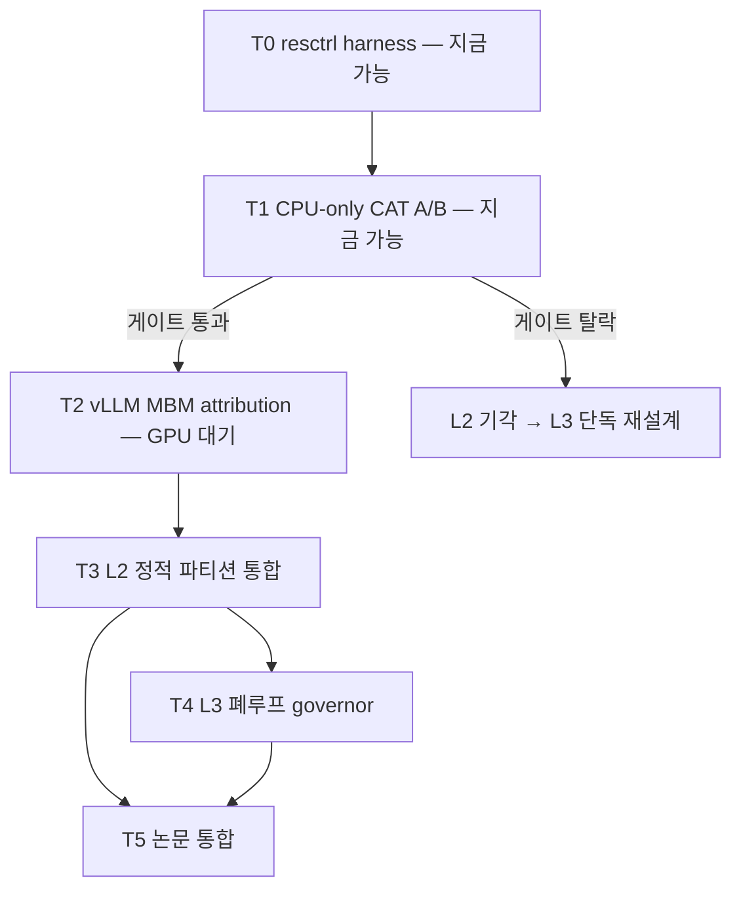

# IDE_026 — task.md (TSK_048 중심)

> **실행 위치 갱신 (2026-06-12)**: 현재 작업 환경이 **호스트 직접** (dgx-b200,
> mystous + sudo) 로 전환됨 — 컨테이너 권한 문제 (CLAUDE.md 이력) 해소.
> **resctrl 은 이미 마운트되어 있음** (rw, 커스텀 그룹 0개 = 본 작업이 첫 사용자).

## T0. [TSK_048-(a)] resctrl harness (GPU 불요)

- [x] resctrl mount — **이미 마운트 확인** (2026-06-12, `/proc/mounts`: `resctrl rw,relatime`)
- [x] `info/` 판독 완료 (2026-06-12 실측 — 아래 표). **L2 CAT 지원 발견** (원안에 없던 능력).

  | 자원 | 실측 값 | 파생 수치 |
  |---|---|---|
  | L3 CAT | cbm `fffff` (20-way), num_closids **15**, min_cbm 1, sparse **0** (= mask 연속 필수) | 300 MB/socket ÷ 20 = **way 당 15 MB** |
  | L3 `shareable_bits` | **`c0000`** (way 18–19), bit_usage `XX...` = IO(DDIO) 와 공유 중 | GPU PCIe DMA/NIC 착지 way — schemata 설계 제약 |
  | L2 CAT | cbm `ffff` (16-way), num_closids **8**, 도메인 = 물리 코어 (SMT sibling 공유, 예: cpu0+112) | 2 MB/core ÷ 16 = **way 당 128 KB** |
  | MB (MBA) | granularity **10%**, min 10, delay_linear 1, **`thread_throttle_mode=max`** | SMT sibling 이 다른 CLOS 면 **가장 강한 throttle 이 코어 전체 적용** (함정 #6) |
  | L3_MON | `llc_occupancy` + `mbm_total_bytes` + `mbm_local_bytes`, num_rmids **480**, max_threshold_occupancy 600 KB | **total − local = 원격(UPI) 트래픽** 분해 가능 |
  | ISA | `waitpkg`(tpause) / `cldemote` / `amx_bf16·int8` / `enqcmd` 실측 ✓ | T4 governor + RESEARCH_DIRECTIONS.md D4 |
  | uncore freq | sysfs 제어 0.8–2.4 GHz (`intel_uncore_frequency/package_0{0,1}_die_00`) | 간섭의 전력·주파수 채널 (D7) |

- [x] `rdt_ctl.py` 작성 (2026-06-11, `src/rdt_ctl.py`): CLOS 생성·schemata 기록·TID/CPU 등록·mon_data 주기 판독 (파일 I/O 만, 외부 의존 0, `--root` 인자화로 호스트/컨테이너 동일 동작)
- [ ] dual-socket 도메인 (0=, 1=) 처리 + 판독 self-test — `sudo python3 src/rdt_ctl.py selftest` (G0 전 항목) **즉시 실행 가능**

## T1. [TSK_048-(b)] CPU-only 간섭 재현 + CAT 격리 A/B (GPU 불요)

serving-역할 합성 부하 (pointer-chase + memcpy, host path 모사) 를 코어 0-7 에,
harvest-역할 aggressor (AVX-512 STREAM-like) 를 배치.

> 코어 배치 수정 (2026-06-11): 기본값 aggressor **16-55 (socket 0 내부)** — MBA 는
> socket-로컬 트래픽만 throttle 하므로 (CLAUDE.md 함정 #3) 원안 16-111 (양 socket)
> 은 B2 효과가 희석됨. 토폴로지 실측: node0=0-55,112-167 / node1=56-111,168-223.
> cross-socket 비교 셀은 `AGGR_CPUS=16-111` 환경변수로 선택 실행.

| 셀 | CAT | MBA | 측정 | 분해 목적 |
|---|---|---|---|---|
| IDLE | — (aggressor 없음) | — | victim 단독 p50/p99 | 간섭 실재 기준선 |
| B0 | off (단일 CLOS) | off | serving p50/p99 latency, harvest GB/s | 총 간섭 |
| B1 | serving 16-way(`0xffff0`) / harvest 4-way(`0x0000f`) | off | 〃 | **용량(capacity) 간섭만** 차단 |
| B1m | off | harvest MBA 20% | 〃 | **대역폭(BW) 간섭만** 차단 (신규 셀) |
| B2 | B1 + harvest MBA 20% | on | 〃 | 둘 다 차단 |

> **B1m 추가 근거 (2026-06-12)**: CAT 은 LLC *용량* 만 분할하고 LLC/메모리 *대역폭*
> 경합은 막지 못함 (way 가 달라도 CHA·mesh·iMC 큐는 공유). B1 vs B1m vs B2 3-축
> 분해로 victim p99 악화가 용량형인지 대역폭형인지 귀속 — 이 귀속 자체가 논문 §9
> 의 1차 데이터. (SUB_201 의 launch-bound vs memcpy-bound 구분과 연결: memcpy-bound
> victim 은 대역폭형 간섭에, pointer-chase victim 은 용량형 간섭에 민감할 것으로 예측)

**실측 기반 배치 규칙 (2026-06-12 확정):**
1. victim 0-7 사용 시 **SMT sibling 112-119 는 반드시 idle** (L2 공유 오염 + `thread_throttle_mode=max` 연좌 방지)
2. aggressor 16-55 의 sibling 128-167 도 idle — 측정 순수성
3. harvest CLOS 의 L3 mask 는 **way 18-19 (`c0000`) 침범 금지** — IO/DDIO 공유 way. GPU 단계(T2+)에서 PCIe DMA 착지 지점과 경합 방지. `0x0000f` 는 이 규칙 충족 ✓
4. mask 는 연속 필수 (`sparse_masks=0`) — 비연속 mask 는 write 시 EINVAL

- [x] aggressor/victim 마이크로벤치 작성 (2026-06-11, `src/victim_aggressor.c` 단일 파일 + `src/build.sh` — victim: pointer-chase+memcpy p50/p99, aggressor: AVX-512 triad GB/s)
- [x] 셀 오케스트레이션 작성 (`src/run_t1_ab.sh` — IDLE/B0/B1/B2 4셀 × 3-run, mon_data 병행 기록 + G1 게이트 자동 판정)
- [ ] **B1m 셀 추가** (`run_t1_ab.sh` 수정 — MBA-only)
- [ ] 호스트 실행: 3-run, mon_data (llc_occupancy / mbm_total / **mbm_local**) 동시 기록 → `src/t1_results/`
- 게이트: **B2 에서 victim p99 가 B0 대비 회복 ≥ 80% AND aggressor 처리량 ≥ B0 의 70%**
  → 미달 시 L2 정적 파티션 기각, L3 폐루프 단독 재설계

## T1.5. MBA→GB/s 캘리브레이션 곡선 (신규, GPU 불요)

> **근거**: MBA 의 % 값은 *지연 삽입 단계* 이지 실제 GB/s 보장이 아니다 — 같은 20%
> 라도 access 패턴 (streaming triad vs pointer-chase vs memcpy) 별 실효 대역폭이
> 다르게 잘린다. T4 governor 가 "MBA 값 → 실효 BW" 변환 테이블 없이는 제어 불가.

- [ ] aggressor CLOS 의 MBA 를 10→100% (10% step) sweep × 3 패턴 → `mba_calibration.csv`
- [ ] 비선형성·포화점 기록 (delay_linear=1 이어도 실효 BW 는 비선형일 수 있음)
- 산출물: governor 용 LUT + 논문 §9 보조 figure

## T2. [TSK_048-(c)] vLLM host 스레드 MBM attribution (GPU 가용 대기)

- [ ] vLLM 부팅 + 스레드 분류 등록: serving CLOS (EngineCore I/O / detok / structured-output
      / KV copy / worker 본체) vs harvest CLOS (ngram precompute / lhc-tempo / AMX draft)
- [ ] 워크로드 mix conc=32 (SUB_212 canonical) 에서 그룹별 llc_occupancy / mbm_total
      **+ mbm_local** 시계열 — **(total − local) = UPI 원격 트래픽** 분리 기록.
      원격분이 크면 MBA 로 제어 불가 → 해당 스레드는 NUMA bind 또는 T4 duty-cycle 대상
- [ ] **RDT-가시/불가시 트래픽 회계**: MBM 합계 vs iMC 레벨 총 트래픽 (turbostat/uncore)
      의 잔차 = DSA·GPU DMA 등 RDT-invisible 트래픽 정량 (RESEARCH_DIRECTIONS.md §2)
- [ ] 음수 lever 재측정: C-8a detok ThreadPool (−0.35% 기측정) 를 CAT 격리 ON/OFF A/B
- 판정: 간섭 지도 (논문 §9 신규 절 데이터) + R1/R2 위험 노출

## T3. L2 정적 파티션 vLLM 통합 (T2 GO 시)

- [ ] `VLLM_RDT_ENABLE` env + gpu_worker/스레드 initializer hook (CLAUDE.md 통합 지점)
- [ ] canonical 1셀 A/B: 격리 ON/OFF × harvest 부하 {0, 50%, 100% 코어}
- [ ] frontier 표: (serving tps 저하, harvest 처리량) — 논문 §8 신규 표

## T4. L3 폐루프 governor (자원 제어 폐루프 — 독립 설계)

> Metronome(LHC 박자 게이팅) 은 기각된 아이디어 — 본 governor 는 그 서사에 의존하지
> 않는다. GPU step-time 신호는 tempo 샘플러 *코드* 재사용 또는 CUDA event 직접 계측.

- [ ] tpause .so 1함수 (dev 머신 단위 테스트 가능 — Alder Lake waitpkg 지원)
- [ ] governor: GPU step-time EMA + MBM 점유 → harvest duty-cycle
- [ ] 제어 목표: serving 저하 상한 x% 를 SLO 로 입력받아 duty 자동 조절
- 게이트: 정적 L2 대비 harvest 처리량 +20% 이상 (같은 SLO 하) — 미달 시 L2 만 채택

## T5. 논문 통합

- [ ] §9 간섭 정량 절 + fig4 측정판 / §8 frontier 표
- [ ] **독립 기여로 기술** — 기각된 Metronome 서사에 얹지 않음. 논문 내 Metronome
      관련 절·표 (tbl_metronome_lhc 등) 의 거취는 사용자 판정 대기

## 우선순위 그래프

