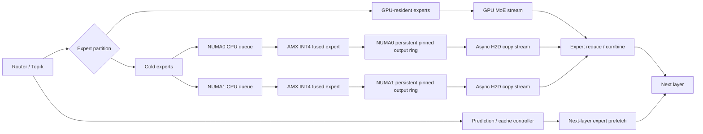
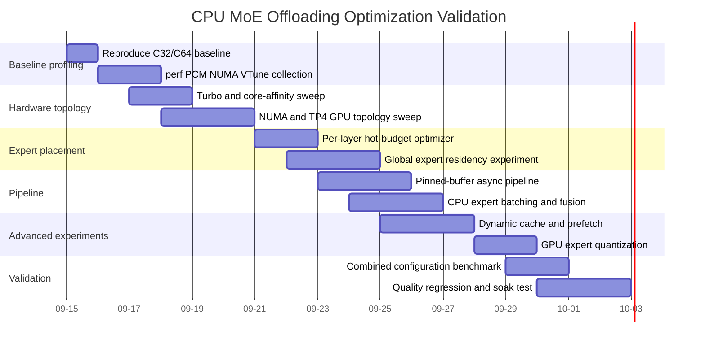

# CPU MoE Offloading 성능 진단 및 개선 전략

## Executive Summary

현재 결과를 다시 읽어보면, **“CPU MoE offloading 자체가 원래 느리다”기보다 현재 시스템이 이미 CPU/DRAM/NUMA 경로의 한계에 부딪힌 상태**로 보는 것이 가장 타당합니다. 특히 중요한 것은 CPU 사용률이 35~40% 수준이라는 사실을 “CPU가 남는다”라고 해석하면 안 된다는 점입니다. 현재 측정에는 실제 DRAM bandwidth, remote-NUMA traffic, LLC miss, memory latency가 없기 때문에 아직 확정할 수는 없지만, 실험 결과의 scaling 형태는 **연산 코어 부족보다 memory bandwidth + NUMA locality + CPU↔GPU 동기화가 지배적인 병목**임을 강하게 시사합니다. fileciteturn0file0

가장 강한 증거는 다음 네 가지입니다. 첫째, CPU worker를 96에서 112로 늘려도 처리량이 개선되지 않았습니다. 둘째, 한 소켓에 제한한 인스턴스가 약 338 tok/s인데 양 소켓을 쓰는 단일 인스턴스도 487~520 tok/s 정도로 2배 scaling되지 않습니다. 셋째, 8 GPU를 두 개의 socket-local TP4 hybrid 인스턴스로 분할해도 총 C64-equivalent throughput이 702.5 tok/s로 단일 TP4의 약 642 tok/s보다 겨우 9% 높습니다. 넷째, GPU-only TP8+EP8은 같은 8 GPU에서 2,031 tok/s이므로 CPU offload가 포함되는 순간 병목이 급격히 커집니다. fileciteturn0file0

반대로 지금까지의 최적화 방향은 매우 정확했습니다. **expert 전량 CPU 약 43 tok/s → hot96 + frequency-based hotmap + deferral 4 + 적절한 KV pool에서 약 642 tok/s**로 약 14.8배 향상되었습니다. 특히 GPU에 올리는 expert를 단순 physical ID 0~95로 고르는 것보다 실제 routing frequency에 따라 선택했을 때 차이가 거의 한 자릿수 배에 달했습니다. 즉 이 시스템의 성능은 “CPU GEMM을 조금 더 빠르게 하는 문제”보다 **CPU로 떨어지는 expert invocation 자체를 최소화하고, 남은 CPU invocation을 매우 큰 batch와 높은 locality로 처리하는 문제**에 가깝습니다. fileciteturn0file0

현재 hot96의 평균 expert coverage는 약 98.64%입니다. 얼핏 충분해 보이지만 Qwen3-Coder-480B는 62개 sparse layer에서 token당 8개 expert를 선택하므로 token 하나당 총 **496 expert selections**가 발생합니다. 평균 miss rate 1.36%만 적용해도 단순 기대값은 **약 6.76개의 CPU-side expert selections/token**입니다. 따라서 98.6% hit rate는 이 모델에서는 결코 “CPU가 거의 안 쓰이는” 상태가 아닙니다. 일부 layer의 hot96 coverage는 91.4%까지 내려가기 때문에 실제 critical path에서는 더 나쁠 가능성이 있습니다. fileciteturn0file0

따라서 제가 권하는 순서는 다음과 같습니다.

**가장 먼저 할 일은 코드 변경이 아니라 측정입니다.** `pcm-memory`, `pcm-numa`, VTune Memory Access, `perf stat`, `numastat`을 동시에 걸어서 DRAM bandwidth와 remote-NUMA를 확인해야 합니다. Intel PCM은 socket/channel별 memory bandwidth와 local/remote NUMA access, PCIe bandwidth를 직접 계측할 수 있고, VTune Memory Access는 NUMA 및 bandwidth-bound access를 분석하도록 설계되어 있습니다. citeturn3search1turn1search3

그 다음의 최우선 실험은 **turbo ON + strict NUMA placement + TP4 GPU를 두 socket에 걸쳐 배치하는 실험**입니다. 현재 Xeon Platinum 8480+는 base 2.0 GHz이고 공식 최대 turbo가 3.8 GHz인데, 보고서의 모든 CPU 실험은 turbo OFF, 2.0 GHz cap 상태입니다. 메모리 병목이면 90% 빨라지지는 않겠지만 AMX compute, routing, synchronization, reduction 부분에는 상당한 headroom이 남아 있습니다. fileciteturn0file0 Intel 사양상 이 CPU는 socket당 56 cores, 8 memory channels, 2DPC에서 DDR5-4400을 지원합니다. citeturn2search0

하지만 **가장 큰 구조적 개선 후보는 uniform hot96을 버리는 것**입니다. 지금은 모든 layer에 똑같이 96개의 GPU expert slot을 할당하지만, layer별 activation skew가 크게 다릅니다. 같은 HBM을 쓰면서 `96 × 62`라는 고정 배분 대신 **전체 `(layer, expert)` pair를 benefit score 순서로 배치**하면 낮은-entropy layer에서는 50~70개만 두고 difficult layer에는 110~140개를 둘 수 있습니다. 이것은 hot100처럼 HBM을 더 쓰는 것이 아니라 **동일한 HBM에서 cold miss를 재분배하는 방식**입니다. MoE-Infinity는 request-level activation tracing을 이용한 cache/prefetch를, HybriMoE는 dynamic scheduling, score-based cache, inter-layer prefetch를 제안했으며 HybriMoE는 KTransformers 위에서 기존 hybrid 방식 대비 decode 평균 1.70배 개선을 보고했습니다. 이 숫자를 현재 시스템에 그대로 기대해서는 안 되지만 방향성은 지금 결과와 매우 잘 맞습니다. citeturn0academia50turn5academia0

제가 현실적으로 잡을 **첫 번째 목표는 4×H100 TP4에서 C64 750~850 output tok/s**입니다. 현재 642±7 tok/s에서 +17~32%입니다. turbo/NUMA/locality만으로 750을 넘을 수 있는지는 측정해봐야 하지만, **NUMA 개선 + non-uniform expert placement + CPU/GPU overlap**을 모두 적용하면 충분히 도전할 가치가 있는 범위입니다. 반면 8 GPU를 자유롭게 쓸 수 있는 경우에는 CPU offload를 계속 극한 최적화하기보다 GPU-only가 이미 2,031 tok/s라는 사실을 감안해야 합니다. 현재 데이터상 hybrid offload의 경제적 목적은 “GPU 수를 줄이는 것”이지, 8 GPU가 이미 있는 상황에서 최고 throughput을 얻는 것이 아닙니다. fileciteturn0file0


## 현재 시스템을 다시 정리한 상태표

현재 실험은 단순한 CPU offload prototype이 아니라 상당히 고도화된 hybrid serving stack입니다. 특히 hot expert placement, AMX INT4 CPU expert, CUDA graph, deferral, TP4, multi-concurrency까지 이미 들어가 있으므로 일반적인 “INT4로 바꾸세요”, “batch를 키우세요” 수준의 처방은 별 의미가 없습니다. KTransformers 자체도 현재 AMX/AVX 기반 MoE kernel, NUMA-aware execution, CPU-GPU heterogeneous expert placement를 명시적으로 지원하는 방향으로 개발되고 있습니다. citeturn2search2turn2search5

| 차원 | 현재 확인된 상태 | 판정 |
|---|---|---|
| CPU | Intel Xeon Platinum 8480+, 2 sockets × 56 physical cores, 224 logical CPUs | 지정됨 |
| CPU frequency | turbo OFF, max scaling 2.0 GHz, performance governor | **지정됨, 매우 중요한 최적화 후보** |
| Cache | L1d 5.3 MiB aggregate, L2 224 MiB aggregate, L3 210 MiB aggregate | 지정됨 |
| NUMA | 2 nodes; node0 CPU 0-55,112-167, node1 56-111,168-223 | 지정됨 |
| DRAM | 2 TB, 32×64 GB DDR5-4400, socket당 약 1 TB | 지정됨 |
| 실제 DRAM BW | 없음 | **미지정 / 즉시 측정 필요** |
| local/remote NUMA bytes | 없음 | **미지정 / 즉시 측정 필요** |
| Storage | 8× Samsung NVMe 3.5 TB RAID5 `/data`; 기타 block devices | 지정됨 |
| GPU | 8× H100 80 GB HBM3, NVLink full connectivity | 지정됨 |
| GPU/NUMA | GPU0-3 ↔ NUMA0, GPU4-7 ↔ NUMA1 | 지정됨 |
| OS | RHEL 9.4 | 지정됨 |
| Kernel | 5.14.0-427.124.1.el9_4.x86_64 | 지정됨 |
| Python | 3.12.3 | 지정됨 |
| PyTorch | 2.13.0+cu130 | 지정됨 |
| CUDA | 13.0 | 지정됨 |
| NCCL | 2.29.7 | 지정됨 |
| SGLang | 0.5.18 + local patch 326+/11− | 지정됨 |
| kt-kernel | 0.7.0.post1 custom build | 지정됨 |
| Triton | 3.7.1 | 지정됨 |
| Transformers | 5.12.1 | 지정됨 |
| TensorFlow | 사용 여부/버전 없음 | **미지정, 현재 inference에는 사실상 비관련** |
| Host C/C++ compiler | CUDA compiler build 정보 외 정확한 GCC/Clang version 및 flags 없음 | **미지정** |
| MKL/OpenBLAS/BLAS | 없음 | **미지정** |
| Model | Qwen3-Coder-480B-A35B-Instruct-FP8 | 지정됨 |
| Layers | 62 | 지정됨 |
| Hidden dimension | 6144 | 지정됨 |
| MoE intermediate | 2560 | 지정됨 |
| Experts | layer당 160 | 지정됨 |
| Experts/token | 8 | 지정됨 |
| Activation | SiLU, model dtype BF16; GPU model FP8 quantization | 지정됨 |
| CPU expert precision | AMX INT4, CPU converted weights 약 232 GB | 지정됨 |
| Input/output seq | input 512 / output 128 / prefix 100 | 지정됨 |
| Serving concurrency | 16~96 sweep, practical optimum 약 C64 | 지정됨 |
| GPU expert placement | hotmap 기반 hot96 | 지정됨 |
| Offloaded weights | cold expert weights → CPU DRAM | 지정됨 |
| Activation offload buffer type | CPU expert 실행을 위해 GPU↔CPU 전달은 존재하나 정확한 pageable/pinned/registration 방식 없음 | **부분 미지정** |
| Optimizer state | inference이므로 해당 없음 | N/A |
| Async mechanism | deferral/callback-free local modification 존재 | **부분 지정; 실제 overlap 비율 미측정** |
| Offload granularity | expert-level hot/cold placement | 지정됨 |
| Per-layer expert budget | 현재 사실상 동일한 N=96 | 지정됨 |
| PCIe H2D/D2H bytes | 없음 | **미지정** |
| CPU total utilization | 약 34~40%, peak 약 48~52% | 지정됨 |
| Per-core utilization | 없음 | **미지정** |
| Context switches | 없음 | **미지정** |
| LLC/cache miss | 없음 | **미지정** |
| DRAM bandwidth | 없음 | **미지정** |
| Page faults | 없음 | **미지정** |
| I/O wait | 없음 | **미지정** |
| steady-state disk I/O | 없음 | **미지정** |
| PCIe bandwidth | 없음 | **미지정** |
| throughput | C32 약 465±6 tok/s at KV40k; C64 약 642±7 tok/s | 지정됨 |
| TTFT | C64 p50 약 3 s 부근 | 지정됨 |
| TPOT | C64 p50 약 76~78 ms, p95 약 84~87 ms 수준 | 지정됨 |
| GPU HBM | hot96/KV40k 약 75~76 GiB/GPU | 지정됨 |
| Host DRAM use | 약 308 GB single instance | 지정됨 |
| CPU cycles/token | 없음 | **미지정 / 필수 추가** |

위의 모든 실측 환경 및 benchmark 값은 업로드된 IDE_069 보고서에 기반합니다. fileciteturn0file0

특히 CPU의 공식 사양을 대입하면 현재 DDR5-4400 2DPC 조건에서 이론적인 socket당 peak bandwidth는 `8 channels × 4400 MT/s × 8 byte ≈ 281.6 GB/s`, dual socket 합산으로 약 **563 GB/s**입니다. 그러나 이것은 theoretical peak일 뿐이며 실제 AMX MoE kernel이 달성하는 sustainable bandwidth는 반드시 PCM/VTune으로 측정해야 합니다. 8480+의 8-channel DDR5 구조와 2DPC DDR5-4400 지원 자체는 Intel 공식 사양과 일치합니다. citeturn2search0


## 병목에 대한 제 판단

### 가장 가능성 높은 병목은 DRAM과 NUMA다

현재 가장 먼저 검증해야 할 가설은 다음입니다.

> **cold expert AMX kernel이 CPU core 수보다 DRAM bandwidth/locality에 제한되고 있으며, dual-socket 사용 시 일부 weight/activation access와 CPU→GPU return path가 UPI를 통과하면서 추가 비용이 발생한다.**

보고서에서 `cpuinfer 96 → 112`가 의미 있는 개선을 만들지 못했고 CPU busy가 100%에 훨씬 못 미치는 반면, socket 하나로 묶인 실행이 크게 느려지는 것은 이 가설과 일치합니다. 또한 현재 single TP4는 GPU0~3을 사용하므로 **모든 GPU가 NUMA0에 붙어 있습니다.** 동시에 CPU inference는 두 socket을 모두 활용합니다. 따라서 NUMA1에서 실행되는 expert가 GPU activation을 받거나 결과를 GPU0~3으로 돌려보내려면 socket interconnect를 통과할 가능성이 있습니다. 정확히 얼마나 발생하는지는 현재 자료에 없습니다. fileciteturn0file0

이 부분은 반드시 추측에서 측정으로 바꿔야 합니다. Intel PCM은 `pcm-memory`로 메모리 BW, `pcm-numa`로 local/remote NUMA access, `pcm-pcie`와 `pcm-iio`로 I/O bandwidth를 계측할 수 있습니다. Intel VTune의 Memory Access analysis는 NUMA 문제와 bandwidth-limited access를 판별하고 memory object까지 attribution할 수 있습니다. citeturn3search1turn1search3

### hot expert hit rate는 높지만 충분히 높지 않다

현재 hot96의 평균 coverage는 98.637%지만 160 experts 중 token당 8 experts, 62 sparse layers라는 구조를 감안하면 매우 다른 그림이 나옵니다.

```text
expert selections / token = 62 × 8 = 496
average CPU miss fraction = 1 - 0.98637 ≈ 0.01363

expected cold selections/token
≈ 496 × 0.01363
≈ 6.76
```

즉 **평균적으로 생성 token 하나를 끝내기 위해 약 6~7번의 cold CPU expert path가 남아 있는 셈**입니다. 이것은 단순한 intuition 계산이고 실제 batching과 expert reuse 때문에 CPU weight traffic을 직접 의미하지는 않지만, 왜 98.6% hit rate에서도 CPU side가 전체 step의 critical path가 될 수 있는지 설명해 줍니다. 게다가 layer별 minimum coverage는 91.4%이므로 worst layer에서는 훨씬 더 많은 CPU work가 발생합니다. fileciteturn0file0

MoE-Infinity가 global popularity뿐 아니라 request-level activation trace와 temporal reuse를 cache/prefetch에 활용한 이유가 정확히 이 문제입니다. HybriMoE 역시 fixed mapping이 activation instability에 취약하다는 점을 지적하고 dynamic intra-layer scheduling, score-based cache 및 inter-layer prefetch를 사용합니다. citeturn0academia50turn5academia0

### CPU-GPU synchronization이 두 번째 병목일 가능성이 높다

KTransformers 논문 자체도 hybrid MoE inference의 주된 제한으로 CPU computation과 CPU-GPU synchronization overhead를 지적하고, AMX-specific kernel과 asynchronous CPU-GPU scheduling을 핵심 최적화로 제시합니다. 발표된 시스템에서는 기존 시스템 대비 decode 1.25~4.09배 향상을 보고하지만, 이 숫자는 현재 환경의 예상 개선폭으로 직접 사용해서는 안 됩니다. citeturn0search3

현재 실험에서도 `deferral=4`가 C32를 470 → 520 tok/s까지 개선한 것은 **scheduling/critical-path manipulation으로 약 10%가 바로 나온다는 강한 신호**입니다. 반면 deferral 8은 다시 감소하고 speculative decoding도 역효과였기 때문에 CPU work 자체를 더 생성하는 최적화는 지금 구조에서는 위험합니다. fileciteturn0file0

### KV와 expert cache는 같은 HBM을 두고 경쟁한다

hot100은 hot96보다 expert miss를 줄일 수 있는데도 성능이 오히려 356 tok/s로 떨어졌고, hot112는 OOM이 발생했습니다. 동시에 KV 24k → 40k 확대는 C64를 425 → 약 642 tok/s로 크게 높였습니다. 따라서 문제는 단순히 “GPU expert를 더 많이 넣자”가 아닙니다. **HBM 1 GiB가 expert cache에 쓰였을 때 얻는 cold miss reduction과, KV에 쓰였을 때 얻는 batching/concurrency 증가를 동시에 최적화해야 합니다.** fileciteturn0file0

이 때문에 uniform `N experts per layer`보다 **HBM byte당 CPU critical-path 절감량**을 기준으로 layer별 slot 수를 다르게 주는 것이 다음 단계입니다.

### SSD/NVMe는 현재 steady-state의 우선 병목이 아닐 가능성이 높다

현재 CPU expert weights는 약 232 GB이고 실제 process DRAM 사용은 약 308 GB입니다. 따라서 정상적인 warm steady-state라면 expert weights는 DRAM에 resident할 수 있고 `/data` NVMe RAID는 model load 단계에만 주로 관여해야 합니다. `iostat`과 major fault가 실제로 0에 가까운지를 먼저 확인하면 됩니다. 만약 decode 중 NVMe read가 지속된다면 그것은 tuning 대상이 아니라 **즉시 수정해야 할 pathological behavior**입니다. fileciteturn0file0


## 우선순위가 높은 구체적 최적화

아래 impact는 **현재 결과에 대한 예상 incremental 효과**이며 서로 더해서 계산하면 안 됩니다. 문헌의 speedup 숫자를 그대로 가져온 것이 아니라 현재 scaling 결과를 기준으로 보수적으로 잡은 실험 우선순위입니다.

| 우선순위 | 변경 | 예상 영향 | 구현 위험 | 판단 |
|---|---|---:|---|---|
| **P0** | Turbo ON + frequency sweep | +5~25% | 낮음 | 가장 싸고 빠른 실험 |
| **P0** | DRAM/NUMA 계측 후 strict local allocation | +10~35% 가능 | 중간 | 가장 가능성 높은 구조 병목 |
| **P0** | TP4 GPU를 `0,1,4,5`처럼 양 socket에 분산 + rank-local CPU pools | +5~25% 가능 | 중간 | 현재 모든 TP4 GPU가 NUMA0인 문제 검증 |
| **P0** | uniform hot96 → global/per-layer weighted hot allocation | +15~40% 가능 | 중간 | 현재 결과상 가장 큰 algorithmic 후보 |
| **P1** | CPU/GPU expert parallel overlap + persistent pinned activation ring | +10~30% | 중간~높음 | sync bubble 제거 |
| **P1** | request/sequence-aware expert cache & next-layer prefetch | +5~25% | 높음 | MoE-Infinity/HybriMoE 방향 |
| **P1** | cold expert token aggregation / larger expert microbatch | +10~30% | 중간 | AMX 및 weight reuse 증가 |
| **P1** | kt-kernel/SGLang upstream v0.7.0 경로와 local patch A/B | 0~20% | 중간 | NUMA/scheduling regression 여부 검증 |
| **P2** | CPU kernel fusion/reorder 제거/activation layout 정리 | +5~20% | 높음 | profile 후 적용 |
| **P2** | GPU hot expert W4/GPTQ 실험으로 slot 확대 | +20% 이상 잠재 | 높음 | 성능/품질 risk 큼 |
| **P2** | THP/hugepage/prefault | 0~10% | 중간 | dTLB miss가 확인될 때만 |
| **P3** | SSD/NVMe direct expert offload | 대개 악화 | 높음 | capacity fallback 용도 |
| **P3** | distributed CPU + RDMA | aggregate scaling 가능 | 높음 | single-node BW가 확실히 포화된 이후 |

### CPU 주파수는 바로 풀어볼 가치가 있다

현재 `intel_pstate/no_turbo=1`, `scaling_max_freq=2000000`으로 CPU가 base 2.0 GHz에 묶여 있습니다. Intel의 8480+ 공식 max turbo는 3.8 GHz입니다. citeturn2search0

A/B benchmark용으로만 다음을 실험합니다.

```bash
# current state
cat /sys/devices/system/cpu/intel_pstate/no_turbo
cpupower frequency-info

# Benchmark A: current
# no_turbo=1

# Benchmark B: turbo enabled
sudo sh -c 'echo 0 > /sys/devices/system/cpu/intel_pstate/no_turbo'
sudo cpupower frequency-set -g performance

# 실제 frequency 반드시 측정
sudo pcm 1
# 또는
turbostat --interval 1
```

여기서는 단순히 `2.0 → 3.8 GHz = 1.9×`를 기대하면 안 됩니다. AMX kernel이 DRAM-bound이면 speedup은 작습니다. 오히려 이 실험은 **병목을 구분하는 diagnostic**입니다. turbo를 켰는데 throughput +5% 이하이고 DRAM bandwidth가 이미 높은 수준이면 memory-bound hypothesis가 강해집니다. 반대로 +20% 이상 오르면 compute/synchronization도 상당 부분 critical path라는 뜻입니다.

### NUMA는 단순 numactl보다 더 깊게 고쳐야 한다

첫 단계에서는 현재 weight page placement부터 봅니다.

```bash
PID=$(pgrep -n -f sglang)

numactl -H
numastat -p "$PID"

watch -n 1 "numastat -p $PID"
```

그 다음에 다음 두 형태를 비교해야 합니다.

```bash
# socket 0 only
numactl --cpunodebind=0 --membind=0 \
    python3 -m sglang.launch_server ...

# socket 1 only
numactl --cpunodebind=1 --membind=1 \
    python3 -m sglang.launch_server ...
```

그러나 최종 구현은 **전체 process를 한 node에 bind하는 것이 아니라 CPU expert memory와 worker pool을 node별로 따로 만드는 것**이어야 합니다.

현재 DRAM이 2 TB이고 CPU expert set이 약 232 GB이므로, 한 가지 공격적인 실험은 **cold expert weights를 두 NUMA node에 각각 복제**하는 것입니다. 약 232 GB를 추가로 소비하지만 각 socket에 1 TB가 있으므로 capacity 관점에서는 충분합니다. 그러면 node0 worker는 node0 weight만, node1 worker는 node1 weight만 읽게 할 수 있습니다. fileciteturn0file0

그보다 메모리 효율적인 방식은 expert ownership을 두 node 사이에 나누는 것입니다. 중요한 것은 다음 invariant입니다.

```text
CPU worker(node N)
    → expert weight(node N)
    → staging buffer(node N)
    → 가능하면 local GPU/TP rank
```

현재 GPU0~3은 전부 NUMA0이고 GPU4~7은 전부 NUMA1입니다. 그런데 8 GPU는 모두 NVLink로 연결되어 있습니다. 따라서 매우 가치 있는 A/B가 다음입니다. fileciteturn0file0

```bash
# Current
CUDA_VISIBLE_DEVICES=0,1,2,3

# NUMA-balanced TP4 candidate
CUDA_VISIBLE_DEVICES=0,1,4,5

# Additional alternatives
CUDA_VISIBLE_DEVICES=0,2,4,6
CUDA_VISIBLE_DEVICES=1,3,5,7
```

TP collective가 NVLink에 머물 수 있다면 이 topology는 **CPU side에서는 양 socket locality를 얻으면서 GPU 간 TP는 NVLink를 유지**할 가능성이 있습니다. 다만 실제 kt-kernel의 CPU pool이 rank별로 분리되는지 확인해야 하므로 `pcm-numa`, `pcm-iio` 및 trace와 함께 실험해야 합니다.

### hot96을 layer별 고정 96에서 global budget으로 바꿔야 한다

현재 hotmap 통계는 이미 중요한 힌트를 줍니다.

```text
hot96 mean coverage : 98.64%
hot96 min coverage  : 91.43%
hot96 max coverage  : 99.57%
```

fileciteturn0file0

이는 모든 layer에 96개씩 배정하는 것이 비효율적이라는 뜻입니다. 예를 들어 매우 skew가 큰 layer는 64개로도 99%가 넘을 수 있지만 어려운 layer는 96개로도 92% 수준일 수 있습니다.

다음 objective를 권합니다.

```text
각 (layer, expert)의 GPU 상주 benefit:

score(l,e)
  = activation_probability(l,e)
  × estimated_CPU_cost(l,e)
  × critical_path_weight(l)
  / GPU_bytes(l,e)
```

그리고

```text
maximize Σ resident(l,e) × score(l,e)

subject to
Σ resident_GPU_bytes <= HBM expert budget
KV_pool >= 40,960-token operating requirement
workspace_margin >= safety threshold
```

즉 `--kt-num-gpu-experts 96` 같은 layer-uniform parameter 대신 **전체 GPU expert byte budget**을 넘기고 allocator가 layer별로 다르게 배분하게 만드는 것이 좋습니다.

더 나아가 최근 N requests를 EWMA로 반영합니다.

```text
dynamic_score
  = α × global_frequency
  + β × recent_request_frequency
  + γ × previous-token / sequence-local reuse
  + δ × CPU latency saved
```

MoE-Infinity는 sparse activation의 request-level trace와 skewed reuse를 caching/prefetch에 활용하고, HybriMoE는 activation instability에 대응하는 score-based cache와 impact-driven prefetch를 채택했습니다. citeturn0academia50turn5academia0

**이 실험의 핵심 metric은 tok/s보다 먼저 `CPU expert calls / output token`입니다.** 현재의 단순 평균 추정 약 6.76을 3 이하, 이상적으로 1~2 수준까지 내릴 수 있다면 CPU critical path가 크게 줄 가능성이 있습니다.

### CPU와 GPU expert를 진짜 병렬 pipeline으로 만들어야 한다

Fiddler의 핵심 관찰은 CPU에 있는 expert weight를 매번 GPU로 옮기는 것보다 CPU 자체에서 해당 expert를 계산함으로써 data movement를 줄이는 것이 유리할 수 있다는 것입니다. citeturn0academia48 현재 시스템도 이미 이 계열에 속하지만, 다음 단계는 CPU computation과 GPU computation 사이의 overlap을 최대화하는 것입니다.

목표 timeline은 다음과 같아야 합니다.



중요한 것은 **CPU result가 끝날 때까지 GPU stream 전체를 blocking하지 않는 것**입니다. hot GPU experts는 즉시 실행하고, cold CPU experts는 node별 thread pool에서 동시에 실행하고, 완성된 CPU output만 별도 copy stream에서 H2D 합니다.

Activation staging buffer에는 매 iteration `pin_memory()`를 호출하면 안 됩니다. PyTorch 공식 자료도 on-the-fly `pin_memory().to(..., non_blocking=True)`가 오히려 느려질 수 있으며, transfer 방식은 실제 시스템에서 benchmark해야 한다고 설명합니다. long-lived, preallocated pinned buffers와 `non_blocking` copy를 A/B하는 쪽이 맞습니다. citeturn1search10

### CPU expert microbatch를 키우는 것이 중요하다

C32에서 C64로 concurrency를 올렸을 때 throughput이 약 465 → 642 tok/s로 오르는 것은 지금 kernel이 batching의 이득을 크게 보고 있다는 뜻입니다. C80에서 collapse한 것은 CPU compute 때문이라기보다 KV capacity가 먼저 무너진 결과로 보고서에 나타납니다. fileciteturn0file0

따라서 scheduler가 cold task를 다음처럼 묶어야 합니다.

```text
naive:
token A -> expert 17
token B -> expert 83
token C -> expert 17
token D -> expert 17

better:
expert 17 -> [A, C, D] one AMX invocation
expert 83 -> [B]
```

그리고 request당 latency SLA를 허용하는 범위에서 짧은 aggregation window를 둡니다.

예를 들어:

```text
0 us     : 즉시 실행
10 us
20 us
40 us
80 us
```

를 sweep하여 expert batch-size histogram과 TPOT를 함께 봅니다.

목표는 단순 CPU utilization 상승이 아니라 다음입니다.

```text
mean tokens / CPU expert invocation ↑
p50 AMX kernel batch size ↑
expert weight reuse ↑
cycles / processed expert-token ↓
```

### INT4를 더 밀기보다는 GPU expert compression을 별도 실험하라

CPU cold experts는 이미 AMX INT4이므로 “CPU INT4”는 이미 적용되어 있습니다. fileciteturn0file0 KTransformers의 현재 kt-kernel은 AMX INT4/INT8와 GPU-side quantized expert 경로를 지원하는 방향으로 유지되고 있습니다. citeturn2search2turn2search5

따라서 다음 precision experiment는 CPU를 INT2로 낮추는 것이 아니라 **GPU resident hot experts를 더 작게 만들어 hot96 ceiling 자체를 없애는 것**입니다.

예를 들어:

```text
Current:
FP8 GPU experts × 96/layer
+ KV40k

Candidate:
W4/quantized GPU experts × 112~144/layer
+ KV40k 유지
```

입니다.

이것이 성공하면 uniform hot100 실험과 달리 KV pool을 희생하지 않고 CPU miss rate를 낮출 수 있습니다. 단, H100에서 해당 W4 kernel의 실제 throughput이 FP8보다 충분히 높은지는 별도 benchmark가 필요하고 quantization quality gate도 확대해야 합니다. 따라서 P2입니다.

### huge page와 kernel tuning은 계측 이후에만 한다

`THP=always`, `numa_balancing=off`, `isolcpus` 등을 무작정 적용하는 것은 권하지 않습니다.

먼저 다음이 보여야 합니다.

```text
dTLB-load-misses high
major/minor faults unexpected
CPU migrations high
remote NUMA high
context-switch rate high
```

그 후에만 다음과 같은 A/B를 합니다.

```bash
cat /sys/kernel/mm/transparent_hugepage/enabled
cat /proc/sys/kernel/numa_balancing

# 예: application이 MADV_HUGEPAGE를 지원하게 만든 뒤
# THP madvise mode A/B

echo madvise | sudo tee \
  /sys/kernel/mm/transparent_hugepage/enabled
```

Linux `perf`는 hardware/software event를 통해 bottleneck을 계측할 수 있고, `perf c2c`는 cache-line sharing 문제를 진단할 수 있습니다. citeturn1search2turn1search1


## 실험 및 프로파일링 계획

### 기준선은 C64 하나를 primary KPI로 고정한다

현재 가장 좋은 비교점은 다음이라고 봅니다.

```text
Primary:
hot96 + hotmap + deferral4 + graph + KV40960
Concurrency = 64
Output throughput ≈ 642 ± 7 tok/s
TPOT p50 ≈ 76~78 ms
TPOT p95 ≈ 84~87 ms

Secondary:
C32, KV24576
≈ 487~520 tok/s
```

fileciteturn0file0

모든 experiment는 같은 Sonnet dataset, seed 42, input 512/output 128/prefix100, 같은 request count로 최소 3회 반복합니다.

현재 C64 jitter가 약 ±1.1% 수준이므로 **+2% 같은 결과는 채택하지 않습니다.** 저는 최소 +5%를 engineering win threshold로 잡겠습니다. fileciteturn0file0

즉 C64 acceptance는 대략 다음입니다.

| 판정 | 기준 |
|---|---|
| Noise | < +3% |
| 약한 개선 | +3~5% |
| 채택 후보 | **≥ +5%** |
| 강한 개선 | ≥ +10% |
| 주요 구조 개선 | ≥ +20% |
| latency guardrail | TPOT p95 +5% 이내 |
| TTFT guardrail | p95 +10% 이내 |
| 품질 | 기존 quality 결과보다 통계적으로 의미 있는 하락 없음 |
| 안정성 | OOM / crash / request failure 없음 |

현재 GSM40 39/40은 smoke quality gate로는 유용하지만 approximation/quantization 변경을 최종 승인하기에는 표본이 너무 작습니다. deferral, quantization, surrogate 같은 quality-sensitive 변경은 최소 수백 문항과 code benchmark를 추가하는 편이 타당합니다. 현재 39/40 결과 자체는 deferral 0과 4에서 동일합니다. fileciteturn0file0

### 한 번의 baseline run에서 반드시 같이 수집할 것

먼저 PID를 잡습니다.

```bash
PID=$(pgrep -n -f 'sglang.launch_server')
echo "$PID"
```

CPU hardware counters:

```bash
sudo perf stat -p "$PID" \
  -e task-clock,cycles,instructions,\
cache-references,cache-misses,\
branches,branch-misses,\
context-switches,cpu-migrations,\
page-faults,minor-faults,major-faults \
  sleep 60
```

Linux kernel 문서상 `perf stat`은 hardware/software performance event를 집계하는 표준 경로입니다. citeturn1search2

이 결과에서 최소한 다음 파생치를 저장합니다.

```text
IPC                = instructions / cycles
LLC miss rate      = cache-misses / cache-references
cycles/output-token
instructions/token
context-switch/token
page-faults/token
```

특히 사용자가 원래 요구한 **CPU cycles/token은 현재 미지정**이므로 여기서 처음으로 baseline을 만들어야 합니다.

### DRAM bandwidth는 PCM과 VTune 둘 다 사용한다

가장 중요한 run입니다.

```bash
sudo pcm-memory 1 -csv=pcm_memory.csv
```

가능하면 동시에:

```bash
sudo pcm-numa 1
sudo pcm-pcie 1
sudo pcm-iio 1
```

Intel PCM은 memory bandwidth뿐 아니라 local/remote NUMA, PCIe/IIO를 계측하는 전용 도구를 제공합니다. citeturn3search1

다음 값이 핵심입니다.

```text
NUMA0 read GB/s
NUMA0 write GB/s
NUMA1 read GB/s
NUMA1 write GB/s

local DRAM accesses
remote DRAM accesses
remote / total %

UPI traffic
PCIe host->GPU
PCIe GPU->host
```

**판정 기준**은 다음과 같습니다.

```text
Case A:
DRAM BW ≈ sustainable peak,
CPU utilization 35~45%
→ memory bandwidth bound

Case B:
remote NUMA > 10~15%
→ locality problem

Case C:
DRAM BW 낮음 + IPC 낮음 + context switch 높음
→ synchronization/scheduler problem

Case D:
DRAM BW 낮음 + IPC 높음 + AMX hot spot
→ compute bound

Case E:
PCIe bursts + cuda sync gaps
→ transfer/synchronization bound
```

보다 상세하게는 VTune을 겁니다.

```bash
sudo vtune \
  -collect memory-access \
  -knob analyze-mem-objects=true \
  -knob dram-bandwidth-limits=true \
  -target-pid "$PID" \
  -duration 60 \
  -result-dir vtune_mem
```

Intel 공식 VTune Memory Access 분석은 bandwidth limitation과 NUMA issue를 분석하도록 설계되어 있으며 memory object attribution도 지원합니다. citeturn1search3

### per-core와 scheduling 상태

```bash
mpstat -P ALL 1
sar -P ALL 1

pidstat -t -p "$PID" 1
pidstat -w -t -p "$PID" 1
```

여기서 보는 것은 aggregate 40%가 아니라 다음입니다.

```text
socket0 core utilization distribution
socket1 core utilization distribution
SMT sibling usage
voluntary ctx switch
involuntary ctx switch
CPU migration
run queue
```

현재 `kt-kernel`에 과거 absolute-core affinity 문제가 있었다는 보고가 있으므로 **thread affinity 확인은 특히 중요**합니다. fileciteturn0file0

### NUMA page placement

```bash
numastat
numastat -p "$PID"

grep -E 'Cpus_allowed_list|Mems_allowed_list' \
    /proc/$PID/status
```

가능하면 benchmark 전후 비교를 저장합니다.

```bash
numastat -p "$PID" > numa.before
# benchmark
numastat -p "$PID" > numa.after
```

목표는 단순 `Numa_Hit`이 아니라 **CPU thread가 실행되는 node와 weight page node가 일치하는지**입니다.

### Python scheduler overhead

```bash
sudo py-spy record \
  --pid "$PID" \
  --duration 60 \
  --native \
  --output pyspy.svg
```

py-spy는 실행 중인 CPython process를 sampling할 수 있고 native extension profiling도 지원합니다. container 안에서 attach할 경우 `SYS_PTRACE` capability가 필요할 수 있습니다. citeturn3search0

여기서 Python flamegraph에서 다음이 보이면 문제입니다.

```text
router Python loops
expert index manipulation
tensor allocation
callback handling
queue lock
Future.wait()
cuda synchronize
repeated .item()
repeated CPU/GPU tensor conversions
```

반대로 대부분이 C++ `kt-kernel`로 내려가 있으면 Python tuning은 우선순위가 낮습니다.

### torch.profiler는 특정 구간에 annotation해서 사용한다

PyTorch Profiler는 CPU와 CUDA activity, input shape, memory allocation, stack 정보 등을 기록할 수 있습니다. citeturn2search8 한국어 PyTorch 튜토리얼에서도 CPU/GPU copy와 operator time을 trace로 분석하는 흐름을 설명하고 있습니다. citeturn4search0turn4search5

전체 production run에 profiler를 켜지 말고 10~20 decode steps만 기록합니다.

```python
with torch.profiler.profile(
    activities=[
        torch.profiler.ProfilerActivity.CPU,
        torch.profiler.ProfilerActivity.CUDA,
    ],
    schedule=torch.profiler.schedule(
        wait=2,
        warmup=2,
        active=10,
        repeat=1,
    ),
    record_shapes=True,
    profile_memory=True,
    with_stack=False,
    on_trace_ready=torch.profiler.tensorboard_trace_handler(
        "/tmp/moe_trace"
    ),
) as prof:
    for step in range(num_steps):
        decode_step()
        prof.step()
```

그리고 코드에 다음 range를 직접 추가하는 것이 훨씬 중요합니다.

```python
with torch.profiler.record_function("moe/router"):
    topk = router(x)

with torch.profiler.record_function("moe/gpu_hot"):
    gpu_y = gpu_experts(...)

with torch.profiler.record_function("moe/cpu_dispatch"):
    ...

with torch.profiler.record_function("moe/cpu_amx"):
    ...

with torch.profiler.record_function("moe/cpu_to_gpu"):
    ...

with torch.profiler.record_function("moe/reduce"):
    ...
```

최종적으로 layer마다 다음 time breakdown이 나와야 합니다.

```text
router
GPU expert
CPU dispatch wait
CPU expert compute
D2H/H2D
GPU waiting for CPU
combine/reduce
```

이 breakdown이 없으면 async optimization은 계속 감으로 할 가능성이 큽니다.

### disk와 page fault는 빠르게 배제한다

```bash
iostat -xz 1
vmstat 1

sudo perf stat -p "$PID" \
  -e page-faults,minor-faults,major-faults \
  sleep 60
```

steady-state decode에서 `/data` RAID가 계속 읽히고 있으면 먼저 weight residency 문제를 고쳐야 합니다.

### GPU

```bash
nvidia-smi dmon -s pucm -d 1
```

그리고 기존처럼:

```bash
watch -n 1 nvidia-smi
```

만 보는 것보다 다음을 저장해야 합니다.

```text
SM utilization
HBM utilization
HBM allocated
SM clocks
memory clocks
power
PCIe / interconnect traffic if available
```

현재 hot96 run의 HBM 사용은 약 75~76 GiB/GPU이고 hot112는 OOM이므로 memory headroom 자체가 중요한 KPI입니다. fileciteturn0file0


## 제안하는 코드 구조

현재 구조에서 가장 필요한 것은 **“router 결과를 받은 다음 CPU가 끝날 때까지 기다렸다 GPU를 계속한다”**가 아니라, CPU/GPU path를 독립적인 future로 만드는 것입니다.

개념 코드는 다음 형태가 좋습니다.

```python
class AsyncMoEExecutor:
    def __init__(self, gpu_cache, numa_pools, transfer_streams):
        self.gpu_cache = gpu_cache

        # One CPU pool per NUMA node.
        self.cpu_pool = numa_pools

        # Long-lived pinned activation/output buffers.
        # Do NOT pin/unpin on every token.
        self.host_rings = {
            0: alloc_numa_pinned_ring(node=0),
            1: alloc_numa_pinned_ring(node=1),
        }

        self.copy_stream = transfer_streams

    def forward(self, layer_id, x, route):
        hot, cold = self.gpu_cache.partition(
            layer_id=layer_id,
            expert_ids=route.expert_ids,
        )

        # GPU work starts immediately.
        gpu_future = launch_gpu_hot_experts_async(
            layer_id,
            x,
            hot,
        )

        # Aggregate cold tokens by expert, then NUMA ownership.
        cold_groups = group_by_expert(cold)

        by_node = assign_to_numa(
            layer_id=layer_id,
            expert_groups=cold_groups,
        )

        cpu_futures = []

        for node, groups in by_node.items():
            if not groups:
                continue

            # The AMX kernel writes directly to a preallocated
            # NUMA-local host ring.
            out_slot = self.host_rings[node].acquire()

            fut = self.cpu_pool[node].submit(
                run_fused_amx_moe,
                layer_id,
                groups,
                out_slot,
            )

            cpu_futures.append((node, fut, out_slot))

        # Optional next-layer cache/prefetch decision can execute
        # concurrently with the current expert work.
        update_prefetch_predictor_async(
            layer_id,
            route,
        )

        gpu_out = gpu_future.result()

        cpu_gpu_outputs = []

        for node, fut, host_slot in cpu_futures:
            # Only wait for this CPU group, not a global CPU barrier.
            fut.result()

            # Copy using a dedicated stream.
            with torch.cuda.stream(self.copy_stream[node]):
                device_out = host_slot.to(
                    device="cuda",
                    non_blocking=True,
                )

            cpu_gpu_outputs.append(device_out)

        wait_copy_streams(cpu_gpu_outputs)

        return fused_expert_reduce(
            gpu_out,
            cpu_gpu_outputs,
            route.weights,
        )
```

실제 구현에서는 `host_slot.to()` 자체가 allocation을 만들지 않도록 destination GPU buffer도 ring-buffer화하는 편이 좋습니다.

```python
cudaMemcpyAsync(
    dst_gpu_ring,
    src_host_ring,
    bytes,
    stream,
)
```

형태가 이상적입니다.

Pinned memory는 **expert weights 전체가 아니라 작은 activation/result ring에만** 적용하는 것을 권합니다. NVIDIA는 pin/unpin 자체가 비싼 operation일 수 있다고 설명하며, GPUDirect RDMA에서도 반복 registration을 피하고 mapping을 재사용하는 것이 중요한 최적화라고 문서화합니다. citeturn1search0 PyTorch 역시 pinned/non-blocking 사용이 항상 자동으로 빨라지는 것은 아니므로 실제 transfer benchmark를 요구합니다. citeturn1search10

### dynamic expert residency

현재 hotmap을 다음 형태로 바꾸는 것이 핵심입니다.

```python
@dataclass
class ExpertStats:
    global_hits: int
    recent_hits: float
    cpu_ns: float
    gpu_ns: float
    bytes_gpu: int
    last_used_step: int


def residency_score(stats: ExpertStats) -> float:
    saved_ns = max(0.0, stats.cpu_ns - stats.gpu_ns)

    temporal = recent_decay(stats.last_used_step)

    return (
        0.35 * stats.global_hits
        + 0.45 * stats.recent_hits
        + 0.20 * temporal
    ) * saved_ns / stats.bytes_gpu
```

그 다음 layer별 quota 대신:

```python
candidates = [
    (score(layer, expert), layer, expert)
    for layer in layers
    for expert in experts
]

for _, layer, expert in sorted(
    candidates,
    reverse=True,
):
    if gpu_bytes_used + size(layer, expert) > expert_budget:
        continue

    make_resident(layer, expert)
```

방식으로 배치합니다.

여기서 중요한 점은 **KV를 먼저 reserve한 뒤 남은 HBM만 expert budget으로 쓰는 것**입니다.

```text
HBM total
- framework workspace
- CUDA graph workspace
- KV target required for C64
- safety margin
= expert cache budget
```

현재 결과상 C64 목표라면 KV40k를 희생하면서 expert를 늘리는 것은 이미 실패한 방향입니다. fileciteturn0file0

### request-local prediction을 추가할 수 있다

MoE-Infinity의 activation trace 개념을 단순화하면 다음과 같습니다. citeturn0academia50

```python
# token t at layer L generated these experts
history[L].append(expert_ids)

# predict likely experts in nearby layers / next token
pred = predictor.predict(
    recent_expert_history=history,
    current_layer=L,
)

for layer, expert, probability in pred:
    if probability > PREFETCH_THRESHOLD:
        gpu_cache.prefetch_async(layer, expert)
```

하지만 현재 구조에서 CPU weights를 GPU에 수시로 copy하는 것은 FP8 expert가 매우 크기 때문에 PCIe 비용이 클 수 있습니다. 따라서 이 기능은 처음부터 full expert migration을 하는 대신 **eviction 후보 결정과 next-request residency 갱신**에 사용하는 쪽이 안전합니다.

향후 predictor가 충분히 정확해졌을 때 inter-layer prefetch를 실험합니다. 최근 HybriMoE는 이러한 dynamic cache/scheduling 방향으로 KTransformers 대비 decode 개선을 보고했습니다. citeturn5academia0


## 오프로드 아키텍처 비교

| 구조 | Capacity | 예상 throughput | latency | 장점 | 단점 | 현재 환경에서의 판단 |
|---|---|---|---|---|---|---|
| **CPU-only** | 매우 큼 | 낮음 | 높음 | GPU HBM 제약 없음, PCIe sync 없음 | DRAM bandwidth와 CPU compute가 전부 critical path | benchmark/reference 용도 |
| **CPU + SATA SSD** | 매우 큼 | 매우 낮음 | 매우 높음 | 싸고 큰 capacity | active expert를 disk에서 가져오면 latency가 지나치게 큼 | steady-state serving 비추천 |
| **CPU + NVMe** | 매우 큼 | 낮음~중간 | 높음 | SATA보다 높은 bandwidth, model paging/prefetch 가능 | DRAM보다 여전히 훨씬 느리고 random miss가 치명적 | cold storage tier로만 사용 |
| **CPU + GPU hot cache** | 큼 | **높음** | 중간 | 현재와 같은 가장 실용적 single-node compromise | NUMA, sync, cold expert tail 문제 | **현 시스템의 주력** |
| **CPU + GPU + dynamic cache/prefetch** | 큼 | **현 hybrid 중 가장 유망** | 중간~낮음 | activation skew/temporal locality 활용 | 구현 복잡성 | **다음 목표** |
| **GPU-only** | HBM에 제한 | **가장 높음** | 가장 낮음 | CPU offload/sync 제거 | 많은 GPU/HBM 필요 | 8 GPU가 있으면 현재 압도적으로 우세 |
| **Distributed CPU + GPU** | 매우 큼 | aggregate throughput 확장 가능 | 네트워크 의존 | 여러 node의 DRAM bandwidth를 합칠 수 있음 | routing/RDMA/network tail latency, consistency | single-node DRAM saturation 확정 후 |
| **Distributed GPU/CPU + RDMA** | 매우 큼 | 잘 설계하면 높음 | 구성 의존 | zero-copy에 가까운 network path 가능 | 복잡성, NIC/GPU topology 중요 | 최후 단계 |

현재 측정은 이 비교를 상당히 명확하게 해 줍니다. 8 GPU를 사용할 수 있을 때 GPU-only TP8+EP8은 C64에서 2,031 tok/s이고 dual hybrid는 702.5 tok/s에 불과합니다. 따라서 8 GPU configuration에서 throughput만 목표라면 CPU offload를 선택할 근거가 없습니다. CPU hybrid는 4 GPU 같은 HBM-constrained deployment의 경제성을 높이는 기술로 보는 것이 맞습니다. fileciteturn0file0

Fiddler 역시 CPU compute를 사용하여 매번 expert weight를 CPU→GPU로 옮기는 비용을 줄이는 방향을 취하고 있으며, MoE-Infinity는 offloading을 request-level cache/prefetch로 보완합니다. citeturn0academia48turn0academia50

RDMA는 현재 single-node TP4의 해결책이 아닙니다. NVIDIA GPUDirect RDMA는 네트워크/외부 DMA device가 GPU memory와 직접 data transfer를 수행하도록 지원하는 기술이므로, **distributed CPU worker를 추가할 때** 비로소 주요 후보가 됩니다. citeturn1search0 현재는 먼저 두 socket 안의 DRAM/UPI/PCIe locality를 해결하는 것이 훨씬 중요합니다.


## 실행 순서와 모니터링

### 제가 실제로 실험한다면 이 순서로 한다

첫 번째 묶음은 코드를 전혀 바꾸지 않습니다.

```text
A0 current baseline, turbo OFF
A1 turbo ON
A2 physical cores only
A3 96 worker
A4 80 / 96 / 112 worker sweep
A5 GPU topology 0,1,2,3
A6 GPU topology 0,1,4,5
```

각 셀에서 반드시:

```text
tok/s
TTFT
TPOT
cycles/token
IPC
DRAM GB/s/socket
remote NUMA %
PCIe GB/s
CPU frequency
CPU expert calls/token
GPU cache hit %
```

을 수집합니다.

이 단계만으로도 병목을 거의 확정할 수 있습니다.

두 번째 묶음은 NUMA allocator입니다.

```text
B0 current first-touch
B1 expert memory interleave
B2 node-local partition
B3 per-socket duplicate cold experts
B4 node-local CPU pool + local staging
```

여기서 `interleave`가 반드시 좋은 것은 아닙니다. bandwidth는 늘릴 수 있지만 모든 worker가 remote access를 일부 하게 됩니다. 최종 목표는 **interleave가 아니라 worker↔weight locality**입니다.

세 번째가 expert placement입니다.

```text
C0 uniform hot96
C1 per-layer optimized static budget
C2 global layer-expert knapsack
C3 global + request-local EWMA
C4 dynamic cache replacement
```

비교할 가장 중요한 intermediate KPI:

```text
cold expert selections/token
CPU expert batches/token
mean tokens/expert batch
CPU MoE milliseconds/token
```

네 번째가 async pipeline입니다.

```text
D0 current
D1 persistent host buffers
D2 pinned host ring
D3 independent copy streams
D4 per-NUMA CPU future
D5 GPU-hot/CPU-cold overlap
D6 lightweight next-layer prefetch
```

마지막이 precision입니다.

```text
E0 FP8 hot96
E1 W4 hot112
E2 W4 hot128
E3 W4 hot144
```

단, KV40k는 고정합니다.

### 실험 일정



### dashboard에 반드시 추가할 metric

Intel PCM은 JSON/Prometheus 형태로 metric을 노출하는 sensor server와 Grafana 활용 경로도 제공하므로 CPU/DRAM dashboard에 잘 맞습니다. citeturn3search1

저라면 dashboard를 다음 네 그룹으로 구성합니다.

| 그룹 | 패널 |
|---|---|
| Serving | output tok/s, total tok/s, TTFT p50/p95/p99, TPOT p50/p95/p99, queue depth, active requests |
| MoE | GPU expert hit %, cold selections/token, per-layer miss %, CPU expert calls/s, tokens/expert-call, deferral count |
| CPU/NUMA | GHz, IPC, cycles/token, CPU/core utilization, DRAM GB/s per socket, local/remote ratio, LLC miss, context switches |
| GPU/data movement | SM util, HBM util, HBM allocated, GPU clocks, D2H/H2D bytes/s, copy-stream occupancy, CPU-wait-on-GPU, GPU-wait-on-CPU |

가장 중요한 custom metric은 기존 시스템 metric이 아니라 다음입니다.

```text
moe_cold_experts_per_output_token
moe_cpu_time_ms_per_output_token
moe_gpu_wait_for_cpu_ms_per_output_token
moe_cpu_expert_batch_size
moe_hot_cache_hit_rate{layer=N}
moe_remote_numa_bytes
moe_h2d_activation_bytes
```

### 최종적으로 기대하는 의사결정

프로파일링 결과에 따라 이후 방향을 이렇게 결정하면 됩니다.

**DRAM BW가 이미 거의 포화**되어 있다면 CPU core를 더 추가하거나 compiler flag를 만지는 것은 중단해야 합니다. 그 경우 성능을 올리는 방법은 **CPU expert 호출 수 감소, expert batching 증가, NUMA-local weight replication, GPU residency 증가**입니다.

**remote NUMA 비율이 높다면** 가장 먼저 topology/allocator를 고칩니다. 특히 TP4를 `GPU0-3`에 몰아놓고 dual-socket CPU를 쓰는 구조가 생각보다 큰 UPI penalty를 만들고 있는지 `GPU0,1,4,5` 실험으로 바로 확인해야 합니다.

**DRAM BW가 낮고 CPU IPC도 낮다면** synchronization/queueing 문제입니다. py-spy, perf, torch.profiler에서 barrier, lock, callback, tensor allocation을 찾아 async future와 persistent ring buffer로 바꿉니다.

**DRAM BW가 낮고 AMX compute가 대부분의 cycle을 먹는다면** turbo, fused AMX kernel, expert batching, quantized kernel tuning이 우선입니다.

**PCIe copy와 GPU idle gap이 크다면** persistent pinned buffers, separate CUDA stream, `non_blocking` transfer, CPU/GPU simultaneous execution을 적용합니다. PyTorch 공식 자료도 pinned/non-blocking transfer를 무조건적인 최적화로 보지 말고 실제 workload에서 계측하도록 권고합니다. citeturn1search10

제 판단으로는 현재 데이터에서 가장 가능성 높은 최종 형태는 다음과 같습니다.

```text
                ┌─────────────────────────────┐
                │  Qwen3-Coder-480B TP4      │
                │  C64 / KV40k               │
                └─────────────┬───────────────┘
                              │
                     topology-aware router
                              │
              ┌───────────────┴───────────────┐
              │                               │
        GPU hot experts                 CPU cold experts
       non-uniform cache               very small tail only
              │                               │
        H100 FP8/W4                 NUMA-local AMX INT4
              │                               │
              │                 expert-grouped microbatches
              │                               │
              └────────── async overlap ──────┘
                              │
                   persistent pinned ring
                              │
                         fused reduce
```

KTransformers가 추구하는 AMX-specialized CPU kernel과 asynchronous CPU/GPU scheduling, MoE-Infinity의 activation-aware cache/prefetch, HybriMoE의 dynamic CPU/GPU scheduling과 score-based caching은 모두 이 방향과 일치합니다. citeturn0search3turn0academia50turn5academia0

가장 중요한 결론은 하나입니다. **지금부터는 CPU thread 수를 늘리거나 CUDA graph flag를 바꾸는 작은 sweep보다, “왜 평균 98.6%의 GPU expert hit rate인데도 CPU가 critical path인가?”를 직접 측정하고 그 남은 1.36%를 공격해야 합니다.** 현재 결과만 보면 다음 큰 성능 향상은 `96 → 112 CPU threads`에서 나오지 않습니다. **NUMA-local memory bandwidth, non-uniform hot expert placement, cold-expert batching, CPU/GPU asynchronous overlap**에서 나올 가능성이 가장 높습니다. fileciteturn0file0