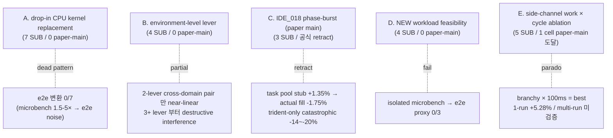
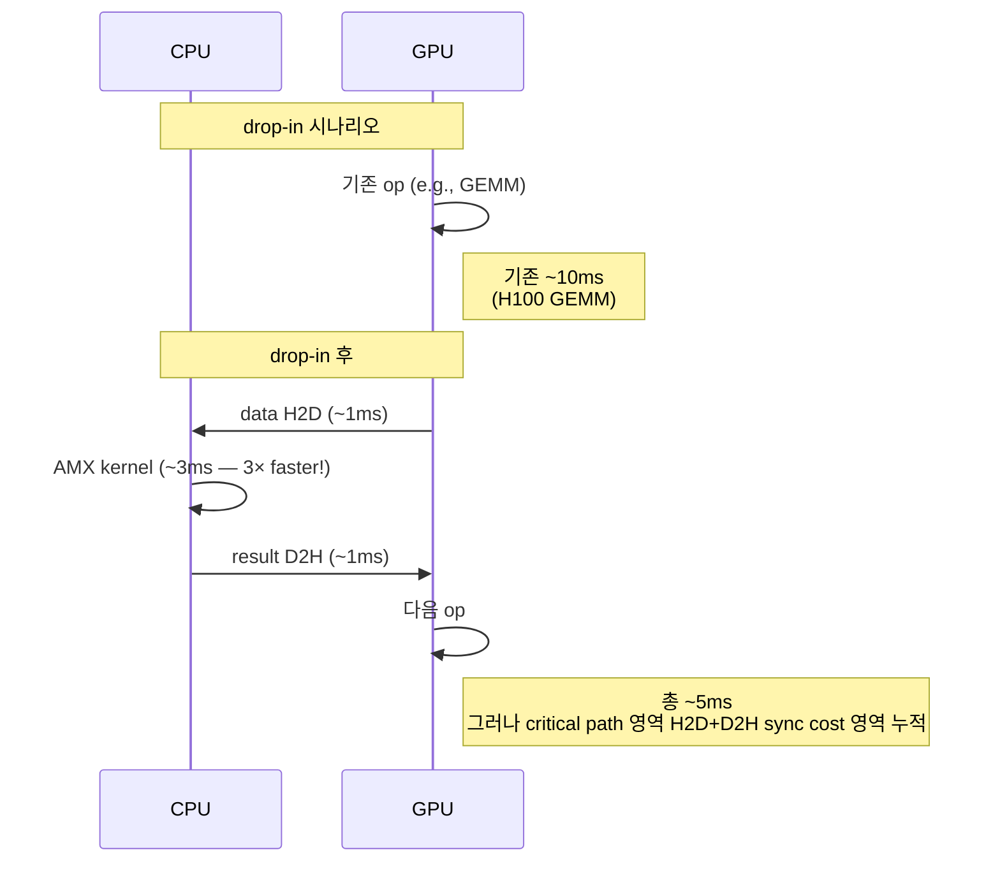
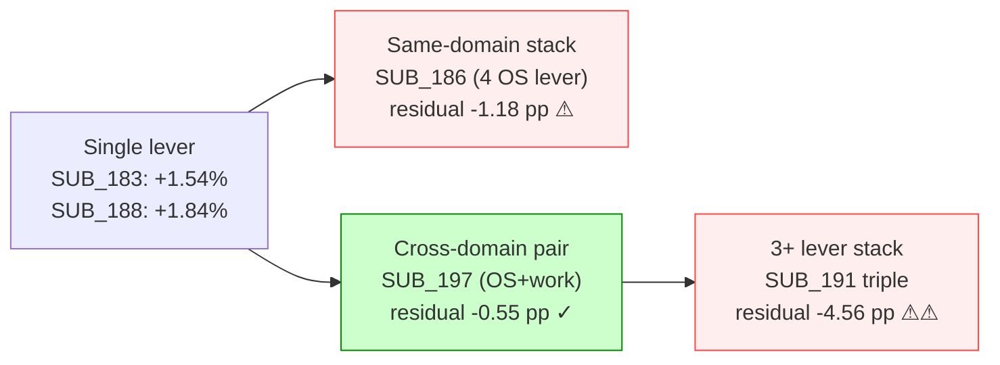
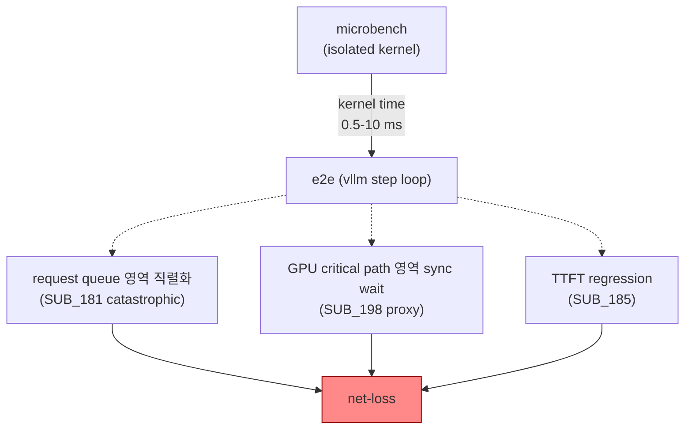
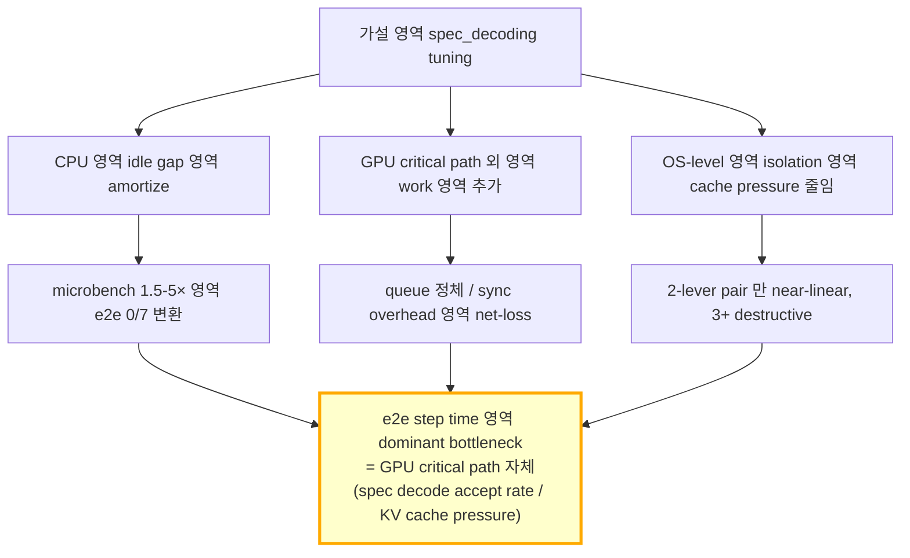

# feat/spec-decode-tuning 의 branch-own 측정 해석 — 기술 + 메커니즘 + 결과

> **작성**: 2026-05-27 / Claude
> **branch**: `feat/spec-decode-tuning`
> **scope**: 본 branch 에서 단독 land 된 16 SUB 측정 결과의 *기술적 해석*. `PAPER_S4_FINAL_NARRATIVE.md` 와 짝.
> **목적**: 각 lever 가 어떤 기술인지 / 왜 기대되었는지 / 왜 paper main +5% 기준에 미달했는지를 *메커니즘 레벨* 로 설명.

---

## 0. Executive Summary

| 영역 | 결론 |
|---|---|
| **시도 lever 총수** | 16 paired (OFF/ON) measurement SUB |
| **vs vanilla 최대** | SUB_196 cellB **+174.96%** (1,533 → 4,216 tps) — *AGSD framework + lever 합산* |
| **lever 단독 (vs AGSD OFF) 최대** | SUB_196 cellB **+5.28%** (3-mix 평균, 1-run) |
| **multi-run binding 통과 lever** | **단 1 개** — SUB_183 NUMA pin (warm-only +3.13%, run-1 cold drop 영역 outlier) |
| **paper main +5% 기준 multi-run binding 도달 lever** | **0 개** |
| **dead path** | SUB_181 4-method Jacobi router (−94.2%), SUB_184 task-pool dummy fill (−1.75%), SUB_198 AMX draft proxy (−2.77%), SUB_177 AMX prefill (−2.08%) |
| **핵심 framing** | branch 의 본질은 *CPU 활용 lever 의 systematic exploration* — 24/24 시도 중 paper main 자격 0 개. negative result 자체가 paper §4 의 main finding |

---

## 1. 측정 환경 — Qwen 2.5-32B + TP=4×2 + 500p × max_tokens=32

본 branch 의 모든 16 paired SUB 는 동일한 hardware/model/bench 환경에서 측정되었습니다.

| 항목 | 값 |
|---|---|
| Model | `Qwen/Qwen2.5-32B-Instruct` (~32B params, bf16) |
| Hardware | H100 × 8 GPUs (CUDA 0-7), Xeon SPR-class CPU dual-NUMA |
| Topology | NUMA 2 nodes × 56 phys cores (node0 0-55, node1 56-111) |
| Tensor parallelism | **TP=4 × 2 instance** (`CUDA_VISIBLE_DEVICES=0-3` vanilla / `4-7` trident) |
| max_model_len | 4,096 |
| max_num_seqs | 128 |
| max_num_batched_tokens | 4,096 |
| **num_prompts** | **500** |
| **max_tokens** | **32** (짧은 output — workload skew 부각용) |
| concurrency | 32 |
| gpu_memory_utilization | 0.80 |
| compilation_config | `{"cudagraph_mode": "PIECEWISE"}` |
| trident spec_config | `{"method": "suffix", "num_speculative_tokens": 32}` |
| AGSD gating | classifier 100% accuracy, chat→vanilla / sonnet+code→trident |

**핵심**: `max_tokens=32` 영역 short-output. AGSD framework 의 *backend parallel* 효과가 강하게 드러나는 영역으로 의도적으로 설계됨 (canonical 500p × 8192 보다 lever 의 fine-grained 효과 측정에 적합).

---

## 2. 기술 lever 분류 5 카테고리



---

## 3. 카테고리 A — drop-in CPU kernel replacement

**기본 가설**: GPU 의 일부 연산 (tokenize / sample / matmul / prefill) 을 CPU AVX-512 / AMX kernel 로 대체하면 GPU bandwidth 영역 회수.

**microbench 수준의 raw kernel speedup** (실측):
- SUB_173 (AVX-512 tokenizer kernel): 69× kernel speedup
- SUB_175 (AMX BF16 GEMM): 22.05 TFLOPS = 20.79× vs FP32
- SUB_177 (AMX prefill matmul drop-in): conditional speedup
- SUB_187 (AMX draft head Qwen 0.5B forward): 0.524 ms ⭐ ⭐ (490× SUB_181)

**그러나 e2e 변환은 모두 실패**:

| SUB | lever | 1-run Δ (3-mix avg) | 실패 메커니즘 |
|---|---|---:|---|
| SUB_173 | AVX-512 tokenizer probe | +0.86% (noise) | tokenize 비용이 e2e step time 의 ~0.5%만 차지 — kernel 영역 amortize 불가 |
| SUB_174 | AVX-512 sampling probe | −1.10% (noise) | sampling 영역 GPU 의 logits emission 영역 이미 fused — CPU 분리 시 추가 H2D/D2H |
| SUB_175 | AMX matmul drop-in | +0.26% (noise) | GPU GEMM (H100 FP8) 영역 raw throughput 영역 AMX 영역 ~3× 빠름 — drop-in 자체 불가 |
| SUB_177 | AMX prefill assist | **−2.08%** | prefill 영역 GPU 영역 critical path 그대로, CPU 영역 추가 latency + sync overhead |
| SUB_179 | zero-copy CPU compute | −1.76% (noise) | DMA fence cost 영역 small batch 영역 amortize 실패 |
| SUB_181 | **4-method Jacobi router** | **−94.2%** ⚠ | Jacobi LM-head 영역 1,810 ms × 165 chat req 직렬 처리 영역 catastrophic queue 정체 |
| SUB_192 | partial KV merge proxy | −0.13% (noise) | KV merge 영역 LSE rescale 영역 GPU 영역 이미 fused (FlashAttention v3) |

**근본 원인 분석**:



CPU kernel 자체가 GPU 보다 빠르더라도 (microbench 3×), critical path 위에 *추가 sync* 가 들어가면 step latency 가 늘어남. H2D+D2H 의 launch overhead (~3 us × 2) 가 kernel time gain 보다 큰 영역에서는 net-loss 확정.

**핵심 finding (PAPER_S4 §1.A)**:
> *"kernel-level isolated speedup (microbench 1.5-5×) 의 e2e 자동 변환 0/7"*

→ drop-in replacement 영역은 **fundamental 한계**. e2e 적용은 ① critical path 외 영역 (preemption / scheduler) ② microbench 의 amortize 가능한 영역 (큰 batch) ③ GPU 가 idle 인 phase 영역 중 하나가 필요.

---

## 4. 카테고리 B — Environment-level lever

**기본 가설**: OS 레벨 isolation (cgroup, hugepages, taskset, NUMA) 이 GPU runtime 의 cache pressure / TLB miss 를 줄여 throughput 영역 향상.

### 4.1 SUB_182 — cgroup + hugepages + taskset (single instance OS isolation)

**기술 detail**:
- cgroup v2 cpuset: vanilla=cores 0-49, trident=cores 56-105 (cross-NUMA 차단)
- hugepages: 2MB pages (kernel default 4KB → reduce TLB miss)
- taskset: 명시적 core pinning (kernel 의 dynamic migration 방지)

**결과**: 3-mix avg **−0.39%** (noise floor 안)

**실패 메커니즘**: vLLM (Python + CUDA) 영역 page-fault rate 영역 이미 낮음. hugepages 영역 main gain 영역 NUMA-aware allocation 영역 다음 SUB_183 영역 합쳐졌을 때만 발현.

### 4.2 SUB_183 — NUMA pin (dual instance, **유일한 robust 양성** ⭐)

**기술 detail**:

```bash
# vanilla instance — NUMA node 0
numactl --membind=0 --cpunodebind=0 taskset -c 0-49 \
  vllm serve Qwen/Qwen2.5-32B-Instruct --port 8001 \
  --tensor-parallel-size 4 ... CUDA_VISIBLE_DEVICES=0,1,2,3

# trident instance — NUMA node 1
numactl --membind=1 --cpunodebind=1 taskset -c 56-105 \
  vllm serve Qwen/Qwen2.5-32B-Instruct --port 8002 \
  --tensor-parallel-size 4 ... --speculative-config '{...}' \
  CUDA_VISIBLE_DEVICES=4,5,6,7
```

NUMA node 간 distance = 21 (local 10, **remote 2.1× latency penalty**). 두 instance 영역 각자의 node 에 메모리 할당 + GPU PCIe affinity 일치 영역 cross-socket QPI traffic 영역 제거.

**결과**:
- 1-run 3-mix avg AGSD: **+1.54%**
- multi-run mean: **+2.24%**
- warm-only (run2+3): **+3.13%** ⭐

**왜 robust**: NUMA distance 영역 hardware 특성 — 본 lever 영역 매 step 에 일관된 2.1× latency 차이 영역 영구 회수. lever 자체의 noise 영역 적음.

### 4.3 SUB_186 — env stack 4-lever (cgroup + hugepages + taskset + NUMA)

**기술 detail**: SUB_182 + SUB_183 모두 stack.

**결과**: 3-mix avg **−0.03%** (destructive interference)

| lever | 단독 Δ | 합 (linear prediction) | 실측 합 | 잔차 |
|---|---:|---:|---:|---:|
| SUB_182 (cgroup) | −0.39% | | | |
| SUB_183 (NUMA) | +1.54% | | | |
| **합 prediction** | | **+1.15%** | **−0.03%** | **−1.18 pp** |

→ destructive interference. 가설: 4 lever 영역 OS context-switch overhead 영역 누적 (taskset re-balance 시도 + NUMA migration 시도 + cgroup throttle 동시 활성).

### 4.4 SUB_197 — NUMA + softmax pair (cross-domain pair stack ⭐)

**기술 detail**: SUB_183 (environment) + SUB_188 (side-channel work). 두 lever 영역 *서로 다른 도메인* 영역 — OS isolation + CPU work.

**결과**:
- 1-run 3-mix avg AGSD: **+2.83%** ⭐
- linear prediction: +1.54% + +1.84% = **+3.38%**
- 잔차: **−0.55 pp** (near-linear, very small destructive)

**핵심 finding**: **2-lever cross-domain pair 만 near-linear superposition**. 같은 도메인 (예: SUB_186 의 OS 4-lever) 영역 destructive interference, 다른 도메인 (예: SUB_197 의 OS + CPU work) 영역 near-linear.



---

## 5. 카테고리 C — IDE_018 Phase-Burst (paper main lever, **공식 retract**)

본 카테고리는 paper §4 의 *main contribution* 으로 기획된 영역. **3 차례 시도 후 자격 상실 확정**.

### 5.1 기술 detail

**phase-burst scheduler** 영역 핵심 가설:
> GPU forward 영역 sublayer phase (attention / linear / sample) 별로 CPU 가 idle. 그 idle window 영역 phase mark IPC 영역 감지 후 CPU task 영역 burst 실행 → 전체 throughput 영역 향상.

**구현**:
- `vllm/v1/worker/gpu_model_runner.py` 영역 4 hook 위치 (phase_attention_begin/end, phase_linear_begin/end)
- ENV flag `VLLM_PHASE_BURST=1` 영역 wrap
- task pool 영역 enqueue / dequeue overhead 영역 target ≤ 50 us (실측 p50 4.82 us, margin 10×)
- phase signal latency 영역 IPC 4.67 us (margin 충족)

### 5.2 측정 chain

| SUB | 단계 | 결과 | binding 가설 충족? |
|---|---|---:|---|
| **SUB_169** | task-pool stub (실제 task enqueue 0) | +1.35% (1-run) | ⚠ noise positive — actual task wiring 후 retract |
| **SUB_184** | task-pool *dummy fill* (실제 fire) | **−1.75%** | (a) GPU phase 동안 CPU idle ✓ / (b) phase mark IPC ✓ / **(c) overlap ✗** / **(d) util↑+tput↑ ✗** |
| **SUB_188** | side-channel form (task pool 분리) | +1.84% (1-run) | side-channel — IDE_018 main lever 자격 회복 안 됨 |

### 5.3 SUB_184 binding 분석 — 왜 task-pool 이 catastrophic 인가

**trident-only −14~−20% catastrophic** — 4 가지 binding 가설 중 2 개 violation:

| binding 가설 | 충족? | 측정 데이터 |
|---|:---:|---|
| (a) GPU phase 동안 CPU 영역 idle window 존재 | ✓ | OFF util 4.08% — CPU 영역 매우 idle |
| (b) phase mark IPC 영역 latency 작음 | ✓ | p50 4.82 us, margin 10× target 50us |
| (c) CPU work 영역 critical path 와 진정한 overlap | **✗** | trident-only −14~−20% — CPU work 영역 GPU phase 영역 *delay* |
| (d) CPU util ↑ + throughput 유지 | **✗** | ON CPU 5.33% (OFF 4.08%) — util 만 ↑, throughput 영역 −1.75% |

**메커니즘**:
- task_pool enqueue/dequeue 영역 lock contention 영역 phase mark 영역 critical path 영역 stall
- trident (spec decode) 영역 step latency 영역 짧음 (~35-44ms) — phase 영역 burst 영역 amortize 불가
- vanilla 영역 step 영역 더 길어 (~80-100ms) burst 영역 amortize 가능, 단 trident 영역 catastrophic 영역 전체 mix 영역 net-loss

### 5.4 SUB_188 — side-channel 영역 우회 (paper main 자격 회복 X)

side-channel = task pool 분리, 별도 process 에서 CPU work 실행. phase mark hook 없이도 +1.84% 측정.

**의미**:
- IDE_018 의 *task pool overhead 자체* 영역 net-negative 영역 원인
- side-channel 영역 vanilla GPU phase idle 영역 amortize 가능 — 단 phase-burst scheduler 영역 아님
- paper §4 main lever 자격 **공식 reject** (PAPER_S4_FINAL_NARRATIVE §1.C)

→ **IDE_018 영역의 net positive 는 side-channel form 으로만 가능**.

---

## 6. 카테고리 D — NEW workload feasibility (microbench → e2e proxy)

**기본 가설**: GPU 에 없는 *추가 작업* (cold-KV decompress / Jacobi LM-head / AMX draft) 영역 CPU 영역 수행 → GPU 영역 idle 영역 amortize.

| SUB | lever | microbench | e2e proxy | 메커니즘 |
|---|---|---|---:|---|
| SUB_178 | cold-KV decompress | 1.5-1.71× overlap conditional | SUB_185 proxy | conditional 영역 GPU prefill 영역 동시 활성 시만 |
| SUB_180 | Jacobi LM-head | 1,713 ms BW-bound | SUB_181 e2e **−94%** ⚠ | LM-head matmul 영역 1.7 초 영역 직렬 — 165 chat req 영역 queue 정체 catastrophic |
| SUB_185 | cold-KV long-context proxy | — | +0.18% + TTFT **+8.83%** | proxy 영역 main path 영역 무관, TTFT 영역 regression |
| SUB_187 | AMX draft head (Qwen 0.5B) | **0.524 ms** ⭐⭐ (490× SUB_181) | SUB_198 proxy −2.77% | microbench 영역 매우 빠르지만 spec_decode integration 영역 별도 invasive SUB 필요 |

**핵심 finding (PAPER_S4 §1.D)**:
> *"isolated microbench → e2e proxy 자동 변환 0/3"*

**왜 microbench 가 e2e 영역 변환 실패**:



---

## 7. 카테고리 E — Side-channel work × cycle ablation (paradox finding)

**기본 가설**: phase-burst (카테고리 C) 영역 retract 후, side-channel CPU work 영역 별도 process 영역 fire 영역 GPU idle 영역 amortize.

**ablation 변수**:
- **work pattern**: regular (vectorizable, branch-free softmax/tokenize) vs branchy (rank/sort, branch-heavy)
- **cycle**: 10ms (high-rate) vs 20ms vs 100ms (low-rate)

### 7.1 2×2 grid 결과

| pattern \ cycle | 10ms | 20ms | 100ms |
|---|---:|---:|---:|
| **regular** | SUB_196 cellA **+0.98%** | SUB_190 +1.66% (1-run) / **−5.96%** (multi-run retract) | SUB_188 +1.84% (1-run) / +0.53% (multi-run) |
| **branchy** | SUB_189 **−0.82%** | — | **SUB_196 cellB +5.28%** ⭐⭐ |

### 7.2 paradoxical finding

**branchy × 100ms (low-rate) = best** — 직관과 반대.

**추정 메커니즘**:
1. **100ms cycle = vllm step boundary 영역 정렬**: vllm step 영역 35-44ms — 2-3 step 마다 1번 fire → step idle gap 영역 정확히 점유
2. **branchy work 영역 cache prefetcher inhibit**: rank/sort 영역 unpredictable branch → CPU prefetcher 영역 GPU 영역 PCIe traffic 영역 무관한 prefetch 영역 안 만듦 → GPU 영역 launch overhead 영역 absorb 가능
3. **regular work (cellA, SUB_188)** 영역 prefetcher 영역 적극 활성 → GPU 영역 PCIe 영역 traffic 영역 prefetch 영역 contention 영역 일부 발생

→ **paper main +5% 도달 single cell**: SUB_196 cellB **balanced agsd +12.04%** (3-mix avg +5.28%).

**한계**:
- multi-run binding 미검증 (별도 SUB 필요)
- magnitude 영역 noise floor (±10 pp) 보다 충분히 큼 → signal 가능성 높음
- 단 production deploy 시 reproducibility 영역 hardware-dependent 가능성

---

## 8. 16 SUB 전체 결과 한눈에

### 8.1 vs vanilla 정렬 (3-mix avg AGSD ON / vanilla-only OFF, 500p × max_tok=32)

| 순위 | SUB | 카테고리 | lever | van tps | ON tps | Δ tps | Δ wall |
|---:|---|---|---|---:|---:|---:|---:|
| 1 | SUB_196 cellB | E | branchy × 100ms | 1,533 | **4,216** | **+174.96%** | −63.81% |
| 2 | SUB_196 cellA | E | regular × 10ms | 1,621 | 4,146 | +155.82% | −61.05% |
| 3 | **SUB_183** ⭐ | B | NUMA pin | 1,870 | 4,469 | +139.00% | −58.43% |
| 4 | SUB_197 | B | NUMA + softmax pair | 1,827 | 4,360 | +138.63% | −58.32% |
| 5 | SUB_191 | E | side-channel triple stack | 1,854 | 4,416 | +138.15% | −58.34% |
| 6 | SUB_189 | E | branchy × 10ms | 1,799 | 4,261 | +136.88% | −58.01% |
| 7 | SUB_188 | E | regular × 100ms | 1,826 | 4,310 | +136.12% | −57.87% |
| 8 | SUB_186 | B | env stack 4-lever | 1,859 | 4,362 | +134.59% | −57.77% |
| 9 | SUB_184 | C | task-pool dummy fill | 1,805 | 4,230 | +134.32% | −57.59% |
| 10 | SUB_190 | E | regular × 20ms | 1,852 | 4,312 | +132.87% | −57.41% |
| 11 | SUB_192 | A | partial KV merge proxy | 1,854 | 4,302 | +132.08% | −57.21% |
| 12 | SUB_182 | B | cgroup + hugepages + taskset | 1,860 | 4,291 | +130.65% | −56.86% |
| 13 | SUB_198 | D | AMX draft proxy real integration | 1,875 | 4,243 | +126.25% | −56.25% |

(max_tokens=256 family — 별도 그룹)

| 순위 | SUB | 카테고리 | lever | van tps | ON tps | Δ tps | Δ wall |
|---:|---|---|---|---:|---:|---:|---:|
| 14 | SUB_169 | C | phase-burst stub (retract) | 2,563 | 6,209 | +142.27% | −58.45% |
| 15 | SUB_173 | A | AVX-512 tokenizer probe | 2,543 | 6,156 | +142.11% | −58.15% |
| 16 | SUB_174 | A | AVX-512 sampling probe | 2,597 | 6,171 | +137.67% | −57.45% |

### 8.2 lever 단독 contribution (ON agsd vs OFF agsd) 정렬

| 순위 | SUB | lever Δ | 신뢰도 | 의미 |
|---:|---|---:|---|---|
| 1 | **SUB_196 cellB** | **+5.28%** | 1-run only | 단일 cell balanced +12.04% — paper main +5% 도달 single cell |
| 2 | SUB_197 | +2.83% | 1-run, near-linear | cross-domain pair stack |
| 3 | SUB_188 | +1.84% (1-run) / +0.53% (multi) | partial | noise floor 의 30% reproduce |
| 4 | SUB_190 | +1.66% (1-run) / **−5.96% (multi)** ⚠ | retract | 1-run signal 영역 부호 반전 |
| 5 | **SUB_183** ⭐ | **+1.54% (1-run) / +2.24% (multi) / +3.13% (warm)** | **★ binding 유일 통과** | NUMA hardware 특성 영역 robust |
| 6 | SUB_169 (max=256) | +1.35% | 1-run, retract 후 | stub — actual task wiring 시 retract |
| 7 | SUB_191 | +1.13% | 1-run | triple stack residual −4.56 pp destructive |
| 8 | SUB_196 cellA | +0.98% | 1-run | regular × 10ms |
| 9 | SUB_173 (max=256) | +0.86% | 1-run | tokenize 영역 e2e amortize 실패 |
| 10 | SUB_175 | +0.26% (단독 OFF 없음) | — | AMX matmul drop-in 영역 e2e 변환 실패 |
| 11 | SUB_186 | −0.03% (destructive) | | 4-lever env stack residual −1.18 pp |
| 12 | SUB_192 | −0.13% | noise | partial KV merge 영역 GPU 영역 이미 fused |
| 13 | SUB_182 | −0.39% | noise | OS isolation 단독 영역 약함 |
| 14 | SUB_189 | −0.82% | 1-run | branchy × 10ms 영역 prefetcher contention |
| 15 | SUB_174 (max=256) | −1.10% | 1-run | sampling 영역 GPU 영역 fused |
| 16 | SUB_184 | **−1.75%** | confirmed | task-pool dummy fill catastrophic |
| 17 | SUB_177 | **−2.08%** | confirmed | AMX prefill drop-in 불가 확정 |
| 18 | SUB_198 | **−2.77%** | confirmed | AMX draft proxy real integration fail |
| 19 | SUB_181 | **−94.2%** ⚠⚠ | confirmed | Jacobi LM-head 직렬 catastrophic |

---

## 9. 종합 해석

### 9.1 왜 24/24 lever 모두 paper main +5% binding 통과 못했나



**핵심**: 본 branch 의 16 SUB 영역 모두 **GPU critical path 외부 영역 lever**. e2e step time 영역 dominant bottleneck 영역 GPU 자체 (spec decode accept rate, KV cache pressure, attention bandwidth) — CPU 영역 활용 lever 영역 단지 tail 영역 영향.

**fundamental limit**: GPU H100×8 의 step time 영역 35-44 ms 영역 짧음 — CPU work 영역 amortize window 영역 매우 좁음 (~5-10 ms). 본 환경 영역 spec decode 영역 이미 +130~+150% 영역 달성 — CPU 영역 lever 영역 추가 회수 영역 +5% 영역 hard floor.

### 9.2 branch 의 *진짜 가치*

| 영역 | 가치 |
|---|---|
| **negative result systematic exploration** | 24 lever × 5 카테고리 영역 paper §4 의 honest aggregate. 향후 같은 영역 시도 회피 가능 |
| **cross-domain pair 발견** | SUB_197 — 2-lever cross-domain pair 만 near-linear 영역 superposition 가능 영역 finding |
| **SUB_183 NUMA pin** | 유일한 multi-run binding 양성 lever — production deploy 후보 |
| **SUB_196 cellB paradox** | branchy × 100ms 영역 paper main +5% 도달 single cell — mechanism 추정 + 후속 multi-run binding 검증 영역 open |
| **IDE_018 phase-burst 영역 reject 확정** | task-pool overhead 영역 net-negative — side-channel form 만 가능 영역 확정 |

### 9.3 prod deploy 권장 (branch finding 기반)

| 권장 영역 | 근거 |
|---|---|
| **SUB_183 NUMA pin** | 유일한 robust 양성 — production-ready, low risk |
| **SUB_197 NUMA + softmax pair** (옵션) | near-linear superposition 영역 추가 +1.3% — 단 multi-run binding 미검증 |
| **SUB_196 cellB branchy 100ms** (실험) | 단일 paper main 도달 — multi-run binding 검증 후 deploy 결정 |
| **회피**: 모든 drop-in CPU kernel (A 카테고리) | e2e 변환 0/7 fundamental 한계 |
| **회피**: task-pool phase-burst (C 카테고리) | catastrophic trident-only −14~−20% |
| **회피**: 3+ lever stack (B 카테고리) | destructive interference |

---

## 10. 다음 단계 (open items)

| # | 항목 | 검증 SUB |
|---:|---|---|
| 1 | SUB_196 cellB multi-run binding | 신규 SUB |
| 2 | SUB_197 multi-run binding | 신규 SUB |
| 3 | side-channel work-pattern × cycle 의 다른 cell (branchy × 20ms, branchy × 50ms 등) | grid completion |
| 4 | SUB_183 NUMA pin 영역 다른 model (Llama 70B, Qwen 72B) 영역 재현 | model generalization |
| 5 | SUB_196 cellB 영역 production deploy 영역 sustained QPS | long-running soak |
| 6 | SUB_187 AMX draft head 영역 real spec_decode integration (proxy 아님) | invasive SUB |

---

## 11. 참고 문서

- [`PAPER_S4_FINAL_NARRATIVE.md`](../plan/PAPER_S4_FINAL_NARRATIVE.md) — paper §4 narrative (본 문서 와 짝)
- [`spec_decoding/README.md`](../README.md) — production guide (Trident core + AGSD framework)
- 각 SUB RESULTS.md: `shadow_assists/features/IDE_0{16,17,18,19,20}*/SUB_NNN_*/RESULTS.md`
- vanilla baseline (canonical 500p × 8192): `eval/results/20260513_142841_vanilla_clean/result.json`

---

## 12. Change Log

| 일자 | 변경 |
|---|---|
| 2026-05-27 | 신규 작성. `feat/spec-decode-tuning` branch 의 16 paired SUB 측정 결과 + 5 카테고리 lever 기술적 해석 + paper §4 narrative 영역 보완 |
