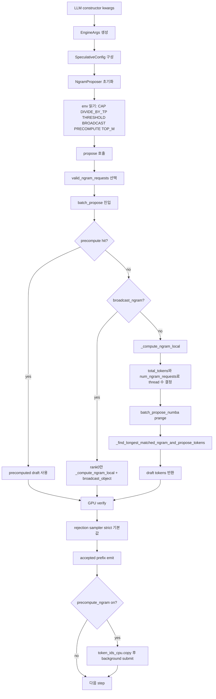

# mystous/vllm_hybrid의 TSK_020 CPU 병렬성과 Coding Workload 최적화 분석

## 실행 요약

본 보고서는 먼저 GitHub 커넥터 **GitHub**를 사용해 `mystous/vllm_hybrid`의 `feat/spec-decode-tuning` 브랜치를 조사했고, 그 다음 보강이 필요한 부분에 한해 저장소 외 1차 자료로 2026년 논문과 공식 Numba 문서를 제한적으로 참조했다. 저장소 증거를 기준으로 보면, **CPU 스레드 튜닝이 직접 들어간 TSK_020의 역사적 베스트는 `SUB_047`의 ngram 설정**이며, 값은 `spec=7`, `prompt_lookup_min=2`, `prompt_lookup_max=5`, `VLLM_NGRAM_NUM_THREADS_CAP=8`, `VLLM_NGRAM_DIVIDE_BY_TP=0`, `TP=8`, `gmu=0.85`이다. 이 설정은 sonnet 워크로드에서 canonical 3-run 평균 **10,956.5 tps**를 냈고, `SUB_044`의 built-in ngram 대비 추가 기여는 약 **+1.65%p**였다. 다만 브랜치 전체의 **현재 overall best**는 이후 `suffix + PIECEWISE cudagraph + gmu=0.80`로 교체되었고, 특히 code workload에서는 ngram의 음수 효과를 없애고 순증으로 바꿨다. 따라서 “CPU thread best”와 “현재 overall best”는 분리해서 봐야 한다. fileciteturn181file0L1-L3 fileciteturn186file0L1-L3 fileciteturn188file0L1-L3

핵심 결론은 다섯 가지다. 첫째, `SUB_047`의 실질적 코드 변경은 `vllm/v1/spec_decode/ngram_proposer.py`에 들어간 **환경변수 기반 Numba thread cap 패치**이고, 이 패치가 `cap=1` 사실상 단일 스레드 상태를 `cap=8`, `divide_by_tp=0`으로 바꾸어 sonnet의 ngram lookup 병목을 약간 완화했다. 둘째, code workload 회귀의 본질은 **CPU thread 수 부족이 아니라 acceptance 붕괴**다. 저장소 분석 문서는 code에서 per-draft `K≈1.10`, per-position acceptance `α≈1.4%`, throughput `-23.2%`를 보고하며, 이 경우 CPU에서 `_find_longest_matched_ngram_and_propose_tokens`가 매 스텝 전체 prefix를 훑어도 GPU 검증 비용과 rejection cost를 상쇄할 만큼 토큰을 받아내지 못한다. 셋째, `SUB_066` broadcast와 `SUB_067` precompute가 실패한 이유는 코드 그대로다. broadcast는 `broadcast_object`로 **Python object/NumPy payload**를 전송하고, precompute는 실제로 `token_ids_cpu.copy()`를 수행해 **전체 2D 배열 복사**를 만든다. 넷째, `SUB_065`의 threshold 하향이 효과가 없었던 이유는 문서의 초기 가설과 달리, 실제 구현이 `np.sum(num_tokens_no_spec)` 즉 **전체 컨텍스트 길이 합**을 기준으로 스레드 모드를 고르기 때문일 가능성이 높다. 긴 8192-token 프롬프트 배치에서는 이 값이 이미 임계값 8192를 훨씬 넘기므로 threshold가 사실상 비결정 변수였을 개연성이 크다. 다섯째, code workload를 정말 살리려면 ngram path 내부의 미세 튜닝보다 **workload-aware gating** 또는 **suffix path로의 전환**이 더 효과적이다. 저장소의 후속 best 문서도 같은 방향을 뒷받침한다. fileciteturn175file0L1-L3 fileciteturn176file0L1-L3 fileciteturn178file0L1-L3 fileciteturn153file0L1-L3 fileciteturn154file0L1-L3 fileciteturn189file0L1-L3 fileciteturn188file0L1-L3

외부 2026 문헌을 저장소 개선안에 연결하면, 바로 쓸 수 있는 방향도 명확하다. `Compiler-Assisted Speculative Sampling`은 speculative path가 이득인 구간을 **비용 모델로 판정**해야 한다고 말하고, `Rethinking Thread Scheduling under Oversubscription`은 oversubscription 시 런타임 간 간섭이 급격히 나빠질 수 있음을 보여준다. `Vec-QMDP`는 **data-oriented contiguous layout + 계층적 병렬화 + load balancing**이 irregular CPU workload에서 강력하다는 점을 보여주고, `Vectorizing the Trie`는 pointer-heavy 탐색을 **정적 sparse/vectorized 구조**로 바꿨을 때 극단적인 가속이 가능하다는 점을 보여준다. 이 네 편은 각각 이 저장소에 대해 **workload gating**, **NUMBA_NUM_THREADS/oversubscription 관리**, **길이 버킷/parallel_chunksize 기반 load balancing**, **suffix automaton/CSR형 matcher로의 장기 재구현**으로 연결된다. citeturn10view0turn11view0turn20view0turn10view1

## 조사 범위와 핵심 판단

이 요청을 정확히 답하기 위해 확인해야 했던 핵심 정보는 다음 다섯 가지였다.

- CPU thread 수와 관련된 **직접 설정점**이 어디인지  
- TSK_020의 “best”가 정확히 무엇인지, 그리고 **historical ngram best**와 **current overall best**가 어떻게 다른지  
- code workload 회귀가 **threading 문제인지 acceptance 문제인지**  
- 브랜치 안에서 broadcast·precompute·threshold 같은 **실패한 대안들이 왜 실패했는지**  
- 저장소 밖 2026 문헌 중 어떤 방법이 이 repo의 CPU path에 **실제로 이식 가능한지**  

이 브랜치에서 CPU-threading 관점의 중심은 일관되게 `SUB_044 → SUB_047 → SUB_065/066/067 → SUB_071`의 흐름이다. `SUB_044`가 built-in ngram speculative decoding을 켜서 첫 net-positive를 만들었고, `SUB_047`이 여기에 **ngram Numba thread cap 패치**를 추가해 historical best를 확정했다. 이어 `SUB_065/066/067`은 각각 threshold, rank0 broadcast, background precompute로 CPU 병렬성을 더 밀어보려 했지만 저장소 문서상 모두 기각되었고, `SUB_071`이 이를 sonnet/chat/code로 일반화 검증하면서 code 회귀를 확정했다. fileciteturn180file0L1-L3 fileciteturn181file0L1-L3 fileciteturn179file0L1-L3 fileciteturn178file0L1-L3

중요한 구분도 있다. **TSK_020 전체 current best**는 더 이상 ngram이 아니다. `Best_SpecDecode_10778tps.md`의 2026-05-25 갱신본은 suffix 기반 “Trident core”가 sonnet/chat/code 모두에서 fair positive를 내며 ngram을 대체했다고 명시한다. 하지만 이 suffix 경로는 CPU thread cap 튜닝이 아니라 speculative method 자체를 바꾼 결과다. 따라서 **“CPU 병렬성 개선을 분석하라”**는 질문에는 `SUB_047` ngram path가, **“현재 branch에서 code workload에 제일 좋은 실전 설정은 무엇이냐”**는 질문에는 suffix path가 답이 된다. fileciteturn188file0L1-L3

또 하나의 한계는 자료 형태다. `de85efff...` 커밋에서 `eval/results/**/engine.log.stdout|stderr`, profiler traces, flamegraph SVG, `perf.data`가 GitHub 100MB 제한 때문에 `.gitignore`로 제외되었다. 그래서 이 보고서의 hotspot 분석은 **커밋된 결과 요약, 설계 문서, 코드 경로**를 근거로 한 것이며, raw engine log/trace 기반의 per-step flame breakdown은 저장소 안 증거만으로는 완전히 재구성할 수 없다. `SUB_071` 문서도 raw launcher log와 wrapper가 `/tmp`에 있다고 적지만, 그 스크립트들은 저장소에 체크인돼 있지 않다. fileciteturn191file0L1-L3 fileciteturn178file0L1-L3

## 저장소 증거 지도와 파일별 해설

아래 표는 CPU-threading 및 TSK_020 best와 직접 연결되는 **핵심 파일/문서/커밋**만 추려 정리한 것이다. 모두 `feat/spec-decode-tuning` 기준이다. fileciteturn186file0L1-L3

| 경로 | 역할 | 핵심 포인트 |
|---|---|---|
| `vllm/v1/spec_decode/ngram_proposer.py` | CPU-side ngram draft 생성 핵심 구현 | thread cap, TP divide, threshold, broadcast, precompute, top-M 모두 여기서 읽고 실행한다. fileciteturn151file0L1-L3 fileciteturn153file0L1-L3 |
| `vllm/config/speculative.py` | speculative decoding 설정 모델 | `method`, `num_speculative_tokens`, `prompt_lookup_min/max`, `rejection_sample_method` 기본값이 여기 있다. fileciteturn158file0L1-L3 fileciteturn159file0L1-L3 |
| `vllm/entrypoints/llm.py` | 사용자 생성자에서 `EngineArgs`로 전달 | constructor kwargs가 엔진 설정으로 넘어간다. repo-backed “CLI equivalent”가 사실상 여기의 Python kwargs다. fileciteturn160file0L1-L3 fileciteturn161file0L1-L3 |
| `vllm/config/scheduler.py` | batch/seq 제한 | `max_num_seqs=256`, `max_num_batched_tokens=8192`의 기본/의미가 정의된다. ngram prealloc size와 batch shape에 영향을 준다. fileciteturn163file0L1-L3 |
| `vllm/config/cache.py` | KV cache dtype / GPU memory 사용률 | `gpu_memory_utilization`, `cache_dtype`, prefix caching 등 best config의 메모리 headroom 조건이 여기에 걸린다. fileciteturn162file0L1-L3 |
| `vllm/sampling_params.py` | 샘플링 파라미터 기본값 | best config 문서의 `temperature=0`, `top_p=1.0`, `max_tokens=8192`를 해석할 기준이다. fileciteturn164file0L1-L3 |
| `shadow_assists/features/IDE_006/TSK_020.md` | TSK_020 상위 허브 | CPU-threading best의 역사, cap sweep, commit history가 가장 응축돼 있다. fileciteturn186file0L1-L3 |
| `shadow_assists/features/IDE_006/TSK_020/README.md` | TSK_020 best index | current best/historical best, 실패 lever 요약, raw 자료 위치가 있다. fileciteturn179file0L1-L3 |
| `shadow_assists/features/IDE_006/TSK_020/Best_SpecDecode_10778tps.md` | historical best 상세 문서이자 이후 overall best 갱신 문서 | ngram best와 suffix current best를 함께 정리한다. fileciteturn188file0L1-L3 |
| `shadow_assists/.../measurements/sub044_spec_decode_20260523/RESULTS.md` | built-in ngram baseline | `num_spec=7` sweet spot, `num_spec=10` OOM을 확정한다. fileciteturn180file0L1-L3 |
| `shadow_assists/.../measurements/sub047_t3_3run_verify_20260523/RESULTS.md` | canonical best 측정 | historical ngram CPU-thread best의 authoritative record다. fileciteturn181file0L1-L3 |
| `shadow_assists/.../measurements/sub071_workload_large_20260524/RESULTS.md` | sonnet/chat/code 일반화 검증 | code 회귀의 직접 증거다. fileciteturn178file0L1-L3 |
| `shadow_assists/.../analysis/workload_acceptance_analysis_20260524.md` | acceptance/coverage 메커니즘 분석 | code 회귀가 acceptance collapse라는 결론의 핵심 근거다. fileciteturn176file0L1-L3 fileciteturn177file0L1-L3 |
| `shadow_assists/.../planning/SUB_065_ngram_threshold_lower.md` | threshold 가설 | threshold 문제의 원래 가설과 null result를 연결한다. fileciteturn182file0L1-L3 |
| `shadow_assists/.../planning/SUB_066_ngram_broadcast.md` | duplicate work 제거 가설 | rank0 broadcast의 intended design과 risks가 정리되어 있다. fileciteturn183file0L1-L3 |
| `shadow_assists/.../planning/SUB_067_speculative_ngram_precompute.md` | overlap 가설 | background precompute의 설계 의도와 risk를 보여준다. fileciteturn184file0L1-L3 |
| `shadow_assists/.../planning/SUB_070_engine_config_sweep.md` | ngram 밖의 진짜 bottleneck 재정의 | “ngram lookup은 1–2%”라는 문제 재정의가 담겨 있다. fileciteturn185file0L1-L3 |

커밋도 분리해 보는 것이 좋다. `c93b88f11...`은 `SUB_044`를 묶어 **built-in ngram speculative decoding이 첫 net-positive**였음을 정리한 커밋이고, `a243e1c9...`는 **실제 코드 패치**인 `VLLM_NGRAM_NUM_THREADS_CAP` 및 `VLLM_NGRAM_DIVIDE_BY_TP` 도입 커밋이다. `de85efff...`는 결과 산출물을 넣되 대형 `engine.log`/trace를 제외한 커밋이어서, 왜 저장소 안에서 요약 문서 위주 분석이 되는지도 설명해 준다. TSK 문서는 추가로 `a3a930ec9`, `202f78082`, `d11f9cf02`를 후속 문서화/베스트 갱신 관련 커밋으로 기록하지만, 이번 조사에서는 이 셋을 개별 fetch하지는 못했다. fileciteturn190file0L1-L3 fileciteturn175file0L1-L3 fileciteturn191file0L1-L3 fileciteturn186file0L1-L3

## TSK_020 CPU-threading 베스트 설정

CPU-threading 관점에서 authoritative한 “best configuration”은 `SUB_047 t3`다. 저장소 문서가 동일하게 재현하는 값은 다음과 같다. `model="meta-llama/Llama-3.3-70B-Instruct"`, `tensor_parallel_size=8`, `max_model_len=16384`, `max_num_seqs=256`, `gpu_memory_utilization=0.85`, `enforce_eager=False`, `kv_cache_dtype="fp8"`, `max_num_batched_tokens=8192`, `disable_log_stats=True`, `seed=0`, speculative config는 `{"method":"ngram","num_speculative_tokens":7,"prompt_lookup_max":5,"prompt_lookup_min":2}`, 샘플링은 `temperature=0.0`, `top_p=1.0`, `max_tokens=8192`, `seed=0`, 환경변수는 `HF_HUB_OFFLINE=1`, `LD_PRELOAD=/usr/lib64/libcuda.so.1`, `VLLM_NGRAM_NUM_THREADS_CAP=8`, `VLLM_NGRAM_DIVIDE_BY_TP=0`이다. 이 조합으로 canonical 3-run 평균 10,956.5 tps가 기록됐다. fileciteturn181file0L1-L3

아래는 저장소 문서가 직접 제시한 historical best constructor다.

```python
LLM(
    model="meta-llama/Llama-3.3-70B-Instruct",
    tensor_parallel_size=8,
    max_model_len=16384,
    max_num_seqs=256,
    gpu_memory_utilization=0.85,
    enforce_eager=False,
    kv_cache_dtype="fp8",
    max_num_batched_tokens=8192,
    disable_log_stats=True,
    seed=0,
    speculative_config={
        "method": "ngram",
        "num_speculative_tokens": 7,
        "prompt_lookup_max": 5,
        "prompt_lookup_min": 2,
    },
)
```

이 constructor는 `SUB_047` 결과 문서의 canonical config다. 샘플링은 별도로 `SamplingParams(temperature=0.0, top_p=1.0, max_tokens=8192, seed=0)`로 적혀 있다. fileciteturn181file0L1-L3

다음 표는 **직접 설정값**, **기본값**, **실제 사용처**, **의미**를 한 번에 묶은 consolidated parameter table이다. 직접 코드/문서에서 확인된 것만 포함했고, 버전이나 런타임 조건이 문서에 없으면 **no specific constraint**로 적었다. 아래 표 전체는 저장소 코드와 공식 Numba 문서를 함께 기초로 정리했다. fileciteturn151file0L1-L3 fileciteturn153file0L1-L3 fileciteturn158file0L1-L3 fileciteturn159file0L1-L3 fileciteturn161file0L1-L3 fileciteturn163file0L1-L3 fileciteturn164file0L1-L3 citeturn18view0

| 항목 | historical best 값 | 기본값/미지정 시 | 위치 | 의미와 영향 |
|---|---:|---:|---|---|
| `method` | `ngram` | 없음 | `speculative.py`, best docs | pure prompt-based draft 생성. CPU path의 중심. |
| `num_speculative_tokens` | `7` | required 또는 draft config 상속 | `speculative.py`, `SUB_044/047` | speculative verify 길이. `10`은 OOM. `7`이 sweet spot. |
| `prompt_lookup_max` | `5` | ngram에서 min/max 둘 다 없으면 둘 다 5 | `speculative.py` | 최대 n-gram 길이. matcher의 탐색 범위. |
| `prompt_lookup_min` | `2` | ngram에서 둘 다 없으면 둘 다 5 | `speculative.py` | 최소 n-gram 길이. 너무 낮으면 hit↑/잡음↑, 너무 높으면 hit↓. |
| `rejection_sample_method` | best config에서 미오버라이드 | `strict` | `speculative.py` | ngram best는 기본 strict rejection을 쓴다. acceptance 낮은 code에서는 reject path가 자주 돈다. |
| `temperature` | `0.0` | `1.0` | `sampling_params.py`, best docs | greedy에 가까워 prompt overlap 영향을 더 직접적으로 반영. |
| `top_p` | `1.0` | `1.0` | `sampling_params.py`, best docs | nucleus pruning 없음. |
| `max_tokens` | `8192` | `16` | `sampling_params.py`, best docs | code workload에서 거의 끝까지 생성돼 spec overhead 누적이 커진다. |
| `tensor_parallel_size` | `8` | `1` | `llm.py`, best docs | TP=8. `divide_by_tp`와 직접 연결. |
| `max_num_seqs` | `256` | `128` | `scheduler.py`, best docs | proposer buffer shape와 batch 병렬도 상한. |
| `max_num_batched_tokens` | `8192` | `2048` | `scheduler.py`, best docs | scheduler issued batch 토큰 budget. |
| `gpu_memory_utilization` | `0.85` | `0.9` | `cache.py`, best docs | historical ngram best의 memory headroom. |
| `kv_cache_dtype` | `fp8` | `auto` | `cache.py`, best docs | KV footprint 축소. |
| `enforce_eager` | `False` | `False` | `llm.py`, best docs | CUDA graphs 유지. |
| `VLLM_NGRAM_NUM_THREADS_CAP` | `8` | `1` | `ngram_proposer.py` | rank당 Numba 사용 가능 스레드 상한. patch의 핵심. |
| `VLLM_NGRAM_DIVIDE_BY_TP` | `0` | `1` | `ngram_proposer.py` | `1`이면 TP size로 다시 나눔. `0`이면 rank당 8스레드 유지. |
| `VLLM_NGRAM_THRESHOLD` | best에서 미오버라이드 | `8192` | `ngram_proposer.py` | `sum(num_tokens_no_spec)` 기준으로 MT/1-thread 선택. large prompt batch에선 비활성 변수일 가능성이 큼. |
| `VLLM_NGRAM_BROADCAST` | `0` | `0` | `ngram_proposer.py` | rank0-only compute + `broadcast_object`. 실측상 회귀. |
| `VLLM_NGRAM_PRECOMPUTE` | `0` | `0` | `ngram_proposer.py` | background precompute. 전체 token matrix copy 때문에 회귀. |
| `VLLM_NGRAM_TOP_M` | `1` | `1` | `ngram_proposer.py` | top-M kernel path. 현재 chain 0만 사용, rejection tree verify 미완성. |
| `HF_HUB_OFFLINE` | `1` | no specific constraint | best docs | offline model loading 전제. |
| `LD_PRELOAD` | `/usr/lib64/libcuda.so.1` | no specific constraint | best docs | 런타임 환경 보정값. |
| `NUMBA_NUM_THREADS` | best docs에 명시 없음 | CPU core 기반 | 공식 Numba docs | `set_num_threads()`가 넘을 수 없는 **최대 launched threads**. 실운영 상한. |
| `NUMBA_THREADING_LAYER` | 명시 없음 | auto | 공식 Numba docs | threading backend 선택. Linux `omp`는 fork-safe 이슈 주의. |
| Python | no specific constraint | no specific constraint | sampled TSK_020 files엔 미핀 | exact pin 없음. 같은 브랜치 다른 artifact에는 3.12.13 흔적이 있으나 TSK_020 requirement로는 미고정. |
| NumPy | no specific constraint | no specific constraint | sampled TSK_020 files엔 미핀 | `np.ndarray`, `np.zeros`, slicing semantics 필요. |
| Numba | no specific constraint | no specific constraint | sampled TSK_020 files엔 미핀 | `@njit(parallel=True)`, `prange`, `set_num_threads`, `get_num_threads` 필요. |

여기서 가장 load-bearing한 코드는 아래와 같다.

```python
cap = int(os.environ.get("VLLM_NGRAM_NUM_THREADS_CAP", "1"))
divide_by_tp = int(os.environ.get("VLLM_NGRAM_DIVIDE_BY_TP", "1"))
if cpu_count:
    self.num_numba_thread_available = max(1, min(cap, (cpu_count // 2)))
    if divide_by_tp:
        self.num_numba_thread_available //= tp_size
    self.num_numba_thread_available = max(1, self.num_numba_thread_available)
else:
    self.num_numba_thread_available = 1
```

이 8줄이 `SUB_047`의 실질적 변화다. vLLM 기본 상태는 사실상 `1 thread/rank`에 가깝고, 이 패치로 `cap=8`, `divide_by_tp=0`이면 rank당 8스레드를 열 수 있게 된다. commit message도 이 change가 `+1.6% over SUB_044`였다고 적고 있다. fileciteturn175file0L1-L3 fileciteturn186file0L1-L3

## 런타임 코드 흐름과 매개변수 사용처

사용자 관점의 시작점은 `vllm/entrypoints/llm.py`다. `LLM(...)` constructor는 Python kwargs를 `EngineArgs(...)`로 모으고, 이것이 speculative/scheduler/cache config 생성으로 이어진다. 이 단계에서 `tensor_parallel_size`, `gpu_memory_utilization`, `kv_cache_memory_bytes`, `compilation_config`, 기타 kwargs가 엔진 구성으로 넘어간다. 이번 조사에서는 `NgramProposer`를 실제로 instantiation하는 중간 파일을 추가 fetch하지 못했지만, 최소한 **constructor → EngineArgs → SpeculativeConfig** 경로까지는 저장소에서 직접 확인된다. fileciteturn160file0L1-L3 fileciteturn161file0L1-L3 fileciteturn158file0L1-L3

ngram CPU path 내부의 가장 중요한 runtime gate는 `_compute_ngram_local()`이다.

```python
original_num_numba_threads = get_num_threads()
total_tokens = np.sum(num_tokens_no_spec)
if total_tokens >= self.num_tokens_threshold:
    final_num_threads = max(
        1, min(self.num_numba_thread_available, num_ngram_requests)
    )
    set_num_threads(final_num_threads)
else:
    set_num_threads(1)
...
batch_propose_numba(...)
set_num_threads(original_num_numba_threads)
```

여기서 실제 thread 수는 세 겹으로 제한된다. 첫째, `self.num_numba_thread_available`은 `cap`, `cpu_count // 2`, `divide_by_tp`, `tp_size`의 함수다. 둘째, `num_ngram_requests`보다 클 수 없다. 셋째, 공식 Numba 문서상 `set_num_threads(n)`은 `NUMBA_NUM_THREADS`보다 클 수 없으며, 런타임은 실제로 **launched threads를 mask**하는 방식으로 동작한다. 따라서 운영환경에서 `NUMBA_NUM_THREADS`를 낮게 잡아 두면 repo의 `cap=8`도 그대로 나오지 않는다. fileciteturn153file0L1-L3 citeturn18view0

draft 계산 본체는 `batch_propose_numba()`이며, `prange(len(valid_ngram_requests))`로 request-level 병렬화를 건다. 각 request는 `context_token_ids = token_ids_cpu[idx, :num_tokens]`를 잘라 `_find_longest_matched_ngram_and_propose_tokens()`에 넘긴다. 이 함수는 `origin_tokens[::-1]`로 뒤집은 뒤 LPS 배열을 사용해 **KMP 스타일로 가장 긴 suffix match**를 찾고, match 뒤 이어지는 최대 `k`개 토큰을 draft로 반환한다. 즉, code workload에서 prefix가 길고 overlap이 적으면 CPU는 **긴 배열을 매번 훑되 짧은 draft만 돌려주는** 형태가 된다. fileciteturn155file0L1-L3 fileciteturn156file0L1-L3

```python
for i in prange(len(valid_ngram_requests)):
    idx = valid_ngram_requests[i]
    num_tokens = num_tokens_no_spec[idx]
    context_token_ids = token_ids_cpu[idx, :num_tokens]
    drafter_output = _find_longest_matched_ngram_and_propose_tokens(
        origin_tokens=context_token_ids,
        min_ngram=min_n,
        max_ngram=max_n,
        max_model_len=max_model_len,
        k=k,
    )
```

이 병렬화 형태는 **request 간 work imbalance**에 취약하다. 공식 Numba 문서도 `prange`의 nested parallelism은 실제로 중첩 병렬이 되지 않고 바깥 루프만 병렬화되며, 잘못된 container mutation은 threadsafe하지 않다고 명시한다. 즉 이 코드 경로에서 개선 여지는 “더 깊은 중첩 `prange`”가 아니라, **요청 길이별 버킷팅**, **parallel chunk size 조정**, **vectorized contiguous layout** 쪽에 더 가깝다. Numba는 `parallel_chunksize()`와 `NUMBA_PARALLEL_DIAGNOSTICS`/`parallel_diagnostics(level=4)`도 제공한다. fileciteturn155file0L1-L3 citeturn17view2turn16view2turn18view1

실행 흐름을 그림으로 요약하면 아래와 같다. 이 흐름은 `llm.py`, `speculative.py`, `ngram_proposer.py`, TSK_020 best 문서를 합쳐 정리한 것이다. fileciteturn161file0L1-L3 fileciteturn159file0L1-L3 fileciteturn153file0L1-L3 fileciteturn154file0L1-L3 fileciteturn181file0L1-L3



## Coding Workload 회귀의 원인과 CPU 핫스폿

저장소가 커밋해 둔 가장 직접적인 code 회귀 증거는 `SUB_071`이다. 동일한 대형 설정에서 chat은 `+37.5%`, code는 **`-23.2%`**였다. raw result도 code vanilla `6964.47 tps`, code spec7+cap8 `5346.84 tps`를 보여 준다. 즉 ngram thread cap 패치가 sonnet에는 플러스였지만 code에는 플러스를 만들지 못했다. fileciteturn178file0L1-L3 fileciteturn171file0L1-L3 fileciteturn172file0L1-L3

`workload_acceptance_analysis_20260524.md`는 이 회귀를 **acceptance collapse**로 해석한다. all-fair historical comparison에서 code의 ngram path는 `K≈1.09`, `α≈1.2%` 수준이었고, historical wrapper comparison에서도 code는 per-draft `K≈1.10`, per-position acceptance `α≈1.4%`였다. 문서는 code prompt가 “의미 없는 comment word salad”인 반면 generated output은 실제 알고리즘 코드라서 **prompt와 generated 사이 어휘 overlap이 거의 0**이라고 설명한다. 이 설명은 ngram matcher의 구조와 정확히 맞물린다. `_find_longest...`는 과거 prefix에서 suffix match를 찾는 방식이므로, prompt↔generated overlap이 작으면 CPU는 긴 prefix scan만 수행하고 대부분 빈 draft 혹은 길이 1 부근의 draft만 돌려준다. fileciteturn176file0L1-L3 fileciteturn177file0L1-L3 fileciteturn155file0L1-L3 fileciteturn156file0L1-L3

따라서 CPU-side hotspot을 code workload 기준으로 정리하면 다음 순서가 된다. 가장 먼저 **`_find_longest_matched_ngram_and_propose_tokens`**가 request당 전체 `origin_tokens`를 뒤집고 선형 스캔하는 구간이고, 그 바깥의 **`batch_propose_numba`**가 이를 `prange`로 돌린다. 저장소 문서가 말하는 `batch_propose_numba`, `_compute_ngram_local`, `_find_longest...` hotspot 지목은 코드 구조와 부합한다. 반면 rejection sampler는 이번 조사에서 전용 구현 파일을 직접 잡아내지는 못했지만, `speculative.py`의 default가 `strict`이고 best config가 이를 override하지 않으므로, code workload처럼 acceptance가 매우 낮을 때는 이 downstream strict verify/reject 경로가 자주 일어났다고 보는 것이 타당하다. 다만 **rejection sampler의 branch-local 구현 파일/라인을 이번 fetch set에서는 직접 확인하지 못했다**는 점은 한계로 남긴다. fileciteturn159file0L1-L3 fileciteturn181file0L1-L3

중요하게도, 이 회귀를 “threshold 때문에 single-thread라서”라고 단정하면 코드와 맞지 않는다. 계획 문서 `SUB_065`는 `total tokens < 8192`라서 single-thread fallback에 걸릴 것이라는 가설을 세웠지만, 실제 구현은 `np.sum(num_tokens_no_spec)`를 본다. 이 변수는 각 요청의 **전체 prefix 길이**이고, `batch_propose_numba`도 그 길이만큼 `token_ids_cpu[idx, :num_tokens]`를 잘라 matcher에 넣는다. 500개 prompt, 8192 길이 프롬프트라는 실험 조건을 고려하면 active batch의 `sum(num_tokens_no_spec)`는 8192를 훨씬 넘는 경우가 많았을 개연성이 높다. 그래서 threshold sweep이 거의 전부 noise였다는 README의 결과와 논리적으로 잘 맞는다. 내 해석으로는 **code 회귀의 주원인은 threshold-bound single-thread가 아니라 acceptance 부족 + 잘못된 작업에 대한 병렬화**였다. fileciteturn153file0L1-L3 fileciteturn155file0L1-L3 fileciteturn182file0L1-L3 fileciteturn179file0L1-L3

실패한 두 CPU 병렬성 대안의 원인도 코드에서 거의 그대로 읽힌다. broadcast path는 아래처럼 NumPy 배열을 포함한 Python tuple을 `broadcast_object`로 보낸다.

```python
if rank == 0:
    self._compute_ngram_local(...)
    payload = (
        self.valid_ngram_draft.copy(),
        self.valid_ngram_num_drafts.copy(),
    )
    tp_group.broadcast_object(payload, src=0)
else:
    recv = tp_group.broadcast_object(None, src=0)
```

이 경로는 duplicate work를 없애는 대신 Python object serialization과 CPU-side copy 비용을 들인다. README가 “pickle+cpu_group broadcast overhead”로 `-1.30%` 회귀를 기록한 이유가 납득된다. precompute path도 문서 요약만 보면 후보처럼 보이지만, 실제 구현에는 `token_ids_cpu.copy()`가 있다. `max_num_seqs=256`, `max_model_len=16384`, `dtype=int32`라면 이 full matrix copy는 최대 약 **16 MiB**다. 저장소 문서가 “매 step 16MB token_ids copy” 때문에 `-3.77%` 회귀라고 적은 것은 코드와 정합적이다. fileciteturn154file0L1-L3 fileciteturn183file0L1-L3 fileciteturn179file0L1-L3 fileciteturn189file0L1-L3

결국 code workload에서의 CPU 병렬성 문제는 “스레드 수를 더 늘리면 좋아진다”가 아니다. `TSK_020.md`의 5-way sweep은 `cap=8/div0`이 sweet spot이지만 `cap=56/div0`은 **-17% 회귀**라고 적는다. 즉 oversubscription은 실제로 해롭다. code workload에서는 acceptance가 낮아 thread를 늘려도 CPU가 더 빨리 “맞지 않는 일을” 할 뿐이다. 이 점은 2026년 oversubscription 논문과도 정확히 같은 방향이다. fileciteturn186file0L1-L3 citeturn11view0

## 개선안과 2026 논문 매핑

저장소 증거와 2026 문헌을 함께 놓고 보면, coding workload를 위한 개선안은 **즉시 적용**, **ngram path 단기 개선**, **장기 재설계**의 세 층으로 나뉜다. 아래 제안은 우선순위 순으로 읽는 것이 좋다. 외부 자료는 모두 2026년 논문 또는 공식 Numba 문서만 사용했다. citeturn10view0turn10view1turn11view0turn13view0turn20view0turn18view0turn18view1turn16view2

### 즉시 적용 권장안

**가장 현실적인 code workload 개선안은 ngram을 계속 미세 조정하는 것이 아니라, code-like 요청에서 ngram을 끄거나 suffix path로 보내는 것**이다. 저장소 자체가 이미 그 결론을 문서화했다. `workload_acceptance_analysis`는 production 권장으로 code-like prompt 검출 시 spec OFF를 제안하고, 이후 `Best_SpecDecode_10778tps.md`는 suffix PIECEWISE가 code에서도 `+18.9%`를 낸다고 적는다. 따라서 실전 운영이라면 “CPU path 최적화” 이전에 **routing policy**가 제일 큰 레버다. 이 방향은 2026 speculative sampling 논문이 말하는 “cost model로 speculative execution이 유리한 구간만 고른다”는 원칙과도 맞는다. fileciteturn177file0L1-L3 fileciteturn188file0L1-L3 citeturn10view0

### ngram path 단기 개선안

첫 번째 단기 개선안은 **request 길이/구조 기반 work bucketing + `parallel_chunksize` sweep**이다. 지금 커널은 `prange(valid_ngram_requests)`로 request 단위만 병렬화하므로, 긴 prefix와 짧은 prefix가 같은 scheduling queue에 섞이면 tail imbalance가 생긴다. code workload는 응답이 길고 request 간 길이 차이도 커지기 쉬워 특히 불리하다. `Vec-QMDP`가 강조하는 data-oriented contiguous layout과 hierarchical load balancing은 정확히 이런 irregular CPU workload를 겨냥한다. Numba는 공식적으로 `parallel_chunksize()`를 제공하므로, Python wrapper에서 `with parallel_chunksize(k): batch_propose_numba(...)` 형태의 microbenchmark를 먼저 해 볼 가치가 크다. 기대효과는 **큰 알고리즘 변경 없이 tail skew 감소**이며, 위험은 낮다. fileciteturn155file0L1-L3 citeturn20view0turn18view1

두 번째는 **thread count를 static cap이 아니라 work-estimate 기반으로 바꾸는 것**이다. 현재는 `final_num_threads = min(self.num_numba_thread_available, num_ngram_requests)`라서 request 수만 본다. 하지만 실제 cost는 request 수가 아니라 **각 request prefix 길이와 match difficulty**에 더 가깝다. code workload에서는 request 수는 많아도 acceptance는 낮고 prefix scan 비용만 길 수 있다. 따라서 `sum(num_tokens_no_spec[valid])` 또는 길이 histogram을 이용한 cost score로 thread count를 정하고, 동시에 `NUMBA_NUM_THREADS`를 운영 상한으로 맞추는 편이 낫다. 2026 oversubscription 논문은 multi-runtime oversubscription이 BLAS/PyTorch 추론에서도 최대 2.4x 성능 차이를 낸다고 보고했고, Numba 문서는 `NUMBA_NUM_THREADS`와 `set_num_threads()`가 상호작용한다고 설명한다. 즉 **rank당 8 threads**가 sonnet에는 맞았어도 code-heavy + 다른 CPU runtime 동시 실행 환경에서는 다를 수 있다. fileciteturn153file0L1-L3 citeturn11view0turn18view0

세 번째는 **threshold 로직의 재정의**다. 현재 `VLLM_NGRAM_THRESHOLD`는 `sum(num_tokens_no_spec)` 기준이다. 그런데 저장소 문서의 가설과 실측이 엇갈린 점을 보면, 이 threshold는 code regression을 설명하는 좋은 control knob가 아니었다. threshold를 유지하더라도, 기준을 “full prefix 길이 합”이 아니라 “이번 스텝에 실제 ngram scan할 총 토큰량” 또는 “valid requests × 평균 recent suffix 길이”로 바꾸는 편이 더 타당하다. 현재 기준은 긴 prompt workload에서 거의 항상 threshold를 넘겨버릴 가능성이 크며, 그러면 knob가 죽는다. 이건 작은 코드 수정으로 검증 가능하고, 결과가 좋지 않으면 쉽게 롤백된다. fileciteturn153file0L1-L3 fileciteturn182file0L1-L3 fileciteturn179file0L1-L3

네 번째는 **precompute의 “전체 복사 제거” 버전**이다. 기존 `SUB_067`은 `token_ids_cpu.copy()` 때문에 실패했다. 그렇다고 overlap 발상 자체가 틀린 것은 아니다. `HybridGen`과 `Compiler-Assisted Speculative Sampling`은 CPU-GPU 협업이 이득이 되려면 partitioning/feedback scheduler가 필수라고 말한다. 이 repo에 그대로 대입하면, background precompute를 유지하되 **최근 suffix window만 복사**하고, hit probability가 높은 요청만 선별해 overlap해야 한다. 현재 구현은 모든 행을 통째로 스냅샷해 비용모델이 없다. 즉 개선 포인트는 “비동기 자체”보다 **비용모델 + 최소 복사**다. fileciteturn189file0L1-L3 fileciteturn184file0L1-L3 citeturn10view0turn13view0

### 장기 재설계안

장기적으로는 `_find_longest_matched_ngram_and_propose_tokens()`의 KMP-style prefix scan을 계속 미세 튜닝하기보다, **code workload 전용 matcher 자료구조**로 바꾸는 것이 더 유망하다. 후보는 두 가지다. 하나는 2024 SAM Decoding처럼 suffix automaton 계열로 가는 것이고, 다른 하나는 2026 `Vectorizing the Trie`처럼 irregular traversal을 **flat CSR / sparse-transition 매트릭스**로 만드는 것이다. 후자는 본래 accelerator 논문이지만, 핵심 아이디어는 pointer-heavy 탐색을 contiguous/vectorized 구조로 바꾸는 일이며, 이것은 CPU에서도 data-oriented design과 잘 맞는다. `Vec-QMDP` 역시 scattered pointer structure를 contiguous layout으로 바꾼 뒤 SIMD/코어 계층 병렬화를 얹어 큰 폭의 가속을 냈다. 이 repo의 code workload 문제도 결국 “긴 irregular 탐색 + 낮은 overlap”이므로, Python/Numba KMP scan의 상수항을 깎는 것보다 **자료구조를 재정의하는 C++/SIMD fast path**가 더 본질적인 해결책일 수 있다. 다만 이것은 현재 branch의 작은 patch 범위를 넘어선다. citeturn10view1turn20view0turn13view1

## 함정, 디버깅, 검증 전략

먼저 함정부터 정리하면, 가장 큰 것은 **historical best와 current overall best를 섞어 읽는 것**이다. CPU-thread tuning이 들어간 ngram best는 분명 `SUB_047`이지만, 현재 branch의 overall best는 suffix다. code workload 성능만 묻는다면 suffix가 이미 더 낫다. 둘째, `disable_log_stats=True`라서 committed best runs에는 `spec_decode_metrics` 직접 로그가 남지 않는다. 그래서 acceptance는 문서에서 역산 혹은 후속 측정 제안으로 다뤄진다. 셋째, raw `engine.log`/trace가 repo에 없기 때문에, “CPU hotspot을 정확히 몇 ms”처럼 말하려면 저장소 밖 로그를 다시 수집해야 한다. 넷째, `NUMBA_NUM_THREADS`가 운영환경에서 낮게 잡혀 있으면 repo의 `cap=8`이 실제로는 재현되지 않는다. 다섯째, Numba 문서가 경고하듯 Linux에서 `omp` threading layer는 fork-safe 이슈가 있으므로, 멀티프로세스 TP 환경에서는 threading layer auto-selection도 확인해야 한다. fileciteturn188file0L1-L3 fileciteturn177file0L1-L3 fileciteturn191file0L1-L3 citeturn18view0

디버깅은 크게 네 단계가 좋다. 첫째, `NUMBA_PARALLEL_DIAGNOSTICS=4` 또는 `parallel_diagnostics(level=4)`로 `batch_propose_numba`가 실제 병렬화됐는지 확인한다. 둘째, `NUMBA_NUM_THREADS`, `get_num_threads()`, `num_ngram_requests`, `sum(num_tokens_no_spec)`를 step-level로 한번만 찍어서 실제 thread decision이 기대와 맞는지 본다. 셋째, code workload에서 `draft length histogram`, `accepted tokens`, `spec coverage`를 직접 수집한다. 현재 문서의 가장 강한 결론은 “acceptance collapse”이지만 committed best run은 `disable_log_stats=True`라 direct counter가 없다. 넷째, `VLLM_NGRAM_BROADCAST`, `VLLM_NGRAM_PRECOMPUTE`, `VLLM_NGRAM_TOP_M`는 모두 default OFF/1로 두고, 실험은 하나씩만 켠다. 특히 top-M은 현재 rejection tree verify가 미완성이라 chain 0만 쓰기 때문에 기능적으로는 거의 top-1이다. citeturn16view2turn18view0 fileciteturn153file0L1-L3 fileciteturn154file0L1-L3 fileciteturn151file0L1-L3

권장 테스트는 아래 순서를 추천한다. 이 표는 저장소의 기존 측정 방식과 Numba 공식 진단 API를 조합해 설계한 것이다. fileciteturn181file0L1-L3 fileciteturn178file0L1-L3 citeturn16view2turn18view1

| 테스트 종류 | 목적 | 최소 통과 조건 |
|---|---|---|
| 단위 테스트 | `_find_longest...`와 thread-setting 로직 검증 | 동일 input에 대해 draft token 동일, `divide_by_tp`/`cap` 조합별 thread count 기대치 일치 |
| 마이크로벤치 | `batch_propose_numba` 단독 CPU cost 측정 | code-like prefix 길이별 scaling 곡선 확보, `parallel_chunksize` sweep 포함 |
| canonical 3-run | throughput variance 확인 | sonnet/chat/code 각각 3-run, CV가 historical 0.5%대에서 크게 악화되지 않을 것 |
| acceptance 계측 | regression 원인 분해 | code workload에서 `num_draft_tokens`, `num_accepted_tokens`, `num_emitted_tokens` 직접 수집 |
| OOM/메모리 guard | `num_speculative_tokens`, precompute copy 안전성 | `spec=7` 유지 시 crash 0, `spec=10`은 historical OOM 재현 여부만 기록 |
| oversubscription guard | `cap`, `NUMBA_NUM_THREADS`, 다른 CPU runtime 간섭 점검 | sonnet/code 둘 다에서 CPU util과 TPS가 함께 기록될 것 |
| regression A/B | feature gate 검증 | baseline historical best vs 변경안의 차이를 workload별로 분리 기록 |
| rollout test | routing/gating 실효성 검증 | code-like 요청에서 ngram OFF 또는 suffix route가 ngram historical best 대비 유의 개선 |

끝으로, 이번 조사에서 남는 개방 질문은 짧게 세 가지다. 첫째, rejection sampler의 **구현 파일/라인**은 이번 fetch set에 직접 잡히지 않았다. 둘째, `/tmp/run_spec_decode.py`, `/tmp/run_workload_gen.py` 같은 wrapper는 저장소 밖이어서 실제 request builder 코드를 line-by-line로 대조하지는 못했다. 셋째, code workload에서 thread 수보다 acceptance가 핵심이라는 결론은 매우 강하지만, 이를 최종 확정하려면 `disable_log_stats=False` 상태에서 **direct acceptance counters**를 한 번 더 수집하는 것이 가장 깔끔하다. 그래도 저장소 안 증거만으로 내릴 수 있는 최고확신 결론은 분명하다. **현 브랜치에서 TSK_020의 CPU-threading historical best는 `SUB_047`이지만, coding workload 최적화의 실전 해법은 ngram thread cap 추가 미세조정보다 routing/gating 또는 suffix 전환이다.** fileciteturn178file0L1-L3 fileciteturn177file0L1-L3 fileciteturn188file0L1-L3