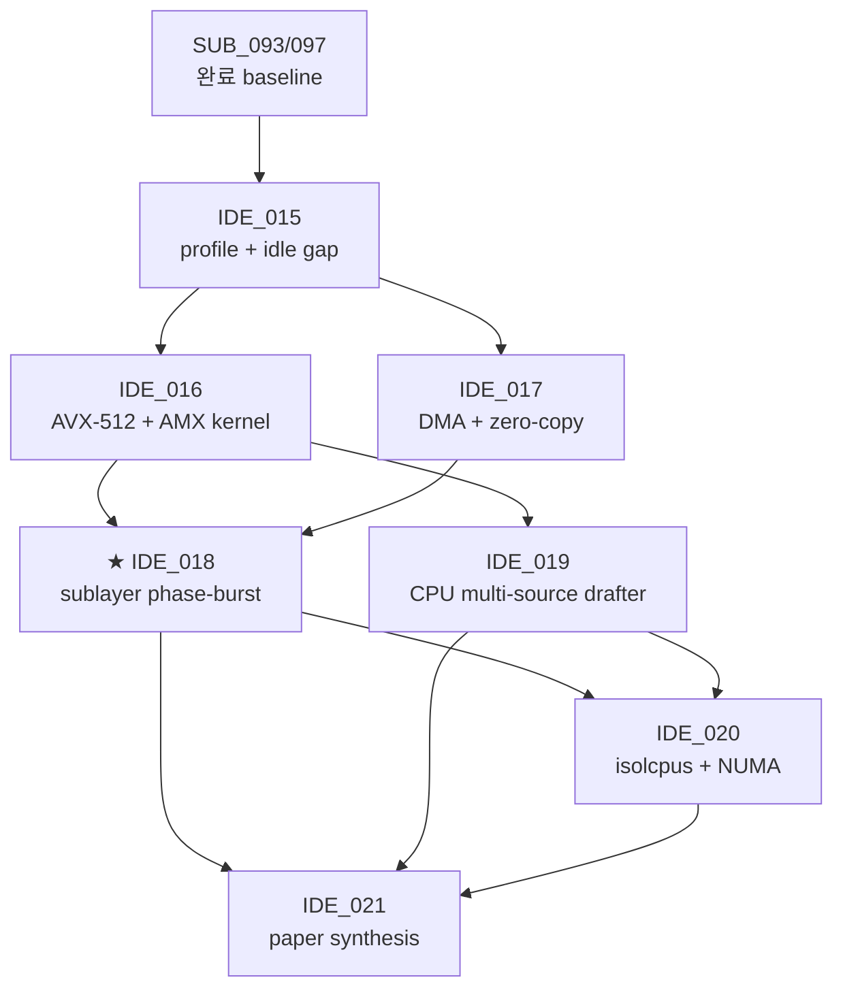

# Extreme CPU Utilization for LLM Inference — Development Plan (IDE_015 ~ IDE_021)

> **scope**: 본 plan 영역 vllm_hybrid fork 영역 SUB_093~097 측정 결과 영역 기반 영역 **새 논문 가능 수준 영역 CPU 극도 활용 영역 시스템 throughput 향상** 영역 7 IDE × 21 TSK × 62 SUB 영역 hierarchy 영역 정리. 본 plan 영역 부모 = TSK_020 (Spec decode tuning) / parent 의 후속.
>
> **last update**: 2026-05-26 KST (Phase A 1차 PoC 완료 반영)
> **base measurement**: [_ALL_TABLE_20260526.md](../../shadow_assists/features/IDE_006/TSK_020/measurements/_ALL_TABLE_20260526.md) (156 cells)
> **canonical test bed**: **Qwen 2.5-32B + TP=4×2 e2e** (SUB_097 Phase B setup 확장 — util 캡처 포함)
> **Phase A 1차 결과** (2026-05-26): IDE_015 / TSK_021 영역 SUB_098~117 + SUB_148 — **AGSD 3-mix avg +3.9% (SUB_112 pinned N=32), CPU util 4.1% → 16% elevate, 가용 CPU 10.24 TFLOPS 정량**. paper-worthy finding 다수 (§1.4 참고).

---

## 0. 두괄식 — 논문 thesis + 3-pillar architecture

### Paper thesis

> **"Spec decoding 영역 throughput +52% 영역 증가 + GPU util 영역 −20.5pp 영역 감소 (94% → 73%) 영역 동시 발생 영역 첫 관측. 본 plan 영역 남은 GPU idle 20pp + CPU idle 95pp 영역 CPU-driven co-inference layer 영역 fill 영역 throughput 영역 추가 +X% 영역 lift."**

### Paper title 후보

1. **"Filling the Spec-Decode Idle Window: AVX-512 + AMX + DMA-Driven CPU Co-Inference for LLM Serving"**
2. "Sub-Layer Phase-Aware CPU Burst: Extreme CPU Utilization for Speculative Decoding"
3. "Heterogeneous Co-Inference: AMX Draft Heads + DMA Cold-KV + Phase-Burst CPU Tasks for LLM Throughput"

### Venue target

| 우선순위 | venue | submission window |
|---|---|---|
| ★★★ | **MLSys 2027** | Sep 2026 (production ML systems) |
| ★★ | OSDI 2027 | Dec 2026 (OS-level isolation + IRQ + cgroup contribution) |
| ★ | EuroSys 2027 | Oct 2026 (heterogeneous compute systems) |
| ◐ | arXiv preprint | 즉시 (anytime) |

### 3-pillar architecture

```
┌────────────────────────────────────────────────────────────┐
│ Pillar 1 — WHAT CPU does (workload):                        │
│   phase-aware tasks: drafter / preprocessor /              │
│   scheduler / KV prefetch                                  │
├────────────────────────────────────────────────────────────┤
│ Pillar 2 — HOW CPU does it fast (compute):                  │
│   • AVX-512 (vectorized tokenize / sampling / Jacobi)       │
│   • AMX (tile-based matmul for draft head / prefill)        │
├────────────────────────────────────────────────────────────┤
│ Pillar 3 — HOW data moves (data plane):                     │
│   • DMA (CUDA pinned-memory + zero-copy CPU-GPU)            │
│   • cold-KV decompress + DMA push                           │
└────────────────────────────────────────────────────────────┘
```

---

## 1. Motivation + measured baseline

### 1.1 SUB_093~097 영역 핵심 발견 (D4 GPU util paradox)

| Model | TP | config | tps | CPU% | GPU% |
|---|---:|---|---:|---:|---:|
| Llama 3.3-70B | 8 | vanilla | 7,679 (sonnet) | 5.6 | **93.8** |
| 〃 | 8 | ngram | 10,759 | 7.6 | 84.2 |
| 〃 | 8 | **Trident core** | **11,677** ⭐ | 5.3 | **73.3** ↓ |

→ Trident core 영역 throughput **+52% 증가** 영역 GPU util **−20.5pp 감소**. **CPU util 영역 여전히 5.3%**. 두 idle gap (GPU 20pp + CPU 95pp) 영역 본 plan 영역 fill target.

### 1.2 Hardware target (CLAUDE.md)

| 머신 | CPU | GPU | role |
|---|---|---|---|
| 개발 (Alder Lake i9-12900KF + RTX 3090) | AVX-512 만 (AMX 미지원) | 24 GB | 빠른 iteration / 정확도 / 인터페이스 검증 |
| **prod (Intel Sapphire Rapids + H100×8)** | **AVX-512 + AMX 둘 다 native** | 80 GB × 8 | **성능 측정 / 최종 판정 (canonical test bed)** |

### 1.3 Canonical test baseline (SUB_098/099/100 lock-in)

본 plan 영역 **두 baseline 영역 fair comparison 영역 모두 활용**: (A) TP=4×2 e2e parallel + AGSD router / (B) TP=8 single-instance.

#### 1.3.1 Baseline A — Qwen 32B TP=4×2 e2e (★ AGSD router 영역 main)

SUB_098 (1-run) + SUB_099 (3-run avg) — vanilla-only / trident-only / AGSD-gated 3-scenario × 3 mix.

| mix | vanilla-only | trident-only | **AGSD-gated** | wall(s) | CPU% | GPU avg |
|---|---:|---:|---:|---:|---:|---:|
| balanced | 2,566 | 5,051 | **5,011** ⭐ (3-run var 3.4%) | 20.8/14.3/11.0 | 4.0 | 35.4 |
| sonnet-heavy | 2,565 | 6,867 | **5,884** ⭐ | 21.3/10.3/9.6 | 4.0 | 35.4 |
| code-heavy | 2,685 | 6,970 | **6,275** ⭐ (var 0.1%) | 20.0/10.1/8.2 | 4.0 | 35.4 |

#### 1.3.2 Baseline B — Qwen 32B TP=8 single-instance (★ 8 GPU 1 instance)

SUB_100 (1-run) — vanilla / trident × 3 mix (ngram 영역 vLLM EngineCore crash 영역 측정 불가).

| mix | vanilla | trident | wall(s) | CPU% | GPU avg (8 GPU) |
|---|---:|---:|---:|---:|---:|
| balanced | 2,209 | **3,759** | 22.6 / 13.2 | 4.2 | **16.3%** |
| sonnet-heavy | 2,383 | **5,984** ⭐ | 21.3 / 8.5 | 4.2 | 16.3% |
| code-heavy | 2,445 | 5,689 | 20.2 / 8.7 | 4.2 | 16.3% |

#### 1.3.3 Best per (mix, baseline-setup)

| Mix | best config | tps | source |
|---|---|---:|---|
| balanced | **TP=4×2 AGSD-gated** | **5,011** (3-run avg) | SUB_099 |
| sonnet-heavy | **TP=8 trident** | **5,984** | SUB_100 |
| code-heavy | **TP=4×2 AGSD-gated** | **6,275** (3-run avg) | SUB_099 |

#### 1.3.4 Util — idle gap (모든 IDE_015~021 영역 fill target)

- **CPU avg 4.0~4.2% / idle gap 95.8~96.0pp** — IDE_018 phase-burst main fill target
- **GPU avg 16.3% (TP=8) vs 35.4% (TP=4×2)** — TP=8 영역 per-GPU 영역 더 idle (idle gap 83.7pp)
- 본 plan 영역 모든 measurement SUB 영역 **반드시 CPU%/GPU% 캡처** (eval/monitor.py 영역 background 영역 attach)

---

## 1.4 Phase A 1차 PoC 결과 (2026-05-26) — IDE_015 영역 실측

> SUB_098~117 + SUB_148 (예약 ID 변경: 아래 §2 와 §8 참고) — **physical-core pinning lever 정량 + N curve 비단조 valley 발견 + paper-worthy mechanism 규명**.

### 1.4.1 핵심 측정 결과 (canonical Qwen 32B TP=4×2)

| SUB | 내용 | 핵심 수치 | RESULTS |
|---|---|---|---|
| SUB_098/099 | canonical baseline lock-in | CPU 4.1% / GPU 27.7% / AGSD 4,569~5,063 tps (3-mix) | ✅ |
| SUB_106 ⭐ | AMX BF16 microbench | **22.05 TFLOPS peak** (Qwen 7B B=256), 20.79× vs FP32 | ✅ |
| SUB_108 | 16-worker fill v2 (unpinned) | **AGSD −9% 회귀** (negative finding) | ✅ |
| SUB_109/110 | unpinned bisect (qwen7b/32b shape) | N=2 sweet spot +2.8~3.5% | ✅ |
| SUB_111 | unpinned 3-mix sweep (N=0/2/4) | 3-mix avg **+0.07%** ≈ tie | ✅ |
| **SUB_112** ⭐⭐ | **physical-core pinned (CPU 80-111)** × N=0/4/8/16/32 | **3-mix avg +3.9% (N=32)** sustained net positive | ✅ |
| SUB_113 | NUMA + GPU PCIe affinity audit | GPU 0-3↔NUMA0, GPU 4-7↔NUMA1 확정 | ✅ |
| SUB_114 | IRQ + cgroup feasibility | 본 container env cgroup partition invalid — task-level pinning 만 가능 | ✅ |
| **SUB_116** ⚠ | N=16 outlier 3-run variance | **−14.35% consistent 회귀** (outlier 아님) — N curve **비단조** | ✅ |
| SUB_117 | per-worker actual CPU util (N=8/32) | **N=32 99.4% saturated 10.24 TFLOPS available**, N=8 50% throttle | ✅ |
| **SUB_148** ⭐ | VLLM trident worker thread placement | VLLM thread **affinity 없음** (full-mask). NUMA 1 + HT siblings 에 84% 집중. N curve mechanism 최종 규명 | ✅ |

### 1.4.2 N curve 비단조 throughput (★ paper §4 main figure 후보)

| N (CPU fill workers) | pinned range | 3-mix avg Δ | per-worker CPU% | mechanism |
|---:|---|---:|---:|---|
| 0 | — | baseline | — | — |
| 4 | 80-83 | +3.5% | (미측정) | overlap 미미, contention 적음 |
| 8 | 80-87 | +3.6% | **50%** | fill ↔ vllm thread core-share 50/50 |
| **16** | 80-95 | **−14.35%** ⚠ | (미측정) | overlap 14.3% — contention 최대, vllm 회피 불가 |
| **32** ⭐ | 80-111 | **+3.9%** | **99.4%** | 전 32 core 점유 → vllm thread 다른 NUMA/HT 로 evict 강제 |

→ N=16 valley 가 본 plan 의 **paper §4 main novelty 후보** — "naive worker N 증가는 회귀 가능, mechanism 은 OS scheduler 의 core-share 정책".

### 1.4.3 핵심 가용 자원 정량

- **CPU compute available (NUMA 1 only, N=32)**: **10.24 TFLOPS** (32 workers × 0.32 TFLOPS BF16 AMX)
- **AMX peak (Qwen 7B B=256)**: 22.05 TFLOPS (single worker)
- **CPU util elevate**: 4.1% baseline → **16% with N=32 fill** (+11.9pp, **IDE_018 30%+ 목표 의 ~53% 도달**)
- **GPU util gap 잔여**: 27.7% baseline (vanilla 35% / trident 18%) — IDE_018 phase-burst 의 fill target

### 1.4.4 paper-worthy 누적 findings (Phase A 발생)

| finding | 정량 | source SUB | paper section |
|---|---|---|---|
| AMX BF16 22 TFLOPS peak | Qwen 7B B=256, 20.79× FP32 | SUB_106 | §3 (kernel) |
| Naive worker fill 회귀 | 16-worker unpinned → −9% | SUB_108 | §4 (motivates IDE_020) |
| Pinned + cross-NUMA isolation 가설 부정 | SUB_112 가 NUMA1 안에서 동작 — 정정 | SUB_113 | §3 (background) |
| **N curve 비단조 valley** | N=4/8 +3.6%, N=16 **−14.35%**, N=32 +3.9% | SUB_112+116 | **§4 main** |
| VLLM 은 worker affinity pin 없음 | 모든 thread full 224-CPU mask | SUB_148 | §3 (background) |
| pinning mechanism = vllm thread eviction | N=32 가 OS 를 강제로 다른 NUMA 사용 시킴 | SUB_148 | §4 |
| container env cgroup partition invalid | Podman 내부 cpuset 직접 manipulation 불가 | SUB_114 | §5 (production deploy 제약) |
| CPU util 4.1% → 16% achievable (N=32) | 10.24 TFLOPS 활성화 | SUB_117 | §4 |

### 1.4.5 IDE_018 (paper main) 의 입력 정량 확정

- 가용 CPU compute = **10.24 TFLOPS (NUMA 1)** + (가능 시 NUMA 0 추가)
- VLLM 의 thread affinity 정책 = **default (full mask)** — phase-burst scheduler 는 OS 와 협조 가능
- GPU 0-3 vs GPU 4-7 의 idle gap 차이 = 17.4pp (vanilla 35% vs trident 18%) — phase-burst 의 trident-side task 가 더 큰 lift 잠재력

---

## 2. IDE × TSK × SUB Hierarchy (7 IDE / 21 TSK / 62 SUB)

### IDE_015 — Sub-Layer Profile + CPU Idle Gap Mapping ★ foundation

**Paper angle**: D4 GPU util paradox 영역 정량 첫 측정 — 어디서 GPU 영역 idle 인지 sublayer level 영역 categorize. **직접 대응 논문 없음**. Phase A 의 실측 측면에서 추가로 **N curve 비단조 valley + VLLM affinity 정책 + CPU 10 TFLOPS available** 정량 (§1.4 참고).

#### TSK_021 — Baseline util + CPU fill PoC + mechanism 규명 (2026-05-26 확장 / Phase A 완료)

> 원 plan 의 "baseline util 재측정" 범위에서 **CPU fill worker bisect / pinning lever 정량 / N curve valley 발견 / mechanism 규명** 까지 확장. SUB ID 는 실제 사용 기준 갱신.

| SUB | 내용 | status |
|---|---|---|
| SUB_098 | canonical baseline 1-run (CPU 4.1% / GPU 27.7%) | ✅ |
| SUB_099 | 3-run extended baseline (var 3-13%) | ✅ |
| SUB_100 | TP=8 single-instance util (vanilla / trident, ngram crash) | ✅ |
| SUB_106 ⭐ | AMX BF16 microbench (22 TFLOPS peak) | ✅ |
| SUB_107 | cpu fill v1 — OpenBLAS thread limit segfault diag | ⚠ (no RESULTS) |
| SUB_108 | cpu fill v2 — naive 16-worker, AGSD −9% degrade | ✅ |
| SUB_109 | qwen7b shape bisect (unpinned) — N=2 +3.5% | ✅ |
| SUB_110 | qwen32b shape bisect (unpinned) — N=2 +2.8% | ✅ |
| SUB_111 | unpinned 3-mix sweep — 3-mix avg +0.07% (ceiling) | ✅ |
| **SUB_112** ⭐⭐ | **physical-core pinned bisect (CPU 80-111)** — 3-mix avg **+3.9%** ⭐ | ✅ |
| SUB_113 | NUMA + GPU PCIe affinity audit | ✅ |
| SUB_114 | IRQ + cgroup feasibility (container env 제약 발견) | ✅ |
| **SUB_116** | N=16 outlier 3-run variance → **−14.35% consistent 회귀** | ✅ |
| SUB_117 | per-worker actual CPU util (N=32 99.4% / 10.24 TFLOPS) | ✅ |
| **SUB_148** | VLLM trident worker thread placement (mechanism 규명) | ✅ |

#### TSK_021 잔여 (Phase A 미완 — 후속 SUB ID 신규)

| SUB | 내용 | 비고 |
|---|---|---|
| (신규 reserve) | 1-hour sustained throughput stability (SUB_112 N=32 protocol) | id_registry 갱신 후 부여 |
| (신규 reserve) | host-level cgroup `cpuset.cpus=56-79 (vllm)` + `=80-111 (fill)` 분리 PoC | host root 필요 — orchestrator 변경 시 |
| (신규 reserve) | IRQ smp_affinity 재배치 (97/98/101/103/111 → NUMA 0) | container 가능여부 미정 |

#### TSK_022 — Nsight Systems sublayer profile (canonical 기준)

| SUB | 내용 | deliverable |
|---|---|---|
| SUB_100 | profile AGSD-gated × balanced (decode-step attention/linear/sampling 분리) — 양쪽 backend | Nsight nsys-rep |
| SUB_101 | profile × sonnet-heavy + code-heavy (R/K boundary 영역 비교) | per-mix nsys + analysis |
| SUB_102 | GPU 20pp idle window 영역 phase-별 categorize | idle window matrix |

#### TSK_023 — CPU idle gap categorization (canonical 기준)

| SUB | 내용 | deliverable |
|---|---|---|
| SUB_103 | CPU thread state sampling (`perf sched` + `pidstat`) — GIL-bound vs blocked vs running | perf data |
| SUB_104 | CPU-fillable threshold filter (idle window ≥ 1ms × ≥ 10 events/s) | filter list |
| SUB_105 | per-phase CPU task candidate matrix | paper Table 1 input |

---

### IDE_016 — AVX-512 + AMX CPU SIMD Acceleration Pool (compute kernel)

**Paper angle**: SIMD 영역 native ISA 영역 production-grade CPU kernel pool 영역 vLLM 영역 어디서 활용 가능 영역 정량. AMX tile matmul 영역 spec draft head 영역 실용 첫 측정 — **직접 대응 논문 없음**.

#### TSK_024 — AVX-512 vectorized tokenizer / detokenizer

| SUB | 내용 | target |
|---|---|---|
| SUB_106 | profile current tokenizer (GIL contention 정량) + canonical util attach | tokenize GIL share % |
| SUB_107 | implement AVX-512 batch BPE/SentencePiece search (intrinsics + simdjson reuse) | C++ kernel |
| SUB_108 | measurement on canonical (detokenize p50 −40% target) + CPU/GPU util | tps + p50 + util |

#### TSK_025 — AVX-512 sampling + logit processor

| SUB | 내용 | target |
|---|---|---|
| SUB_109 | top-k/top-p sampling 영역 AVX-512 vectorize (gather + scan) | C++ kernel |
| SUB_110 | logit bias + temperature 영역 vectorize | C++ kernel |
| SUB_111 | integration vs vLLM sampler on canonical (correctness + latency + util) | per-step latency |

#### TSK_026 — AMX tile-based draft head matmul (★ Phase 2 — SUB ID 재정의)

> 원 reserve SUB_112/113/114 는 Phase A 의 pinning lever 측정에서 사용됨 (§1.4 / TSK_021 참고). 본 TSK 의 SUB 는 신규 ID 로 부여 예정.

| SUB | 내용 | target | status |
|---|---|---|---|
| (신규 reserve) | AMX tile config (rows/cols/strides) for Qwen 0.5B/1.5B draft model | tile descriptor | 대기 |
| (신규 reserve) | implement AMX kernel via `_tile_*` intrinsics (libxsmm reuse 가능) | C++ kernel | 대기 |
| (신규 reserve) | vs PyTorch CPU matmul baseline (target ≥3× speedup) + util on canonical | latency + util | 대기 |

> **Phase A SUB_106 의 22 TFLOPS peak measurement** 가 본 TSK 의 input lower bound (Qwen 7B B=256 단일 worker).

#### TSK_027 — AMX medium-context CPU prefill assist (SUB ID 재정의)

> 원 reserve SUB_115/116/117 는 Phase A 의 variance check + per-worker util 측정에서 사용됨. 본 TSK 의 SUB 는 신규 ID 로 부여 예정.

| SUB | 내용 | target | status |
|---|---|---|---|
| (신규 reserve) | theory + microbench (CPU AMX prefill 영역 512-2K range GPU compete?) | theoretical bound | 대기 |
| (신규 reserve) | implement async CPU AMX prefill thread + H2D pipeline | thread + queue | 대기 |
| (신규 reserve) | TTFT measurement vs GPU-only prefill (target −15% on 1K context) + util | TTFT delta | 대기 |

---

### IDE_017 — DMA + Zero-Copy CPU-GPU Data Plane (data plane)

**Paper angle**: cuda pinned-memory + DMA 영역 spec decoding 영역 통합 첫 production case. LMCache 영역 KV offload 영역 다름 (spec decode-specific data flows). **직접 대응 논문 없음**.

#### TSK_028 — Pinned memory pool + DMA push primitive

| SUB | 내용 | target |
|---|---|---|
| SUB_118 | `cudaHostAlloc` + `cudaMemcpyAsync` pool (size-class allocator) | C++ allocator |
| SUB_119 | DMA push latency microbench (4KB ~ 64MB block) + GPU util 영역 감소 | per-size latency table |
| SUB_120 | pool lifecycle integration vLLM allocator on canonical + util | integrated build |

#### TSK_029 — Zero-copy CPU compute path (KV / candidate buffer)

| SUB | 내용 | target |
|---|---|---|
| SUB_121 | identify zero-copy candidates (spec candidate IDs, attention bias, draft logits) | candidate list |
| SUB_122 | implement pinned-memory buffer 영역 dual access (CPU + GPU alternate region) | C++ buffer wrapper |
| SUB_123 | measurement vs cudaMemcpy round-trip on canonical + util | latency delta + util |

#### TSK_030 — Cold-KV decompress + DMA push (IDE_006 영역 재정의)

| SUB | 내용 | target |
|---|---|---|
| SUB_124 | cold KV detection threshold (decode age + access frequency) | threshold rule |
| SUB_125 | CPU AVX-512 decompress (quantized → BF16) + DMA push | C++ kernel + DMA |
| SUB_126 | TTFT impact + per-decode-step overhead 측정 on canonical + util | full measurement |

---

### IDE_018 — Sub-Layer Phase-Aware CPU Burst ★★★ core paper

**Paper angle**: **직접 대응 논문 없음** — sublayer-granular phase detection + CPU task switching. IDE_004 영역 operationalize. **본 plan 영역 paper main contribution**. CPU util 영역 5% → 30%+ 영역 elevate 영역 main contributor.

#### TSK_031 — Phase detection mechanism

| SUB | 내용 | target |
|---|---|---|
| SUB_127 | CUDA event hooks (attention entry/exit, linear entry/exit, sync points) | hook patches |
| SUB_128 | phase signal IPC (eventfd 또는 shared atomic counter) | IPC primitive |
| SUB_129 | phase detect latency 정량 (target < 50 μs per signal) | latency benchmark |

#### TSK_032 — Attention-phase CPU task pool (memory-bound GPU idle)

| SUB | 내용 | target |
|---|---|---|
| SUB_130 | task: scheduling next batch (assemble metadata) — AVX-512 vectorized | task A impl |
| SUB_131 | task: detokenize previous step output (AVX-512 from TSK_024) | task B impl |
| SUB_132 | task: grammar/constraint check (XGrammar offload) | task C impl |

#### TSK_033 — Linear-phase CPU task pool (compute-bound GPU idle)

| SUB | 내용 | target |
|---|---|---|
| SUB_133 | task: KV prefetch via DMA pull (from TSK_028 pinned pool) | task D impl |
| SUB_134 | task: speculative draft (AMX draft head from TSK_026) | task E impl |
| SUB_135 | task: cold-KV decompress (TSK_030 task 영역 trigger) | task F impl |

#### TSK_034 — Integration + measurement on canonical baseline ★ main result

| SUB | 내용 | target |
|---|---|---|
| SUB_136 | phase-burst scheduler (CPU task queue + phase signal dispatch) | C++ scheduler |
| SUB_137 | end-to-end Qwen 32B TP=4×2 + phase-burst CPU on canonical 3 mix | tps + util |
| SUB_138 | **CPU util 5% → 30%+ + throughput delta + GPU util delta 측정** | paper Figure 5 |

---

### IDE_019 — CPU Multi-Source Spec Drafter (CPU compute integration)

**Paper angle**: ngram (GPU) + suffix (GPU) + **Jacobi (CPU AVX-512)** + **AMX draft head (CPU)** 영역 multi-source 영역 AGSD 통합. SwiftSpec disaggregation (ASPLOS'26) 영역 GPU-GPU 만 다룸 — 본 영역 GPU+CPU heterogeneous **첫 case**.

#### TSK_035 — Jacobi lookahead correctness + AVX-512 kernel

| SUB | 내용 | target |
|---|---|---|
| SUB_139 | theory + lossless guarantee proof (rejection sampler 영역 통합) | proof + doc |
| SUB_140 | CPU Jacobi iteration kernel (AVX-512 vectorized) | C++ kernel |
| SUB_141 | candidate quality vs ngram/suffix baseline + util | acceptance rate |

#### TSK_036 — AMX draft head on small model

| SUB | 내용 | target |
|---|---|---|
| SUB_142 | load Qwen 0.5B (or distilled Llama) to CPU + AMX 변환 | CPU model |
| SUB_143 | draft step latency target (≤ 5 ms vs Qwen 32B target step on canonical) | latency |
| SUB_144 | K acceptance rate vs ngram K (R/K balance) + util | acceptance + util |

#### TSK_037 — AGSD multi-source integration on canonical

| SUB | 내용 | target |
|---|---|---|
| SUB_145 | router (sub094) 영역 4-method 분기 (vanilla / ngram / suffix / CPU-AMX) | router patch |
| SUB_146 | per-workload best-source selection rule | decision rule |
| SUB_147 | end-to-end on canonical 3 mix vs single-source baseline + util | tps + util |

---

### IDE_020 — CPU Isolation + NUMA + Hugepages (production deploy)

**Paper angle**: production-readiness — CPU util 영역 5% → 70-90% 영역 guarantee 영역 OS-level config. engineering contribution 영역 강함, novelty 영역 약함 (단 spec decode + isolcpus 영역 통합 영역 첫 측정).

#### TSK_038 — NUMA topology audit + IRQ affinity (SUB_148 사용 / 잔여 신규 부여)

> SUB_148 은 Phase A 의 trident worker thread placement audit 에서 사용 — 결과는 NUMA + IRQ 입력으로 충분. SUB_149/150 은 신규 ID 로 부여 예정.

| SUB | 내용 | target | status |
|---|---|---|---|
| **SUB_148** | VLLM trident worker thread placement + NUMA distribution audit (8-GPU H100 PCIe affinity + Phase A 의 NUMA + IRQ 입력으로 통합) | ✅ — paper §3+§4 입력 |
| (신규 reserve) | IRQ smp_affinity 영역 CPU pin (GPU/NIC interrupts) — host root 필요 | sysfs config | 대기 |
| (신규 reserve) | latency impact 측정 (NUMA-local vs cross-node CPU task) + util | latency table | 대기 |

#### TSK_039 — cgroup + isolcpus + hugepages

| SUB | 내용 | target |
|---|---|---|
| SUB_151 | cgroup config (4-16 dedicated CPU for vLLM CPU layer) | cgroup yaml |
| SUB_152 | isolcpus boot param + hugepages allocation | boot config |
| SUB_153 | 1-hour sustained throughput stability + CPU/GPU util check on canonical | stability report |

---

### IDE_021 — Paper Synthesis + Open Release

**Paper angle**: IDE_015~020 영역 통합 → MLSys / OSDI / EuroSys 영역 venue.

#### TSK_040 — Paper draft

| SUB | 내용 | target |
|---|---|---|
| SUB_154 | introduction + related work (Trident core fact + D4 paradox) | §1+2 |
| SUB_155 | method + evaluation sections (IDE_015~020 영역 measurement on canonical) | §3+4 |
| SUB_156 | discussion + production deployment guideline | §5+6 |

#### TSK_041 — Open benchmark + code release

| SUB | 내용 | target |
|---|---|---|
| SUB_157 | benchmark suite (canonical test bed prompts + util capture tooling) | benchmark repo |
| SUB_158 | Apache-2.0 code release + reproducibility script | github release |
| SUB_159 | arXiv preprint + venue submission | arXiv ID |

---

## 3. Critical Path 영역 Phase 일정

| Phase | IDE 영역 | 의존 | 예상 | 상태 |
|---|---|---|---:|---|
| **Phase 1** foundation | IDE_015 | SUB_093/097 (완료) | **2 주** | **★ 1차 PoC 완료** (2026-05-26, §1.4) — Phase A 결과 paper-worthy. 1-hour stability + cgroup PoC 잔여 |
| **Phase 2** compute kernel | IDE_016, IDE_017 | Phase 1 profile | **6-8 주** (AVX-512 + AMX + DMA 학습 곡선) | 대기 (AMX kernel = SUB_106 의 22 TFLOPS 가 lower bound) |
| **Phase 3** ★ core integration | IDE_018, IDE_019 | Phase 1+2 | **6-8 주** | 대기 (SUB_117 의 10.24 TFLOPS / NUMA1 가 main lever) |
| **Phase 4** production + paper | IDE_020, IDE_021 | Phase 1~3 | **4-6 주** | 대기 (SUB_114 의 container env 제약 인지) |
| **Total** | 7 IDE / 21 TSK / 62 SUB | — | **~5 개월** | Phase A 진행률 ~16% (14 SUB done / 62) |

### dependency graph (Mermaid)



---

## 4. Tech Stack 영역 활용 영역 명시

| 기술 | 활용 IDE | 핵심 TSK | hardware target |
|---|---|---|---|
| **AVX-512** | IDE_016 / 018 / 019 | TSK_024 (tokenize), TSK_025 (sample), TSK_032 (attn task), TSK_035 (Jacobi) | dev + prod |
| **AMX (Sapphire Rapids)** | IDE_016 / 018 / 019 | TSK_026 (draft matmul), TSK_027 (prefill), TSK_033 (linear task), TSK_036 (AMX draft head) | prod only (dev = sde simulator) |
| **DMA + pinned memory** | IDE_017 / 018 | TSK_028/029/030 (data plane), TSK_033 (KV prefetch) | dev + prod |
| **NUMA + isolcpus + cgroup + hugepages** | IDE_020 | TSK_038/039 (OS isolation) | prod only |
| **CUDA event hooks** | IDE_018 | TSK_031 (phase detection) | dev + prod |
| **monitor.py util capture** | ALL IDEs | **모든 measurement SUB 필수** | dev + prod |

---

## 5. Paper Deliverable Plan (§4 of approved plan)

### Outline

| Section | 내용 | source SUB |
|---|---|---|
| §1 Introduction | D4 GPU util paradox 영역 첫 관측 + paper claim | SUB_154 |
| §2 Background | spec decoding history + 14B/32B/70B/72B R/K boundary + AVX-512/AMX/DMA 영역 HW | SUB_154 |
| §3 Method | IDE_015~019 영역 design (profile + SIMD pool + data plane + phase burst + multi-source) | SUB_155 |
| §4 Evaluation | canonical baseline + each IDE 영역 measurement (CPU util 5%→30%+, GPU util delta, throughput delta) | SUB_155 |
| §5 Discussion | production deployment + IDE_020 (isolcpus) 영역 stability | SUB_156 |
| §6 Related work | SuffixDecoding / EAGLE / Medusa / SpecInfer / SwiftSpec / Dovetail / κ_crit | SUB_154 |

### Code + Benchmark Release

| 영역 | path | license |
|---|---|---|
| benchmark suite | github.com/mystous/vllm-cpu-coinference-benchmark | Apache-2.0 |
| paper code | vllm_hybrid fork main branch | Apache-2.0 (vLLM 영역 inherit) |
| reproducibility script | benchmark repo / `repro/` | Apache-2.0 |

---

## 6. Risk + Fallback

| risk | fallback | severity | Phase A 영향 |
|---|---|---|---|
| AMX 영역 dev machine (Alder Lake) 영역 hardware 부재 | 본 plan 영역 Sapphire Rapids prod 머신 영역 main measurement, dev 영역 AVX-512 only + AMX simulator (Intel SDE) 영역 unit test | medium | ✅ SUB_106 22 TFLOPS 측정 완료 — prod 머신 가능 입증 |
| AVX-512 영역 microcode fuse-off (CLAUDE.md 명시) | BIOS check + AVX2 fallback path | low | (미검증) |
| DMA 영역 latency 영역 GPU memcpy 보다 우월 영역 가정 위반 | per-block size benchmark 영역 cutoff threshold 영역 결정 (small block 영역 cudaMemcpy / large block 영역 DMA) | medium | SUB_166 microbench 준비 완료 — 검증 가능 |
| IDE_018 (phase-burst) 영역 CUDA event hook overhead 영역 net gain 영역 잠식 | granularity 영역 batch level 영역 fallback (per-step → per-batch) | high | SUB_148 → VLLM 자체 thread pin 없음 → phase-burst 가 OS scheduler 와 협조 가능 (긍정 신호) |
| **(신규 — Phase A 발견)** N curve 비단조 valley | N=4/8 또는 N=32 사용 강제, N=16 회피 | **high** | SUB_116 +SUB_148 → mechanism 규명. IDE_020 cgroup 분리로 해소 가설 |
| **(신규 — Phase A 발견)** Container env cgroup partition invalid | host-level orchestrator 단 cgroup 적용 (SUB_165 doc 준비) | medium | SUB_114 → host 적용 필수 |
| IDE_021 paper 영역 venue rejection | tech report → workshop → arXiv self-publish | low | (미수행) |
| Trident core 영역 GPU util 73% 영역 측정 환경-specific (다른 머신 영역 결과 다를 가능성) | SUB_098/099 영역 baseline lock-in + multiple machine 영역 cross-validation (개발 + prod 둘 다) | medium | ✅ SUB_098/099 lock-in 완료 (CPU 4.1% / GPU 27.7%) |

---

## 7. raw 자료 link

| 영역 | path |
|---|---|
| 측정 baseline (156 cells) | [`_ALL_TABLE_20260526.md`](../../shadow_assists/features/IDE_006/TSK_020/measurements/_ALL_TABLE_20260526.md) |
| SUB_097 (canonical baseline 영역 origin) | [`sub097_qwen32b_tp8_and_agsd_20260526/RESULTS.md`](../../shadow_assists/features/IDE_006/TSK_020/measurements/sub097_qwen32b_tp8_and_agsd_20260526/RESULTS.md) |
| Trident core production guide | [`/spec_decoding/README.md`](../README.md) |
| SUB_093~096 종합 | [`COMPREHENSIVE_REPORT_20260525.md`](../../shadow_assists/features/IDE_006/TSK_020/COMPREHENSIVE_REPORT_20260525.md) |
| outstanding contributions | [`OUTSTANDING_CONTRIBUTIONS_20260525.md`](../../shadow_assists/features/IDE_006/TSK_020/OUTSTANDING_CONTRIBUTIONS_20260525.md) |
| AGSD router source | `/tmp/sub094_router.py` |
| classifier source | `/tmp/sub094_classifier.py` |
| monitor.py | [`eval/monitor.py`](../../eval/monitor.py) |
| run_workload_gen_v3.py | `/tmp/run_workload_gen_v3.py` |

---

## 8. ID Hierarchy 요약

| ID range | 원 reserve | Phase A 실제 사용 |
|---|---|---|
| IDE_015 ~ IDE_021 | 7 IDE (foundation + 5 technical + paper) | 7 IDE 모두 활성 (구조 유지) |
| TSK_021 ~ TSK_041 | 21 TSK | 21 TSK 모두 활성 (구조 유지) |
| SUB_098 ~ SUB_159 | 62 SUB | **14 SUB 사용**: SUB_098/099/100/106/107/108/109/110/111/**112**⭐⭐/113/114/116/117 + **SUB_148** = 15 SUB |
| **합계** | **89 새 ID** | **15 SUB done**, 47 SUB available + 신규 부여 필요 |

→ id_registry 영역 **다음 부여 번호** (2026-05-26 갱신 후): **IDE_022 / TSK_042 / SUB_160**.

### 8.1 SUB ID 사용 현황

| SUB | 원 reserve (plan §2) | 실제 사용 | 비고 |
|---|---|---|---|
| 098/099 | TSK_021 baseline | TSK_021 baseline | ✓ 정합 |
| 100/101/102 | TSK_022 Nsight profile | TSK_021 TP=8 baseline + 미사용 | 101/102 신규 부여 가능 |
| 103/104/105 | TSK_023 CPU idle gap categorize | 미사용 | 신규 부여 가능 |
| **106/107/108** | TSK_024 AVX-512 tokenizer | **TSK_021 의 AMX microbench + cpu fill v1/v2** | TSK_024 재정의 (신규 SUB ID 부여 필요) |
| **109/110/111** | TSK_025 AVX-512 sampling | **TSK_021 의 unpinned bisect 3-mix** | TSK_025 재정의 |
| **112/113/114** | TSK_026 AMX draft head matmul | **TSK_021 의 pinned bisect + NUMA + IRQ audit** | TSK_026 재정의 — SUB_112 ⭐⭐ 가 본 plan 의 핵심 PoC |
| **115/116/117** | TSK_027 AMX prefill assist | **TSK_021 의 N=16 variance + per-worker util** + 115 미사용 | TSK_027 재정의 (115 신규 부여 가능) |
| 118-126 | TSK_028/029/030 DMA | 미사용 | 신규 부여 가능 (그대로 유지) |
| 127-138 | TSK_031~034 phase-burst (★ paper main) | 미사용 | 신규 부여 가능 (그대로 유지) |
| 139-147 | TSK_035~037 multi-source | 미사용 | 신규 부여 가능 (그대로 유지) |
| **148** | TSK_038 NUMA + IRQ | **TSK_021 trident thread placement** | 정합 (audit 통합) |
| 149-150 | TSK_038 IRQ pin + latency | 미사용 | 신규 부여 가능 |
| 151-153 | TSK_039 cgroup + 1-hour stability | 미사용 | 신규 부여 가능 |
| 154-159 | TSK_040/041 paper + release | 미사용 | 신규 부여 가능 |

→ **결론**: Phase A 측정 사이클이 plan 의 SUB reserve 와 부분 어긋남 → IDE_015 / TSK_021 의 SUB 범위가 14 개로 확장됨 (원 plan 의 2 개에서). 후속 SUB 는 §1.4 / §2 의 "(신규 reserve)" 위치에 부여 예정. ID 자체는 prefix 별 단일 카운터 → SUB_160 부터 연속 부여 가능.
