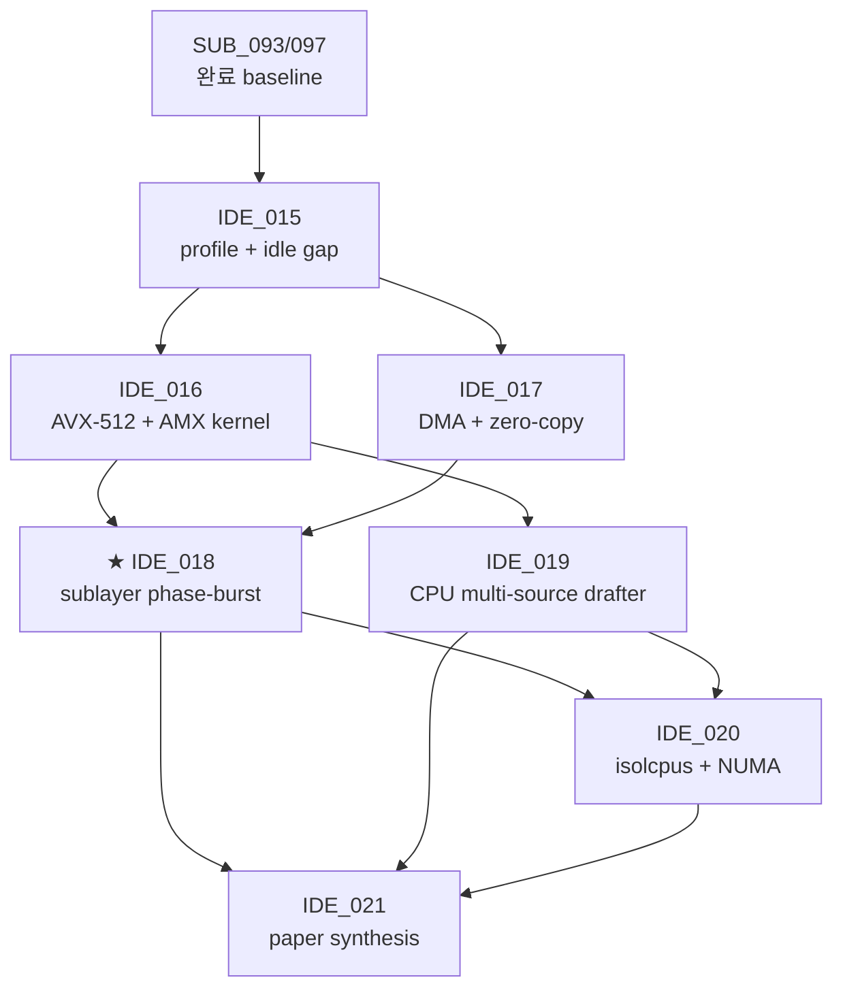

# Extreme CPU Utilization for LLM Inference — Development Plan (IDE_015 ~ IDE_021)

> **scope**: 본 plan 영역 vllm_hybrid fork 영역 SUB_093~097 측정 결과 영역 기반 영역 **새 논문 가능 수준 영역 CPU 극도 활용 영역 시스템 throughput 향상** 영역 7 IDE × 21 TSK × 62 SUB 영역 hierarchy 영역 정리. 본 plan 영역 부모 = TSK_020 (Spec decode tuning) / parent 의 후속.
>
> **last update**: 2026-05-26 KST
> **base measurement**: [_ALL_TABLE_20260526.md](../../shadow_assists/features/IDE_006/TSK_020/measurements/_ALL_TABLE_20260526.md) (156 cells)
> **canonical test bed**: **Qwen 2.5-32B + TP=4×2 e2e** (SUB_097 Phase B 영역 setup 영역 확장 — util 캡처 포함)

---

## 0. 두괄식 — 논문 thesis + 3-pillar architecture

### Paper thesis

> **"Spec decoding 영역 throughput +52% 영역 증가 + GPU util 영역 −20.5pp 영역 감소 (94% → 73%) 영역 동시 발생 영역 첫 관측. 본 plan 영역 남은 GPU idle 20pp + CPU idle 95pp 영역 CPU-driven co-inference layer 영역 fill 영역 throughput 영역 추가 +X% 영역 lift."**

### Paper title 후보

1. **"Filling the Spec-Decode Idle Window: AVX-512 + AMX + DMA-Driven CPU Co-Inference for LLM Serving"**
2. "Sub-Layer Phase-Aware CPU Burst: Extreme CPU Utilization for Speculative Decoding"
3. "Heterogeneous Co-Inference: AMX Draft Heads + DMA Cold-KV + Phase-Burst CPU Tasks for LLM Throughput"

### Venue target

| 우선순위 | venue | submission window |
|---|---|---|
| ★★★ | **MLSys 2027** | Sep 2026 (production ML systems) |
| ★★ | OSDI 2027 | Dec 2026 (OS-level isolation + IRQ + cgroup contribution) |
| ★ | EuroSys 2027 | Oct 2026 (heterogeneous compute systems) |
| ◐ | arXiv preprint | 즉시 (anytime) |

### 3-pillar architecture

```
┌────────────────────────────────────────────────────────────┐
│ Pillar 1 — WHAT CPU does (workload):                        │
│   phase-aware tasks: drafter / preprocessor /              │
│   scheduler / KV prefetch                                  │
├────────────────────────────────────────────────────────────┤
│ Pillar 2 — HOW CPU does it fast (compute):                  │
│   • AVX-512 (vectorized tokenize / sampling / Jacobi)       │
│   • AMX (tile-based matmul for draft head / prefill)        │
├────────────────────────────────────────────────────────────┤
│ Pillar 3 — HOW data moves (data plane):                     │
│   • DMA (CUDA pinned-memory + zero-copy CPU-GPU)            │
│   • cold-KV decompress + DMA push                           │
└────────────────────────────────────────────────────────────┘
```

---

## 1. Motivation + measured baseline

### 1.1 SUB_093~097 영역 핵심 발견 (D4 GPU util paradox)

| Model | TP | config | tps | CPU% | GPU% |
|---|---:|---|---:|---:|---:|
| Llama 3.3-70B | 8 | vanilla | 7,679 (sonnet) | 5.6 | **93.8** |
| 〃 | 8 | ngram | 10,759 | 7.6 | 84.2 |
| 〃 | 8 | **Trident core** | **11,677** ⭐ | 5.3 | **73.3** ↓ |

→ Trident core 영역 throughput **+52% 증가** 영역 GPU util **−20.5pp 감소**. **CPU util 영역 여전히 5.3%**. 두 idle gap (GPU 20pp + CPU 95pp) 영역 본 plan 영역 fill target.

### 1.2 Hardware target (CLAUDE.md)

| 머신 | CPU | GPU | role |
|---|---|---|---|
| 개발 (Alder Lake i9-12900KF + RTX 3090) | AVX-512 만 (AMX 미지원) | 24 GB | 빠른 iteration / 정확도 / 인터페이스 검증 |
| **prod (Intel Sapphire Rapids + H100×8)** | **AVX-512 + AMX 둘 다 native** | 80 GB × 8 | **성능 측정 / 최종 판정 (canonical test bed)** |

### 1.3 Canonical test baseline (SUB_098/099/100 lock-in)

본 plan 영역 **두 baseline 영역 fair comparison 영역 모두 활용**: (A) TP=4×2 e2e parallel + AGSD router / (B) TP=8 single-instance.

#### 1.3.1 Baseline A — Qwen 32B TP=4×2 e2e (★ AGSD router 영역 main)

SUB_098 (1-run) + SUB_099 (3-run avg) — vanilla-only / trident-only / AGSD-gated 3-scenario × 3 mix.

| mix | vanilla-only | trident-only | **AGSD-gated** | wall(s) | CPU% | GPU avg |
|---|---:|---:|---:|---:|---:|---:|
| balanced | 2,566 | 5,051 | **5,011** ⭐ (3-run var 3.4%) | 20.8/14.3/11.0 | 4.0 | 35.4 |
| sonnet-heavy | 2,565 | 6,867 | **5,884** ⭐ | 21.3/10.3/9.6 | 4.0 | 35.4 |
| code-heavy | 2,685 | 6,970 | **6,275** ⭐ (var 0.1%) | 20.0/10.1/8.2 | 4.0 | 35.4 |

#### 1.3.2 Baseline B — Qwen 32B TP=8 single-instance (★ 8 GPU 1 instance)

SUB_100 (1-run) — vanilla / trident × 3 mix (ngram 영역 vLLM EngineCore crash 영역 측정 불가).

| mix | vanilla | trident | wall(s) | CPU% | GPU avg (8 GPU) |
|---|---:|---:|---:|---:|---:|
| balanced | 2,209 | **3,759** | 22.6 / 13.2 | 4.2 | **16.3%** |
| sonnet-heavy | 2,383 | **5,984** ⭐ | 21.3 / 8.5 | 4.2 | 16.3% |
| code-heavy | 2,445 | 5,689 | 20.2 / 8.7 | 4.2 | 16.3% |

#### 1.3.3 Best per (mix, baseline-setup)

| Mix | best config | tps | source |
|---|---|---:|---|
| balanced | **TP=4×2 AGSD-gated** | **5,011** (3-run avg) | SUB_099 |
| sonnet-heavy | **TP=8 trident** | **5,984** | SUB_100 |
| code-heavy | **TP=4×2 AGSD-gated** | **6,275** (3-run avg) | SUB_099 |

#### 1.3.4 Util — idle gap (모든 IDE_015~021 영역 fill target)

- **CPU avg 4.0~4.2% / idle gap 95.8~96.0pp** — IDE_018 phase-burst main fill target
- **GPU avg 16.3% (TP=8) vs 35.4% (TP=4×2)** — TP=8 영역 per-GPU 영역 더 idle (idle gap 83.7pp)
- 본 plan 영역 모든 measurement SUB 영역 **반드시 CPU%/GPU% 캡처** (eval/monitor.py 영역 background 영역 attach)

---

## 2. IDE × TSK × SUB Hierarchy (7 IDE / 21 TSK / 62 SUB)

### IDE_015 — Sub-Layer Profile + CPU Idle Gap Mapping ★ foundation

**Paper angle**: D4 GPU util paradox 영역 정량 첫 측정 — 어디서 GPU 영역 idle 인지 sublayer level 영역 categorize. **직접 대응 논문 없음**.

#### TSK_021 — Baseline util 재측정 (SUB_097 Phase B util gap fill)

| SUB | 내용 | deliverable |
|---|---|---|
| SUB_098 | SUB_097 Phase B setup + monitor.py × 2 (per-backend GPU group monitor) | 9 cell × CPU%/GPU% 캡처 |
| SUB_099 | vanilla / trident / AGSD-gated 영역 wall + tps + util 영역 표 확정 | canonical baseline lock-in doc |

#### TSK_022 — Nsight Systems sublayer profile (canonical 기준)

| SUB | 내용 | deliverable |
|---|---|---|
| SUB_100 | profile AGSD-gated × balanced (decode-step attention/linear/sampling 분리) — 양쪽 backend | Nsight nsys-rep |
| SUB_101 | profile × sonnet-heavy + code-heavy (R/K boundary 영역 비교) | per-mix nsys + analysis |
| SUB_102 | GPU 20pp idle window 영역 phase-별 categorize | idle window matrix |

#### TSK_023 — CPU idle gap categorization (canonical 기준)

| SUB | 내용 | deliverable |
|---|---|---|
| SUB_103 | CPU thread state sampling (`perf sched` + `pidstat`) — GIL-bound vs blocked vs running | perf data |
| SUB_104 | CPU-fillable threshold filter (idle window ≥ 1ms × ≥ 10 events/s) | filter list |
| SUB_105 | per-phase CPU task candidate matrix | paper Table 1 input |

---

### IDE_016 — AVX-512 + AMX CPU SIMD Acceleration Pool (compute kernel)

**Paper angle**: SIMD 영역 native ISA 영역 production-grade CPU kernel pool 영역 vLLM 영역 어디서 활용 가능 영역 정량. AMX tile matmul 영역 spec draft head 영역 실용 첫 측정 — **직접 대응 논문 없음**.

#### TSK_024 — AVX-512 vectorized tokenizer / detokenizer

| SUB | 내용 | target |
|---|---|---|
| SUB_106 | profile current tokenizer (GIL contention 정량) + canonical util attach | tokenize GIL share % |
| SUB_107 | implement AVX-512 batch BPE/SentencePiece search (intrinsics + simdjson reuse) | C++ kernel |
| SUB_108 | measurement on canonical (detokenize p50 −40% target) + CPU/GPU util | tps + p50 + util |

#### TSK_025 — AVX-512 sampling + logit processor

| SUB | 내용 | target |
|---|---|---|
| SUB_109 | top-k/top-p sampling 영역 AVX-512 vectorize (gather + scan) | C++ kernel |
| SUB_110 | logit bias + temperature 영역 vectorize | C++ kernel |
| SUB_111 | integration vs vLLM sampler on canonical (correctness + latency + util) | per-step latency |

#### TSK_026 — AMX tile-based draft head matmul

| SUB | 내용 | target |
|---|---|---|
| SUB_112 | AMX tile config (rows/cols/strides) for Qwen 0.5B/1.5B draft model | tile descriptor |
| SUB_113 | implement AMX kernel via `_tile_*` intrinsics (libxsmm reuse 가능) | C++ kernel |
| SUB_114 | vs PyTorch CPU matmul baseline (target ≥3× speedup) + util on canonical | latency + util |

#### TSK_027 — AMX medium-context CPU prefill assist (IDE_002 operationalize)

| SUB | 내용 | target |
|---|---|---|
| SUB_115 | theory + microbench (CPU AMX prefill 영역 512-2K range GPU compete?) | theoretical bound |
| SUB_116 | implement async CPU AMX prefill thread + H2D pipeline | thread + queue |
| SUB_117 | TTFT measurement vs GPU-only prefill (target −15% on 1K context) + util | TTFT delta |

---

### IDE_017 — DMA + Zero-Copy CPU-GPU Data Plane (data plane)

**Paper angle**: cuda pinned-memory + DMA 영역 spec decoding 영역 통합 첫 production case. LMCache 영역 KV offload 영역 다름 (spec decode-specific data flows). **직접 대응 논문 없음**.

#### TSK_028 — Pinned memory pool + DMA push primitive

| SUB | 내용 | target |
|---|---|---|
| SUB_118 | `cudaHostAlloc` + `cudaMemcpyAsync` pool (size-class allocator) | C++ allocator |
| SUB_119 | DMA push latency microbench (4KB ~ 64MB block) + GPU util 영역 감소 | per-size latency table |
| SUB_120 | pool lifecycle integration vLLM allocator on canonical + util | integrated build |

#### TSK_029 — Zero-copy CPU compute path (KV / candidate buffer)

| SUB | 내용 | target |
|---|---|---|
| SUB_121 | identify zero-copy candidates (spec candidate IDs, attention bias, draft logits) | candidate list |
| SUB_122 | implement pinned-memory buffer 영역 dual access (CPU + GPU alternate region) | C++ buffer wrapper |
| SUB_123 | measurement vs cudaMemcpy round-trip on canonical + util | latency delta + util |

#### TSK_030 — Cold-KV decompress + DMA push (IDE_006 영역 재정의)

| SUB | 내용 | target |
|---|---|---|
| SUB_124 | cold KV detection threshold (decode age + access frequency) | threshold rule |
| SUB_125 | CPU AVX-512 decompress (quantized → BF16) + DMA push | C++ kernel + DMA |
| SUB_126 | TTFT impact + per-decode-step overhead 측정 on canonical + util | full measurement |

---

### IDE_018 — Sub-Layer Phase-Aware CPU Burst ★★★ core paper

**Paper angle**: **직접 대응 논문 없음** — sublayer-granular phase detection + CPU task switching. IDE_004 영역 operationalize. **본 plan 영역 paper main contribution**. CPU util 영역 5% → 30%+ 영역 elevate 영역 main contributor.

#### TSK_031 — Phase detection mechanism

| SUB | 내용 | target |
|---|---|---|
| SUB_127 | CUDA event hooks (attention entry/exit, linear entry/exit, sync points) | hook patches |
| SUB_128 | phase signal IPC (eventfd 또는 shared atomic counter) | IPC primitive |
| SUB_129 | phase detect latency 정량 (target < 50 μs per signal) | latency benchmark |

#### TSK_032 — Attention-phase CPU task pool (memory-bound GPU idle)

| SUB | 내용 | target |
|---|---|---|
| SUB_130 | task: scheduling next batch (assemble metadata) — AVX-512 vectorized | task A impl |
| SUB_131 | task: detokenize previous step output (AVX-512 from TSK_024) | task B impl |
| SUB_132 | task: grammar/constraint check (XGrammar offload) | task C impl |

#### TSK_033 — Linear-phase CPU task pool (compute-bound GPU idle)

| SUB | 내용 | target |
|---|---|---|
| SUB_133 | task: KV prefetch via DMA pull (from TSK_028 pinned pool) | task D impl |
| SUB_134 | task: speculative draft (AMX draft head from TSK_026) | task E impl |
| SUB_135 | task: cold-KV decompress (TSK_030 task 영역 trigger) | task F impl |

#### TSK_034 — Integration + measurement on canonical baseline ★ main result

| SUB | 내용 | target |
|---|---|---|
| SUB_136 | phase-burst scheduler (CPU task queue + phase signal dispatch) | C++ scheduler |
| SUB_137 | end-to-end Qwen 32B TP=4×2 + phase-burst CPU on canonical 3 mix | tps + util |
| SUB_138 | **CPU util 5% → 30%+ + throughput delta + GPU util delta 측정** | paper Figure 5 |

---

### IDE_019 — CPU Multi-Source Spec Drafter (CPU compute integration)

**Paper angle**: ngram (GPU) + suffix (GPU) + **Jacobi (CPU AVX-512)** + **AMX draft head (CPU)** 영역 multi-source 영역 AGSD 통합. SwiftSpec disaggregation (ASPLOS'26) 영역 GPU-GPU 만 다룸 — 본 영역 GPU+CPU heterogeneous **첫 case**.

#### TSK_035 — Jacobi lookahead correctness + AVX-512 kernel

| SUB | 내용 | target |
|---|---|---|
| SUB_139 | theory + lossless guarantee proof (rejection sampler 영역 통합) | proof + doc |
| SUB_140 | CPU Jacobi iteration kernel (AVX-512 vectorized) | C++ kernel |
| SUB_141 | candidate quality vs ngram/suffix baseline + util | acceptance rate |

#### TSK_036 — AMX draft head on small model

| SUB | 내용 | target |
|---|---|---|
| SUB_142 | load Qwen 0.5B (or distilled Llama) to CPU + AMX 변환 | CPU model |
| SUB_143 | draft step latency target (≤ 5 ms vs Qwen 32B target step on canonical) | latency |
| SUB_144 | K acceptance rate vs ngram K (R/K balance) + util | acceptance + util |

#### TSK_037 — AGSD multi-source integration on canonical

| SUB | 내용 | target |
|---|---|---|
| SUB_145 | router (sub094) 영역 4-method 분기 (vanilla / ngram / suffix / CPU-AMX) | router patch |
| SUB_146 | per-workload best-source selection rule | decision rule |
| SUB_147 | end-to-end on canonical 3 mix vs single-source baseline + util | tps + util |

---

### IDE_020 — CPU Isolation + NUMA + Hugepages (production deploy)

**Paper angle**: production-readiness — CPU util 영역 5% → 70-90% 영역 guarantee 영역 OS-level config. engineering contribution 영역 강함, novelty 영역 약함 (단 spec decode + isolcpus 영역 통합 영역 첫 측정).

#### TSK_038 — NUMA topology audit + IRQ affinity

| SUB | 내용 | target |
|---|---|---|
| SUB_148 | 8-GPU H100 NUMA node mapping (lstopo + GPU-PCIe attachment) | topology diagram |
| SUB_149 | IRQ smp_affinity 영역 CPU pin (GPU/NIC interrupts) | sysfs config |
| SUB_150 | latency impact 측정 (NUMA-local vs cross-node CPU task) + util | latency table |

#### TSK_039 — cgroup + isolcpus + hugepages

| SUB | 내용 | target |
|---|---|---|
| SUB_151 | cgroup config (4-16 dedicated CPU for vLLM CPU layer) | cgroup yaml |
| SUB_152 | isolcpus boot param + hugepages allocation | boot config |
| SUB_153 | 1-hour sustained throughput stability + CPU/GPU util check on canonical | stability report |

---

### IDE_021 — Paper Synthesis + Open Release

**Paper angle**: IDE_015~020 영역 통합 → MLSys / OSDI / EuroSys 영역 venue.

#### TSK_040 — Paper draft

| SUB | 내용 | target |
|---|---|---|
| SUB_154 | introduction + related work (Trident core fact + D4 paradox) | §1+2 |
| SUB_155 | method + evaluation sections (IDE_015~020 영역 measurement on canonical) | §3+4 |
| SUB_156 | discussion + production deployment guideline | §5+6 |

#### TSK_041 — Open benchmark + code release

| SUB | 내용 | target |
|---|---|---|
| SUB_157 | benchmark suite (canonical test bed prompts + util capture tooling) | benchmark repo |
| SUB_158 | Apache-2.0 code release + reproducibility script | github release |
| SUB_159 | arXiv preprint + venue submission | arXiv ID |

---

## 3. Critical Path 영역 Phase 일정

| Phase | IDE 영역 | 의존 | 예상 |
|---|---|---|---:|
| **Phase 1** foundation | IDE_015 | SUB_093/097 (완료) | **2 주** |
| **Phase 2** compute kernel | IDE_016, IDE_017 | Phase 1 profile | **6-8 주** (AVX-512 + AMX + DMA 학습 곡선) |
| **Phase 3** ★ core integration | IDE_018, IDE_019 | Phase 1+2 | **6-8 주** |
| **Phase 4** production + paper | IDE_020, IDE_021 | Phase 1~3 | **4-6 주** |
| **Total** | 7 IDE / 21 TSK / 62 SUB | — | **~5 개월** |

### dependency graph (Mermaid)



---

## 4. Tech Stack 영역 활용 영역 명시

| 기술 | 활용 IDE | 핵심 TSK | hardware target |
|---|---|---|---|
| **AVX-512** | IDE_016 / 018 / 019 | TSK_024 (tokenize), TSK_025 (sample), TSK_032 (attn task), TSK_035 (Jacobi) | dev + prod |
| **AMX (Sapphire Rapids)** | IDE_016 / 018 / 019 | TSK_026 (draft matmul), TSK_027 (prefill), TSK_033 (linear task), TSK_036 (AMX draft head) | prod only (dev = sde simulator) |
| **DMA + pinned memory** | IDE_017 / 018 | TSK_028/029/030 (data plane), TSK_033 (KV prefetch) | dev + prod |
| **NUMA + isolcpus + cgroup + hugepages** | IDE_020 | TSK_038/039 (OS isolation) | prod only |
| **CUDA event hooks** | IDE_018 | TSK_031 (phase detection) | dev + prod |
| **monitor.py util capture** | ALL IDEs | **모든 measurement SUB 필수** | dev + prod |

---

## 5. Paper Deliverable Plan (§4 of approved plan)

### Outline

| Section | 내용 | source SUB |
|---|---|---|
| §1 Introduction | D4 GPU util paradox 영역 첫 관측 + paper claim | SUB_154 |
| §2 Background | spec decoding history + 14B/32B/70B/72B R/K boundary + AVX-512/AMX/DMA 영역 HW | SUB_154 |
| §3 Method | IDE_015~019 영역 design (profile + SIMD pool + data plane + phase burst + multi-source) | SUB_155 |
| §4 Evaluation | canonical baseline + each IDE 영역 measurement (CPU util 5%→30%+, GPU util delta, throughput delta) | SUB_155 |
| §5 Discussion | production deployment + IDE_020 (isolcpus) 영역 stability | SUB_156 |
| §6 Related work | SuffixDecoding / EAGLE / Medusa / SpecInfer / SwiftSpec / Dovetail / κ_crit | SUB_154 |

### Code + Benchmark Release

| 영역 | path | license |
|---|---|---|
| benchmark suite | github.com/mystous/vllm-cpu-coinference-benchmark | Apache-2.0 |
| paper code | vllm_hybrid fork main branch | Apache-2.0 (vLLM 영역 inherit) |
| reproducibility script | benchmark repo / `repro/` | Apache-2.0 |

---

## 6. Risk + Fallback

| risk | fallback | severity |
|---|---|---|
| AMX 영역 dev machine (Alder Lake) 영역 hardware 부재 | 본 plan 영역 Sapphire Rapids prod 머신 영역 main measurement, dev 영역 AVX-512 only + AMX simulator (Intel SDE) 영역 unit test | medium |
| AVX-512 영역 microcode fuse-off (CLAUDE.md 명시) | BIOS check + AVX2 fallback path | low |
| DMA 영역 latency 영역 GPU memcpy 보다 우월 영역 가정 위반 | per-block size benchmark 영역 cutoff threshold 영역 결정 (small block 영역 cudaMemcpy / large block 영역 DMA) | medium |
| IDE_018 (phase-burst) 영역 CUDA event hook overhead 영역 net gain 영역 잠식 | granularity 영역 batch level 영역 fallback (per-step → per-batch) | high |
| IDE_021 paper 영역 venue rejection | tech report → workshop → arXiv self-publish | low |
| Trident core 영역 GPU util 73% 영역 측정 환경-specific (다른 머신 영역 결과 다를 가능성) | SUB_098/099 영역 baseline lock-in + multiple machine 영역 cross-validation (개발 + prod 둘 다) | medium |

---

## 7. raw 자료 link

| 영역 | path |
|---|---|
| 측정 baseline (156 cells) | [`_ALL_TABLE_20260526.md`](../../shadow_assists/features/IDE_006/TSK_020/measurements/_ALL_TABLE_20260526.md) |
| SUB_097 (canonical baseline 영역 origin) | [`sub097_qwen32b_tp8_and_agsd_20260526/RESULTS.md`](../../shadow_assists/features/IDE_006/TSK_020/measurements/sub097_qwen32b_tp8_and_agsd_20260526/RESULTS.md) |
| Trident core production guide | [`/spec_decoding/README.md`](../README.md) |
| SUB_093~096 종합 | [`COMPREHENSIVE_REPORT_20260525.md`](../../shadow_assists/features/IDE_006/TSK_020/COMPREHENSIVE_REPORT_20260525.md) |
| outstanding contributions | [`OUTSTANDING_CONTRIBUTIONS_20260525.md`](../../shadow_assists/features/IDE_006/TSK_020/OUTSTANDING_CONTRIBUTIONS_20260525.md) |
| AGSD router source | `/tmp/sub094_router.py` |
| classifier source | `/tmp/sub094_classifier.py` |
| monitor.py | [`eval/monitor.py`](../../eval/monitor.py) |
| run_workload_gen_v3.py | `/tmp/run_workload_gen_v3.py` |

---

## 8. ID Hierarchy 요약

| ID range | 부여 |
|---|---|
| IDE_015 ~ IDE_021 | 7 IDE (foundation + 5 technical + paper) |
| TSK_021 ~ TSK_041 | 21 TSK |
| SUB_098 ~ SUB_159 | 62 SUB |
| **합계** | **89 새 ID** |

→ id_registry 영역 다음 부여 번호: **IDE_022 / TSK_042 / SUB_160**.
