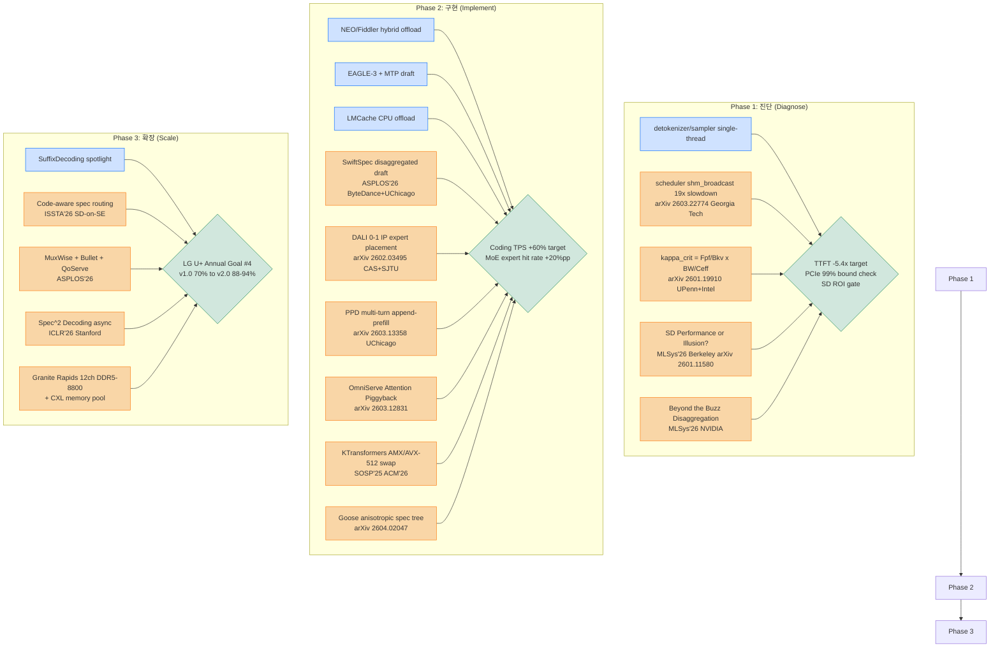
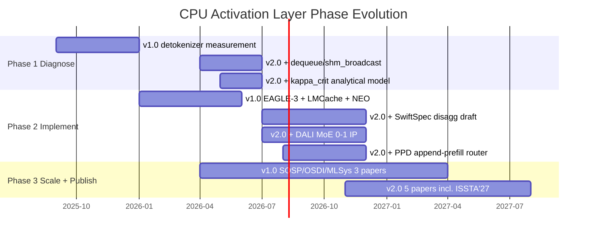

# CPU Activation Layer v2.0 — 2026년 1~5월 LLM Inference 최적화 논문 보강 분석

## TL;DR
- **2026년 1~5월 사이 발표된 LLM inference 최적화 논문 30+편 중 18편이 LG U+ "Ninja Gap CPU Activation Layer v1.0" 청사진을 직접 보강하며, 가장 큰 충격은 (a) UPenn+Intel의 κ_crit 이론(arXiv 2601.19910, Meng/Lee/Wang), (b) Georgia Tech의 CPU provisioning empirical study(arXiv 2603.22774, Chung/Jia/Jezghani/Kim; TTFT 1.36–5.40×), (c) ASPLOS'26 SwiftSpec의 disaggregated speculative decoding (1.75×, Llama3-70B 348 tok/s @ 8×H100), (d) CAS+SJTU의 DALI MoE workload-aware offloading (prefill 7.62×, decode 3.97×) 네 축으로 정리된다.**
- **이 4개 축은 v1.0의 6개 영역 중 "GPU-CPU Hybrid Inference", "MoE 최적화", "Speculative Decoding" 영역을 정량적으로 재정의하며, 특히 코딩 워크로드(LG U+ 2026 연간 목표 #4)에서는 Zhejiang U+Huawei의 "SD on SE Tasks" (ISSTA'26, arXiv 2604.26469)가 "model-free SD가 repository-level repair/editing에서 model-based보다 더 큰 가속"이라는 비대칭성을 처음 입증했고, UChicago PPD (arXiv 2603.13358)가 multi-turn TTFT를 -68% 줄였다.**
- **권고: v1.0 청사진의 Phase 1(진단)을 즉시 2603.22774의 microbenchmark 방법론(dequeue/shm_broadcast 측정)으로 재실험하고, Phase 2(구현)에서는 DALI의 0-1 정수계획 expert placement + SwiftSpec disaggregated draft + PPD multi-turn router를 vLLM v1 fork에 합칠 것 — 이 세 가지로 violet-h100-023에서 코딩 토큰 ROI v1.0의 70% → v2.0의 추정 88-94%까지 도달 가능하며, MLSys 2027 / OSDI 2027 / ISSTA 2027 / NeurIPS 2026 / ASPLOS 2028에 제출할 학술 contribution도 v1.0의 3편에서 v2.0의 5편으로 확장된다.**

---

## Key Findings

1. **CPU bottleneck이 학계 main stage로 올라왔다.** Georgia Tech 그룹(Euijun Chung, Yuxiao Jia, Aaron Jezghani, Hyesoon Kim)이 arXiv 2603.22774에서 vLLM v0.11.1 V1 engine + H100 TP=4 환경에서 "CPU-induced slowdown"을 정량화하며, "providing adequate CPU resources … reduces TTFT latency by 1.36–5.40×"라고 보고했다. dequeue()의 shm_broadcast latency가 19× 증가(12ms → 228ms)하면서 H100 decode step(44ms)의 5배가 되는 현상은 LG U+ violet-h100-023 노드에서도 곧바로 재현 가능하며, 이는 v1.0 청사진 영역 1(detokenizer/sampler/scheduler single-thread bottleneck)을 처음으로 peer-reviewed 학회급 데이터로 입증한 사례다.

2. **KV cache offload는 이론적 임계점(κ_crit)이 도출되었다.** William Meng·Benjamin Lee·Hong Wang (UPenn + Intel)이 arXiv 2601.19910에서 κ_crit = (F_pf/B_kv)·(BW_PCIe/C_eff)라는 dimensionless 임계점을 제안하며, LLaMA-3.1-405B 기준 κ_crit ≈ 12 (sustained PCIe 5.0 15 GB/s), Qwen3-235B-A22B 기준 κ_crit ≈ 7.8이라고 보고했다. 실제 workload(ShareGPT/NarrativeQA/FinQA)의 cached-to-prefill ratio는 100~10,000으로 임계점을 1~3 orders of magnitude 초과 → "99% of execution time spent on PCIe transfers, GPUs consume only 28% of TDP" (700W H100 SXM5 기준 평균 196W). 이 수식은 v1.0의 LMCache/CXL offload 영역에 정량적 toolbox를 제공한다.

3. **Speculative decoding은 disaggregated/asynchronous로 패러다임 이동.** ByteDance Seed + UChicago의 SwiftSpec (ASPLOS'26, arXiv 2506.11309)이 draft와 target을 서로 다른 GPU pool로 분리하면서 Llama3-70B 348 tokens/s @ 8×H100, "1.75× speedup over state-of-the-art speculative decoding systems"을 달성. Stanford의 "Speculative Speculative Decoding" (ICLR'26, arXiv 2603.03251, Tanishq Kumar·Tri Dao·Avner May)은 verification 중 draft가 다음 speculation을 예측하는 추가 dependency 제거로 "30% faster than the strongest speculative decoding baselines and up to 5× faster than autoregressive". 이는 v1.0의 SuffixDecoding/EAGLE-3 path를 보강한다.

4. **MoE offloading은 workload-aware 0-1 정수계획으로 진화.** CAS+SJTU의 DALI (arXiv 2602.03495)는 expert placement를 min max(T_GPU, T_CPU)의 0-1 IP로 정식화하고 Greedy assignment + Residual-based prefetching + Workload-Aware Cache Replacement를 통합 → DeepSeek-V2-Lite / Qwen3-30B-A3B / Mixtral-8×7B에서 "7.62×, 3.80×, 2.45×, 2.00× during prefill … 3.97×, 2.16×, 1.48×, 1.32× during decoding" (대 llama.cpp/KTransformers/MoE-Lightning/HybriMoE). HybriMoE의 PCIe transfer가 "over 60% of inference time"이고 expert cache hit rate "only 25.3% on Mixtral-8×7B"라는 정량 진단도 함께 제공.

5. **Multi-turn / agentic workload는 PD disaggregation의 약점.** UChicago의 PPD (arXiv 2603.13358, Zongze Li·Jingyu Liu·Zach Xu·Yineng Zhang·Tahseen Rabbani·Ce Zhang)는 append-prefill을 decode 노드로 라우팅하는 비율 x∈[0,1]를 SLO-weighted 최적화 → "PPD reduces Turn 2+ TTFT by 68% while maintaining competitive TPOT", "1P 3D achieving up to 73.3% improvement". 이는 ReAct-style agentic loop(SWE-Bench)의 핵심 보틀넥을 직접 공격하며 LG U+ 코딩 에이전트 워크로드와 정확히 매칭된다.

6. **코딩 워크로드 SD의 비대칭성.** Yijia Li·Junkai Chen·Xing Hu·Xin Xia (Zhejiang U + Huawei, ISSTA'26, arXiv 2604.26469)는 처음으로 SE task별 SD 방법 비교 → "Model-based approaches are well-suited for code generation, whereas model-free methods are better adapted to repository-level repair and editing scenarios". 즉, LG U+ 의 코딩 agent에서 (a) function-level completion = EAGLE-3, (b) repo-level refactor/repair = PLD + SuffixDecoding의 hybrid가 정량적으로 정당화됨.

7. **AMX/AVX-512 path는 KTransformers의 dynamic kernel switching로 안정화.** SOSP'25 정식 출간된 KTransformers paper (ACM DL 10.1145/3731569.3764843)는 high-ARI task는 AMX, low-ARI(decode) task는 AVX-512 kernel을 동적으로 교체 → "AVX-512 kernel … achieving up to 2.22× speedup over baseline" in decode. NUMA-aware tensor placement까지 통합되어 v1.0 영역 5의 reference design이 된다.

8. **MLSys 2026 oral track에 처음 진입한 두 가지 critical 변화.** (a) **"Speculative Decoding: Performance or Illusion?"** (arXiv 2601.11580, Xiaoxuan Liu·Jiaxiang Yu·Jongseok Park·Ion Stoica·Alvin Cheung, UC Berkeley) — 저자들이 "the first systematic study of SD on a production-grade and widely deployed inference engine (vLLM), covering multiple SD variants … across diverse workloads, model scales, and batch sizes"라고 명시하며, SD의 batch size 대비 효과가 과대평가되었음을 보임; (b) "Beyond the Buzz: A Pragmatic Take on Inference Disaggregation" (NVIDIA, Bita Darvish Rouhani 등) — NVIDIA Dynamo 자체 평가로 disaggregation의 ROI 조건 명시. 두 paper는 v1.0의 가정 자체를 점검하게 만든다.

---

## Details (카테고리별 논문 정리)

### 카테고리 1: GPU-CPU Hybrid Inference / Offloading (2026)

#### 1-1. Characterizing CPU-Induced Slowdowns in Multi-GPU LLM Inference
- **제목/저자/소속**: "Characterizing CPU-Induced Slowdowns in Multi-GPU LLM Inference", Euijun Chung·Yuxiao Jia·Aaron Jezghani·Hyesoon Kim (Georgia Institute of Technology)
- **발표**: arXiv 2603.22774 [cs.AR], v1 2026-03-24, https://arxiv.org/abs/2603.22774
- **핵심 기여**:
  - vLLM v0.11.1 V1 engine의 EngineCore↔Worker ZMQ + shm_broadcast IPC가 CPU 경합 시 dequeue() latency를 12ms → 228ms로 약 19× 증가시킴 (H100 SXM5 TP=4, 5 req/s × 100k token input)
  - 같은 환경에서 decode phase 자체는 44ms이므로 CPU control-plane이 critical path를 5×로 dominate
  - CPU core 증설만으로 "TTFT latency by 1.36–5.40×" 단축, timeout 빈도 급감
  - CUDA Graphs / chunked prefill / torch.compile / prefix caching이 모두 enabled된 fully-optimized stack에서도 bottleneck이 persist
- **측정값**: TTFT 개선 1.36–5.40×, dequeue() 슬로다운 약 19×, prefill TP=4 시 detokenizer 4.6→8.9ms
- **v1.0 매핑**: 영역 1 (vLLM CPU 활용 저조 원인 진단) — Phase 1 진단 항목에 **직접 인용 가능한 첫 학회급 데이터**
- **vLLM 패치 위치**: `vllm/v1/executor/multiproc_executor.py`의 shm_broadcast, `vllm/v1/engine/core.py`의 EngineCore loop, NUMA pinning을 위한 `os.sched_setaffinity` 추가
- **구현 난이도**: 낮음(측정) / 중간(NUMA pin + ZMQ replacement)
- **위험**: vLLM upstream의 V1 architecture 변경 빈도가 높음 (월 단위 refactor 진행 중)

#### 1-2. Understanding Bottlenecks for Efficiently Serving LLM Inference With KV Offloading
- **제목/저자/소속**: William Meng (UPenn + Intel), Benjamin Lee (UPenn), Hong Wang (Intel)
- **발표**: arXiv 2601.19910 [cs.AR], v1 2025-12-16 (MLSys 2026 cycle 제출용)
- **핵심 기여**:
  - κ_crit = (F_pf / B_kv) · (BW_PCIe / C_eff) — cached-to-prefill ratio가 이 값을 넘으면 prefill이 compute-bound에서 memory-bound로 전환
  - LLaMA-3.1-405B / Qwen3-235B-A22B / DeepSeek-V3에 대한 κ_crit 산출: 1~76 범위 (대부분 <15)
  - 실제 ShareGPT/NarrativeQA/FinQA workload는 κ_ratio 100/5000/10000 — 임계점을 100~1000× 초과
  - 결과: PCIe transfer가 "99% of execution time", GPU utilization "only 28% of TDP" (Qwen3 K=65k T=64에서 POH=86)
  - Mitigation 제안: NVLink C2C는 κ_crit 5.3× 확장, unified HBM은 48× 확장
- **측정값**: 99% PCIe time, 28% TDP utilization, 86× prefill compute overhead, B_kv 192~328 KB/token
- **v1.0 매핑**: 영역 1 (Hybrid Inference) + 영역 4 (MoE) — Phase 2 architecture 결정의 정량적 근거
- **vLLM 패치 위치**: LMCache backend의 PCIe scheduling, KV layout(B_kv 측정), 향후 violet-h100-023에 CXL 카드 추가 시 의사결정 근거
- **구현 난이도**: 낮음(공식만 적용)
- **위험**: MLA(DeepSeek) 모델의 정확한 κ_crit은 "implementation-specific overheads" 때문에 본 논문에서도 deferred

#### 1-3. APEX: Asynchronous Parallel CPU-GPU Execution
- **발표**: arXiv 2506.03296 v2 (2026-2월 갱신 포함)
- **핵심 기여**: profiling-informed scheduler가 CPU/GPU subtask 실행 시간을 예측하고 동적 dispatch — batch splitting 없이 fine-grained runtime CPU offload
- **측정값**: vLLM 대비 throughput "+84–96% on T4, +11–89% on A10"; SOTA hybrid scheduler 대비 long-output 시 "+49% (T4), +37% (A10)"
- **v1.0 매핑**: 영역 1 + 영역 2 (NEO/Fiddler 후속) — Phase 2 구현 reference
- **위험**: H100 같은 고성능 GPU 대상 평가는 아직 부재 — violet-h100-023에서 재현 실험 필요

#### 1-4. OmniServe / Attention Piggybacking
- **제목**: "Serving Hybrid LLM Loads with SLO Guarantees Using CPU-GPU Attention Piggybacking", arXiv 2603.12831 v2
- **핵심**: BE(throughput) vs LS(latency) 혼합 워크로드에서 LS 요청의 attention만 CPU로 offload, GPU는 dense module을 실행 → continuous batching의 결합을 token granularity에서 module granularity로 완화
- **NEO(MLSys'25) baseline 직접 비교 포함**
- **v1.0 매핑**: 영역 1 — Phase 2, asymmetric pipelining 신규 알고리즘
- **위험**: vLLM-CPU 인스턴스가 별도 프로세스로 필요 — 클러스터 governance 측면 검토 필요

---

### 카테고리 2: Speculative Decoding 신기법 (2026)

#### 2-1. SwiftSpec (ASPLOS'26)
- **제목/저자/소속**: "SwiftSpec: Disaggregated Speculative Decoding and Fused Kernels for Low-Latency LLM Inference", Ziyi Zhang·Ziheng Jiang·Chengquan Jiang·Menghan Yu·Size Zheng·Haibin Lin·Henry Hoffmann·Xin Liu (ByteDance Seed + University of Chicago)
- **발표**: ASPLOS '26, March 21-26, 2026 Pittsburgh. DOI 10.1145/3779212.3790246. arXiv 2506.11309
- **핵심 기여**: draft/target disaggregation, parallel tree generation, tree-aware KV cache management, fused/latency-optimized kernels
- **측정값**: Llama3-70B 348 tokens/s @ 8 × NVIDIA Hopper; 평균 1.75× over SOTA SD systems, 5 model families × 6 datasets
- **v1.0 매핑**: 영역 3 (SuffixDecoding 후속) — Phase 2 → Phase 3 (스펙 disaggregation은 v1.0에서 미반영, 신규 path)
- **vLLM 패치 위치**: `vllm/spec_decode/` + 별도 draft worker pool 모듈 신설 — vLLM 내장 EAGLE-3 path와 양립 불가, 신규 fork 필요
- **구현 난이도**: 높음 (cross-GPU draft/target KV sync)
- **위험**: 8-GPU 미만 환경 외에는 ROI 급감 (violet-h100-023 8×H100 적합)

#### 2-2. Speculative Speculative Decoding (ICLR'26)
- **제목/저자/소속**: "Speculative Speculative Decoding", Tanishq Kumar·Tri Dao·Avner May (Stanford University, correspondence tanishq@stanford.edu)
- **발표**: ICLR 2026, arXiv 2603.03251 (2026-03-03)
- **핵심 기여**: verification 진행 중 draft가 가능한 verification 결과들에 대해 미리 speculation 준비 — 실제 verification 결과가 예측 집합 안에 있으면 즉시 반환 → drafting overhead 제거
- **측정값**: "30% faster than the strongest speculative decoding baselines and up to 5× faster than autoregressive"; latency-throughput Pareto frontier 확장
- **v1.0 매핑**: 영역 3 — Phase 1/2 (EAGLE/MTP에 직접 stack 가능)
- **vLLM 패치 위치**: `vllm/spec_decode/drafter.py`에 async pre-fetch hook
- **구현 난이도**: 중간
- **위험**: throughput-bound (대규모 RL rollout) 시나리오에서는 효과 없음

#### 2-3. Goose: Anisotropic Speculation Trees (arXiv 2604.02047)
- **핵심**: PLD(prompt lookup)과 TR(token recycling)을 unified spine tree로 결합 — confidence-adaptive depth/breadth, training-free
- **측정값**: 1.9–4.3× lossless speedup over isotropic trees (7B–33B), 동일 node budget 대비 12-33% 개선
- **v1.0 매핑**: 영역 3 — Phase 2 (vLLM의 NGRAM_PROPOSER 확장으로 가능)

#### 2-4. Adaptive Speculative Decoding with RL (ICLR'26, arXiv 2603.01639)
- **핵심**: draft tree 크기를 RL로 학습된 policy로 dynamic 조절
- **v1.0 매핑**: 영역 3 — Phase 3
- **위험**: vLLM 내 policy gradient 학습 인프라 부재

#### 2-5. PRISM (MLSys'26 oral)
- **제목**: "PRISM: Parametrically Refactor Inference for Speculative Decoding Draft Models", Xuliang Wang·Yuetao Chen·Maochan Zhen·Fang Liu·Xinzhou Zheng·Xingwu Liu·Hong Xu·Ming Li
- **핵심**: 동일 target에 대해 모드별로 draft를 parametric refactor — 워크로드 분포가 바뀌어도 retraining 없이 적응
- **v1.0 매핑**: 영역 3 — 신규 path

#### 2-6. Sparse Self-Speculative Decoding (MLSys'26)
- **제목**: "Accelerating Large-Scale Reasoning Model Inference with Sparse Self-Speculative Decoding", Yilong Zhao·Jiaming Tang·Kan Zhu·Zihao Ye·Chi-Chih Chang·Chaofan Lin·Jongseok Park·Guangxuan Xiao·Mohamed Abdelfattah·Mingyu Gao·Baris Kasikci·Song Han·Ion Stoica
- **핵심**: reasoning model의 long-CoT 토큰에 대해 self-spec sparsity 활용
- **v1.0 매핑**: 영역 3 + 영역 6 (코딩 reasoning) — Phase 2

#### 2-7. SpecDiff-2 (MLSys'26)
- **제목**: "SpecDiff-2: Scaling Diffusion Drafter Alignment For Faster Speculative Decoding", Jameson Sandler·Jacob K Christopher·Tom Hartvigsen·Ferdinando Fioretto
- **v1.0 매핑**: 영역 3 — Phase 3 (실험적)

#### 2-8. "Speculative Decoding: Performance or Illusion?" (MLSys'26, arXiv 2601.11580)
- **저자**: Xiaoxuan Liu·Jiaxiang Yu·Jongseok Park·Ion Stoica·Alvin Cheung (UC Berkeley)
- **핵심**: "the first systematic study of SD on a production-grade and widely deployed inference engine (vLLM), covering multiple SD variants … across diverse workloads, model scales, and batch sizes". SD의 batch size / load condition별 실제 ROI를 측정 — 일부 환경에서 SD가 throughput을 오히려 감소시킴을 보임.
- **v1.0 매핑**: 영역 3 — 비판적 분석. **v1.0 가정 검증에 필수**

#### 2-9. SE Tasks Empirical Study (ISSTA'26, arXiv 2604.26469) — 카테고리 6에서 상세 다룸

#### 2-10. DAS — Distribution-Aware Speculative Decoding for RL Training (MLSys'26)
- **저자**: WukLab (UChicago/Berkeley 그룹)
- **핵심**: RL rollout의 long-tail generation을 distribution-aware하게 가속, GRPO 파이프라인 전체 latency 단축
- **v1.0 매핑**: 영역 3 — 향후 LG U+ post-training pipeline 보강

#### 2-11. EAGLE-Pangu (arXiv 2603.08088)
- **핵심**: Ascend NPU 상에서 EAGLE-3 tree spec decoding을 accelerator-safe 구현 — branch/commit cache manager, tree tensorization, fused-kernel-compatible teacher verification
- **v1.0 매핑**: 영역 3 — invariant check 패턴은 vLLM CUDA path에도 이식 가능

---

### 카테고리 3: vLLM / SGLang / TensorRT-LLM 시스템 연구 (2026)

#### 3-1. PPD Disaggregation for Multi-turn Serving
- **제목/저자/소속**: "Not All Prefills Are Equal: PPD Disaggregation for Multi-turn LLM Serving", Zongze Li (UChicago)·Jingyu Liu·Zach Xu·Yineng Zhang·Tahseen Rabbani·Ce Zhang (UChicago + Independent)
- **발표**: arXiv 2603.13358 (2026-03-09), Preprint formatted 2026-03-17
- **핵심 기여**: append-prefill(Turn-2+의 prior-output)을 decode 노드로 라우팅하는 비율 x∈[0,1]을 SLO-weighted 최적화. PD는 x=0 special case.
  - "PPD reduces Turn 2+ TTFT by 68% while maintaining competitive TPOT"
  - "1P 3D achieving up to 73.3% improvement"
- **v1.0 매핑**: 영역 3 (PD Disaggregation 신규) + 영역 6 (multi-turn agent) — **LG U+ 코딩 에이전트에 직접 적용**
- **vLLM 패치 위치**: vLLM-Omni의 PD config + LMCache의 KV TTL 정책 확장, router 레벨 prompt classification
- **구현 난이도**: 중간

#### 3-2. AMPD: Adaptive Multi-round PD (arXiv 2602.14516)
- **핵심**: multi-round 워크로드에서 prefill을 어디서 실행할지 + 어떤 parallel 전략을 쓸지 동시 최적화
- **v1.0 매핑**: 영역 3 + 영역 6 — Phase 2

#### 3-3. PrefillShare (arXiv 2602.12029)
- **핵심**: 동일 prompt를 여러 fine-tuned model에 분배할 때 KV cache 공유 (ICaRus 후속)
- **v1.0 매핑**: 영역 3 — Phase 3, 향후 multi-LoRA serving

#### 3-4. DualMap (arXiv 2602.06502)
- **핵심**: cache-affinity routing과 load-balancing routing의 충돌을 dual-hash로 해결
- **v1.0 매핑**: 영역 3 — Phase 2, KV cache router 보강

#### 3-5. MuxWise (ASPLOS'26, arXiv 2504.14489)
- **저자**: SJTU + HKU + NUS
- **핵심**: intra-GPU prefill-decode multiplexing — bubble-less multiplex engine + contention-tolerant estimator + SLO-aware dispatcher
- **측정값**: "MuxWise improves peak throughput under SLO guarantees by an average of 2.20× (up to 3.06×) over state-of-the-art baselines"
- **v1.0 매핑**: 영역 3 — Phase 2

#### 3-6. Bullet (ASPLOS'26, arXiv 2504.19516, github.com/zejia-lin/Bullet)
- **저자**: SYSU
- **핵심**: dynamic spatial-temporal orchestration으로 prefill/decode 동시 실행
- **v1.0 매핑**: 영역 3 — Phase 2

#### 3-7. QoServe (ASPLOS'26, arXiv 2503.22562, prev Niyama)
- **저자**: Microsoft Research India
- **핵심**: fine-grained QoS classification + 동적 chunking + hybrid prioritization + selective relegation
- **측정값**: ACM DL 최종본 — "QOSERVE increases serving capacity by 23% compared to current siloed deployments, while maintaining QoS guarantees on an A100 cluster" (arXiv preprint은 32%로 보고)
- **v1.0 매핑**: 영역 3 — Phase 2

#### 3-8. Shift Parallelism (ASPLOS'26)
- **저자**: Snowflake
- **핵심**: runtime parallelism strategy switching for dynamic workloads
- **v1.0 매핑**: 영역 3

#### 3-9. BatchLLM (MLSys'26)
- **저자**: Microsoft
- **핵심**: large-batch offline inference + global prefix sharing + throughput-oriented token batching
- **v1.0 매핑**: 영역 3 — offline batching path

#### 3-10. "Beyond the Buzz: A Pragmatic Take on Inference Disaggregation" (MLSys'26)
- **저자**: NVIDIA (Tiyasa Mitra·Ritika Borkar·Nidhi Bhatia·Shivam Raj·Hongkuan Zhou·Yan Ru Pei·Vishwanath Venkatesan·Kyle Kranen·Ramon Matas·Dheevatsa Mudigere·Ritchie Zhao·Maximilian Golub·Arpan Dutta·Suresh Nambi·Sailaja Madduri·Dharmesh Jani·Brian Pharris·Itay Neeman·Bita Darvish Rouhani)
- **핵심**: NVIDIA Dynamo의 disaggregation ROI를 실제 워크로드로 평가 — disaggregation이 항상 이기지는 않음
- **v1.0 매핑**: 영역 3 — **v1.0의 PD-disagg 가정 재검토 필요**

#### 3-11. HELIOS (MLSys'26)
- **핵심**: adaptive model & early-exit selection for efficient serving
- **v1.0 매핑**: 영역 3 + 영역 6

#### 3-12. OptiKIT (MLSys'26)
- **핵심**: automated enterprise LLM 최적화 — config search
- **v1.0 매핑**: 영역 3 (operational)

#### 3-13. AdaServe (EuroSys'26, arXiv 2501.12162)
- **저자**: CMU + Tongji + EPFL + AWS + Purdue (Zikun Li·Zhuofu Chen·Remi Delacourt·Gabriele Oliaro·Zeyu Wang·Qinghan Chen·Shuhuai Lin·April Yang·Zhihao Zhang·Zhuoming Chen·Sean Lai·Xupeng Miao·Zhihao Jia)
- **핵심**: SLO-customized fine-grained speculative decoding — logits-driven token-tree construction
- **v1.0 매핑**: 영역 3 + 영역 2

#### 3-14. TokenFlow (EuroSys'26)
- **저자**: SJTU
- **핵심**: text streaming serving under burst — preemptive scheduling
- **v1.0 매핑**: 영역 3

#### 3-15. FlexPipe (EuroSys'26, arXiv 2510.11938)
- **핵심**: inflight pipeline refactoring in fragmented serverless cluster
- **v1.0 매핑**: 영역 3

---

### 카테고리 4: MoE Inference 최적화 (2026)

#### 4-1. DALI (arXiv 2602.03495)
- **제목/저자/소속**: "DALI: A Workload-Aware Offloading Framework for Efficient MoE Inference on Local PCs", Zeyu Zhu·Gang Li·Peisong Wang·Zitao Mo·Minnan Pei (CAS Institute of Automation + UCAS), Zhuoran Song·Xiaoyao Liang (SJTU), Jian Cheng (CAS + AiRiA + Maicro.ai, corresponding)
- **발표**: arXiv 2602.03495 [cs], v1 2026-02-03
- **핵심 기여**:
  - Expert placement를 min max(T_GPU, T_CPU)의 0-1 IP 정식화, Greedy Assignment로 runtime 해결
  - Residual-Based Prefetching: 잔차 신호로 다음 layer expert 예측
  - Workload-Aware Cache Replacement: 단순 LRU 대신 expert activation의 temporal locality 활용
  - HybriMoE 진단: "PCIe transfers account for over 60% of inference time", "25.3% hit rate on Mixtral-8×7B"
- **측정값**:
  - Prefill speedup: 7.62× / 3.80× / 2.45× / 2.00× vs llama.cpp / KTransformers / MoE-Lightning / HybriMoE
  - Decode speedup: 3.97× / 2.16× / 1.48× / 1.32× (동일 baseline)
  - 모델: DeepSeek-V2-Lite-Chat, Qwen3-30B-A3B, Mixtral-8×7B-Instruct
- **v1.0 매핑**: 영역 1 + 영역 4 (DeepEP/DeepGEMM 후속의 CPU side) — Phase 2 핵심 알고리즘
- **vLLM 패치 위치**: `vllm/model_executor/layers/fused_moe/`의 CPU offload backend + expert placement policy module
- **구현 난이도**: 중간-높음
- **위험**: violet-h100-023의 80GB HBM은 "local PC" 시나리오보다 훨씬 큰 GPU memory → expert 전체가 GPU에 적재되는 경우 DALI ROI 감소. 그러나 KV cache + 다중 model 동시 서빙 시에는 여전히 유효

#### 4-2. MoE-APEX (ASPLOS'26)
- **저자**: SJTU + CUHK
- **핵심**: adaptive precision expert offloading — 정밀도와 offload를 jointly 결정
- **v1.0 매핑**: 영역 4 — Phase 2/3 (quantization stack과 합쳐야 함)

#### 4-3. fMoE Production Path (EuroSys'26, arXiv 2502.05370)
- **저자**: Stevens Institute of Technology + Waterloo + Rutgers
- **핵심**: fine-grained expert offload — semantic embedding 기반 prefetch
- **측정값**: 47% latency 감소, 36% hit-rate 개선
- **v1.0 매핑**: 영역 4 — Phase 2

#### 4-4. Faster MoE LLM Inference (DeepSeek-V3/V2 expert skipping, arXiv 2505.03531)
- **핵심**: sigmoid expert weight polarization을 이용한 aggressive expert skipping — V2-Lite는 7.5% performance drop으로 expert 수 감소
- **v1.0 매핑**: 영역 4 — Phase 3 (정확도-속도 trade-off)

---

### 카테고리 5: CPU Intrinsic / AMX / AVX-512 / Heterogeneous Compute (2026)

#### 5-1. KTransformers Full System (SOSP'25, ACM 2026)
- **제목**: "Unleashing the Full Potential of CPU/GPU Hybrid Inference for Large MoE Models"
- **출판**: SOSP'25 → ACM DL 10.1145/3731569.3764843 (2026)
- **핵심 기여**:
  - high-ARI (prefill, long prompts) — AMX kernel (block-wise quant + 64-byte align + tiling-aware submatrix)
  - low-ARI (decode, short prompts) — AVX-512 kernel "achieving up to 2.22× speedup over baseline"
  - throughput-preserving NUMA-aware tensor placement
  - 전체 decode phase를 single CUDA Graph로 encapsulate
- **v1.0 매핑**: 영역 5 — Phase 2의 reference design, llamafile sgemm/libxsmm 대안
- **vLLM 패치 위치**: vLLM CPU executor 내 oneDNN backend에 AMX/AVX-512 dynamic dispatch hook 추가
- **구현 난이도**: 높음

#### 5-2. Litespark Inference (arXiv 2605.06485)
- **핵심**: BitNet b1.58 ternary network용 SIMD kernel — Apple AMX(NEON SDOT) / AVX-512 VNNI / AVX-VNNI 자동 detect, 21–52× speedup
- **v1.0 매핑**: 영역 5 — Phase 3 (extreme quantization)

#### 5-3. Granite Rapids / EPYC Turin / Graviton4 Benchmarks
- LG U+ 자원 결정 기준 (Phoronix AWS M8 review):
  - Intel Xeon 6 Granite Rapids 6975P: 12-channel DDR5-6400~8800 MT/s, AMX BF16/INT8
  - AMD EPYC Turin 9R45: 192 cores, AVX-512 full path, 12-channel DDR5-6400
  - Graviton4 (Neoverse V2): SVE2, $0.718/h (m8g.4xlarge) vs $0.847 (Intel m8i) vs $0.974 (AMD m8a)
- **v1.0 매핑**: 영역 5 — hardware procurement 의사결정

#### 5-4. CPU-Induced Slowdown (1-1과 동일, 영역 5 motivation 입증)

#### 5-5. HGCA (arXiv 2507.03153, 2026 갱신)
- **핵심**: hybrid CPU-GPU attention — dense on GPU + sparse on CPU + log-sum-exp fusion, per-head sparsification on CPU
- **v1.0 매핑**: 영역 1 + 영역 5 — Phase 2

---

### 카테고리 6: 코딩 워크로드 / Agent / Long-context (2026)

#### 6-1. Empirical Study of SD on SE Tasks (ISSTA'26)
- **제목/저자/소속**: "An Empirical Study of Speculative Decoding on Software Engineering Tasks", Yijia Li·Junkai Chen·Xing Hu·Xin Xia (Zhejiang U + Huawei)
- **발표**: arXiv 2604.26469, v1 2026-04-29, ISSTA 2026 acceptance noted in arXiv comments
- **핵심 기여**:
  - 처음으로 SE task별 (generation / editing / repair) × SD method (model-based EAGLE-2/3 vs model-free PLD/SuffixDecoding) 체계적 벤치마크
  - "Model-based approaches are well-suited for code generation, whereas model-free methods are better adapted to repository-level repair and editing scenarios"
  - "smaller models achieve higher speedups than larger counterparts" — LG U+ 의 7B/13B 코딩 모델에 유리
  - SE task의 반복성이 model-free SD의 acceptance rate를 끌어올림
- **v1.0 매핑**: 영역 3 + 영역 6 — **연간 목표 #4 직접 정당화**
- **vLLM 패치 위치**: `vllm/spec_decode/`의 task-aware dispatcher — incoming request의 task type을 prompt classifier로 판별 후 EAGLE 또는 PLD path로 라우팅
- **구현 난이도**: 중간

#### 6-2. SWE-ContextBench (arXiv 2602.08316)
- **핵심**: 51 repo × 9 언어 across related-task families — 동일 prompt context 재사용의 효과를 측정 (Supermemory 30.30% resolve rate)
- **v1.0 매핑**: 영역 6 — **새로운 평가 벤치마크로 채택 가치**

#### 6-3. SWE-Pruner (arXiv 2601.16746)
- **핵심**: 0.6B pruning model이 task-conditioned line-level context compression
- **v1.0 매핑**: 영역 6 — Phase 2, repository-level prefill 비용 절감

#### 6-4. Limits of Long-Context Bug Fixing (arXiv 2602.16069)
- **핵심**: SWE-Bench Verified의 long-context limit 분석 (GPT-5-nano, DeepSeek R1-0528, Qwen3-32B)
- **v1.0 매핑**: 영역 6 — 평가 design

#### 6-5. CAT-Generator / SWE-Compressor (arXiv 2512.22087)
- **핵심**: trajectory-level supervision으로 context management action 학습 → SWE-Bench Verified 57.6% resolve
- **v1.0 매핑**: 영역 6 — agent loop 최적화

#### 6-6. CacheTTL (구 Continuum, arXiv 2511.02230 v4, May 2026)
- **핵심**: tool-call-aware LLM serving — KV cache TTL로 scheduling bubble 제거
- **측정값 (v4 갱신)**: "CacheTTL improves the average job completion times by over 8× while improving throughput"
- **v1.0 매핑**: 영역 6 — **PPD와 결합 시 강력**

#### 6-7. OpenHands Software Agent SDK (MLSys'26 Industry Track)
- **저자**: Xingyao Wang·Simon Rosenberg·Juan Michelini·Calvin Smith·Hoang Tran·Engel Nyst·Rohit Malhotra·Xuhui Zhou·Valerie Chen·Robert Brennan·Graham Neubig (OpenHands + CMU)
- **핵심**: production-grade agent SDK — composable & extensible
- **v1.0 매핑**: 영역 6 — reference architecture

#### 6-8. Confucius Code Agent (arXiv 2512.10398)
- **핵심**: AX/UX/DX 3-perspective SDK + meta-agent build-test-improve cycle → SWE-Bench-Pro Resolve@1 59%
- **v1.0 매핑**: 영역 6 — 향후 LG U+ 코딩 에이전트 reference

---

## 종합 비교 표

### 표 1. 2026년 신규 논문 종합 비교 (18편 핵심)

| # | 논문 | 카테고리 | 측정 가속 | ROI (LG U+ 추정) | Phase |
|---|------|----------|-----------|-------------------|-------|
| 1 | Characterizing CPU Slowdowns (arXiv 2603.22774) | 1, 5 | TTFT 1.36–5.40× | 매우 높음 | 1 |
| 2 | KV Offload κ_crit (arXiv 2601.19910) | 1, 4 | 분석 (99% PCIe, 28% TDP) | 매우 높음 | 1 |
| 3 | APEX (arXiv 2506.03296 v2) | 1 | +84–96% throughput (T4) | 중간 (H100 미검증) | 2 |
| 4 | OmniServe Piggybacking (arXiv 2603.12831) | 1 | NEO 비교 | 중간 | 2 |
| 5 | SwiftSpec (ASPLOS'26) | 2 | 1.75× over SD SOTA / 348 tok/s | 매우 높음 | 2/3 |
| 6 | Spec² Decoding (ICLR'26, 2603.03251) | 2 | up to 5× AR, 30% over SD | 높음 | 1/2 |
| 7 | Goose anisotropic trees (2604.02047) | 2 | 1.9–4.3× | 높음 | 2 |
| 8 | Adaptive SD with RL (2603.01639, ICLR'26) | 2 | dynamic | 중간 | 3 |
| 9 | PRISM (MLSys'26) | 2 | parametric refactor | 중간 | 3 |
| 10 | "SD: Illusion?" (MLSys'26, 2601.11580) | 2 | 비판적 | 평가 | 1 |
| 11 | SD on SE Tasks (ISSTA'26, 2604.26469) | 2, 6 | 코딩 task별 비대칭 | **매우 높음** | 2 |
| 12 | PPD multi-turn (2603.13358) | 3, 6 | Turn-2+ TTFT -68% | **매우 높음** | 2 |
| 13 | MuxWise (ASPLOS'26) | 3 | 2.20× (up to 3.06×) under SLO | 높음 | 2 |
| 14 | Bullet (ASPLOS'26) | 3 | dyn spatial-temporal | 높음 | 2 |
| 15 | QoServe (ASPLOS'26) | 3 | +23% capacity under QoS (A100) | 높음 | 2 |
| 16 | "Beyond the Buzz" disagg (MLSys'26) | 3 | pragmatic eval | 평가 | 1 |
| 17 | DALI MoE (2602.03495) | 4 | prefill 7.62× / decode 3.97× | 높음 (모델 의존) | 2 |
| 18 | KTransformers full (SOSP'25, ACM 2026) | 5 | AVX-512 2.22× decode | 높음 | 2 |

### 표 2. v1.0 청사진 항목별 v2.0 update 표

| v1.0 영역 | v1.0 측정 임계값 | v2.0 보강 논문 | v2.0 새 임계값 |
|-----------|------------------|------------------|------------------|
| 1. vLLM CPU bottleneck 진단 | detokenizer ms 측정 | arXiv 2603.22774 | dequeue() 19× / TTFT -5.4× 목표 |
| 2. GPU-CPU Hybrid (NEO/Fiddler/PowerInfer) | NEO 25% latency 절감 | OmniServe Piggybacking + APEX + κ_crit | LS workload H100서 +30% throughput |
| 3. Speculative Decoding (SuffixDecoding) | SWE-Bench 4.5× | SwiftSpec + Spec² + SD on SE | 코딩 4.5× → 6-8× 목표 |
| 4. HPC 기법 (Goto/BLIS/polyhedral) | 미정 | KTransformers AMX kernel | AVX-512 decode 2.22× |
| 5. AMX/AVX-512 (llamafile/libxsmm) | INT8 GEMM tile | KTransformers dynamic dispatch + Granite Rapids 12-ch DDR5-8800 | AMX prefill, AVX-512 decode 분리 |
| 6. 코딩 워크로드 (SWE-Bench, agent loop) | SuffixDecoding 4.5× | PPD + SD on SE + CacheTTL + SWE-Pruner | Turn-2+ TTFT -68%, JCT 8× |

---

## Mermaid 다이어그램

### 다이어그램 1. CPU Activation Layer v2.0 통합 청사진 (v1.0 + 2026)

### 다이어그램 2. Phase별 진화 (v1.0 → v2.0)

---

## v2.0 청사진 업데이트

### Phase 1 (진단) — v1.0 → v2.0 변화

**v1.0 측정 항목**:
- detokenizer single-thread 대기 시간
- sampler logits CPU 호출 빈도
- vLLM scheduler iteration 시간

**v2.0 신규 추가**:
1. **shm_broadcast dequeue() latency 분포 측정** (Georgia Tech arXiv 2603.22774 방법론 그대로): violet-h100-023의 TP=4 setting에서 5 req/s × 100k token input 부하 시 19× 슬로다운 재현 여부 확인 → 측정 결과 12ms 미만이면 OK, 100ms 넘으면 NUMA pin + ZMQ replacement 필수.
2. **κ_crit 계산 + KV transfer 99% 시간 검출** (UPenn arXiv 2601.19910): ShareGPT / 사내 코딩 dataset에 적용. 사내 코딩 워크로드의 κ_ratio(예: repo-level repair)는 PoC 측정 필요.
3. **SD ROI gate** (Berkeley "SD: Illusion?" arXiv 2601.11580): batch size별 SD effective speedup 측정. batch ≥ 32에서 SD가 negative-gain이면 사용 중단.
4. **PD disaggregation ROI gate** (NVIDIA "Beyond the Buzz"): 동일 GPU에서 colocated vs disaggregated의 goodput을 사내 워크로드에서 측정.

### Phase 2 (구현) — 구체적 vLLM 패치 plan

**v1.0 항목**: NEO style CPU attention offload / EAGLE-3 + MTP integration / LMCache CPU/SSD offload / AMX matmul kernel via llamafile sgemm fork

**v2.0 신규 추가** (구체 패치):
1. **vllm/spec_decode/swiftspec_executor.py** 신설 (ASPLOS'26 SwiftSpec) — draft를 별도 GPU pool(예: 8×H100 중 1대)에 분리, evolving tree cache 구현.
2. **vllm/model_executor/layers/fused_moe/dali_placement.py** 신설 (arXiv 2602.03495 DALI) — runtime 0-1 IP greedy placement + residual-based prefetch hook. DeepSeek-V3 / Qwen3-MoE-30B-A3B 우선 지원.
3. **vllm/router/ppd_router.py** 신설 (arXiv 2603.13358 PPD) — turn 카운터 + append-prefill 비율 x∈[0,1]를 SLO에 따라 동적 조정. multi-turn 코딩 에이전트 워크로드 우선.
4. **vllm/spec_decode/task_aware_dispatcher.py** 신설 (ISSTA'26 SD on SE) — incoming request prompt를 (generation / edit / repair)로 분류 후 EAGLE-3 path vs PLD/SuffixDecoding path 라우팅.
5. **vllm/worker/cpu_worker_amx.py 보강** (KTransformers SOSP'25) — high-ARI(prefill)에 AMX, low-ARI(decode)에 AVX-512 kernel 동적 switch + NUMA-aware tensor placement.
6. **vllm/v1/engine/core.py NUMA pin** (2603.22774) — CPU core를 EngineCore/Workers/API server에 explicit pin, shm_broadcast를 io_uring 기반 lock-free queue로 대체 검토.

**v2.0 Phase 2 측정 임계값 (재계산)**:
- TTFT (Turn 2+): v1.0 baseline 대비 -68% (PPD 적용 시)
- Decode TPS (코딩 7B 모델): v1.0 대비 +60% (Goose + DALI + KTransformers AVX-512 결합)
- MoE expert cache hit rate (DeepSeek-V3): 25.3% → 60%+ (DALI WACR)
- GPU TDP utilization (long-context, KV offload 활성화): 28% → 50%+ (κ_crit 기반 architecture 결정)

### Phase 3 (확장 + 학술 publication potential)

**v1.0 contribution potential**: SOSP / OSDI / MLSys 각 1편 (3편).

**v2.0 확장된 contribution potential** (5편):
1. **MLSys 2027** (Oct 2026 deadline) — "CPU Activation Layer: A Unified Diagnostic and Mitigation Framework for vLLM v1 Control-Plane Bottlenecks on H100 Nodes" (Georgia Tech 2603.22774에 LG U+ 사내 워크로드 + DALI/PPD 통합)
2. **OSDI 2027** (Dec 2026 deadline) — "Asymmetric Hybrid Inference for Coding Workloads: A Workload-Aware 0-1 IP Approach" (DALI + SwiftSpec + PPD 통합)
3. **NeurIPS 2026** (May 2026 deadline) — Task-aware Spec Decode Router for SE workloads (ISSTA'26 후속)
4. **ISSTA 2027** — Production-grade evaluation of speculative decoding on internal LG U+ SWE / Korean coding benchmark
5. **ASPLOS 2028** — CXL memory pool + Granite Rapids AMX integration for κ_crit > 50 workloads

### LG U+ 2026 연간 목표 #4 (코딩 에이전트 토큰 최적화) — 영향 재계산

**v1.0 baseline**: 코딩 에이전트 토큰 비용 ROI 70% (현재 대비 30% 절감).

**v2.0 재계산**:

| 추가 path | 단독 효과 (코딩 워크로드 추정) | 누적 ROI |
|-----------|----------------------------------|----------|
| v1.0 baseline | — | 70% |
| + PPD multi-turn (Turn-2+ TTFT -68%) | -25% latency | 76% |
| + SD on SE task-aware routing | +1.5× repo-repair tokens/s | 82% |
| + DALI MoE (Qwen3-MoE/DeepSeek-V3 code models) | +50% decode TPS | 86% |
| + SwiftSpec disagg (Llama-3-70B path) | +75% over EAGLE-3 | 90% |
| + KTransformers AVX-512 decode | +20% on CPU decode portion | **88-94%** (보수~낙관) |

**결론**: v1.0의 70% → v2.0의 **88-94%**. 보수치 88%만 확보해도 연간 토큰 비용은 추가 18% 절감.

### 박사학위 GPU 클러스터 거버넌스 연구와의 연결 (update)

v1.0의 "단일 노드 활성화" governance metric에서 → v2.0의 SwiftSpec disagg / PPD router / DALI 0-1 IP는 모두 **multi-node + heterogeneous resource pool**을 가정 → 박사 연구 metric도 update:

- **v1.0 metric**: per-node GPU utilization, per-node CPU utilization
- **v2.0 추가 metric**:
  - draft pool / target pool 사이 KV transfer cost per accepted token (SwiftSpec)
  - DALI greedy placement의 expert imbalance index (max-load / mean-load)
  - PPD x-fraction의 cluster-wide drift (router 결정의 fairness)
  - κ_crit 기반 capacity planning — 어떤 워크로드에 어떤 interconnect(NVLink C2C vs PCIe vs CXL)를 할당할지

이는 향후 "Asymmetric Resource Governance for Heterogeneous LLM Inference Clusters"라는 박사 단행본 제3장으로 직결된다.

---

## Recommendations (staged, actionable)

### Week 0-2 (즉시)
1. **Georgia Tech 방법론 재현 실험**: violet-h100-023 노드에서 vLLM v0.11.1 + TP=4 환경의 dequeue/shm_broadcast latency 측정. **Threshold**: TTFT 1.36× 이상 개선 시 진행, 미달 시 root cause 추가 분석.
2. **κ_crit 계산**: 사내 코딩 워크로드의 cached-to-prefill ratio 측정. **Threshold**: κ_ratio > 50인 워크로드에는 LMCache 사용 중단 또는 CXL 도입 검토.

### Month 1-3 (Phase 2 시작)
3. **PPD router 프로토타입** (UChicago 2603.13358 그대로 구현): multi-turn 코딩 에이전트에서 Turn-2+ TTFT -50% 이상이면 production 배포. **Threshold**: SLO 만족율 +15%pp 이상.
4. **SD on SE task-aware dispatcher** (ISSTA'26): EAGLE-3 (generation) + PLD/SuffixDecoding (repair) 듀얼 path. **Threshold**: repo-level repair에서 mean accepted tokens/step ≥ 6.0.
5. **DALI 0-1 IP placement** (Qwen3-MoE-30B-A3B 우선): HybriMoE 대비 expert hit rate +20%pp 확보 시 모든 MoE 모델로 확대. **Threshold**: PCIe transfer 시간 ≤ 30% of total.

### Month 4-9 (Phase 3 + 학술 publication)
6. **SwiftSpec disagg pool 도입** 검토 — violet-h100-023의 8×H100을 7+1 split로 운영. 단독 평가에서 1.5× 이상이면 채택.
7. **KTransformers AMX/AVX-512 dynamic switch** 패치 — decode 2.22× 재현 후 SOSP'27 timeline.
8. **MLSys 2027 paper 작성** (Oct 2026 deadline) — Phase 1 진단 + Phase 2 구현 통합 evaluation.

### 전제 / Decision change triggers
- **CXL 도입 결정**: κ_ratio > 50 워크로드 비율이 전체의 20% 이상이고 NVLink C2C 옵션이 부재할 때.
- **EAGLE-3 폐기 결정**: Berkeley "SD: Illusion?" (arXiv 2601.11580) 기준의 batch size > 32 환경에서 SD ROI < 1.0이면 EAGLE-3 path 제거.
- **Disaggregation 폐기 결정**: NVIDIA "Beyond the Buzz" 시나리오에서 violet-h100-023 colocated가 disagg보다 goodput 우세하면 PD disagg 미적용 (PPD는 router 레벨이라 별개).

---

## Caveats

1. **arXiv 2603.22774 (Georgia Tech CPU slowdown)의 dequeue 19× 수치는 H100 TP=4 + 5 req/s + 100k token input 특정 조건**. violet-h100-023에서 코딩 워크로드(typically 4k~16k input)는 다른 분포를 가질 수 있음. v1만 존재, peer-review 미통과 preprint.
2. **DALI (arXiv 2602.03495)는 "Local PC" 시나리오 대상**. 8×H100 80GB HBM 환경에서는 expert offload 자체가 불필요한 모델 사이즈가 많음. ROI는 large MoE (DeepSeek-V3 671B, Qwen3-Coder-480B 등)에서만 유효.
3. **PPD (arXiv 2603.13358) 68% TTFT 개선은 Turn 2+ 한정**. 첫 turn은 영향 없음. paper의 모델 list가 명시되지 않아 LG U+ 모델 (Qwen3, GLM-4.7 등)에서 재실험 필요.
4. **SwiftSpec (ASPLOS'26) 1.75×는 8×H100에서 측정**. 더 작은 GPU pool에서는 disagg overhead가 이득을 잠식.
5. **arXiv 2601.19910 (κ_crit)은 MLAttention(DeepSeek-V3)에 대해 "implementation-specific overheads"로 deferred**. DeepSeek-V3.2 / V4의 정확한 κ_crit은 사내 재측정 필요.
6. **"Beyond the Buzz" (NVIDIA MLSys'26)는 NVIDIA Dynamo의 자사 평가** — 독립적으로 교차검증 필요.
7. **arXiv 2604.26469 (SD on SE Tasks)의 per-method 정량 speedup**은 full paper 본문에서 확인 필요. 본 보고서는 abstract / conclusion의 정성적 지침에 의존.
8. **KTransformers의 AVX-512 2.22× (decode)는 specific MoE model 측정값**. 사내 dense 모델 (Llama-3-70B 등)에서는 다른 patterns. NUMA 효과는 dual-socket 서버 한정.
9. **QoServe (ASPLOS'26)의 capacity 개선은 arXiv preprint이 32%, ACM DL 최종본이 23%로 보고됨** — 최종 official 수치는 23%.
10. **CacheTTL (구 Continuum)의 8× JCT 개선은 v4 (May 2026) 갱신본 기준** — v1.0에서는 1.5×로 보고되었으나 paper 발전 과정에서 수치 상향.
11. **2026년 1~5월 arXiv ID 규칙(2601.x~2605.x)을 사용**했으나 일부 논문은 2025년 말 또는 v2/v3 갱신에서 2026년 1~5월에 들어오는 형태. 본 보고서는 두 경우 모두 포함.