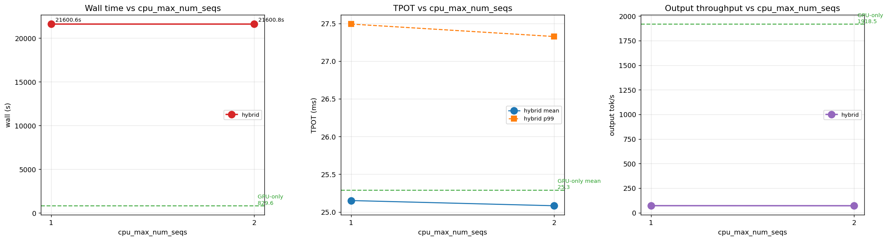
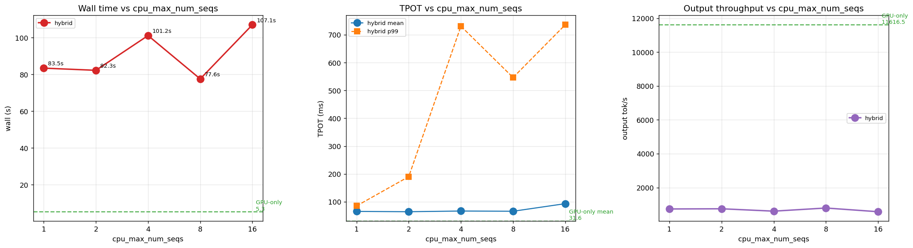
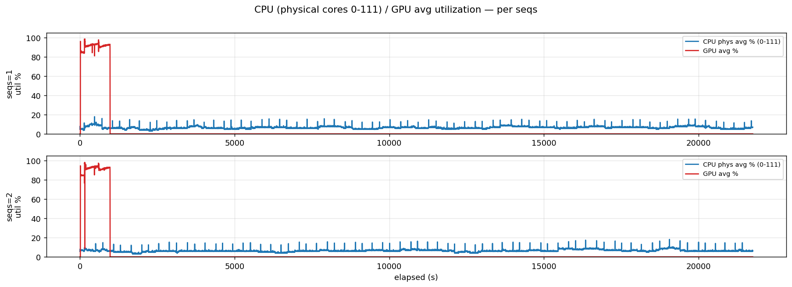
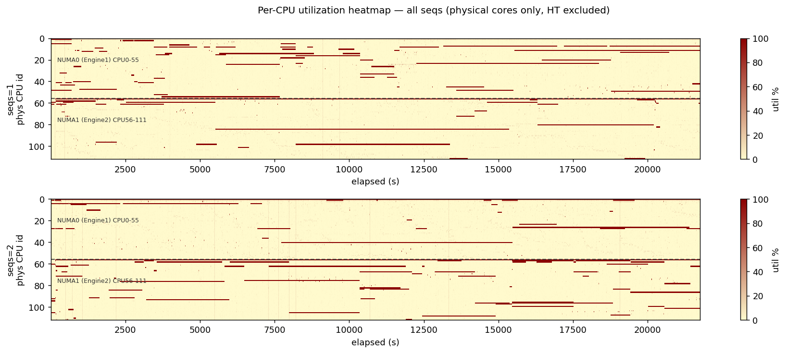
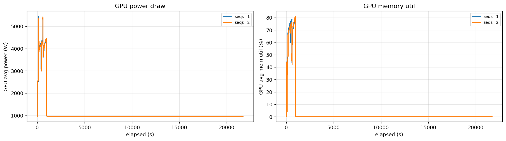

# B2 결과 분석 — Workload Redefinition 가설의 실제 판정

작성일: 2026-04-22  
작성자: Codex  
대상 결과:

- `measurement_results/H100x8/g0_longctx_32b/`
- `measurement_results/H100x8/g0_longctx_32b_control/`

이 문서의 목적은 단순히 숫자를 옮기는 것이 아니다.  
B2의 원래 질문이 무엇이었는지 다시 고정하고, 이번 실험이 그 질문에 대해 **무엇을 답했고 무엇은 아직 답하지 못했는지**를 구조적으로 판정하는 것이다.

---

## 1. 먼저 질문을 다시 고정한다

B2는 "큰 모델이나 긴 입력을 그냥 돌려보자"는 아이디어가 아니었다.  
B2의 질문은 정확히 다음과 같았다.

**현재의 128/128 중심 workload 에서는 CPU shadow 기법의 ROI가 거의 보이지 않는데, long-context / long-decode / high-KV-pressure workload 로 가면 CPU가 실제로 끼어들 구조적 자리가 생기는가?**

이 질문을 더 풀어쓰면 두 개의 하위 질문으로 나뉜다.

1. 지금까지 하이브리드가 안 좋았던 이유가 `아이디어 자체` 때문인가
2. 아니면 `시험한 workload가 CPU shadow가 빛날 수 없는 구간`이었기 때문인가

이번 B2 실험은 바로 이 둘을 가르기 위한 것이었다.

---

## 2. 이번 문서의 분석 원칙

이번 분석은 다음 세 원칙 위에서 진행한다.

### 2.1 비교 가능한 실험만 직접 비교한다

같은 모델, 같은 입력 길이, 같은 출력 길이, 같은 prompt 수, 같은 concurrency인 경우만 직접 비교한다.  
다른 workload를 섞어서 "전체 경향"처럼 말하지 않는다.

### 2.2 timeout이 낀 throughput은 그대로 믿지 않는다

장시간 timeout이 들어간 실험에서 평균 throughput은 bulk 성능이 아니라 **마지막 몇 개 straggler** 에 의해 망가질 수 있다.  
따라서 throughput은 항상 아래 지표와 같이 읽는다.

- completed count
- duration
- TTFT
- TPOT
- ITL

### 2.3 이번 판정의 대상은 `현재 hybrid 구조`다

이번 결과로 곧바로 기각되는 것은 `CPU shadow` 전체 개념이 아니다.  
이번 결과가 직접 겨누는 대상은 **현재 구현된 request-level CPU decode 분기형 hybrid** 다.

---

## 3. 실험군을 두 개의 층으로 나눈다

이번 결과는 하나의 실험이 아니라 두 개의 workload 층으로 나뉜다.

### 3.1 Heavy 층: B2의 본판정 대상

디렉토리:
[g0_longctx_32b](/vllm_hybrid/measurement_results/H100x8/g0_longctx_32b)

비교 대상:

- [gpu_only_baseline](/vllm_hybrid/measurement_results/H100x8/g0_longctx_32b/gpu_only_baseline)
- [seqs1](/vllm_hybrid/measurement_results/H100x8/g0_longctx_32b/seqs1)
- [seqs2](/vllm_hybrid/measurement_results/H100x8/g0_longctx_32b/seqs2)

공통 workload:

- model: `Qwen2.5-32B-Instruct`
- input length: `16384`
- output length: `16384`
- prompts: `100`
- max concurrency: `55`

즉, **16K in / 16K out / concurrency 55** 의 heavy long-decode workload 이다.  
이 층이 B2의 핵심 판정 대상이다.

### 3.2 Control 층: 기존 짧은 workload의 재확인

디렉토리:
[g0_longctx_32b_control](/vllm_hybrid/measurement_results/H100x8/g0_longctx_32b_control)

비교 대상:

- [gpu_only_baseline](/vllm_hybrid/measurement_results/H100x8/g0_longctx_32b_control/gpu_only_baseline)
- [seqs1](/vllm_hybrid/measurement_results/H100x8/g0_longctx_32b_control/seqs1)
- [seqs2](/vllm_hybrid/measurement_results/H100x8/g0_longctx_32b_control/seqs2)
- [seqs4](/vllm_hybrid/measurement_results/H100x8/g0_longctx_32b_control/seqs4)
- [seqs8](/vllm_hybrid/measurement_results/H100x8/g0_longctx_32b_control/seqs8)
- [seqs16](/vllm_hybrid/measurement_results/H100x8/g0_longctx_32b_control/seqs16)

공통 workload:

- model: `Qwen2.5-32B-Instruct`
- input length: `128`
- output length: `128`
- prompts: `500`

즉, **128/128 short workload** 이다.  
이 층은 B2의 본판정보다는, 기존 하이브리드 scaling 한계가 여전히 유지되는지 보는 대조군이다.

---

## 4. 그림은 어떻게 읽어야 하는가

이번 문서에서 그림은 **증거의 중심**이 아니라 **숫자 해석을 돕는 보조 수단**이다.  
핵심 판정은 JSON/bench 결과로 하고, 그림은 그 판정을 시각적으로 확인하는 용도로만 쓴다.

### 4.1 Heavy workload 요약 그림

- [analysis_bench.png](../../../measurement_results/H100x8/g0_longctx_32b/analysis_bench.png)

이 그림은 heavy workload 에서 `gpu_only`, `seqs1`, `seqs2` 가 얼마나 벌어지는지를 한 장에 보여준다.  
하지만 이 그림만 보고 "hybrid throughput이 완전히 무너졌다"라고 결론내리면 부족하다. 왜냐하면 timeout에 의해 집계가 왜곡될 수 있기 때문이다.

### 4.2 Control workload 요약 그림

- [analysis_bench.png](../../../measurement_results/H100x8/g0_longctx_32b_control/analysis_bench.png)

이 그림은 short workload 에서 `seqs1 -> seqs16` scaling 이 단조롭게 좋아지지 않는다는 점을 보여준다.  
즉, current hybrid 구조의 불안정한 scaling 한계가 heavy workload 전에도 이미 존재했다는 점을 확인하는 보조 자료다.

### 4.3 Heavy workload 보조 그림

- [analysis_util_timeseries.png](../../../measurement_results/H100x8/g0_longctx_32b/analysis_util_timeseries.png)
- [analysis_cpu_heatmap.png](../../../measurement_results/H100x8/g0_longctx_32b/analysis_cpu_heatmap.png)
- [analysis_gpu_power_mem.png](../../../measurement_results/H100x8/g0_longctx_32b/analysis_gpu_power_mem.png)

이 세 장은 각각:

- 시간이 지나며 bulk와 tail이 어떻게 갈리는지
- CPU 자원이 실제로 어떻게 쓰였는지
- GPU pressure 자체는 충분했는지

를 보조적으로 보여준다.

중요한 점은, 이 그림들이 **CPU를 많이 썼다 = CPU가 유의미했다**를 뜻하지는 않는다는 것이다.  
이번 문서에서는 오히려 반대로, **CPU가 관여했지만 구조를 구제하지 못했다**는 해석을 보조하는 자료로만 쓴다.

---

## 5. Heavy workload에서 실제로 관측된 사실

이제 B2의 본론으로 들어간다.

### 5.1 GPU-only 기준선

[gpu_only.json](/vllm_hybrid/measurement_results/H100x8/g0_longctx_32b/gpu_only_baseline/gpu_only.json)

- output throughput: `1918.53 tok/s`
- total token throughput: `3893.50 tok/s`
- mean TTFT: `6875.64 ms`
- mean TPOT: `25.29 ms`
- completed: `100 / 100`
- benchmark duration: `829.58 s`
- wall time: `978.24 s`

이 값은 heavy workload에서의 **정상적인 GPU-only 기준선**이다.

### 5.2 Hybrid seqs1

[hybrid.json](/vllm_hybrid/measurement_results/H100x8/g0_longctx_32b/seqs1/hybrid.json)

- output throughput: `72.16 tok/s`
- total token throughput: `146.49 tok/s`
- mean TTFT: `6854.53 ms`
- mean TPOT: `25.15 ms`
- completed: `98 / 100`
- benchmark duration: `21600.60 s`
- wall time: `21748.89 s`

### 5.3 Hybrid seqs2

[hybrid.json](/vllm_hybrid/measurement_results/H100x8/g0_longctx_32b/seqs2/hybrid.json)

- output throughput: `71.40 tok/s`
- total token throughput: `144.22 tok/s`
- mean TTFT: `6579.33 ms`
- mean TPOT: `25.08 ms`
- completed: `96 / 100`
- benchmark duration: `21600.81 s`
- wall time: `21749.01 s`

### 5.4 표면적인 ratio

heavy workload 기준에서 output throughput ratio는 다음과 같다.

- `seqs1 / gpu_only = 72.16 / 1918.53 = 3.76%`
- `seqs2 / gpu_only = 71.40 / 1918.53 = 3.72%`

겉으로만 보면 current hybrid가 거의 완전히 붕괴한 것처럼 보인다.

---

## 6. 그런데 왜 이 숫자를 그대로 읽으면 오판인가

여기서부터가 이번 문서의 핵심이다.

### 6.1 throughput은 붕괴했는데 TTFT/TPOT는 거의 안 변했다

heavy workload에서 GPU-only와 hybrid를 비교하면:

- mean TTFT: 거의 비슷하다
- mean TPOT: 거의 비슷하다
- mean ITL: 거의 비슷하다

이 세 개가 거의 유지된다는 것은, **완료된 request들의 token-step dynamics 자체는 GPU-only와 크게 다르지 않았다**는 뜻이다.

만약 진짜로 hybrid bulk path 전체가 느려졌다면, 보통 다음 중 적어도 하나는 크게 망가진다.

- TTFT
- TPOT
- ITL

그런데 이번 결과는 그렇지 않다.

### 6.2 반면 duration은 정확히 6시간에 박혔다

hybrid seqs1/2는 둘 다:

- benchmark duration ≈ `21600 s`

즉, 이건 정상 종료 시간이 아니라 **6시간 timeout** 결과다.

### 6.3 completed count도 100이 아니다

- seqs1: `98 / 100`
- seqs2: `96 / 100`

즉, 100개 request 중 대부분은 끝났지만  
마지막 `2~4` 개가 끝나지 못한 채 timeout에 걸렸다.

### 6.4 여기서 논리적으로 따라오는 해석

이 조합은 다음 구조를 뜻한다.

- 대다수 request 는 bulk 구간에서 거의 GPU-only처럼 진행됐다
- 소수 request 가 tail에서 극단적으로 오래 남았다
- 그 straggler가 전체 wall time을 6시간으로 늘렸다
- 그래서 평균 throughput이 붕괴한 것처럼 보였다

즉, 이번 결과는:

**"모든 요청이 조금씩 느려졌다"**가 아니라  
**"대부분은 비슷했지만 소수 tail request가 전체 집계를 망쳤다"**

로 읽는 것이 맞다.

---

## 7. 이 해석이 의미하는 구조적 결론

이제 숫자를 구조로 바꾸면 다음과 같다.

### 7.1 current hybrid의 주된 문제는 bulk가 아니라 tail이다

heavy workload에서 current hybrid는 bulk path의 압도적 향상을 보여주지 못했다.  
하지만 더 중요한 것은, bulk가 약간 나쁜 수준이 아니라 **tail이 병적으로 길어진다**는 점이다.

즉 이번 결과의 핵심 문제는 평균 저하가 아니라:

**tail amplification**

이다.

### 7.2 long-decode workload는 current hybrid를 살려주지 못했다

B2가 기대했던 낙관적 시나리오는 이랬다.

> "128/128에서는 CPU가 끼어들 자리가 없었지만, 16K/16K 같은 큰 workload로 가면 CPU shadow의 ROI가 드러날 수 있다."

이번 결과는 그 기대를 지지하지 않는다.

정확히는:

**long-decode / high-KV-pressure workload로 가도, 현재 구현된 hybrid는 상대적으로 좋아지지 않았다.**

더 강하게 말하면:

**큰 workload는 current hybrid의 문제를 해결하지 못했고, 오히려 tail 위험을 더 크게 드러냈다.**

---

## 8. 그런데 이것이 왜 `CPU shadow 전체 기각`은 아닌가

이 지점에서 가장 많이 생기는 오해를 끊어야 한다.

이번 결과가 기각하는 것은 다음이다.

**현재의 request-level CPU decode 분기형 hybrid**

즉 구조적으로 보면:

- 일부 request를 CPU path로 보낸다
- long-decode request가 CPU path에서 straggler가 된다
- 그 straggler가 전체 benchmark wall clock을 잡아먹는다

반면 이번 결과가 곧바로 기각하지 못하는 것은 다음이다.

**CPU shadow plane 개념 전체**

왜냐하면 CPU shadow plane은 원래:

- CPU가 main decode를 직접 수행하는 것이 아니라
- GPU의 임계 경로 밖에서
- scheduler / KV / prefetch / hint / admission을 준비하는 구조

이기 때문이다.

즉 이번 결과는 CPU shadow 개념을 약화시키는 것이 아니라, 오히려 문서들의 공통 결론을 강화한다.

**CPU는 main decode path에 들어가면 안 되고, shadow plane으로만 써야 한다.**

---

## 9. Control workload는 무엇을 보태주는가

이제 short control workload를 본다.

### 9.1 control 묶음의 핵심 숫자

- seqs1: output throughput `738.86 tok/s`
- seqs2: output throughput `749.73 tok/s`
- seqs4: output throughput `609.39 tok/s`
- seqs8: output throughput `794.75 tok/s`
- seqs16: output throughput `575.99 tok/s`

### 9.2 여기서 읽어야 할 것은 "절대값"이 아니라 "형태"다

current hybrid가 안정적인 구조라면,  
적어도 `seqs`를 올릴 때 성능은 비교적 예측 가능한 방향으로 움직여야 한다.

그런데 control workload에서는:

- seqs1 -> seqs2: 거의 변화 없음
- seqs2 -> seqs4: 오히려 하락
- seqs4 -> seqs8: 다시 상승
- seqs8 -> seqs16: 다시 크게 하락

즉, scaling이 단조롭지 않고 sweet spot이 매우 좁다.

### 9.3 control 묶음이 heavy 해석에 주는 의미

이 보조 신호는 heavy workload에서 드러난 tail hazard가 우연이 아니라는 점을 뒷받침한다.  
이미 short workload에서도 current hybrid는 **구조적으로 불안정한 scaling** 을 보이고 있었고,
heavy workload로 가면서 그것이 **tail failure** 형태로 더 거칠게 드러난 것이다.

즉:

- control workload는 current hybrid의 구조적 불안정을 보여주고
- heavy workload는 그 불안정이 어떻게 catastrophic tail로 번지는지를 보여준다

---

## 10. B2 가설에 대한 최종 판정

이제 원 질문으로 돌아간다.

### 질문

**"Workload를 키우면 CPU shadow의 ROI가 살아나는가?"**

### current hybrid에 대한 판정

**아니오.**

더 정확히는:

- heavy long-decode workload는 current hybrid를 살려주지 못했다
- bulk path의 뚜렷한 이득도 없었고
- 소수 request의 catastrophic tail 때문에 전체 결과가 무너졌다

### CPU shadow 개념 자체에 대한 판정

**보류**

이번 결과는 `CPU shadow 전체 기각`이 아니다.  
이번 결과가 직접 겨누는 대상은:

**CPU가 일부 요청을 직접 decode하는 현재 하이브리드 구조**

이다.

---

## 11. 이번 결과가 다음 단계 선택에 주는 의미

이번 B2 결과는 앞으로의 방향을 꽤 강하게 좁혀 준다.

### 11.1 다음 우선순위는 B1이다

B2가 "큰 workload를 줘도 current hybrid는 안 산다"는 결과를 냈다면,  
그 다음 질문은 자연스럽게 이거다.

**왜 tail이 생기는가?**

즉:

- request-level CPU routing이 문제인가
- host control-path가 문제인가
- scheduler / admission / ready-state 관리가 문제인가

이건 바로 B1, 즉 **Inverted Control Plane** 가설의 영역이다.

### 11.2 B3는 아직 후순위다

Meta-scheduling Gateway는 장기 구조로는 의미가 있다.  
하지만 지금 당장 필요한 답은 "vLLM 앞단 orchestration을 뺄까"가 아니라:

**현재 hybrid 내부에서 long-decode straggler를 누가 만드는가**

이다.

따라서 지금 단계의 순서는:

1. B2로 current hybrid가 heavy workload에서도 안 산다는 사실을 확정
2. B1로 tail의 구조적 원인을 겨냥
3. B3는 그 이후 시스템 외부화 후보로 검토

가 맞다.

---

## 12. 최종 결론

이번 B2 실험은 원래 기대했던 낙관적 시나리오를 지지하지 않았다.

즉:

**"큰 workload를 주면 current hybrid의 ROI가 살아날 것"이라는 기대는 틀렸다.**

하지만 더 중요한 결론은 이것이다.

**이번 결과는 CPU shadow 전체를 기각하는 것이 아니라, CPU가 일부 request를 직접 decode하는 현재 hybrid 구조를 사실상 기각한다.**

이번 결과를 한 문장으로 요약하면:

**heavy workload에서 current hybrid는 bulk를 개선하지 못했고, 오히려 CPU로 빠진 소수 long-decode request가 catastrophic tail을 만들어 전체 결과를 망친다.**

따라서 다음 단계는 명확하다.

**B2의 후속은 B1이다. 즉, 이제는 workload를 키워보는 단계가 아니라 control-path와 routing 구조 자체를 겨냥해야 한다.**

