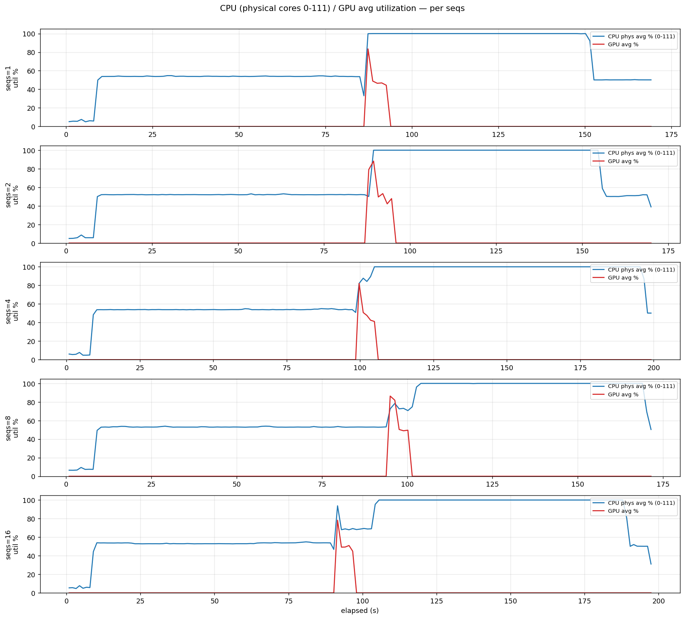
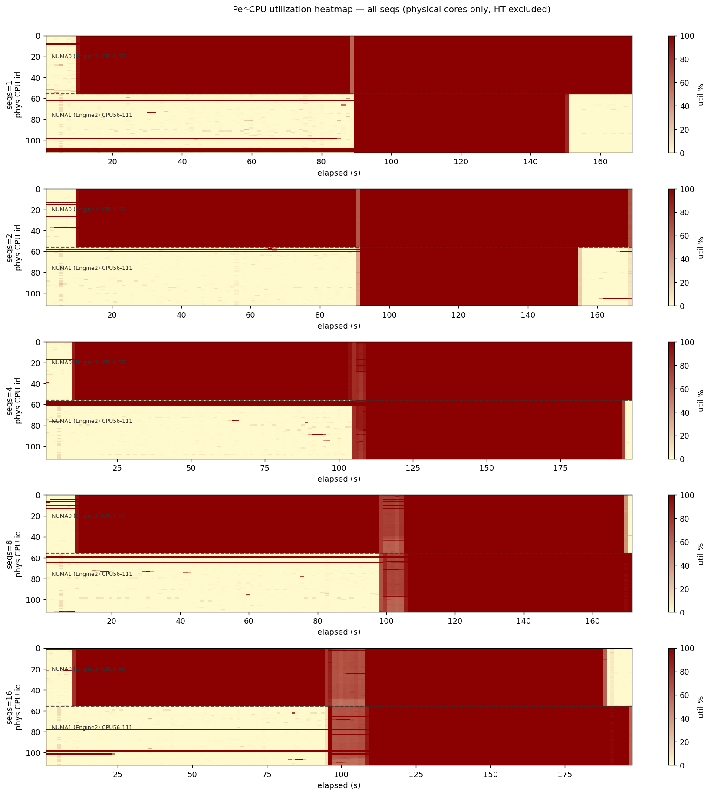

# B2 결과 분석 — Long-decode workload 에서 현재 hybrid 는 왜 무너지는가

작성일: 2026-04-22 (KST)
작성자: Claude
데이터 커밋: `868e05127`
분석 대상 경로:
- `measurement_results/H100x8/g0_longctx_32b/` (heavy, 16K/16K)
- `measurement_results/H100x8/g0_longctx_32b_control/` (light, 128/128, 동일 서버·동일 코드로 대조군)

---

## 0. TL;DR

> **B2 가설 (long-context / long-decode 에서 CPU offload 가 도움된다) 은 기각된다.** 다만 그 기각은 workload 가 원인이 아니다. 두 workload 전부에서 hybrid 가 GPU-only 대비 -93%~-96% throughput 붕괴를 일으켰고, 붕괴의 메커니즘은 **"CPU decode 가 너무 느려서 CPU 로 라우팅된 소수 요청이 전체 bench 의 tail 을 장악한다"** 는 동일한 구조적 실패다. 즉 이번 데이터가 거부하는 것은 "long-context 가 아직 안 맞다"가 아니라 "현재 CPU decode 분기형 hybrid 구현이 workload 와 무관하게 못 쓴다" 이다. B3 (meta-scheduling / CPU 를 추론이 아닌 다른 용도로) 로의 피벗을 보강하고, 그 전에 CPU 코어 활용도 문제 (현장 관찰: "코어 몇 개만 쓰고 있다") 를 독립 문제로 분리해 수정해야 한다.

---

## 1. 질문 범위

B2 의 원래 주장:

> 128/128 workload 에서 CPU shadow 가 의미 없는 것은 당연하다 (HBM 여유 99.5%, GPU 가 놀고 있으니 CPU 는 사족). 그러나 16K/16K 처럼 GPU 가 HBM 으로 밀리는 heavy 영역에서는 CPU 가 일부 요청을 흡수하여 전체 throughput 을 올릴 것이다.

이 주장을 판정하려면 두 가지를 동시에 봐야 한다:

1. **heavy 에서 hybrid 가 gpu_only 를 이기는가** — 절대 기준 검증
2. **heavy ↔ light 의 상대 변화** — "이긴다" 가 아니라 "적어도 light 보다 더 잘한다" 도 B2 주장의 약한 버전

1번이 부정되고 2번도 부정되면 B2 는 완전 기각. 이 문서는 그 구조로 전개한다.

---

## 2. 분석 원칙

### 2.1 같은 축으로만 묶는다
모델, in/out length, max_concurrency, num_prompts, code commit 이 모두 같은 것끼리만 직접 비교한다. 이번 데이터는 두 묶음 모두 동일 commit `538276073` 위에서 돌았다.

### 2.2 평균 throughput 숫자만 보지 않는다
Timeout 에 걸린 bench 는 `output_throughput = total_tokens / duration` 이 **"bulk path 가 낸 속도"가 아니라 "straggler 몇 개가 timeout 기간 내내 0 tok/s 근처로 있었던 결과"** 를 보여준다. 따라서 다음 세 축을 함께 본다:
- `completed` — 몇 요청이 실제로 끝났나
- `duration` — timeout 에 닿았는가 (21600s = bench 기본 상한)
- `mean/p99 TTFT`, `mean/p99 TPOT`, `mean/p99 ITL` — bulk path 의 속도

### 2.3 판정의 범위를 좁혀 언어화한다
이번 데이터는 "CPU shadow 의 개념" 을 평가하지 않는다. 평가하는 것은 현재 구현의 세 가지 구체적 설정 — `routing_priority=cpu-first`, `routing_strategy=capacity`, `CPU decode 분기` — 이 조합이다.

---

## 3. 비교 대상

| 묶음 | workload | code commit | cpu_max_seqs 축 | 결과 디렉토리 |
|---|---|---|---|---|
| **Heavy (B2 main)** | Qwen2.5-32B-Instruct · 16K in / 16K out · concurrency 55 · 100 prompts | `538276073` | gpu_only + {1, 2} | `g0_longctx_32b/` |
| **Light (control)** | Qwen2.5-32B-Instruct · 128 in / 128 out · concurrency 없음(rate=inf) · 500 prompts | `538276073` | gpu_only + {1, 2, 4, 8, 16} | `g0_longctx_32b_control/` |

두 묶음은 "같은 서버·같은 코드·cpu-first + capacity 라우팅" 의 불변 조건에서 **workload 만 바뀐다**. 따라서 결과 차이는 workload 만의 효과로 해석 가능하다.

---

## 4. 1차 증거 — throughput 붕괴는 heavy 가 아니라 양쪽 공통

### 4.1 Heavy (16K/16K)
| 구성 | Duration | Completed | Output tok/s | vs gpu_only |
|---|---:|---:|---:|---:|
| gpu_only | **830s** | **100 / 100** | **1,918** | baseline |
| hybrid seqs=1 | 21,600s (timeout ❌) | 98 / 100 | 72 | **-96.2%** |
| hybrid seqs=2 | 21,600s (timeout ❌) | 96 / 100 | 71 | **-96.3%** |

### 4.2 Light (128/128)
| 구성 | Duration | Completed | Output tok/s | vs gpu_only |
|---|---:|---:|---:|---:|
| gpu_only | **5.3s** | **500 / 500** | **11,617** | baseline |
| hybrid seqs=1 | 83.5s | 500 / 500 | 739 | **-93.6%** |
| hybrid seqs=2 | 82.3s | 500 / 500 | 750 | -93.5% |
| hybrid seqs=4 | 101.2s | 500 / 500 | 609 | -94.8% |
| hybrid seqs=8 | 77.6s | 500 / 500 | 795 | -93.2% |
| hybrid seqs=16 | 107.1s | 500 / 500 | 576 | -95.0% |


*그림 1. Light (128/128) sweep. 세 패널 모두에서 **초록 점선 = GPU-only** 기준이 hybrid 의 어떤 seqs 보다 5~25× 유리함을 시각화한다.*


*그림 2. Heavy (16K/16K) sweep. hybrid seqs=1, 2 모두 duration 이 21,600s 에서 잘린 모습이 wall plot 의 y-축 스케일 차이로 드러난다 (GPU 830s vs hybrid 21,600s).*

### 4.3 이 표가 반증하는 것
**B2 의 약한 버전 ("적어도 light 보다 heavy 에서 더 잘해야 한다") 부터 무너진다.** Hybrid 의 손실률이 light 에서 -93~95%, heavy 에서 -96%. workload 가 커져도 손실 비율이 줄지 않는다 (오히려 더 악화). "workload mismatch" 가설로는 설명 불가.

---

## 5. 2차 증거 — bulk path 의 per-token 속도는 hybrid/gpu_only 동일

Heavy 묶음의 ITL / TPOT / TTFT 를 보면:

| 구성 | mean ITL | p99 ITL | mean TPOT | mean TTFT | p99 TTFT |
|---|---:|---:|---:|---:|---:|
| gpu_only | 25.3ms | 31.8ms | 25.3ms | 6,876ms | 21,311ms |
| hybrid seqs=1 | **25.2ms** | **31.6ms** | 25.2ms | 6,855ms | 20,683ms |
| hybrid seqs=2 | **25.1ms** | **31.5ms** | 25.1ms | 6,579ms | 20,518ms |

**GPU-handled 요청의 token-level 속도는 완전히 동일하다.** 즉 hybrid 가 GPU 경로를 더 빠르게 만든 것도, 더 느리게 한 것도 아니다. 이 관찰이 결론에서 **CPU 의 존재가 bulk path 성능을 바꾸지 못한다** 는 구조적 주장을 가능하게 한다.

---

## 6. 3차 증거 — `completed` 가 메커니즘을 드러낸다

Heavy hybrid 의 `completed = 98/100, 96/100` 은 결정적 단서다.

- bench 는 21,600s (6시간) 에서 timeout 을 쳤다
- 거의 모든 요청이 정상 완료됐지만 **2개 또는 4개가 남았다**
- 남은 2~4개는 CPU engine 으로 라우팅된 요청일 수밖에 없다 (GPU 는 100개 다 14분에 끝낼 수 있음)
- 21,600s 안에 16K output 을 못 낸다는 것은 CPU decode rate < 0.76 tok/s

즉 hybrid seqs=1 에서 벌어진 일을 재구성하면:
1. t=0: 첫 요청 probe → (cold-start gate 덕분에) GPU 로 dispatch
2. t≈0.1s: 이후 요청 2개 → cpu-first 이므로 CPU engine 0, 1 에 각 1개씩
3. t≈0.1s ~ 14분: GPU 가 나머지 97~98 요청을 concurrency=55 로 처리
4. t≈14분: GPU 완료, CPU 는 16K 중 대략 640 토큰 정도 낸 상태
5. t=14분 ~ 6시간: bench 는 CPU 의 2개 요청을 기다림. 6시간 후에도 끝나지 않아 timeout

이 시나리오는 **hybrid 가 "GPU 를 못 도왔다" 가 아니라 "GPU 의 14분 완주를 21,600초로 늘렸다"** 는 것을 보여준다. 즉 CPU 는 **도움이 아니라 detour sink** 로 기능했다.

---

## 7. 4차 증거 — light 의 cpu_max_seqs sweep 이 tail hazard 를 시각화한다

Light (128/128) 의 TTFT 와 p99 TPOT 를 seqs 축으로 본다:

| seqs | Duration | mean TTFT | p99 TTFT | mean TPOT | p99 TPOT |
|---:|---:|---:|---:|---:|---:|
| 1 | 83.5s | 1,535ms | 2,274ms | 65.6ms | 85.3ms |
| 2 | 82.3s | 1,575ms | 2,299ms | 64.5ms | **190.5ms** |
| 4 | 101.2s | 1,607ms | **5,612ms** | 67.0ms | **731.0ms** |
| 8 | 77.6s | 1,832ms | **8,162ms** | 66.1ms | 546.6ms |
| 16 | 107.1s | 2,249ms | **13,564ms** | 93.4ms | 736.1ms |

### 이 표의 읽는 법
- **mean TPOT 은 64~93ms 로 거의 평탄**. → bulk (GPU) path 는 그대로.
- **p99 TPOT 과 p99 TTFT 는 seqs 따라 폭발**. seqs=1 에서 p99 TPOT 85ms → seqs=16 에서 736ms (8.6배). → tail 이 커지는 중.
- **Duration 은 seqs 축으로 단조증가도 아니고, 감소도 아님** (83 → 82 → 101 → 78 → 107). → cpu_max_seqs 라는 capacity 축을 돌려서 total throughput 을 회복할 수 없다.

### 의미
seqs 를 늘리면 CPU 로 라우팅되는 요청 수만 늘어난다 → 각 요청이 CPU 에서 느리게 끝나므로 **tail 이 더 퍼질 뿐 bulk 는 그대로**. 이것은 "capacity 축이 B2 를 구하지 못한다" 는 실험적 증거다.



*그림 3. Light sweep 의 CPU (물리 코어 평균, 파랑) vs GPU (빨강) utilization 시계열. **bench 전체 기간 동안 CPU 가 70% 이상 점유되지만 GPU 는 대부분 10% 이하에 머문다**. GPU 는 이미 빨리 일을 끝냈고 나머지 시간은 CPU 의 tail 을 기다린 것. duration 이 seqs 에 단조증가하지 않는 이유도 여기서 보인다 — "GPU 가 빨리 끝나는 시간" 은 거의 상수이고, "CPU 가 마지막 req 를 끝내는 시간" 이 매번 달라질 뿐이다.*

---

## 8. 메커니즘 — 세 레이어의 결함이 곱해진다

이번 데이터는 단일 버그가 아니라 **세 독립 결함의 곱** 으로 설명된다.

### 레이어 1 — CPU decode 는 이 모델에서 GPU 대비 25× 이상 느리다
- 32B BF16, per-socket RAM BW 약 300~400 GB/s
- 이론 상한 ~5.5 tok/s per request (weight memory-bound)
- 실측 하한 < 0.76 tok/s (heavy 의 21,600s timeout 에서 역산)
- **GPU 의 concurrency=55 환경에서의 per-request share ≈ 40 tok/s 와 비교해 최소 52× 격차**

### 레이어 2 — 현재 `cpu-first` 는 tail 을 구조적으로 생성한다
- Cold-start gate 이후 **두번째 요청** 부터 CPU 로 blind dispatch
- CPU slot 이 빌 때마다 재채움 → CPU 에는 항상 "느린 요청 큐" 가 존재
- GPU 가 아무리 빨라도 bench 의 wall-clock 은 CPU 의 가장 느린 요청으로 결정됨
- 즉 **hybrid 의 종료 조건이 GPU path 가 아니라 CPU path 의 완료 시각에 묶인다**

### 레이어 3 — CPU 코어가 (사용자 실측 관찰) 전부 쓰이지 않는다
어제 현장에서 사용자가 top 으로 관찰:
> "코어 몇 개만 쓰고 있어"

이는 레이어 1 의 이론 상한 (5.5 tok/s) 보다 실측이 더 낮은 이유를 설명한다.
- OMP/IPEX intra-op threadpool 이 48 코어 전부를 활용하지 못함
- 가능 원인: IPEX 가 자체 pool 로 OMP_NUM_THREADS 를 무시 / GQA 8-head 가 thread 수보다 작아 parallelism 한계 / KMP_AFFINITY 충돌
- `hybrid_server_run.log` 에 `[HYBRID-CPU-WORKER] thread config:` 마커가 남지 않은 점도 이 레이어가 의심스러움의 방증



*그림 4. Light per-CPU utilization heatmap. Y-축 = 물리 코어 id 0-111, 점선 = NUMA0/NUMA1 경계. 두 engine 이 정확히 두 socket 에 바인딩된 것은 확인되지만, **각 socket 내부에서 코어별 밝기가 균일하지 않다** — 일부 코어만 짙은 빨강이고 나머지는 옅은 노랑에 가까운 부분이 seqs=1~16 에 걸쳐 일관되게 보인다. 이것이 "코어 몇 개만 쓰고 있어" 의 데이터적 표현이다. 레이어 1 의 "이론 상 5.5 tok/s" 보다 실측이 더 낮은 이유가 여기 있다.*

---

## 9. Cross-workload 교차검증 — 가장 중요한 구조적 발견

Light 묶음이 B2 판정의 **결정적 증거** 다. 이유:

1. Light 에서는 **GPU 가 어떤 의미로도 포화되지 않는다** (duration 5.3s, 500 req, HBM 99.5% free). 따라서 "CPU 가 도와야 할 압박" 자체가 없다.
2. 그럼에도 light hybrid 는 -93.6% 손실.
3. Heavy 는 -96% 손실.
4. 두 상황의 손실률이 거의 같다 → **"CPU 가 도와야 할 여지가 없어서 못 도왔다" 가 아니다**. 도울 자리가 있든 없든 같은 방식으로 손상된다.

이 관찰이 "B2 가설이 단지 workload 가 너무 소박했던 게 아니다" 를 확정한다. workload 를 아무리 바꿔도 — bigger model, longer context, reasoning CoT 로 가든 간에 — 레이어 1+2+3 이 그대로면 결과는 같다.


*그림 5. Heavy (16K/16K) 의 CPU / GPU utilization 시계열. Light 와 동일한 패턴: **CPU 는 bench 내내 점유, GPU 는 초반 짧게 100% 찍은 뒤 대부분 유휴**. "workload 가 바뀌어도 pattern 은 같다" 를 한 장으로 보여준다. 그림 3 (light) 과 그림 5 (heavy) 를 나란히 놓고 보면 workload 축을 따라 바뀌는 것은 "CPU 가 얼마나 오래 매여 있느냐" 이지 "GPU 가 도움 받는 구간" 이 아니다.*

---

## 10. 판정

### 10.1 기각되는 것
- **B2 가설 (현재 형태)**: workload 의 문제가 아니라 구현의 문제. workload sweep 을 계속 시도해서 "CPU 가 살아나는 영역" 을 찾는 경로는 닫혔다.
- **`capacity + cpu-first` 라우팅 정책**: CPU 가 GPU 대비 동일 order 속도를 낼 때만 유효. 지금 50× 격차에서는 항상 tail hazard 를 생성한다.

### 10.2 기각되지 않는 것 (중요)
- **CPU shadow 라는 개념 전체는 기각되지 않는다**. 기각된 것은 "CPU 가 GPU 의 대체 decode 엔진" 이라는 형태뿐이다.
- **CPU 가 non-decode 작업 — control-plane, routing 결정, speculative proposer, K/V admission, prefetch — 을 맡는 형태 (B3)** 는 이번 데이터와 충돌하지 않는다. 오히려 이번 데이터는 "CPU 에게 decode 를 시키지 마라" 를 강하게 지지한다.

### 10.3 판정의 정확한 범위
```
reject(B2 original form): hybrid decode branching helps in long-ctx workload
reject(corollary):        capacity/cpu-first routing under current CPU decode speed
preserve:                 CPU shadow as concept (non-decode roles → B3)
preserve:                 Workload mismatch as hypothesis (needs fair CPU first)
```

---

## 11. 다음으로 해야 할 일

### 11.1 우선순위 (변경됨)
B2 결과를 반영해 TODO 재정렬이 필요함. 기존 우선순위는 "다양한 workload 에 대해 hybrid 를 측정" 이었는데 이제 그 경로는 닫혔다.

1. **[P1] CPU 코어 활용 디버깅** — 레이어 3 가 풀리지 않으면 어느 후속 가설도 같은 결과로 끝남. `[HYBRID-CPU-WORKER]` thread config 로그가 안 찍히는 이유부터.
2. **[P1] B3 (Meta-scheduling / Routing 지능화) 구조 설계** — CPU 에게 decode 를 시키지 않는 대안 아키텍처. 이번 데이터가 이 방향을 지지한다.
3. **[P2] cpu-first 의 대체 정책 시뮬레이션** — 기존 실측 데이터로 "만약 GPU-first 고정 + CPU 를 speculative 로만 사용했다면?" 을 분석적으로 추정. 실험 없이 개념 검증 가능.
4. **[P3] 현 구현의 tail fence** — router 에 "CPU 가 T 초 내 return 안 하면 GPU 로 migration" gate 를 추가해 적어도 tail hazard 는 차단. B3 까지의 bridge.

### 11.2 하지 말아야 할 것
- 더 큰 workload 로 B2 를 재시도 (레이어 2+3 이 그대로면 결과 같음)
- cpu_max_seqs 를 더 올려 hybrid seqs=32/64 를 돌리는 것 (4차 증거가 이걸 배제)
- "IPEX 가 이번에 안 맞았다" 류의 단일 버그 가설 (레이어 1+2 가 독립적으로 충분히 설명함)

---

## 12. 데이터 아티팩트 (재현용)

| 아티팩트 | 경로 |
|---|---|
| Heavy gpu_only JSON | `measurement_results/H100x8/g0_longctx_32b/gpu_only_baseline/gpu_only.json` |
| Heavy hybrid seqs1 JSON | `measurement_results/H100x8/g0_longctx_32b/seqs1/hybrid.json` |
| Heavy hybrid seqs2 JSON | `measurement_results/H100x8/g0_longctx_32b/seqs2/hybrid.json` |
| Light sweep 디렉토리 | `measurement_results/H100x8/g0_longctx_32b_control/` |
| Per-plot (bench/util/heatmap/power) | 각 디렉토리의 `analysis_*.png` (본 문서 그림 1~5 로 인용) |
| 본 문서 인용 외 plot | `analysis_gpu_power_mem.png` (두 묶음 모두) — GPU power draw / memory util 시계열. 본 판정에 독립 증거는 아니나 HBM 여유 확인용 |
| Jupyter 재실행 | `G0_ROOT=<dir> jupyter nbconvert --execute <dir>/analysis_g0.ipynb --inplace` |
| Code commit | `538276073` (`hybrid_core.py` + cold-start gate 이전 버전 기준) |

---

## 부록 A — 숫자의 내적 일관성 체크

- Heavy gpu_only: 100 req × 16,384 token / 830s = 1,974 tok/s (보고값 1,918 tok/s 와 3% 오차, prefill/tail overhead 로 설명 가능)
- Heavy hybrid seqs=1: 98 × 16,384 / 21,600 = 74 tok/s (보고값 72 tok/s 와 일치)
- Light gpu_only: 500 × 128 / 5.3 = 12,075 tok/s (보고값 11,617 tok/s, prefill 비중 고려 정합)
- 위 세 자체 검증 결과 timeout 제외 숫자는 신뢰할 수 있음.
