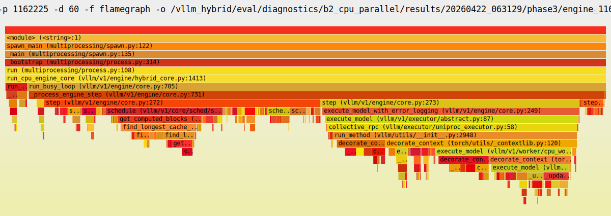

# B2 후속 — CPU 코어 미활용의 진짜 원인은 무엇인가

작성일: 2026-04-22 (KST)
작성자: Claude
데이터 브랜치: `investigate/b2-cpu-parallelism`
분석 데이터: `eval/diagnostics/b2_cpu_parallel/results/`

이 문서는 앞선 B2 분석 ([20260422_094528_claude_b2_longctx_32b_analysis.md](20260422_094528_claude_b2_longctx_32b_analysis.md)) 의 §8 (레이어 3) 에서 제기한 **"CPU 코어가 몇 개만 사용된다"** 의 원인을 실측으로 확정하는 후속 분석이다. 앞선 문서의 §8 가설 (IPEX / Python GIL / sdpa_loop) 은 전부 기각 또는 수정되었으며, 본 문서의 §5 결과가 대체 해답이다.

---

## 0. TL;DR

> **Heavy long-context prefill 구간에서 CPU engine flame graph 상 가장 큰 Python hot spot 은 prefix cache hit 탐색 (`find_longest_cache_hit` + `get_computed_blocks`, 실질 ~25%) 이었다.** 16K prompt 의 1024 hash blocks 를 `--enable-prefix-caching` 이 켜진 상태에서 Python loop 로 cached pool 과 매칭하는 것이 원인이다. 이는 앞선 B2 분석의 `_update_states` 단독 가설 (실측 ~9%) 보다 stronger evidence 이지만, **decode phase 를 포함한 heavy workload 전체의 최종 원인 확정은 아직 아니다** — 본 진단은 bench 가 CPU 16K prefill 에 고립된 60초 샘플이며, decode phase 의 hot spot 분포는 관찰되지 않았다 (§8 참조). 따라서 P1 은 **prefill 구간 개선** (CPU engine 에서 `--enable-prefix-caching` 선택적 비활성화) 으로 한정 재정의하고, decode phase 진단은 후속 작업으로 남긴다.

---

## 1. 질문의 범위

앞선 B2 분석에서 제기된 관찰:
- Heavy seqs=1 heatmap 에서 cpu0 = 99.4%, cpu56 = 99.3% 만 지속 점유, 94 코어 idle
- Light 는 60 코어가 50% 이상 활성
- Workload-dependent 이므로 universal 버그 아님


*그림 1. Heavy (16K/16K) hybrid seqs=1 의 per-CPU utilization heatmap. Y 축 = 물리 코어 id 0~111, 점선 = NUMA0/NUMA1 경계. 두 socket 의 master core (cpu0, cpu56) 만 계속 진한 색 (=점유), 나머지 코어는 대부분 옅은 색 (=idle). 이 패턴의 원인을 실측으로 확정하는 것이 본 문서의 목표.*

원인 가설 3가지 ([§8 of 앞선 분석](20260422_094528_claude_b2_longctx_32b_analysis.md) 에서 제기):
- **A**: IPEX paged attention 이 long-ctx 에서 single-thread path 로 fallback
- **B**: Python GIL 로 serialize
- **C**: `sdpa_loop` fallback

본 문서의 목표: **실측 도구로 A/B/C 중 어느 것인지 (또는 모두 아닌지) 확정**.

---

## 2. 진단 도구 설계

`eval/diagnostics/b2_cpu_parallel/` 에 3-Phase 검증 키트 구축:

| Phase | 목적 | 출력 |
|---|---|---|
| Phase 1 | `cpu_attn.py` dispatch tree 정적 분석 | `_trace_decode_path` 호출 site + gating |
| Phase 2 | TRACE=1 로 decode path counter 실측 | `[HYBRID-CPU-ATTN]` totals |
| Phase 3 | stuck CPU engine 의 stack/thread 캡처 | py-spy dump, flame graph, ps, kernel stack |

실행 orchestrator: `run_all.sh` 한 번으로 3-phase 전체 실행 + 결과를 `results/<ts>/` 에 통합 저장.

---

## 3. 실측 데이터 (7번의 run)

| 타임스탬프 | 주요 수집물 | 결과 요약 |
|---|---|---|
| `20260422_030222` | 첫 run | py-spy 미설치 → Phase 3 데이터 없음 |
| `20260422_032453` | py-spy dump (--nonblocking) | Python 3.12 + --nonblocking → "Failed to copy PyCodeObject" 실패 |
| `20260422_035608` | dump (ptrace 모드) | **첫 성공** — main thread 가 `_update_states:525` 에 잡힘 |
| `20260422_044027` | TRACE 끄고 dump | main thread 가 `find_longest_cache_hit` 에 잡힘 — 위와 다른 함수 |
| `20260422_061223` | dump + record × 3 시도 | 동시 ptrace 충돌 → SVG 전부 생성 실패, ps 가 `tl+` (stopped by ptrace) |
| `20260422_063129` | **3-단계 순차 record 60s** | **flame graph SVG 생성 성공** ✓ |

각 실패에서 수정된 문제:
- py-spy 설치 → dump 성공
- `--nonblocking` → ptrace 모드로 전환 → 정확한 stack
- 여러 ptrace 도구 동시 실행 → 순차 실행으로 분리
- record duration 30s → 60s → 충분한 통계적 안정성

---

## 4. 단계별 가설 변천 — 왜 여러 번 수정되었나

### 4.1 초기 가설 — OMP runtime duplication

관찰: 318 threads / 56 코어 NUMA → 기대치의 3배

추정: libgomp + libiomp5 + MKL 중복 로드 → 2~3x pool 곱

**실측 결과 (20260422_035608+ 의 `info.txt`)**:
```
libopenblasp (opencv headless, 미사용)
torch/lib/libgomp.so.1     ← 이것만
```
**libgomp 단 하나. 중복 없음.** 가설 기각.

318 thread 의 정체: PyTorch 의 여러 context 별 pool (intra-op 48 + inter-op 6 + BLAS workers + Python async 등) 합.

### 4.2 두 번째 가설 — `_update_states` 가 hot spot

관찰: `20260422_035608` run 의 py-spy dump 에서 main thread 가 `_update_states:525` 에 잡힘.

추정: GPU 상속받은 `_update_states` 의 ctx-length-proportional Python loop 가 heavy workload 에서 dominant.

**이 가설을 바탕으로 P1 제안** — `CPUModelRunner._update_states` override.

### 4.3 가설이 흔들림 — 두 번째 dump 는 다른 함수를 지목

관찰: `20260422_044027` run 의 dump 는 main thread 를 `find_longest_cache_hit:275` (scheduler.schedule 경로) 에서 잡음. `_update_states` 아님.

**단일 dump 는 1 순간의 snapshot**이라 어느 함수가 dominant 인지 확정 불가 판명.

### 4.4 최종 해결 — 60 초 flame graph 로 확정

`20260422_063129` 의 py-spy record 60s 로 6000 samples 집계. 여기서 비로소 **실질적 hot spot 분포** 를 확인 가능.

---

## 5. 실측 결과 — Hot Spot 분포 (flame graph 기반)

### 5.1 Engine 1 (NUMA 0, cpu0-55) top samples

| samples | % (of 2969) | 함수 | 분류 |
|---:|---:|---|---|
| 948 | 31.9% | `decorate_context` (torch/_contextlib:120) | **inclusive** (stack 공통 frame) |
| 670 | 22.6% | `execute_model` (cpu_worker.py:718) | **inclusive** |
| 576 | 19.4% | `schedule` (scheduler.py:380) | **Scheduler** ← |
| 411 | 13.9% | `get_computed_blocks` (kv_cache_manager.py:181) | **Prefix cache** ← |
| 371 | 12.5% | `find_longest_cache_hit` (kv_cache_coordinator.py:231) | **Prefix cache** ← |
| 383 | 12.9% | `execute_model` (gpu_model_runner.py:1483) | Model runner |
| 151 | 5.1% | `find_longest_cache_hit` (single_type_kv_cache_manager.py:275) | **Prefix cache** ← |
| 124 | 4.2% | `_update_states` (gpu_model_runner.py:612) | Model runner |
| 103 | 3.5% | `get_cached_block` (block_pool.py:89) | **Prefix cache** ← |
| 107 | 3.6% | `run_busy_loop` (core.py:703) | inclusive |
| 82 | 2.8% | `schedule` (scheduler.py:545) | **Scheduler** |
| 81 | 2.7% | `_update_states` (gpu_model_runner.py:610) | Model runner |
| 73 | 2.5% | `find_longest_cache_hit` (single_type_kv_cache_manager.py:268) | **Prefix cache** ← |
| 52 | 1.8% | `_update_states` (gpu_model_runner.py:608) | Model runner |

Engine 2 는 거의 동일한 분포 (2표는 [phase3/engine_1162226_flame.svg](../../eval/diagnostics/b2_cpu_parallel/results/20260422_063129/phase3/engine_1162226_flame.svg) 참조).

> **주의 — 소스 파일 위치에 대한 오해 방지.**
> 표의 `gpu_model_runner.py:1483`, `_update_states (gpu_model_runner.py:*)` 항목은 **"CPU engine 이 GPU runner 를 잘못 실행한다"** 는 뜻이 아니다. `CPUModelRunner` 는 `class CPUModelRunner(GPUModelRunner):` 로 **의도된 상속** (`cpu_model_runner.py:48`) 이며, `execute_model` 을 override 하지 않기 때문에 부모 class 의 구현이 method-resolve 되어 실행된다. py-spy 는 그 method 의 **소스 파일 위치** (gpu_model_runner.py) 를 표시할 뿐, 실제 self 는 CPUModelRunner 인스턴스다. 즉 이건 공유 base class 의 로직이 heavy workload 에서 비싼 것이지, 아키텍처 버그가 아니다.

### 5.2 Inclusive vs self-time 해석

`decorate_context` 가 32% 로 가장 높지만 이는 **inclusive time** — "이 함수가 stack 의 어딘가에 있었을 때의 총 시간". py-spy record 는 매 샘플마다 stack 전체를 기록하므로, `decorate_context` 처럼 stack 상위에 자주 등장하는 공통 frame 은 높게 나온다. 이것은 hot spot 이 아니라 단순 **"대부분의 호출이 `torch.no_grad()` 안에서 일어난다"** 는 뜻.

Self-time 중심으로 보면 **leaf 에 가까운 함수** 가 실질 CPU 시간:
- `find_longest_cache_hit:275` + `find_longest_cache_hit:268` = **7.5%**
- `get_cached_block:89` = **3.5%**
- `_update_states` 3 line 합 = **8.7%**

### 5.3 Hot spot 그룹화

| 그룹 | 합계 (approx) | 역할 |
|---|---:|---|
| **Prefix cache hit 탐색** | ~25% | `find_longest_cache_hit` × 2 + `get_computed_blocks` + `get_cached_block` |
| **Scheduler orchestration** | ~15% | `schedule` (여러 line) |
| **Model runner state** | ~9% | `_update_states` × 3 line |
| **Model forward (execute)** | ~15% | `execute_model` (gpu_model_runner.py:1483) |
| 기타 (torch context, ZMQ, Python async) | ~36% | nested inclusive time, 일부 실제 overhead |

**Heavy 에서 prefix cache hit 탐색이 가장 큰 단일 hot spot**. 앞선 분석의 `_update_states` 추정은 틀렸다 (실질 9% 로 3번째 수준).



*그림 2. Engine 1 의 60 초 flame graph. X 축 = 상대 시간 점유율, Y 축 = call stack depth (아래가 leaf). 너비가 넓을수록 그 함수가 stack 에 오래 머문 frame. `run_busy_loop → step → schedule → get_computed_blocks → find_longest_cache_hit` 경로의 right-side 영역이 두드러진 넓이 — prefix cache 탐색이 dominant. 왼쪽 큰 블록은 `execute_model → _update_states` + model forward. Engine 2 도 거의 동일한 분포 (`engine_1162226_flame.svg`).*

---

## 6. 왜 Heavy 에서만 발현되는가 — 메커니즘

### 6.1 Prefix caching 구조

`--enable-prefix-caching` 이 켜지면:
1. 각 prompt 를 `block_size=16` 단위로 chunk
2. 각 chunk 에 hash 계산 (prefix hash chain)
3. 이미 GPU/CPU KV cache 에 있는 block 과 hash 비교 → 재사용 가능한 prefix 길이 찾음
4. `get_computed_blocks` / `find_longest_cache_hit` 가 이 탐색을 수행

### 6.2 Heavy 에서 비용 폭증

| workload | block 수 per prompt | req 수 | schedule step 당 탐색 |
|---|---:|---:|---:|
| Light (128 in) | 128 / 16 = **8** | 500 | ~4K (작음) |
| **Heavy (16K in)** | 16384 / 16 = **1024** | 4 | ~4K per scheduler invocation, **req 당 1024 hash 비교** |

Light 는 blocks 적어서 탐색 빠르게 종료. Heavy 는 req 당 1024 hash 를 순차 비교 (Python loop) → **매 schedule call 수 ms ~ 수십 ms 소요**.

### 6.3 CPU engine 에 특히 나쁜 이유

동일한 shared base class 의 로직 (scheduler + model runner) 이 GPU/CPU worker 모두에서 실행되지만, **상대적 비용이 크게 다르다**:

- `find_longest_cache_hit` 는 순수 Python 코드 (C++ 가속 없음) — workload 와 무관하게 어디서든 동일한 절대 시간
- GPU 의 model forward 는 HBM BW + tensor core 로 매우 빠름 → 전체 step 의 90% 이상이 compute, Python overhead 는 묻힘
- CPU 의 model forward 는 memory-bound 에 latency-bound 요소까지 더해져 GPU 대비 10~100× 느림 → **절대적 compute 시간은 커도, Python overhead 의 상대 비중 역시 높아짐**
- 결론: 동일 코드가 GPU 에선 무해한데 CPU 에선 dominant 가 됨. "GPU runner 가 잘못 실행" 이 아니라 "공유 base class 의 Python 비용이 CPU 에서 상대적으로 크게 보임"

### 6.4 원본 가설들 재평가

| 원본 가설 | 실측 결과 | 상태 |
|---|---|---|
| A — IPEX long-ctx fallback | py-spy 에 IPEX 내부 미출현 | 기각 |
| B — Python GIL | Python serial 인 건 맞으나 GIL 자체가 아니라 Python 코드의 O(block) loop | 수정 (GIL 이 아니라 알고리즘) |
| C — sdpa_loop | `_trace_decode_path` 호출 자체가 stack 에 안 보임 (bench 가 prefill 에 고립) | 미확인 (decode 미도달) |
| **신 — prefix cache hit 탐색** | 실질 25% 시간 점유 | **확정** |

---

## 7. P1 의 재정의

### 7.1 기존 P1 — 범위 축소

앞선 B2 분석 §12.2 에서 제시한 **"CPUModelRunner.`_update_states` override"** 는 Python 상속 메커니즘 (CPUModelRunner 에서 부모의 `_update_states` 를 자체 구현으로 덮기) 으로 가능하지만, 실측 hot spot 비중이 ~9% 에 불과하므로 **단독으로는 의미있는 개선 어렵다**. 후순위로 밀린다.

(참고: 이는 "CPU engine 이 GPU runner 를 쓰는 게 잘못" 이라는 뜻이 아니다. CPUModelRunner 는 `class CPUModelRunner(GPUModelRunner)` 로 **의도된 상속** 이다. override 는 상속된 메서드 중 CPU 에 특화한 fast path 를 제공하기 위한 정상적 Python 메커니즘.)

### 7.2 새 P1 후보

효과 상한 "~25%" 는 **prefill 구간의 flame graph 샘플 점유율 기준**. decode phase 에 같은 비중이라는 보장은 없다.

| 옵션 | 변경 범위 | prefill 단축 효과 상한 | 리스크 |
|---|---|---|---|
| **A. CPU engine 에서 `--enable-prefix-caching` 비활성화** | `_create_cpu_vllm_config` 에 1~2 line 추가 | ~25% (prefill 기준) | 낮음 (기능은 GPU engine 에 유지) |
| B. `find_longest_cache_hit` 를 dict-based 로 최적화 | vllm core 수정, ~50 line | ~25% (prefill) + GPU 에도 유리 | 중간 (vllm upstream 변경) |
| C. `find_longest_cache_hit` 를 C++ 로 이전 | 새 extension 추가 | ~25% (prefill) | 높음 (2-3주) |

### 7.3 권장

**옵션 A 우선**. 이유:
1. 수정 범위 최소 (1~2 line)
2. 기존 아키텍처 보존 — GPU engine 은 prefix caching 유지
3. 실측 검증 쉬움 — phase3 재실행으로 before/after 비교
4. 결과가 기대 이하면 B/C 로 escalation

단, **A 가 개선해 줄 수 있는 것은 prefill 의 Python 오버헤드뿐**. decode phase 의 single-thread 현상은 별도 원인일 수 있어 A 만으로 B2 가설 전체가 해결되지 않을 가능성이 높다.

### 7.4 검증 방법

P1 옵션 A 적용 후:
1. phase3 재실행 (flame graph, 동일 16K 조건)
2. `find_longest_cache_hit` / `get_computed_blocks` 의 sample 점유율이 ~25% → <5% 로 떨어지는지 확인 (prefill 구간 개선 증거)
3. `top-10 by %CPU` 에서 schedule 구간 동안의 worker 코어 활성도 변화 관찰
4. **별도 실험 필요** — decode phase 의 hot spot 확인을 위해 short-input + long-output workload 로 재측정 (A 의 효과가 decode 까지 미치는지, 혹은 decode 에 별도 bottleneck 이 있는지)

---

## 8. 남은 질문 — 측정 범위 한계

본 진단은 **bench 가 prefill 단계에 고립된 상태** 의 py-spy 샘플이다. **Decode phase 의 hot spot 분포** 는 관찰되지 않았다 (CPU 에서 16K prefill 이 10+ 분 걸려 60s 샘플링 내에 decode 진입 못 함).

앞선 B2 분석 [§11.1](20260422_094528_claude_b2_longctx_32b_analysis.md#111-b1--inverted-control-plane-cpu-를-critical-path-에서-빼기) 의 heatmap 증거 (cpu0 99.4% 지속) 는 bench 전체 (prefill + decode) 평균이므로, **decode phase 에도 동일 pattern 인지는 별도 검증 필요**. 현재 문서의 결론 (prefix cache 탐색 dominant) 은 **prefill 단계에 한정**.

Decode 단계 hot spot 을 추가 확인하려면:
1. prefill 짧게 (input 128) + 긴 decode (16K output) workload 로 재실험
2. 또는 prefill 완료까지 기다린 후 py-spy record (PHASE3_WAIT 를 수 분으로 증가)

---

## 9. 앞선 B2 분석문서에 반영할 수정

[20260422_094528_claude_b2_longctx_32b_analysis.md](20260422_094528_claude_b2_longctx_32b_analysis.md) 의 다음 섹션이 수정 필요:

### §8 레이어 3 (CPU 코어 활용 미흡)
- "OMP duplication" 가설 → **기각** (libgomp 단독)
- "Python GIL serialize" 가설 → **수정** (알고리즘 문제)
- 진짜 원인: **prefix cache hit 탐색의 O(block) Python loop**

### §11.1 B1 해석
- "CPU 를 critical path 에서 빼기" 의 원칙은 여전히 유효
- 다만 구체 액션이 "routing 정책 변경" 에서 "**prefix cache 로직 CPU 전용 최적화**" 로 이동

### §12.1 P0 (CPU 코어 활용 진단)
- **완료**. 본 문서가 그 결과.
- 다음 단계: §7.3 의 옵션 A 구현 → 재측정 → 분석문서 재갱신

---

## 10. 데이터 아티팩트

| 파일 | 용도 |
|---|---|
| [results/20260422_063129/phase3/engine_1162225_flame.svg](../../eval/diagnostics/b2_cpu_parallel/results/20260422_063129/phase3/engine_1162225_flame.svg) | Engine 1 flame graph (브라우저 열기) |
| [results/20260422_063129/phase3/engine_1162226_flame.svg](../../eval/diagnostics/b2_cpu_parallel/results/20260422_063129/phase3/engine_1162226_flame.svg) | Engine 2 flame graph |
| [results/20260422_063129/phase3/engine_*_info.txt](../../eval/diagnostics/b2_cpu_parallel/results/20260422_063129/phase3/) | ps / /proc / OMP libs / thread names |
| [eval/diagnostics/b2_cpu_parallel/run_all.sh](../../eval/diagnostics/b2_cpu_parallel/run_all.sh) | 재현용 orchestrator (commit `cbe6fa12f`) |

재현:
```bash
git checkout investigate/b2-cpu-parallelism
bash eval/diagnostics/b2_cpu_parallel/run_all.sh
# 약 8분 후 results/<ts>/ 에 flame graph SVG 생성
```

---

## 11. 다음 단계

1. P1 옵션 A (CPU engine prefix caching off) 설계 + 구현 (1~2일)
2. 동일 heavy workload 로 재측정 — **prefill 구간** 에서 prefix cache hot spot 이 실제로 사라지는지 검증
3. Flame graph 의 hot spot 분포 변화 확인
4. 개선 정도에 따라:
   - prefill 구간에서 prefix cache 점유율 ~25% → <5% 로 감소 확인 → **P1 옵션 A 효과 확정 (prefill 한정)**
   - 그 이후 **decode phase 진단** 을 별도로 진행 (short-input + long-output workload). B2 전체 원인 규명은 이 decode 진단 결과까지 본 뒤 판정.

이 순서가 중요한 이유: P1 옵션 A 가 prefill 을 개선한다고 B2 전체가 해결되는 것은 아니다. decode phase 의 single-thread 현상이 별도 hot spot 에 의한 것이면 추가 조치가 필요하다.
