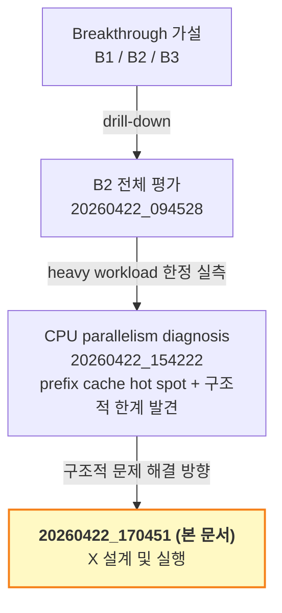
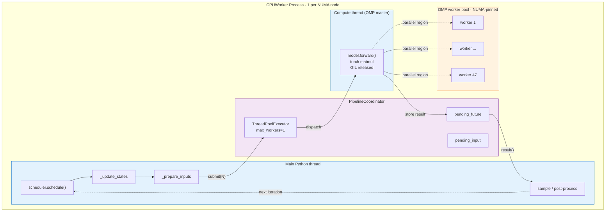
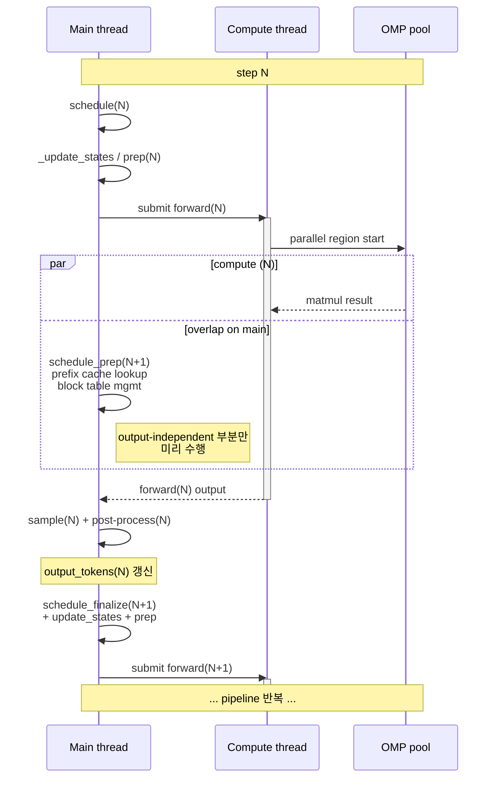
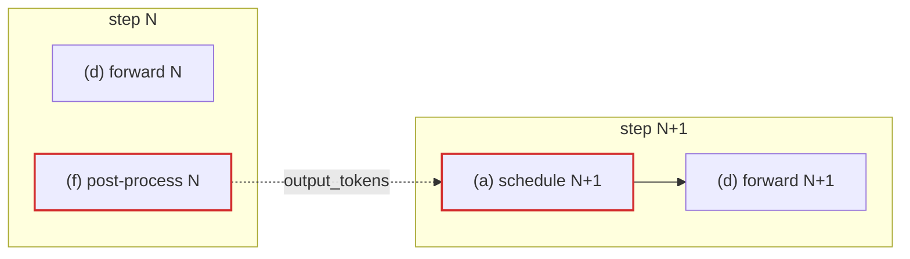
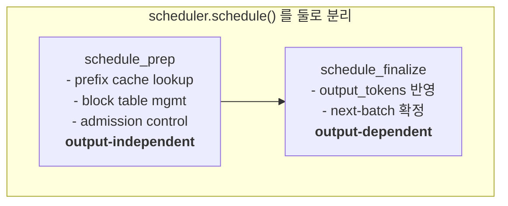

# Pipelined Async CPU Executor (X) — 설계 및 실행 계획

작성일: 2026-04-22 (KST)
작성자: Claude
부제: B2 diagnosis → X 설계 → 실행

---

## 0. 문서의 위치

### 0.1 Breakthrough 계층 내 본 문서



### 0.2 본 문서의 3 Part 구조


| Part | 섹션 | 역할 |
|---|---|---|
| **I** | §1, §2 | diagnosis 결과를 본 문서 scope 로 재정리. 여기 **신규 contribution 없음** — 출처는 `20260422_154222`. |
| **II** | **§3** | **본 문서의 신규 contribution**. X 의 상세 설계. 이 Part 가 문서의 존재 이유. |
| **III** | §4~§7 | §3 를 **어떻게 구현할 것인가** — Phase 계획, 의사결정, 대안. §3 종속. |

### 0.3 X 의 scope

X 는 B2 (heavy long-context) drill-down 에서 발견됐지만, **해결 대상은 CPU engine 의 sync executor 아키텍처 자체**이다. 따라서 X 의 효과는 B2 workload 에 한정되지 않고 light/heavy 모든 CPU engine 경로에 적용된다. 파일명 `_b2_` prefix 는 발견 경로를 표시하는 것이지 적용 범위가 아님.

### 0.4 관련 문서

- [`20260422_094528_claude_b2_longctx_32b_analysis.md`](20260422_094528_claude_b2_longctx_32b_analysis.md) — B2 전체 평가 (B1/B2/B3 해석 포함)
- [`20260422_154222_claude_b2_cpu_parallelism_diagnosis.md`](20260422_154222_claude_b2_cpu_parallelism_diagnosis.md) — flame graph 실측 진단 (본 문서 Part I 의 출처)

---

# Part I · 맥락 (이전 분석의 요약)

> **이 Part 의 역할**: 앞선 diagnosis 문서의 핵심 결과를 본 문서의 scope 로 재정리. 신규 내용 없음. §1 은 실측으로 도출된 bottleneck 목록, §2 는 그것들을 micro-fix 로는 해결 못 한다는 구조적 한계. 이 두 섹션은 Part II (§3 X 설계) 의 동기로 기능한다.

---

## 1. 실측으로 도출된 bottleneck Backlog

출처: [`20260422_154222_claude_b2_cpu_parallelism_diagnosis.md`](20260422_154222_claude_b2_cpu_parallelism_diagnosis.md) §5 hot spot 분석 결과를 본 문서 scope 로 재정리.

Flame graph (60s, 6000 samples, prefill 구간) 에서 식별된 hot spot 을 영향 순으로 정리. 각 항목은 **접근 방식의 복수 옵션** 을 가진다.

### 1.1 Prefix cache hit 탐색 (~25% prefill 시간)
위치: `scheduler.schedule()` → `get_computed_blocks` → `find_longest_cache_hit` → `get_cached_block`
원인: 16K prompt 의 1024 hash blocks 를 Python loop 로 cached pool 과 매칭

| ID | 접근 | 효과 상한 | 비용 |
|---|---|---:|---|
| **A-1** | CPU engine 에서 `--enable-prefix-caching` 비활성화 | ~25% (기능 포기) | 1~2 line |
| **A-2** | `find_longest_cache_hit` loop 를 C++ 이전 (`PyDict_GetItem` 직접) | ~20% (기능 유지) | ~150 line + build |

### 1.2 `_update_states` (~9% prefill 시간)
위치: `gpu_model_runner._update_states` — CPU engine 이 부모 class 의 구현 상속
원인: PP 분기, spec_decode 분기, `new_token_ids` 동기화 로직이 CPU 에서 불필요

| ID | 접근 | 효과 상한 | 비용 |
|---|---|---:|---|
| **B-1** | `CPUModelRunner._update_states` override — PP/spec 분기 skip | ~5~7% | ~30 line |
| **B-2** | `block_ids` append loop (layer 64 × zip extend) C++ 이전 | ~3~5% | ~100 line + build |

### 1.3 `torch.no_grad()` context manager overhead (~5% self-time)
위치: `decorate_context`, `clone`, `__enter__` in `grad_mode.py`
원인: 매 forward 호출마다 decorator 진입/탈출

| ID | 접근 | 효과 상한 | 비용 |
|---|---|---:|---|
| **C-1** | no_grad 를 outermost layer 로 hoisting (step 당 1회) | ~3% | 모델 구조 수정 |
| **C-2** | `torch.inference_mode()` 로 교체 | ~3~5% | ~10 line |

### 1.4 Scheduler 내부 Python 루프 (~15% prefill, prefix cache 제외)
위치: `scheduler.py` 의 여러 line (333, 337, 380, 511, 545, 552)

| ID | 접근 | 효과 상한 | 비용 |
|---|---|---:|---|
| **D-1** | CPU engine 용 scheduler fast path (cpu_max_seqs=1 특화) | 10%+ | 수백 line |
| **D-2** | scheduler 전체 C++ 재작성 | 15%+ | 큰 작업 |

### 1.5 Profile check overhead (~2%)
위치: `_hybrid_profile_enabled` — 매 step `os.environ.get` 호출

| ID | 접근 | 효과 상한 | 비용 |
|---|---|---:|---|
| **E-1** | module load 시 한 번 캐시 | ~2% | 2~3 line |

### 1.6 ZMQ idle polling (~3%)
위치: `_process_input_queue` in `core.py`
현재 우선순위 낮음 (구조적, 측정 편차 크다).

---

## 2. 구조적 문제 — Sync 설계의 한계

위 A~E 항목을 **전부 구현해도** 해결되지 않는 근본 문제가 있다.

### 2.1 관찰된 현상
- Heavy workload 에서 `cpu0` = 99.4% 점유 (6시간 연속)
- Worker core 들 (cpu1~47) = 각 <10% 평균
- Light workload 에서는 60 코어 50% 이상 활성

### 2.2 원인 — `UniProcExecutor` 의 동기 설계

vllm CPU engine 의 `CPUWorker.execute_model` 은 **동기적으로 `model.forward()` 를 호출**하고, 결과가 나올 때까지 main thread 가 block 된다.

```python
# 현재 CPU engine (UniProcExecutor, CPUWorker)
def execute_model(self, scheduler_output):
    self._pre_compute(scheduler_output)        # Python serial (~100ms)
    output = self.model_runner.execute_model(  # ← main thread block
        scheduler_output, ...)                 #    OMP matmul (~500ms)
    self._post_compute(output)                 # Python serial (~100ms)
    return output
```

Matmul 이 진행되는 동안:
- OMP worker thread 들은 일함 (48 코어)
- **Main Python thread 는 block 되어 아무것도 못 함**

즉 Python serial 과 compute 가 **완전히 순차적**. Pipeline 불가.

### 2.3 GPU 는 왜 다른가

GPU 는 `MultiProcExecutor` 를 쓴다. TP=N worker 가 **별도 프로세스**에서 `model.forward` 전담.

```
GPU 한 step:
  [main: Python prep 10ms] → [RPC dispatch]
  [GPU worker 1..8: forward 80ms] ← 이 동안 main 은 다음 batch prep 가능
  [main: 결과 수집 10ms]
```

**Main Python thread 는 GPU compute 가 도는 동안 자유**. 다음 step 의 scheduler 를 미리 돌릴 수 있다. CPU 엔진은 이 프리덤이 **설계상 없다**.

### 2.4 "CPU 가 GPU 보다 유연하지 않나?" 의 해답

**유연하다**. 하드웨어적으로도, OS 프리미티브로도 CPU 는 threading / async / shared memory 에 GPU 보다 유리하다. CPU 가 single-master 패턴인 것은 **하드웨어 한계가 아니라 vllm 의 CPU executor 구현이 동기적** 이기 때문이다.

구체적으로:
- Python GIL 은 Python 레벨에서만 배타적. **Torch tensor ops (matmul 등) 는 C 에서 실행되며 GIL 을 해제한다**.
- 즉 main Python thread 와 compute thread 가 **동시에 일하는 게 원리적으로 가능**.
- 단, 현재 `CPUWorker.execute_model` 이 single thread 로 구현돼 있어 이 기회를 전혀 활용 안 함.

### 2.5 Micro fix 로는 해결 못 하는 이유

A-1 (prefix off) 이 Python serial 을 25% 줄인다 해도:
- 남은 serial 은 여전히 compute 와 **순차** 실행
- Serial 이 200ms → 150ms 로 줄면 step 시간이 650ms → 600ms (7% 개선)
- Worker idle 비율 변화는 거의 없음

전부 (A+B+C+D+E) 구현해 serial 을 50% 줄여도:
- Step time 은 serial+compute 합이므로 개선은 25~30% 선
- 여전히 "1 master core + 나머지 자주 idle" 패턴은 유지

**패턴을 바꾸려면 pipeline 이 들어와야 한다**. 그게 X.

---

# Part II · X 설계 (본 문서의 contribution)

> **이 Part 의 역할**: 본 문서의 **신규 기여**. §1/§2 의 진단을 해결하는 새로운 아키텍처 — **Pipelined Async CPU Executor** 의 상세 설계. 아래 12 subsection 은 목적 → 원리 → 컴포넌트 → 동기화 → 의존성 → interface 호환 → 정량 효과 → 위험까지를 다룸.

---

## 3. X — Pipelined Async CPU Executor

### 3.1 목표

Main Python thread 가 compute 가 돌아가는 동안 **다음 step 의 Python 작업**을 동시에 진행하도록 vllm CPU executor 를 재설계.

### 3.2 핵심 원리 — torch CPU matmul 의 GIL 해제

Torch 의 CPU 연산자 (matmul, softmax 등) 는 C++ 로 구현되어 있으며, 내부에서 `Py_BEGIN_ALLOW_THREADS` / `Py_END_ALLOW_THREADS` 블록으로 GIL 을 해제하고 compute 를 수행한다. 이는 문서화된 동작이다.

즉 한 프로세스 안에서:
- **Thread A (main Python)**: scheduler / state update / prepare_inputs / sample / post-process — Python 코드. **GIL 필요**.
- **Thread B (compute)**: `model.forward()` — torch matmul 연속. **GIL 해제 상태로 실행**.

GIL 이 해제되는 구간이 충분히 크면 Thread A 와 Thread B 는 **같은 CPU 에서 병렬로 진행 가능**. 이게 pipeline 의 물리적 근거.

### 3.3 아키텍처 다이어그램

#### 3.3.1 컴포넌트 구조 (정적)



#### 3.3.2 Pipeline 시간 흐름 (동적)

1-step lookahead 가 작동하는 이상적 시나리오 — `schedule_prep` (output-independent) 부분만 compute 와 overlap:



### 3.4 구성 요소

#### 3.4.1 `PipelineCoordinator`
Pipeline 상태를 관리하는 컴포넌트. `CPUWorker` 내부 필드로 소유.

**필드**:
- `_compute_pool: ThreadPoolExecutor(max_workers=1)` — compute thread 생성/관리
- `_pending_future: Optional[Future[ModelRunnerOutput]]` — 진행 중인 step N 의 결과
- `_pending_input: Optional[SchedulerOutput]` — step N 의 스케줄 입력 (post-process 에서 필요)
- `_shutdown_event: threading.Event` — graceful shutdown 신호
- `_compute_lock: threading.Lock` — 공유 상태 접근 보호 (model tensor 등)

**책임**:
- compute submit / wait
- pipeline state transition
- error propagation (compute thread 의 예외를 main thread 로)

#### 3.4.2 `PipelinedCPUWorker`
기존 `CPUWorker` 를 상속하거나 대체. `execute_model` 의 semantics 를 "sync lookahead" 로 변경.

**기본 아이디어**: caller 는 `execute_model(N)` 을 호출하지만, 실제로 받는 output 은 **이전 호출의 결과 (N-1)**. First call 은 `None` 또는 `empty_output` 반환. Last call (shutdown) 은 explicit flush 로 pending future 완료.

**Trade-off**: caller (`EngineCore.step`) 의 sync 기대치와 충돌 가능 → §3.10 에서 해결 방안.

#### 3.4.3 `ComputeTaskWrapper`
Compute thread 에서 실행되는 wrapper. `model_runner.execute_model(prepared_input)` 을 호출하고 output 반환. 예외는 Future 에 caught.

```python
def _compute_task(self, prepared) -> ModelRunnerOutput:
    # GIL 해제는 model_runner 내부 torch 호출에서 자동
    return self.model_runner.execute_model(
        prepared.scheduler_output,
        prepared.intermediate_tensors,
    )
```

### 3.5 Thread 책임 분담

| 작업 | Main thread | Compute thread |
|---|:---:|:---:|
| `scheduler.schedule()` | ✓ | |
| `_update_states()` | ✓ | |
| `_prepare_inputs()` | ✓ | |
| `model.forward()` (matmul 모음) | | ✓ |
| `sample()` | (선택) | (선택) |
| Result post-processing (output token 반영) | ✓ | |
| KV cache 할당 / 할당 해제 | ✓ | |
| ZMQ IPC (입력 수신 / 결과 송신) | ✓ | |

`sample()` 의 위치는 구현 선택:
- **Compute thread**: forward 결과를 즉시 sampling → main 에 반환. Pipeline 효율 ↑
- **Main thread**: sampling 이 serial Python 이므로 main 에서. 단, 이 경우 post-compute 가 커짐.

**권장**: sample 을 compute thread 에 포함 (현재 `model_runner.execute_model` 이 sample 까지 포함) → 구현 단순.

### 3.6 공유 상태와 동기화

#### 3.6.1 공유 상태 목록
매 step 에서 update 되는 상태 중 **두 thread 가 동시에 접근할 가능성** 이 있는 것:

| 상태 | 소유자 | Thread 접근 | 보호 방법 |
|---|---|---|---|
| `self.requests: dict[req_id, CachedRequestState]` | CPUModelRunner | main 쓰기, compute 읽기 | **read-during-compute 보장** — compute 중에 main 은 requests 수정 금지 (다음 iter prep 에서만 수정) |
| `self.input_batch: InputBatch` | CPUModelRunner | main 쓰기, compute 읽기 | 동상. compute 는 input tensors 만 읽고 끝 |
| KV cache blocks (tensor) | block pool | compute 쓰기, main 인덱스만 | main 은 KV cache 텐서 직접 안 건드림. block indices 만 관리 |
| `scheduler.requests` (scheduler-side) | Scheduler | main only | compute 는 접근 안 함 |
| model parameters (weight tensors) | Model | compute only 읽기 | constant — 동시 읽기 안전 |

**설계 원칙**: compute thread 는 **읽기 전용**으로만 접근. 수정은 main thread 에서만. 이 계약을 깨는 코드 변경은 race 유발.

#### 3.6.2 동기화 원시
- `Future`: compute 완료 신호. `result()` 로 main 이 대기.
- `Event`: shutdown signal.
- `Lock`: **기본적으로 불필요**. 읽기 전용 계약을 지키면 contention 없음.

Python GIL 은 dict / list 같은 built-in 의 atomic 연산을 보장하므로 간단한 공유 dict 접근은 lock 없이도 안전 (단, 복합 연산은 아님).

#### 3.6.3 상태 스냅샷 vs 공유
두 가지 설계:
- **A. Shared state + read-only 계약** (권장): 위처럼 compute thread 는 읽기만. 성능 overhead 없음. 단 코드 리뷰에서 계약 보장 책임.
- **B. Snapshot + copy**: compute thread 시작 시 필요한 state 를 deep copy 해서 넘김. 안전하지만 매 step copy 비용 (특히 KV block 인덱스 리스트).

**선택**: A. KV cache / model tensor 가 대체로 "pointer + index" 구조라 conceptual sharing 으로 충분. B 는 실측 후 race 발견 시 fallback.

### 3.7 의존성 chain — 무엇이 overlap 가능한가

#### 3.7.1 Step 내부 dependency

매 step 의 6 단계는 서로 직렬 dependency:


(a)(b)(c)(e)(f) 는 Main thread, (d) 는 Compute thread 대상.

#### 3.7.2 Step 간 dependency



**★ tight dependency**: `schedule(N+1)` 은 `post-process(N)` 의 `output_token_ids` 업데이트가 필요. 즉 step N+1 의 (a) 는 step N 의 (f) 완료를 기다려야 함.

#### 3.7.3 Naive pipeline 의 한계

1-step lookahead 를 순진하게 적용하면:

```mermaid
gantt
    title Naive pipeline (overlap 이득 거의 없음)
    dateFormat s
    axisFormat %S s
    section Main
    (a)(b)(c) N      :a1, 0, 2s
    (e)(f) N         :a2, 7, 1s
    (a)(b)(c) N+1    :a3, after a2, 2s
    (e)(f) N+1       :a4, 16, 1s
    section Compute
    forward N        :c1, 2, 5s
    forward N+1      :c2, 10, 5s
    section Overlap
    Main idle        :crit, 2, 5s
    Main idle 2      :crit, 10, 5s
```



Main 이 compute(N) 동안 할 일이 없음 → 실제 overlap 이득 0.

#### 3.7.4 실효 pipeline — Scheduler 쪼개기

Scheduler 내부 중 **output_token_ids 와 무관한 부분** (prefix cache lookup, block mgmt) 을 **compute(N) 중에 미리 실행**:



이 분리가 성공하면 실제 pipeline 이득이 나옴:

```mermaid
gantt
    title Effective pipeline (schedule_prep 분리 시)
    dateFormat s
    axisFormat %S s
    section Main
    (a)(b)(c) N              :a1, 0, 2s
    sched_prep N+1 overlap   :active, ap1, 2, 5s
    (e)(f) N                 :a2, after ap1, 1s
    sched_final + (b)(c) N+1 :a3, after a2, 1s
    sched_prep N+2 overlap   :active, ap2, 11, 4s
    (e)(f) N+1               :a4, after ap2, 1s
    section Compute
    forward N         :c1, 2, 5s
    forward N+1       :c2, 10, 4s
```



`schedule_prep(N+1)` 이 `forward(N)` 과 overlap → Main idle 구간 소멸.

→ **§4 Phase 1 (의존성 분석) 의 핵심 목표**: scheduler 의 어느 부분이 output-independent 인지 실제 코드 레벨에서 매핑. 분리 불가능하면 X 의 이득은 제한적 (compute_post 의 일부만).

### 3.8 1-step lookahead vs 2-step lookahead

| Lookahead | 복잡도 | 이득 | 조건 |
|---|---|---|---|
| 1-step | 낮음 | compute 시간의 ~30% overlap 가능 | dependency 분리 가능해야 함 |
| 2-step | 높음 (2개 pending future) | 추가 ~10% | 이중 lookahead 는 output 2개 밀리는 문제 |

**제안**: 1-step 으로 시작, 2-step 은 1-step 이 작동 확인 후 별도 증설로 검토.

### 3.9 Error 및 예외 처리

#### 3.9.1 Compute thread 예외
`future.result()` 시 `CancelledError`, `TimeoutError`, `Exception` 이 raise 가능.

- `model.forward()` 내부 OOM (CPU DRAM 부족): main thread 에서 catch → EngineCore 에 fatal 전파 → graceful shutdown
- Sampling 오류: 동상
- KV cache allocation 실패 (compute 중에 발생 안 함, main 에서만): 해당 없음

**구현 규약**: compute task 안에서 던져진 예외는 Future 에 저장됨. main thread 의 `result()` 호출 시 재생. Main thread 는 `try/except` 로 감싸서 pipeline 을 gracefully drain.

#### 3.9.2 Partial pipeline drain
서버 종료, abort request 등으로 pending future 가 있는 상태에서 빠져나가야 할 때:

```python
def shutdown(self):
    self._shutdown_event.set()
    if self._pending_future is not None:
        try:
            self._pending_future.result(timeout=30)
        except TimeoutError:
            self._pending_future.cancel()
    self._compute_pool.shutdown(wait=True, cancel_futures=True)
```

#### 3.9.3 Request abort 중간
특정 request 가 완료 또는 abort 된 경우:
- scheduler 는 다음 schedule 에서 자동으로 그 request 를 제외
- pending future 의 이전 step 의 output 에는 abort 된 request 가 포함될 수 있음 → post-process 에서 필터

### 3.10 기존 vllm 인터페이스와의 호환

이 섹션이 가장 민감. CLAUDE.md 의 **"core.py 무수정"** 원칙과 충돌 가능.

#### 3.10.1 3가지 주입 옵션

**옵션 α — CPUWorker 레벨**:
```python
class CPUWorker:
    def execute_model(self, scheduler_output):
        # 1-step lookahead, 현재 call 이 이전 output 반환
        ...
```
- 장점: core.py 무수정 가능
- 단점: `execute_model` 의 return 이 "previous step output" 으로 바뀜 → caller semantic 위반
- 해결: `EngineCore.step()` 이 output 을 바로 output queue 에 넣는 구조이므로, 1-step lag 이 허용될 수 있음. 실측 필요.

**옵션 β — CPUModelRunner 레벨**:
`CPUModelRunner.execute_model` 내부에서 *일부* overlap.
- 장점: 더 local 한 변경
- 단점: model_runner 는 원래 stateless-ish 했는데 pipelining state 를 주입하면 복잡도↑
- 추가: `_update_states` 와 `_prepare_inputs` 를 overlap 하려면 model_runner 가 이전 step 의 완료 상태를 알아야 함

**옵션 γ — 새 EngineCore 서브클래스**:
```python
class PipelinedCPUEngineCore(EngineCore):
    def run_busy_loop(self):
        # 오버라이드: pipelining 명시적
        ...
```
- 장점: 가장 clean. core.py 손 안 대고 subclass 로 교체
- 단점: `EngineCore` 이 현재 subclass 친화적으로 설계돼 있는지 불명. `run_busy_loop` 가 private 가까운 메서드라면 override 안정성 낮음

#### 3.10.2 권장 경로
1. **α 시도** — 가장 적은 변경. `EngineCore.step()` 의 output flow 가 1-step lag 을 허용하는지 실측 검증.
2. α 가 불가하면 **γ** — `PipelinedCPUEngineCore` 클래스 신설, `run_cpu_engine_core` 에서 조건부 사용.
3. β 는 마지막 후보.

#### 3.10.3 Feature flag
신설 engine / worker 를 기존과 병존시키기 위해:
```python
# HybridConfig 에 필드 추가
cpu_pipelined: bool = False  # X 활성화 flag
```

또는 env var:
```bash
HYBRID_CPU_PIPELINED=1
```

단계별 활성화 → off 상태에서는 기존 동기 경로, on 상태에서만 X. 안전한 A/B 비교.

### 3.11 기대 효과 (정량)

매 step 의 이론 상한 개선:
```
step_time_sync    = serial_pre + compute + serial_post
step_time_pipe    = max(serial_pre + compute, compute_prev + serial_post + serial_pre_next)
                 ≈ compute + serial_overlap_failure

이득 = (serial_pre + serial_post) × overlap_ratio
```

`overlap_ratio` 는 §3.7 의 dependency 분리 가능성에 의존:
- 완전 overlap 가능: `overlap_ratio = 1.0` → 이득 = (serial_pre + serial_post)
- 완전 불가: `overlap_ratio = 0.0` → 이득 = 0

실측 추정:
- serial_pre (scheduler + update_states + prepare_inputs): ~150ms
- compute (CPU forward on 16K prefill batch=1): ~500ms
- serial_post (sample + post-process): ~50ms

overlap_ratio = 0.6 (보수적 추정) 일 때:
- 이득 = 200 × 0.6 = 120ms / step
- 현재 step = 700ms → 580ms (17% 단축)

overlap_ratio = 0.8 (낙관적) 일 때:
- 이득 = 160ms / step
- 현재 700ms → 540ms (23% 단축)

micro fix 와 조합:

| 조치 | 추정 prefill 개선 |
|---|---:|
| Baseline | — |
| A-1 만 | -15% |
| X 만 (overlap 0.6) | -17% |
| X 만 (overlap 0.8) | -23% |
| A-1 + X | -30~35% |
| A-1 + B-1 + C-2 + E-1 + X | -40~50% |

### 3.12 위험 및 mitigation

| # | 위험 | 발견 시점 | Mitigation |
|---|---|---|---|
| 1 | torch CPU matmul 이 GIL 해제 안 함 (또는 불완전) | Phase 2 실측 후 | MultiProc 설계로 피봇 |
| 2 | scheduler 의 output-independent 부분 분리 불가 | Phase 1 | overlap ratio ↓ 하지만 0 은 아님, X 여전히 가치 있음 |
| 3 | race condition — 공유 state 의 미허용 수정 | Phase 2/3 | snapshot 옵션 B 로 전환 (cost 증가) |
| 4 | core.py 수정 필요 (옵션 γ) | Phase 3 | 원칙 예외 요청 or 옵션 β 로 fallback |
| 5 | 1-step lag 가 `EngineCore.step()` 에서 호환 안 됨 | Phase 3 | 옵션 γ (새 EngineCore) 로 |
| 6 | OMP thread affinity 가 compute thread 로 섞여 NUMA 깨짐 | Phase 4/5 | compute thread 에 NUMA 재바인드 명시 |
| 7 | Exception propagation 깔끔하지 않음 | Phase 4 | Future chain 테스트 강화 |
| 8 | Correctness divergence (token 다름) | Phase 4 | sampling determinism seed + diff 검증 도구 |

---

# Part III · 실행 및 의사결정 (§3 종속)

> **이 Part 의 역할**: Part II (§3) 의 X 설계를 **어떻게 구현할 것인가**. Phase 단위 plan, 의사결정 포인트, 대안 경로 비교, 다음 단계. §3 에 나온 설계를 전제로 한 실행 세부.

---

## 4. 실행 계획 — Phase 1 ~ 5

Torch CPU matmul 이 GIL 을 해제한다는 것은 공식 문서화된 동작 (`Py_BEGIN_ALLOW_THREADS` 블록) — 별도 사전 측정 없이 이 가정 위에서 구현 진행. 만약 Phase 2 구현 후 실측에서 overlap 실효가 없다면 그 때 MultiProc 으로 pivot.

| Phase | 목적 | 산출물 | 소요 | 위험 |
|---|---|---|---:|---|
| **1** | 의존성 분석 — overlap 가능 구간 매핑 | data flow 문서 | 1일 | 낮음 |
| **2** | 최소 구현 — compute 를 별도 thread 로 (pipeline 아직 안 함) | `CPUWorker` 수정, correctness 검증 | 2일 | 중간 |
| **3** | Pipeline 활성화 — 1-step lookahead | run_busy_loop 호환 레이어 | 2~3일 | 높음 |
| **4** | 정합성 검증 | light + heavy 테스트 | 1일 | 중간 |
| **5** | 측정 — flame graph + wall time | phase3 재실행, before/after 비교 | 0.5일 | 낮음 |

**총 ~1주**.

### 4.1 Phase 1 상세

매 step 의 data flow 를 분해해 **overlap 가능 구간** 을 색칠:

```
step(N) start
  [scheduler.schedule] → scheduler_output_N
    ├ uses: prev step 의 output (dependency ★)
  [_update_states(scheduler_output_N)]
    ├ uses: scheduler_output
  [_prepare_inputs(N)]
    ├ produces: input tensors
  [model.forward(N)]            ← overlap zone (GIL 해제)
  [sample(N)]
    ├ produces: output tokens ★
step(N+1) start:
  [scheduler.schedule]  ← needs ★
```

overlap 가능: `_update_states(N+1)` 의 일부 + `scheduler.schedule(N+1)` 의 prefix cache lookup 파트 (sampling 결과와 독립).

### 4.2 Phase 2 상세

`cpu_worker.py:718` 의 `self.model_runner.execute_model(...)` 를 `compute_executor.submit(...)` 로 교체. 아직 pipeline 아님, 단지 compute 가 별도 thread 에서 실행됨을 확인.

```python
# CPUWorker.__init__
self._compute_pool = ThreadPoolExecutor(max_workers=1,
                                         thread_name_prefix="cpu-compute")

# CPUWorker.execute_model
def execute_model(self, scheduler_output):
    ...
    future = self._compute_pool.submit(
        self.model_runner.execute_model,
        scheduler_output, intermediate_tensors)
    output = future.result()  # 아직 block, 단 thread 분리는 됨
    ...
```

correctness: output bit-equality 검증.

### 4.3 Phase 3 상세

Pipeline 활성화. 두 옵션 중 선택:

**옵션 α — CPUWorker 레벨에서 1-step lookahead**:
```python
def execute_model(self, scheduler_output):
    # 이전 step 의 compute 완료 대기
    prev_output = (self._pending_future.result()
                   if self._pending_future else None)
    # 현재 step 의 compute launch (반환은 안 함, 비동기)
    self._pending_future = self._compute_pool.submit(
        self._run_forward, scheduler_output, ...)
    # 이전 step output 반환
    return prev_output
```

**옵션 β — CPUModelRunner 레벨에서 overlap**:
model_runner.execute_model 내부에서 `_update_states + _prepare_inputs` 와 **이전 iter 의 compute** 가 overlap.

α 가 더 단순하나 run_busy_loop 의 sync interface 와 정합 문제. β 는 local 하지만 model_runner 내부 state 관리 복잡.

**추천**: α 를 default, Phase 3 에서 구현 가능성 실측 후 β 로 전환 검토.

### 4.4 Phase 4 상세

- Light (128/128) workload 로 100 req 완주
- output token 들이 baseline 과 bit-equal
- 100회 run 반복 후 deadlock / panic 없음
- Heavy (16K) 로 Phase 3 재실행해 py-spy flame graph 변화 확인

### 4.5 Phase 5 측정

- `cpu0` master 점유율: 99% → ? (목표 <70%)
- Worker core 평균 util: <10% → ? (목표 >25%)
- Heavy bench duration: baseline 대비 감소율 (목표 30%+)
- phase3 flame graph 에서 serial 구간 / compute 구간 비율

---

## 5. 의사결정 포인트 (구현 착수 전)

### 5.1 Pipeline depth
- 1-step lookahead 로 시작. 2-step 은 복잡도 크게 상승하므로 후속 검토.

### 5.2 core.py 수정 허용 여부
CLAUDE.md 에 **"core.py 무수정"** 원칙 명시. Phase 3 옵션 α 가 `run_busy_loop` 의 interface 호환을 요구. 사전에:
- core.py 수정 없이 CPUWorker / CPUModelRunner 수준에서 해결 가능한지 결론
- 불가능하면 원칙 예외 허용 여부 결정

### 5.3 Correctness 기준
- **엄격**: bit-equal output tokens. deterministic sampler 필수.
- **완화**: sampling 결과 tokens 동일, 내부 tensor 업데이트 순서 차이 허용.

### 5.4 Micro fix 와의 조합 순서

A-1/B-1/C-2/E-1 은 sync 안에서도 가치 있음. 하지만 X 가 들어오면 이들이 **pipeline 의 overlap 구간** 에 있는 작업인지, 아니면 별도 경로인지에 따라 효과가 달라짐. 제안:
- **X Phase 1~2 완료 후 A-1/E-1 같은 저비용 fix 부터 추가** → 각 fix 의 실효를 X 위에서 측정

---

## 6. 대안 경로 비교

| 경로 | 예상 효과 | 비용 | 리스크 |
|---|---:|---|---|
| Micro fix 만 (A-1 + B-1 + C-2 + E-1) | 20~30% serial 축소, 패턴 유지 | 수일 | 낮음 |
| **X (async) 만** | 30~40% pipeline 이득, 패턴 개선 | ~1.5주 | 중~높음 (GIL / 의존성) |
| **X + micro fix** | 50~70% 개선 (이론) | ~2주 | 중~높음 |
| MultiProcExecutor 로 전환 | 이론상 비슷한 pipeline, 단 IPC 비용 별도 | ~1.5주 | 중 (IPC 설계) |
| Do nothing (현재 구조 유지) | 0% | 0 | heavy workload 의 CPU offload 포기 |

X + micro fix 가 가장 큰 기대 효과. Phase 2 실측에서 overlap 이 미미하면 MultiProc 으로 pivot.

---

## 7. 다음 단계 (정해진 순서)

1. **Phase 1** — scheduler 의존성 분석 문서 작성
2. **Phase 2** — CPUWorker 에 compute thread 분리, correctness 검증
3. **Phase 3** — pipeline 활성화 (1-step lookahead)
4. **Phase 4** — 정합성 검증 (light + heavy)
5. **Phase 5** — flame graph 재측정, before/after 비교
6. 각 phase 완료 후 **정지 + 평가**: 다음 phase 를 진행할지 중단할지

각 phase 사이에 **stop-and-measure** 를 강제하여 sunk cost 에 빠지지 않도록 함.

---

## 부록 A — 용어

| 용어 | 의미 |
|---|---|
| Main thread | CPUWorker 프로세스 안의 Python 메인 thread — scheduler / update_states / prepare_inputs 실행 |
| Compute thread | X 에서 도입하는 별도 thread — `model.forward()` 전담, OMP master 역할 |
| OMP workers | Compute thread 가 parallel region 진입 시 활성화되는 47 개 thread (OMP pool) |
| 1-step lookahead pipeline | 현재 step 의 compute 와 다음 step 의 Python prep 이 overlap 하는 구조 |
| GIL 해제 | torch C++ 커널 실행 시 `Py_BEGIN_ALLOW_THREADS` 로 GIL 반환 → 다른 Python thread 실행 가능 |
