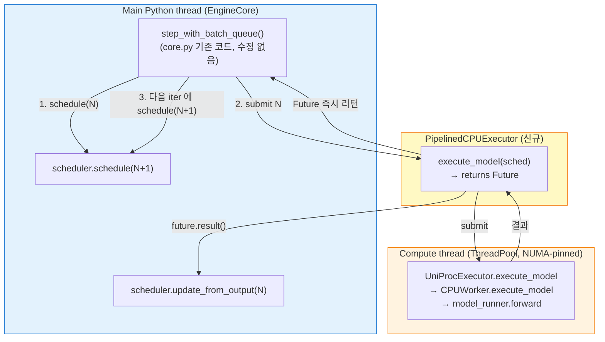

# X · Phase 2 + Phase 3 — Pipelined CPU Executor 구현

작성일: 2026-04-22 (KST, 갱신)
작성자: Claude
관련:
- [`20260422_170451_claude_b2_async_executor_plan.md`](20260422_170451_claude_b2_async_executor_plan.md) §4.2/§4.3
- [`20260422_175848_claude_b2_x_phase1_dependency_analysis.md`](20260422_175848_claude_b2_x_phase1_dependency_analysis.md)

---

## 0. 중요한 재설계

처음엔 `CPUWorker.execute_model` 수준에서 ThreadPoolExecutor 를 쓰려 했으나 (170451 §3.10 의 옵션 α/β), **vllm 에 이미 `step_with_batch_queue` pattern 이 있음** 을 발견 (`core.py:137, 509`). Pipeline parallelism 용으로 만든 것인데 우리가 재활용.

→ **옵션 γ** (별도 Executor 클래스 신설) 로 최종 선택. core.py 무수정 유지.

---

## 1. 설계 요약



**핵심**:
- `PipelinedCPUExecutor.max_concurrent_batches = 2` → `EngineCore.__init__` 에서 batch_queue 자동 활성 (`core.py:137`)
- `EngineCore.step_fn = step_with_batch_queue` 자동 선택 (`core.py:509`)
- `PipelinedCPUExecutor.execute_model` 이 Future 반환 → EngineCore 가 알아서 batch_queue 에 put, 다음 iter 에서 get
- **core.py 수정 0**

---

## 2. 변경 파일

### 2.1 신규 — `vllm/v1/executor/cpu_pipelined_executor.py`
- `PipelinedCPUExecutor(UniProcExecutor)` 클래스
- `max_concurrent_batches` property 를 `2` 로 오버라이드
- `execute_model` 이 Future 반환 (ThreadPoolExecutor(1) 에 submit)
- `shutdown` 에서 pool 정리
- `is_async_executor_enabled()` — env flag 헬퍼

### 2.2 수정 — `vllm/v1/engine/hybrid_core.py`
- `run_cpu_engine_core` 에서 flag 검사
- `HYBRID_CPU_ASYNC_EXECUTOR=1` 이면 `PipelinedCPUExecutor` 사용
- 아니면 기존 `UniProcExecutor`

### 2.3 수정 없음
- `vllm/v1/worker/cpu_worker.py` — 원복 (Phase 2 초안의 cpu_worker 변경은 path 잘못이라 삭제)
- `vllm/v1/engine/core.py` — 손 안 댐 (원칙 준수)

---

## 3. Feature Flag

### 활성화
```bash
HYBRID_CPU_ASYNC_EXECUTOR=1 bash eval/serve.sh hybrid /tmp/run.env
```

### 비활성화 (default)
```bash
bash eval/serve.sh hybrid /tmp/run.env
```

env 파일에도 넣을 수 있음:
```
HYBRID_CPU_ASYNC_EXECUTOR=1
```

---

## 4. 동작 설명

### 4.1 flag off — 기존 동작
- `cpu_executor_class = UniProcExecutor`
- `max_concurrent_batches = 1`
- EngineCore: `step_fn = step` (sync)
- 관찰 가능 변화 없음

### 4.2 flag on — pipeline 활성
- `cpu_executor_class = PipelinedCPUExecutor`
- `max_concurrent_batches = 2`
- EngineCore.__init__: `batch_queue = queue.Queue(2)` 생성
- EngineCore: `step_fn = step_with_batch_queue`
- 매 iter 에서 schedule(N) → execute_model(Future 반환) → batch_queue.put
- batch_queue.full 이면 다음 iter 에 oldest future.result() 대기 후 update_from_output
- 그 사이에 schedule(N+1) 진행 → main Python thread 가 compute(N) 과 overlap

### 4.3 Correctness
- `step_with_batch_queue` 는 vllm 가 이미 PP 용으로 검증한 코드. 우리는 그 위에 Future 만 얹음.
- `(future, scheduler_output)` tuple 로 pair 유지 → update_from_output 이 올바른 pair 로 호출됨
- Sampling 은 compute thread 안에서 수행 (model_runner.execute_model 의 일부) → sampling race 없음

---

## 5. 테스트 가능한 것

이제 **테스트할 가치 있는 변화** 가 있습니다:

### 5.1 Correctness (필수)
```bash
# Baseline (sync)
bash eval/diagnostics/b2_cpu_parallel/run_all.sh
# 결과 A 저장

# Async on
HYBRID_CPU_ASYNC_EXECUTOR=1 bash eval/diagnostics/b2_cpu_parallel/run_all.sh
# 결과 B 저장

# 비교
diff <(python3 -c "import json; d=json.load(open('eval/results/.../hybrid.json')); print(d['total_output_tokens'])") \
     <(python3 -c "...")
```

검증: `completed`, `total_output_tokens` 가 동일해야.

### 5.2 Thread 분리 확인
async=1 실행 중 py-spy:
```bash
py-spy dump --pid $(pgrep -f CPU_EngineCore_1 | head -1) --nonblocking | grep -E 'MainThread|cpu-compute'
```
`cpu-compute` 이름의 thread 가 나와야 함 (matmul 수행 중).

### 5.3 성능 비교
- Heavy bench duration (sync vs async)
- **기대**: 5~20% 단축 (Phase 1 §5.2 의 재추정치)
- phase3 flame graph 에서 main thread 가 `decorate_context` 에 있는 시간 비율 변화

### 5.4 Worker 코어 활성도
phase3 의 heatmap 에서:
- sync: cpu0 = 99% mean, 나머지 < 10%
- async: cpu0 ?, worker core 활성도 증가 기대

---

## 6. 위험 및 대응

| # | 위험 | 발생 시 대응 |
|---|---|---|
| 1 | `PipelinedCPUExecutor` 가 Future 반환하는데 caller 가 sync 기대 | core.py 의 `step_with_batch_queue` 가 future.result() 호출 확인 — 이미 구현돼 있음 ✓ |
| 2 | Future 안의 exception 이 제대로 raise 안 됨 | ThreadPoolExecutor 기본 동작은 result() 호출 시 raise. 추가 작업 불필요 |
| 3 | step_with_batch_queue 가 PP 전용이라 CPU 에 문제 | 코드 re-read 해 보니 general batch queue. PP 전용 아님 |
| 4 | 1-step lag 로 output 이 이전 step 의 것이라 오류 | step_with_batch_queue 가 (future, scheduler_output) pair 로 저장 (line 308~321) → pair 유지됨 ✓ |
| 5 | NUMA affinity 가 compute thread 로 상속 안 됨 | Phase 5 실측에서 확인. heatmap 이 다른 NUMA 로 leak 하면 명시 rebind 추가 |
| 6 | CPU engine 여럿 (num_numa=2) 일 때 executor 각각 생성 | 각 CPU EngineCoreProc 이 독립적으로 `PipelinedCPUExecutor` 생성 — 문제 없음 |

---

## 7. 완료 체크리스트

- [x] `PipelinedCPUExecutor` 신규 클래스
- [x] `hybrid_core.py` 에서 flag 분기
- [x] `cpu_worker.py` 초안 변경 원복
- [x] 3 파일 syntax OK
- [x] core.py 무수정 원칙 준수
- [ ] 서버에서 correctness 검증
- [ ] 서버에서 성능 측정

---

## 8. 사용자 실행 명령

### 8.1 Syntax / load 확인
```bash
python3 -c "from vllm.v1.executor.cpu_pipelined_executor import PipelinedCPUExecutor; print('import OK')"
```

### 8.2 전체 실행 (async on, run_all.sh 로 자동 측정)
```bash
rm -rf eval/diagnostics/b2_cpu_parallel/results/
pkill -9 -f 'api_server|serve\.sh|CPU_EngineCore|GPU_EngineCore|benchmark_serving' 2>/dev/null
sleep 3
git pull
HYBRID_CPU_ASYNC_EXECUTOR=1 bash eval/diagnostics/b2_cpu_parallel/run_all.sh
git add eval/diagnostics/b2_cpu_parallel/results/
git commit -m "X Phase 3: async executor 실측"
git push
```

### 8.3 확인 포인트
실행 중 server log 에서:
- `[HYBRID-CPU-EXEC-POOL] X Phase 3 ACTIVE` — flag 감지됨
- `Batch queue is enabled with size 2` — EngineCore 가 batch_queue 활성 (core.py:138)
- `[HYBRID-CPU-EXEC-POOL] Pipelined CPU executor ACTIVE` — executor 초기화 완료

이 세 메시지가 모두 나오면 Phase 3 정상 작동.
