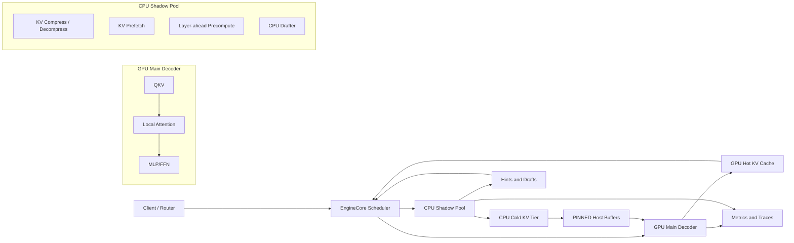
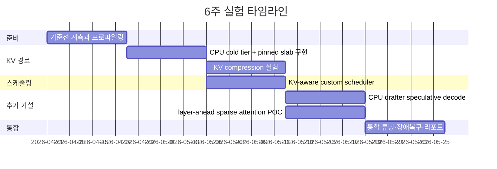

# vLLM 기반 CPU Shadow 아키텍처 연구 보고서

## 요약

결론부터 말하면, **호스트 CPU는 LLM 추론에 “의미 있게” 기여할 수 있다. 다만 그 형태는 GPU와 대칭적인 공동 디코더가 아니라, GPU의 디코드 경로를 방해하지 않는 `shadow` 역할이어야 한다.** 최근 연구들의 공통점은 CPU가 잘하는 일을 GPU의 주 경로 밖으로 밀어내는 데 있다. 구체적으로는 KV 캐시의 저장 계층화와 비동기 로딩, 일부 attention 계산의 선행·희소화, 토큰 단위 스케줄링, 프리픽스 재사용, 그리고 조건이 맞을 때의 speculative decoding이다. 반대로 **dense MLP/FFN을 CPU가 정면으로 떠안는 방식**은 PCIe/NUMA 전송과 동기화 비용 때문에, 메모리 제약이 극단적인 경우를 제외하면 대개 전체 처리량 목표에 불리하다. NEO, APEX, ScoutAttention, OmniServe는 모두 “CPU가 KV/attention/스케줄링을 비동기로 떠안아 GPU 배치 한계를 높이는 방향”에서 성과를 냈고, Blink는 한 걸음 더 나아가 **호스트 CPU 자체가 토큰 단위 제어 경로의 병목**이 될 수 있음을 보여주었다. vLLM 공식 문서도 CPU offload를 “가상적인 GPU 메모리 확대”로 설명하며, 빠른 CPU-GPU 인터커넥트가 없으면 매 forward마다 전송 비용을 치른다고 명시한다. citeturn24view4turn24view3turn24view1turn24view0turn26view1turn17view4turn34view0

당장 ROI가 높은 순서는 대체로 다음과 같다. **첫째**, GPU 쪽에서 먼저 FP8 KV 캐시, prefix caching, chunked prefill 같은 저위험 기능을 다 켠 뒤, CPU는 **cold KV tier**와 **비동기 prefetch**에 붙인다. **둘째**, 스케줄러를 KV 압박과 CPU-ready 상태를 아는 방향으로 바꿔 decode batch ceiling을 높인다. **셋째**, 긴 문맥에서만 ScoutAttention류의 layer-ahead precompute나 블록 희소 attention을 검토한다. **넷째**, medium-to-low QPS, memory-bound 조건에서만 CPU drafter 기반 speculative decoding을 켠다. 반대로 **disaggregated prefill은 tail latency 제어에는 유용하지만 vLLM 공식 문서상 throughput 개선용은 아니다.** citeturn17view6turn17view3turn17view9turn17view7turn17view8turn6search0

vLLM 관점에서 구현 난이도도 생각보다 명확하다. 비침습적 확장은 `scheduler_cls`로 교체 가능한 스케줄러, `KVConnector`의 `start_load_kv()`와 event 경로, `KVCacheManager`의 `get_computed_blocks()`·`allocate_slots()`, 그리고 attention backend 인터페이스를 축으로 잡으면 된다. 즉, **처음부터 거대한 듀얼 파이프라인을 다시 짜기보다, 스케줄러와 KV 계층을 먼저 바꾸고, attention은 실험적으로 꽂아 넣는 구조**가 유지보수와 upstream 추적 측면에서 훨씬 낫다. citeturn19view0turn17view5turn20view0turn20view1turn19view2turn19view3turn17view0turn19view1

## 결론과 적용 범위

이 보고서의 목표 지표는 **시스템 처리량**과 **SLO를 만족하는 goodput**이다. 여기서는 goodput를 “주어진 TTFT·TPOT 목표를 만족한 출력 tok/s”로 정의하겠다. vLLM은 이미 이 분석에 필요한 핵심 지표들을 제공한다. `vllm:time_to_first_token_seconds`, `vllm:request_time_per_output_token_seconds`, `vllm:inter_token_latency_seconds`, `vllm:kv_cache_usage_perc`, `vllm:num_requests_running`, `vllm:num_requests_waiting`, `vllm:prompt_tokens_cached`, `vllm:external_prefix_cache_hits` 같은 메트릭이 `/metrics` 엔드포인트에 노출된다. 따라서 “CPU가 실제로 도움이 되는가”는 감으로 볼 일이 아니라, **배치 천장·KV 점유율·TTFT/TPOT·goodput**를 같이 보면서 판단해야 한다. citeturn23view0

이 범위에서 특히 중요한 것은 **prefill 최적화와 decode 최적화를 분리해서 보는 일**이다. vLLM 문서는 chunked prefill이 prefill의 compute-bound 성격과 decode의 memory-bound 성격을 더 잘 섞어 throughput과 latency 모두를 개선할 수 있다고 설명한다. 반면 disaggregated prefill은 tail ITL을 제어하는 데는 좋지만, 공식 문서가 분명히 “throughput은 개선하지 않는다”고 적고 있다. 처리량이 목표인 현재 질문에서는, CPU를 prefill 분리 전용으로 쓰기보다 **decode 단계의 KV 압박과 host control-path를 완화하는 데 우선 투입**해야 한다. citeturn17view9turn17view8

왜 그런가를 가장 잘 보여주는 것이 GPU-CPU 전송 계층과 호스트 제어 경로다. CUDA Best Practices Guide는 GPU 메모리 대역폭이 호스트-디바이스 대역폭보다 훨씬 높기 때문에, CPU에서 약간 빠를 수 있는 계산이라도 데이터를 호스트로 넘겨야 한다면 전체적으로는 GPU에 남겨두는 편이 낫다고 권고한다. 또한 pinned memory와 `cudaMemcpyAsync()`를 쓰면 전송 성능과 overlap이 좋아지지만, pinned memory는 scarce resource라 남용하면 시스템 성능을 해칠 수 있다. Blink는 이보다 더 강한 메시지를 던진다. 토큰 단위 continuous batching, KV-cache block 관리, 다음 스텝 dispatch가 매번 호스트로 돌아오는 현재 구조 자체가 fast GPU에서 민감한 병목이 되며, CPU 간섭이 들어오면 P99 TTFT/TPOT와 decode throughput이 크게 흔들릴 수 있다는 것이다. citeturn34view0turn26view1

따라서 최종 질문은 “CPU에 무엇을 더 맡길까”가 아니라, **“무엇을 CPU에 맡겨도 GPU의 토큰 단위 임계 경로에 들어오지 않게 할 수 있는가”**가 된다. 이 기준으로 보면, 프리픽스 재사용 관리, cold KV tier, 비동기 KV 로딩, CPU drafter, KV 압력 인지 스케줄링은 후보가 되지만, dense FFN 본체를 CPU에서 직접 계산하는 것은 기본값으로는 후순위다. NEO와 APEX는 constrained GPU에서 좋은 결과를 내지만, 그조차도 핵심은 **CPU-오프로딩 작업을 얼마나 잘 overlap하느냐**였지 CPU가 주 디코더가 되는 것이 아니었다. citeturn24view4turn24view3

## 분석 성능 모델

이 문제를 정량적으로 보려면 먼저 KV 캐시가 batch ceiling을 어떻게 결정하는지 봐야 한다. 한 토큰이 차지하는 KV 바이트 수를 다음처럼 두자.

\[
b_{kv}=2 \cdot N_{layer}\cdot N_{kv\_heads}\cdot d_{head}\cdot s_{kv}
\]

여기서 `2`는 K와 V, \(N_{layer}\)는 레이어 수, \(N_{kv\_heads}\)는 KV head 수, \(d_{head}\)는 head dimension, \(s_{kv}\)는 KV 데이터형의 바이트 수다. 활성 decode 배치가 \(B\), 평균 live context 길이가 \(\bar{\ell}\)라면 GPU에 올라가 있는 KV 총량은 대략

\[
M_{kv}^{gpu}\approx B \cdot \bar{\ell}\cdot b_{kv}
\]

이고, 여유 GPU 메모리를 \(M_{free}\), 런타임 여유분을 \(M_{margin}\)이라 두면 decode batch ceiling은

\[
B_{ceiling}\approx \left\lfloor \frac{M_{free}-M_{margin}}{\bar{\ell}\cdot b_{kv}} \right\rfloor
\]

로 근사할 수 있다. vLLM 문서가 `gpu_memory_utilization` 또는 `kv_cache_memory_bytes`를 키우면 KV cache가 커져 throughput이 좋아질 수 있다고 설명하는 이유가 바로 이 식이다. FP8 KV 캐시는 KV footprint를 낮춰 더 많은 토큰을 저장하게 하며, 더 긴 문맥과 더 높은 throughput을 가능하게 한다. citeturn37view0turn17view6

GPU-only 디코드의 스텝 시간은 모듈별 합으로 생각할 수 있지만, hybrid 비교에는 아래 근사가 더 유용하다.

\[
T_{step}^{gpu}\approx T_{gpu\_main}(B,\bar{\ell}) + T_{host\_ctl}
\]

여기서 \(T_{gpu\_main}\)은 QKV·attention·MLP의 GPU 경로, \(T_{host\_ctl}\)은 배치 재구성, block table 갱신, 결과 copy-out 같은 호스트 측 제어 비용이다. Blink의 핵심 주장은 바로 이 \(T_{host\_ctl}\)이 fast GPU·long decode에서 무시하기 어렵다는 점이다. vLLM의 Model Runner V2 설계 문서도 scheduler와 worker가 step \(N+1\) 입력을 준비하는 동안 GPU가 step \(N\)을 실행하도록 비동기 overlap을 강화하고 있다고 밝힌다. 즉, vLLM도 이미 **CPU work는 overlap되어야 한다**는 방향으로 진화하고 있다. citeturn26view1turn17view1

CPU 역할 \(j\)가 들어간 hybrid는 다음처럼 보는 것이 가장 실전적이다.

\[
T_{step}^{hyb}(j)\approx T_{gpu\_main}^{'}(B',\bar{\ell})
+\max \left(0,\;T_{cpu,j}+T_{xfer,j}+T_{sync,j}-O_j\right)
\]

여기서 \(O_j\)는 GPU 주 경로 뒤에 숨겨진 overlap 양이다. 이 식이 말하는 바는 단순하다. **CPU 일이 도움이 되려면, 늘어난 batch ceiling이 가져오는 이득이 임계경로에 새로 들어온 CPU·전송·동기화 비용보다 커야 한다.** 최종적으로 decode 처리량은

\[
TPS \approx \frac{B_{eff}\cdot a_{spec}}{T_{step}}
\]

로 둘 수 있다. \(a_{spec}=1\)이면 일반 decode, speculative decoding이면 accepted tokens per verify pass만큼 \(a_{spec}>1\)이 된다. 따라서 hybrid의 수익성 조건은

\[
\frac{B_{eff}^{'}}{B_{eff}}\cdot \frac{a_{spec}^{'}}{a_{spec}}
>
\frac{T_{step}^{hyb}}{T_{step}^{gpu}}
\]

이다. 이 불등식이 만족될 때만 system throughput과 goodput가 오른다. vLLM 공식 speculative decoding 문서가 이 기능을 “medium-to-low QPS, memory-bound workloads”에서 inter-token latency를 줄이는 기능으로 한정해서 설명하는 것도 같은 논리다. citeturn17view7turn34view0

이 모델에서 세 가지 운영 구간이 나온다. **KV-bound 구간**에서는 batch ceiling이 낮아 GPU 연산기가 놀기 때문에, FP8 KV·KV compression·cold tiering이 거의 정비례에 가깝게 이익을 준다. **Overlap-bound 구간**에서는 CPU shadow 작업이 충분히 숨겨질 때만 이익이 나며, APEX·NEO·ScoutAttention이 바로 이 overlap을 어떻게 만들 것인가에 집중한다. **Control-path-bound 구간**에서는 오히려 CPU에 더 맡기는 것보다 호스트가 하던 제어를 줄이는 편이 낫고, Blink가 이 방향의 극단값이다. citeturn24view4turn24view3turn24view1turn26view1

아래 표는 7B/13B/34B/70B급 dense 모델을 대상으로, **정확한 아키텍처 수치가 아니라 vLLM serving 의사결정 관점에서의 대표적 권고**를 정리한 것이다. NEO는 7B·8B·70B를, OmniServe는 34B·70B mixed-load 시나리오를, Aegaeon은 최대 72B까지를 다루고 있어 이 구간화에 실질적 근거를 제공한다. citeturn28view0turn27view1turn25view0

| 모델 급 | 짧은 문맥 | 중간 문맥 | 긴 문맥 | 권장 CPU 역할 |
|---|---|---|---|---|
| 7B | GPU-only 튜닝이 우선 | prefix/spec 정도가 유효 | constrained GPU면 KV tiering 검토 | prefix, CPU drafter, 가벼운 KV tier |
| 13B | GPU-only + FP8 KV 우선 | KV 압박이 슬슬 보임 | PCIe 노드면 offload 이득 가능 | KV tier, spec, 스케줄러 개선 |
| 34B | weight+KV 압박이 본격화 | batch ceiling 개선 여지 큼 | CPU shadow ROI가 높아짐 | KV tier, async prefetch, 토큰 스케줄링 |
| 70B | short context에서도 메모리 민감 | KV와 host control-path 둘 다 문제 | 가장 강한 CPU-shadow 수요 | KV tier, prefix 재사용, 스케줄러, 필요 시 spec |

## 역할별 우선순위와 ROI

최근 결과를 숫자로만 요약하면 방향이 뚜렷하다. NEO는 constrained GPU에서 CPU 오프로딩으로 T4/A10G/H100에서 각각 최대 7.5×, 26%, 14% throughput 향상을 보고했고, 더 강한 CPU를 주면 A10G에서 79.3%까지 올라갔다. APEX는 기존 hybrid 스케줄러보다 더 세밀한 overlap으로 T4에서 84–96%, A10에서 11–89% 개선을 보고했다. ScoutAttention은 기존 offloading 방식 대비 2.1× speedup을, OmniServe는 70B mixed-load 서비스에서 LS SLO attainment 최대 1.48×와 BE decode throughput 6.94×를, DuoDecoding은 CPU draft + GPU target 조합에서 generation latency 최대 2.61×와 TTFT 17% 감소를 보고했다. 반대로 Blink는 **호스트를 더 쓰는 것보다 덜 쓰는 것**이 더 큰 이득이 될 수 있음을 보여 주며, isolated setting에서도 decode throughput 최대 2.1×, P99 TTFT/TPOT 개선을 보고했다. Aegaeon은 멀티모델 풀링에서 1.5–9× goodput, 82% GPU 절감을 보여 주었고, TurboQuant는 3.5 bits/channel에서 quality-neutral, Google 블로그 기준 long-context retrieval에서 최소 6× KV 메모리 감소를 제시한다. citeturn28view0turn24view3turn24view1turn27view1turn24view5turn26view1turn25view0turn41search0turn24view7

이 근거를 vLLM 단일/소수 GPU dense serving 관점으로 재정렬하면 아래 표가 된다. 표의 평가는 문헌 결과와 vLLM 공식 기능 제약을 합친 **실전 우선순위**다. citeturn17view4turn17view6turn17view7turn17view9turn24view4turn24view3turn24view1turn24view0turn26view1turn25view0

| 역할 | 기대 이득 | 주 비용 | 구현 복잡도 | 대표 실패 모드 | 유리한 조건 | 최종 판단 |
|---|---|---|---|---|---|---|
| GPU FP8 KV + CPU cold KV tier | decode batch ceiling 상승, KV occupancy 완화 | pack/unpack, H2D prefetch | 중간 | prefetch miss로 TPOT 급등 | 16K+ 문맥, 34B/70B, PCIe 노드 | **최우선** |
| external prefix cache / prefix processing | TTFT 감소, GPU cycle 절감, reuse-heavy goodput 향상 | hash lookup, cache bookkeeping | 낮음 | 낮은 prefix hit rate | RAG, 멀티턴, shared system prompt | **최우선** |
| KV offload with async prefetch | GPU 메모리 절감으로 B ceiling 상승 | PCIe/NUMA, pinned memory, sync | 중간 | 작은 전송 다발, cross-NUMA, invalid blocks | 7B–70B 모두 가능하나 긴 문맥일수록 유리 | **상** |
| KV compression/decompression on CPU | offloaded tier footprint 추가 절감, 대형 문맥 유리 | CPU cycles, dequant latency | 높음 | dequant miss, accuracy drift | 34B/70B, cold KV, 높은 reuse | **상** |
| layer-ahead sparse attention precompute | long-context decode의 임계 attention 부담 감소 | CPU attention cycles, merge sync | 높음 | 희소화 오류, ready miss | 32K+ 문맥, attention-dominant 구간 | **중상** |
| attention piggybacking | mixed-load에서 LS 보호 + BE 활용 | activation transfer, queueing | 높음 | LS interference, tail jitter | LS/BE 혼재 서비스, 34B/70B | **중상** |
| token-level scheduler / KV-aware admission | goodput 상승, queue와 batch ceiling 동시 개선 | scheduler complexity, profiling 필요 | 중간 | 잘못된 admission으로 SLO 악화 | bursty online serving, 멀티티어 요청 | **상** |
| CPU drafter speculative decoding | TPOT 감소, accepted tokens/step 증가 | drafter CPU cost, acceptance 의존 | 중간 | high-QPS에서 역효과, TTFT 증가 | medium/low QPS, memory-bound interactive | **조건부 상** |
| quantized CPU kernels | CPU drafter·KV pack·selective offload의 enabling layer | kernel integration cost | 중간 | NUMA/스레드 비효율 | AVX-512/AMX 강한 CPU | **보조 수단** |
| selective MLP/FFN offload | 모델 적재 가능성 확대, 일부 constrained GPU 실험 가치 | activation/weight 전송, sync | 높음 | PCIe가 FFN 이득을 상쇄 | 24GB급 GPU, batch offline 성격 | **기본 비권장** |
| SmartNIC/DPU | host control-path 제거, isolation 개선 | RDMA/DPUs, stack 재설계 | 매우 높음 | 개발 범위 폭증, 운영 복잡도 | 대규모 멀티테넌트, 장기 로드맵 | **전략 과제** |

실험 순서를 잘못 잡으면 몇 주가 쉽게 날아간다. 따라서 마이크로벤치는 “CPU가 더 빠를까?”가 아니라, **“CPU 경로가 GPU 메인 경로 뒤에 숨겨질까?”**를 먼저 보는 식으로 설계해야 한다. 아래 순서가 가장 안전하다.

| 우선 마이크로벤치 | 측정값 | 통과 기준 |
|---|---|---|
| pinned vs pageable, same-NUMA vs cross-NUMA H2D/D2H slab 전송 | GB/s, latency, overlap 비율 | same-NUMA pinned async가 pageable보다 유의미하게 높고, cross-NUMA 패널티가 명확히 관측될 것 |
| KV cold block prefetch | block-ready miss rate, decode-step stall time | miss rate가 낮고, stall time이 steady-state TPOT의 한 자릿수 % 안에 들어올 것 |
| KV compression | CPU cycles/token, pack/depack µs, fidelity | cold tier 압축이 net-positive이며 fidelity 검증 통과 |
| scheduler 개선 | decode batch ceiling, KV occupancy, p95 TTFT/TPOT | ceiling 상승이 TTFT/TPOT 악화보다 클 것 |
| CPU drafter | accepted tokens/verify, drafter tok/s, TTFT delta | acceptance와 CPU tok/s가 충분해 net TPOT 이득이 날 것 |
| selective FFN offload | per-layer CPU+transfer vs GPU FFN time | 대부분의 경우 탈락할 가능성이 높고, 통과 시에만 유지 |

한국어 보조 자료로는 PyTorchKR의 TurboQuant 구현 해설이 실험 항목과 파라미터 감을 잡는 데 실용적이다. 다만 이는 원논문과 공식 블로그를 대체하는 1차 자료는 아니고, **실험 체크리스트 보조용**으로 보는 것이 맞다. citeturn40view1turn41search0turn24view7

## vLLM 통합 설계

vLLM 내부 구조는 이 연구를 하기에 꽤 좋은 출발점이다. 공식 아키텍처 문서에 따르면 engine core process가 scheduler와 KV cache를 관리하고 GPU worker 실행을 조정한다. `EngineCore.step()`은 `scheduler.schedule()`을 호출하고, 그 결과를 `model_executor.execute_model()`에 넘긴 뒤, 다시 `scheduler.update_from_output()`으로 상태를 갱신한다. 또한 scheduler 클래스는 `scheduler_cls`로 교체 가능하다. 즉, **CPU-shadow 로직의 1차 진입점은 custom scheduler**다. citeturn17view0turn19view1turn19view0

KV 경로도 이미 갈고리(hook)가 있다. prefix caching 설계 문서는 scheduler가 `kv_cache_manager.get_computed_blocks()`와 `allocate_slots()`를 호출해 prefix hit와 새 block 할당을 처리한다고 설명한다. 실제 scheduler 문서에서도 `allocate_slots()`에 `delay_cache_blocks=load_kv_async` 같은 매개가 보이며, `update_from_output()`에는 invalid block과 async KV load failure를 회복하는 코드 경로가 있다. `LMCacheConnectorV1`의 `start_load_kv()`는 forward pass 전에 paged KV buffer로 비동기 로드를 시작하도록 설계되어 있다. **즉, “CPU cold tier + async prefetch”는 vLLM의 설계 철학과 어긋나는 외부 해킹이 아니라, 이미 존재하는 KVConnector 패턴의 자연스러운 확장**이다. citeturn17view3turn20view0turn20view1turn20view3turn17view5

attention 쪽도 확장 포인트가 분명하다. `AttentionBackend`는 기본적으로 decoder attention만 지원하지만 override가 가능하고, paged attention 설계 문서는 실제 커널 구현 파일이 `csrc/attention/attention_kernels.cu`라고 직접 밝힌다. plugin system 문서도 out-of-tree attention backend 구현을 지원한다. 따라서 ScoutAttention류의 sparse/low-rank/layer-ahead 실험은 **스케줄러는 그대로 두고 custom attention backend로 먼저 검증**하는 것이 맞고, 성과가 나올 때만 더 깊은 커널 변경으로 들어가는 것이 좋다. citeturn19view2turn19view3turn33search0

아래 구조는 production-friendly한 CPU-shadow 아키텍처의 최소형이다. 핵심은 GPU가 주 디코더이고, CPU는 KV·draft·hint를 준비하되, `ready`가 늦으면 언제든 GPU-only 경로로 떨어지는 것이다. 이 방향은 vLLM의 async-first 설계와도 맞고, OmniServe·ScoutAttention·APEX의 공통분모이기도 하다. citeturn17view1turn24view0turn24view1turn24view3

실제 구현 포인트를 코드 경로로 정리하면 다음과 같다. 파일 경로는 vLLM 공식 설계·API 문서에 직접 노출된 것들만 적었다. citeturn17view0turn17view2turn17view5turn19view3turn32view0turn31view0turn37view0

| 기능 | 1차 훅 | 2차 훅 | 최소 구현 전략 |
|---|---|---|---|
| KV-aware custom scheduler | `vllm/v1/core/sched/scheduler.py` | `vllm/v1/engine/core.py` | `scheduler_cls`로 교체. request별 `predicted_cpu_ready_ns`, `kv_pressure_score`, `prefix_reuse_score`를 들고 decode-first budget 조정 |
| CPU cold KV tier | `vllm/distributed/kv_transfer/kv_connector/v1/lmcache_connector.py` | `vllm/v1/core/kv_cache_manager.py` | LMCacheConnector 패턴을 복제한 `CPUShadowKVConnector` 작성. `start_load_kv()`에서 async slab H2D 시작 |
| KV compression | `KVConnector` + `KVCacheManager` | `gpu_model_runner.initialize_kv_cache_tensors()` | hot/cold block metadata 분리. cold block만 compressed format으로 저장하고 H2D 직전 pack 해제 |
| layer-ahead precompute | `GPUModelRunner.execute_model()` | custom `AttentionBackend` | layer L의 Q/K/V가 준비될 때 CPU shadow job enqueue. layer L+1 도달 전 ready면 merge, 아니면 skip |
| sparse/low-rank attention | `vllm/v1/attention/backend.py` | `csrc/attention/attention_kernels.cu` | 처음엔 backend만 교체해 정확도·overlap 확인. 성과가 나면 fused kernel로 이동 |
| CPU drafter speculative decode | `--speculative-config` 경로 | scheduler의 `spec_token_ids` 처리 | CPU drafter를 별 워커로 두고 accepted tokens 이득이 있는 queue tier에서만 활성화 |
| selective MLP offload | `vllm/config/offload.py` | `LLM(... offload_params=...)` | 실험으로만 유지. `gate_up_proj`, `down_proj` 등 일부 파라미터만 선별 offload |
| fallback / recovery | `scheduler.update_from_output()` | metrics/trace path | invalid block, ready miss, TTFT/TPOT regression 시 즉시 GPU-only 경로로 강등 |

실행 순서 관점에서 추천하는 최소 구현 순서는 **커스텀 스케줄러 → KV connector 기반 cold tier → metrics/trace → CPU drafter → attention backend 실험**이다. 이 순서는 upstream 추적이 쉽고, 실패했을 때 rollback도 간단하다. 반대로 FFN offload나 deep kernel 변경을 먼저 하면 원인 분리가 거의 불가능해진다. citeturn19view0turn20view3turn17view5turn19view2turn37view0

## 실험 설계와 일정

실험은 반드시 **“vLLM 기본값”이 아니라 “이미 잘 튜닝된 GPU-only baseline”**과 비교해야 한다. 그 baseline에는 최소한 prefix caching, chunked prefill, 적절한 `gpu_memory_utilization`/`kv_cache_memory_bytes`, 그리고 가능한 경우 FP8 KV가 포함되어야 한다. 그렇지 않으면 CPU-shadow가 실제 이익보다 과대평가된다. 또한 서버 측 메트릭은 `/metrics`, 부하 재현은 `vllm bench serve`를 쓰는 것이 가장 일관적이다. vLLM은 TTFT, TPOT, ITL, queue time, KV usage, running/waiting 요청 수, speculative decoding 수용 토큰 수까지 노출한다. citeturn23view0turn38search0turn17view6turn17view9

하드웨어는 두 클래스가 필요하다. **첫째**, CPU-shadow의 ROI가 가장 잘 드러나는 constrained PCIe 노드다. 예시로 entity["company","NVIDIA","semiconductor company"] L4는 PCIe Gen4 x16 64GB/s, GPU 메모리 대역폭 300GB/s다. 즉, host-device 경로가 상대적으로 얇기 때문에 offload·overlap의 성패가 바로 드러난다. **둘째**, H100 PCIe 또는 H100 NVLink pair 같은 high-end 노드다. H100 PCIe 브리지 구성에서는 NVLink 최대 대역폭이 600 GB/s이고, 공식 제품 문서는 bridged pair를 같은 CPU domain 아래 두는 구성을 권장한다. 즉, 같은 hybrid 기법도 PCIe와 NVLink에서 결과가 달라질 수 있으므로 둘 다 봐야 한다. citeturn34view3turn36view0turn34view4

또한 NUMA 배치는 선택이 아니라 필수다. `numactl`은 프로세스의 CPU와 메모리 배치 정책을 제어하며, pinned memory와 async copy를 쓸 때 cross-NUMA가 끼면 CPU-shadow 이득이 쉽게 사라진다. CUDA 문서도 pinned host memory와 `cudaMemcpyAsync()`가 overlap을 위해 필요하지만, 과사용은 해롭다고 분명히 경고한다. citeturn34view5turn34view0

아래 매트릭스면, 한 번의 캠페인으로 “어디서부터 CPU가 실제로 돈이 되는가”를 대부분 판정할 수 있다.

| 축 | 제안 |
|---|---|
| baseline | tuned vLLM GPU-only / +FP8 KV / +prefix cache / +chunked prefill / +LMCache offload |
| hybrid 변형 | +custom scheduler / +CPU cold KV tier / +KV compression / +CPU drafter / +layer-ahead sparse attention / +selective FFN offload |
| 모델 | 7B급, 13B급, 34B급, 70B급 dense 모델 |
| workload | 짧은 입력·짧은 출력, 긴 입력·짧은 출력, 긴 입력·긴 출력, shared-prefix 멀티턴, reasoning-heavy long decode, LS/BE mixed arrival |
| 입력·출력 길이 예시 | 512→128, 8K→128, 16K→1K, shared 4K prefix + delta 512→256, 1K→2K |
| arrival 패턴 | burst, 무한동시성, Poisson 1/4/16 req/s, LS/BE 혼합 |
| 핵심 지표 | output tok/s, total tok/s, goodput, p50/p95/p99 TTFT, TPOT, ITL, GPU util, CPU util, KV usage %, max stable decode batch ceiling, H2D/D2H GB/s, ready-miss rate |
| 합격선 예시 | 34B/70B long-context에서 goodput +15% 이상, p95 TPOT 악화 ≤10%, invalid block recovery 거의 없음 |

이 중 특히 중요한 ablation은 세 가지다. **하나는** CPU-shadow를 켰을 때 batch ceiling이 실제로 올라가는가, **둘은** 올라간 ceiling이 TPOT 증가를 상쇄하고도 남는가, **셋은** p95/p99 tail이 무너지지 않는가다. 논문 수치가 좋아 보여도 production에서는 세 번째에서 탈락하는 경우가 많다. ScoutAttention, OmniServe, APEX처럼 overlap을 노리는 기법일수록 `ready-miss rate`와 `stall time`을 별도 지표로 두어야 한다. citeturn24view1turn24view0turn24view3

아래 일정은 “하나의 단일 노드 vLLM fork”를 기준으로 잡은 6주 계획이다. timeline은 hardening까지 포함한 현실적인 최소선이다.

| 주차 | 목표 | 산출물 |
|---|---|---|
| 첫째 주 | tuned GPU-only baseline 확정, metrics/trace 수집기 구축 | model×workload별 TTFT/TPOT/KV ceiling 기준선 |
| 둘째 주 | same-NUMA pinned slab allocator, async H2D/D2H, CPU cold KV tier 연결 | KV prefetch miss/stall 레포트 |
| 셋째 주 | KV compression 후보 비교 FP8/저비트/TurboQuant-class 실험 | compression ratio vs depack latency vs fidelity 표 |
| 넷째 주 | custom scheduler로 KV-aware admission, decode-biased token budget 도입 | batch ceiling·goodput 개선치 |
| 다섯째 주 | CPU drafter speculative decode, layer-ahead sparse attention POC | acceptance·ready-miss 중심 판정 |
| 여섯째 주 | 통합 실험, fallback 임계값 설정, 운영 runbook 작성 | production default 설정안과 위험 완화 문서 |

## 운영 권고와 위험 관리

production 기본값은 **GPU-first decoder + CPU-shadow KV tier**다. 즉, GPU는 항상 hot path를 유지하고, CPU는 KV 압박을 줄이고 다음 스텝에 필요한 블록을 미리 준비하며, 늦으면 즉시 버리는 식이어야 한다. 이 철학은 vLLM의 async-first 설계, CUDA의 async copy 권장, 그리고 Blink가 보여준 host control-path 민감성을 동시에 만족시킨다. pinned memory는 재사용되는 slab pool로 운영하고, `cudaMemcpyAsync()`는 전용 stream으로 분리하며, 작은 전송은 block-sized 묶음으로 합쳐야 한다. GPUDirect RDMA나 SmartNIC/DPU는 장기적으로 의미가 크지만, 단일 노드 vLLM 연구의 첫 production default는 아니다. citeturn17view1turn34view0turn34view2turn24view2

권장 기본 설정은 다음과 같다.

| 항목 | 권장 기본값 | 이유 | 비활성화 조건 |
|---|---|---|---|
| CPU/GPU locality | GPU별 engine을 같은 NUMA node에 `--cpunodebind` / `--membind` | cross-NUMA 전송과 remote DRAM 방지 | 단일 소켓·단일 NUMA 환경 |
| pinned memory | 재사용 slab pool만 pin | pinned memory는 빠르지만 scarce resource | 시스템 swap 압박 또는 host memory 부족 |
| memcpy | `cudaMemcpyAsync()` + 전용 stream + double buffer | CPU prepare / DMA / GPU compute overlap | async copy가 실제로 overlap되지 않을 때 |
| KV cache | FP8 KV 먼저 활성화 | 가장 낮은 위험의 batch ceiling 확대 | 정확도 또는 backend 호환 문제 |
| prefix | local prefix cache 기본 on, reuse-heavy면 external prefix cache | TTFT와 GPU cycle 절감 | prefix hit rate가 거의 0일 때 |
| chunked prefill | 기본 on | prefill/decode 균형 개선 | 특정 모델 backend와 충돌 시 |
| CPU cold KV tier | `kv_cache_usage_perc`가 일정 수준 이상이거나 batch ceiling이 막힐 때만 활성화 | 불필요한 오프로딩 방지 | short context·low occupancy |
| CPU drafter | medium/low QPS interactive tier에서만 on | high-QPS에선 CPU draft가 역효과 가능 | acceptance 저하, TTFT 증가 |
| selective FFN offload | 기본 off | throughput보다 fit 용도 성격이 강함 | 24GB급 constrained GPU에서만 실험적으로 on |
| fallback | invalid block, ready miss, p95 TTFT/TPOT 악화 시 즉시 GPU-only로 강등 | tail 보호 | 없음, 항상 유지 |

위 기본값의 핵심은 **조건부 활성화**다. CPU-shadow는 “항상 켜두는 가속기”가 아니라, **KV가 병목일 때만 켜지는 2차 계층**이어야 한다. 특히 7B/13B short-context 서비스에서는 오히려 prefix caching과 spec decode만으로 충분한 경우가 많다. 34B/70B, 16K+ long-context, reasoning-heavy decode처럼 KV pressure가 분명할 때에만 CPU cold tier와 scheduler 강화가 강한 ROI를 낸다. citeturn23view0turn17view6turn17view7turn24view4turn24view3

가장 큰 위험은 아래 다섯 가지다.

| 우선 위험 | 영향 | 완화책 |
|---|---|---|
| CPU 작업이 토큰 임계경로로 침투 | TPOT 급등, goodput 하락 | ready-miss 계측, 늦으면 skip, GPU-only fallback |
| cross-NUMA와 작은 PCIe 전송 | 기대 이득 소실 | same-NUMA binding, slab batching, pinned pool 재사용 |
| KV load 실패·invalid block | 재시도 폭증, tail 악화 | connector event 추적, recompute fallback, failure budget |
| sparse/compression 정확도 드리프트 | 품질 저하 | golden set, layer별 fidelity gate, conservative rollout |
| CPU contention | host-side jitter, TTFT/TPOT 흔들림 | 전용 코어 격리, IRQ/NIC 분리, shadow 워커 수 상한 |

여기에 하나를 더 보태면, **호스트 CPU를 줄이는 편이 더 나을 수도 있다는 가능성**을 항상 열어둬야 한다. Blink의 메시지는 무겁다. 토큰 단위 연산에서는 CPU를 더 쓰는 최적화가 아니라, **CPU가 하던 일을 없애는 최적화**가 더 큰 편일 수 있다. 따라서 이 연구의 성공 기준은 “CPU를 얼마나 바쁘게 만들었는가”가 아니라, **GPU utilization과 goodput를 실제로 올렸는가, 그리고 tail latency를 지켰는가**여야 한다. 그 기준으로 보면, 현 시점의 기본 전략은 분명하다. **vLLM production default는 GPU 메인 디코더를 유지한 채, CPU를 KV 계층화·스케줄링·조건부 speculative drafting에만 붙이는 것**이다. 그 다음 단계가 되어서야 SmartNIC/DPU나 GPU-resident control plane을 검토할 가치가 생긴다. citeturn26view1turn24view2turn25view0turn23view0
