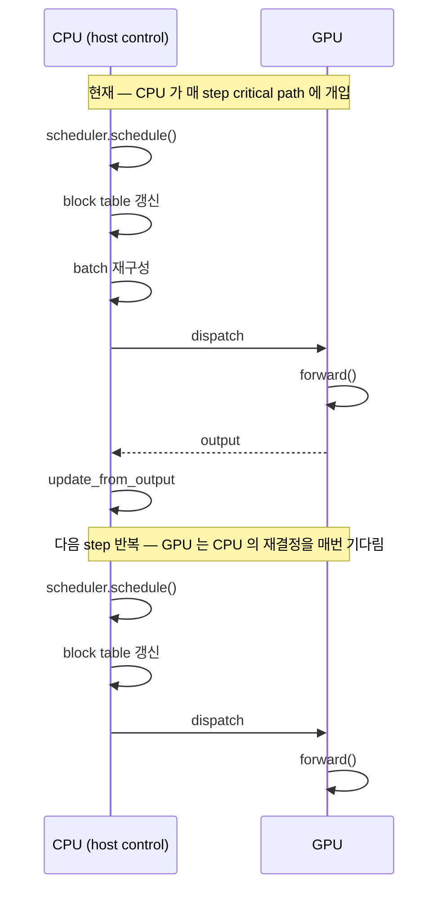
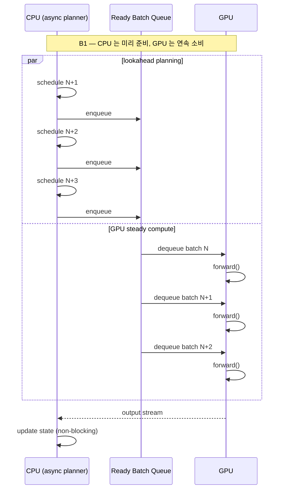
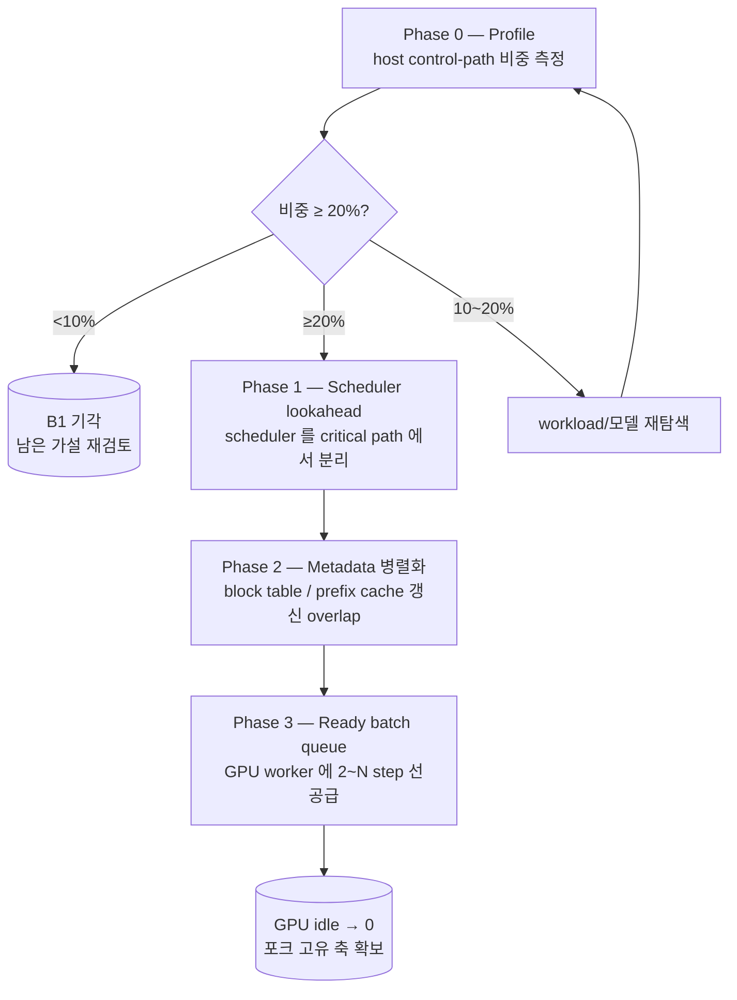

# B1 — Inverted Control Plane: 설계 및 실행 계획

## Part I · 우리가 잘못 봤던 것

지금까지의 모든 시도는 공통 전제를 깔고 있었다. **CPU 에게 계산을 더 맡기면 빨라진다**. B2 (heavy workload CPU decode shadow) 도, X (CPU async executor) 도 이 전제 위에서 설계됐다. 두 시도 모두 실측에서 패배했다.

B2 는 Qwen2.5-32B × 16K/16K 에서 hybrid 가 GPU-only 대비 -96% throughput 으로 나왔고, X 는 CPU async pipeline 이 same-req 의 중복 compute 로 sync 대비 절반 생산량에 머물렀다. 패배의 원인은 세부 구현의 불운이 아니라, 전제의 결함이었다. Fast GPU 앞에서 진짜 일어나는 일은 이렇다.

GPU 한 step forward 는 μs~ms 단위로 끝난다. 그 사이 CPU 는 다음 step 의 `scheduler.schedule`, `block table` 갱신, `batch 재구성`, `dispatch` 를 해야 한다. 이 작업들이 GPU 의 idle 을 만든다. 우리는 그 idle 을 **CPU 가 계산을 더 해서 메우려** 했지만, idle 자체를 만드는 주체가 CPU 의 host control-path 였다는 점을 보지 못했다.

## Part II · 이론적 근거

이 관찰은 우리만의 발견이 아니다. 최근 serving 연구들이 같은 현상을 서로 다른 각도에서 보고한다.

- **Blink** — <https://arxiv.org/abs/2407.20242> — fast GPU 환경에서 host-side scheduling / continuous batching / block table 갱신 / token-step dispatch 가 그 자체로 병목이 될 수 있음을 체계적으로 제시한다. B1 의 축이 곧 Blink 의 축이다.
- **NanoFlow** — <https://arxiv.org/abs/2408.12757> — intra-device operation overlap 으로 GPU bubble 을 제거한다. 이 논문의 메시지를 확장하면 CPU host 의 작업도 GPU 와 **구조적으로 overlap** 시킬 대상이다.
- **Sarathi-Serve** — <https://arxiv.org/abs/2403.02310> — scheduler 의 batching 결정 (chunked prefill 혼합, stall-free 스케줄) 이 latency/throughput 에 얼마나 큰 레버리지인지를 보여준다. scheduler 자체가 고비용 경로라는 점이 여기서도 드러난다.
- **vLLM (PagedAttention)** — <https://arxiv.org/abs/2309.06180> — block table 과 KV memory management 가 step 마다 필요한 구조임을 밝힌 기반 논문. 현재 우리의 host 비용 구조의 뿌리.

이 문헌이 공통으로 말하는 것은 다음 한 문장으로 요약된다. **CPU 는 계산을 더 맡을수록이 아니라, step 제어 경로에서 빠질수록 이득일 수 있다.**

## Part III · 우리가 바꿔야 하는 구조

전제가 틀렸다면 결론도 반대로 세워야 한다.

핵심 발상은 세 가지다. scheduler 는 별도 수행 주체로 분리된다. GPU worker 에는 ready batch queue 가 미리 공급된다. GPU 는 매 step 마다 host 의 세밀한 재결정을 기다리지 않고, 준비된 입력을 연속 실행한다.

이 방향이 옳다면 얻는 것이 단순 throughput 개선을 넘는다. vLLM 포크로서 우리가 내세울 차별점이 "CPU 를 어떻게 쓰는가" 가 아니라 "host control-path 를 어디까지 줄일 수 있는가" 로 바뀐다. 이는 **모델에 무관하고, 하드웨어가 빨라질수록 더 커지는 축**이다. GPU 세대가 교체될 때마다 가치가 증가한다.

## Part IV · 단계적 계획

구현보다 관찰이 먼저다. 각 단계는 앞 단계의 결과가 있어야 의미가 생긴다.

### Phase 0 · Profile

step total 대비 host control-path 비중을 숫자로 확정한다. 측정 대상은 네 덩어리다.

- `scheduler.schedule()` — 다음 step 의 batch 를 결정하는 시간
- block table / metadata 갱신 — KV block 할당, prefix cache lookup, request 상태 기록
- batch 재구성 — padding, attention mask, positional encoding 조립
- dispatch 대기 — worker 로의 전송 + 응답 수신

현재 `VLLM_HYBRID_PROFILE=1` + sublayer breakdown 이 엔진 내부에 살아있다. 여기에 control-path 네 구간의 per-step 누적 시간 기록만 추가하면 된다. 엔진 본 로직은 무수정.

판정은 위 다이어그램대로다. 비중이 step total 의 20% 이상이면 Phase 1 진입, 10~20% 는 workload 와 모델 조건을 바꿔 재측정, 10% 미만은 B1 기각.

산출물: `01_phase0_profile.md`

### Phase 1 · Scheduler lookahead

`scheduler.schedule()` 을 GPU 의 critical path 에서 밀어낸다. 다음 batch 를 GPU forward 와 **병행**하여 미리 계획한다. scheduler 실행을 별도 Python thread 혹은 프로세스로 분리하고, GPU worker 는 ready batch queue 에서 pull 한다.

여기서 X 의 실패가 반복될 수 있다는 점을 유의한다. scheduler 가 결과를 모르는 채로 lookahead 하면 같은 req 의 decode step 이 중복 dispatch 될 수 있고, 그것이 X 에서 본 "compute 는 2 배, 결과물은 절반" 을 그대로 재생산한다. 따라서 Phase 1 에서 우선 풀어야 할 것은 **lookahead 된 batch 가 정확히 한 번만 실행되고, 실제 결과가 들어온 뒤에 scheduler state 가 deterministic 하게 복구되는 정확성 계약**이다. 성능 측정은 그 계약이 선 뒤에 한다.

판정: Phase 0 에서 잡힌 scheduler 구간이 step total 에서 사라진 비율로 계측. 정확성 계약이 깨지면 (완료 개수 불일치 등) 즉시 중단.

산출물: `02_phase1_scheduler_lookahead.md`

### Phase 2 · Block table / metadata 병렬화

block 할당, prefix cache lookup 같은 metadata 갱신을 forward 와 겹친다. Phase 0 에서 이 구간의 비중이 큰 것이 확인된 경우에만 진입. 일부 작업 (특히 prefix hash 계산) 은 이미 CPU 위의 순수 연산이므로 thread pool 로 쉽게 분리 가능하다. 실제 critical 한 것은 block table 갱신의 race 다. 갱신이 forward 와 겹칠 때 데이터 일관성이 깨지지 않도록 경계면을 둔다.

판정: 이 구간의 step total 기여가 절반 이하로 내려가면 성공.

산출물: `03_phase2_metadata.md`

### Phase 3 · Ready batch queue 공급

GPU worker 가 host 의 세밀한 재결정을 기다리지 않고 준비된 batch 를 연속 소비한다. Phase 1 의 lookahead 를 queue 화 해서 2~N step 앞서 배치가 미리 준비되어 있게 한다. queue 의 깊이는 조절 가능한 파라미터. 깊을수록 GPU idle 이 줄지만 lookahead 정확성 비용이 커진다. Phase 1 의 정확성 계약이 이미 서 있어야 의미가 있다.

판정: CUDA stream 레벨 GPU idle 이 Phase 0 baseline 대비 절반 이하.

산출물: `04_phase3_ready_queue.md`

## Part V · 경계선

B1 은 기존 경로를 파괴하지 않는다. X 의 실패가 "멀쩡한 sync 경로를 대체하려 한 과몰입" 에서 비롯됐음을 반복하지 않기 위해 다음을 원칙으로 둔다.

- GPU-only 경로, 기존 vLLM 엔진, 기존 hybrid 엔진의 동작은 **무변경이 기본값**이다. B1 이 활성화되지 않은 구성에서는 바이너리와 동작이 B1 도입 이전과 같아야 한다.
- vLLM core.py 는 건드리지 않는다 (CLAUDE.md 원칙). 필요한 확장은 hybrid_core.py 및 B1 전용 모듈에서 해결한다.
- 각 Phase 는 **숫자로 진입·기각이 결정**된다. Phase 0 이 20% 미만을 보이면 후속 Phase 는 실행하지 않는다. Phase 1 의 정확성 계약이 깨지면 멈춘다.
- **구현보다 관찰이 먼저**다. Phase 0 이전에는 코드 수정이 없다.

## Part VI · 지금 할 일

단 한 가지. Phase 0 profile 을 돌린다.

1. sync hybrid 가 light/heavy 두 workload 에서 정상 동작함은 이미 확인됐다 (sync duration 382s / 10.2 tok/s 실측 있음).
2. `VLLM_HYBRID_PROFILE=1` 과 sublayer breakdown 이 엔진 내부에 살아있다. 여기에 control-path 네 구간의 per-step 누적 시간 기록만 추가한다.
3. 측정 결과를 `01_phase0_profile.md` 로 기록하고 비중 숫자로 Phase 1 진입 여부를 판정한다.

Phase 0 이 끝나면 이 디렉토리의 나머지 문서 구조가 확정된다. 비중이 크면 Phase 1~3 를 순차 구현하고, 작으면 이 디렉토리는 "시도하지 않기로 했다" 는 판정 기록으로만 남는다.
