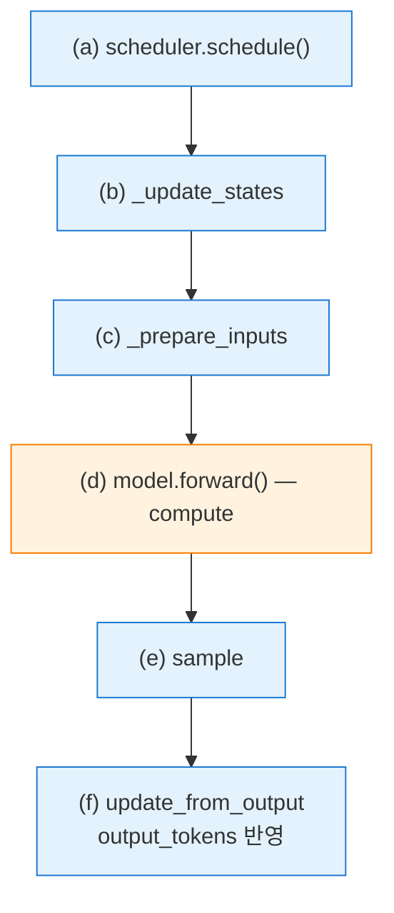

# X · Phase 1 — Scheduler 의존성 분석

작성일: 2026-04-22 (KST)
작성자: Claude
관련: [`01_design_and_plan.md`](01_design_and_plan.md) §4.1 Phase 1

---

## 0. 목표

`scheduler.schedule()` + `execute_model()` 경로에서 **어떤 작업이 이전 step 의 output_tokens 에 의존하고 어떤 작업이 독립적인지** 를 코드 레벨에서 매핑. 독립 구간이 compute(N) 과 overlap 가능한 pipeline 후보.

---

## 1. 한 step 의 data flow



Main thread: (a)(b)(c)(e)(f). Compute thread: (d).

---

## 2. `scheduler.schedule()` 내부 해부

`vllm/v1/core/sched/scheduler.py:165` `schedule()` 의 주요 단계와 의존성:

### 2.1 RUNNING requests 스케줄 (line 202~330)

```python
while req_index < len(self.running) and token_budget > 0:
    request = self.running[req_index]
    num_new_tokens = (request.num_tokens_with_spec
                      + request.num_output_placeholders
                      - request.num_computed_tokens)   # ← output-dependent
    ...
    new_blocks = self.kv_cache_manager.allocate_slots(request, num_new_tokens, ...)
```

의존성:
- `request.num_computed_tokens` — 이전 step 의 `update_from_output` 에서 +num_scheduled 됨 ★ **output-dependent**
- `request.num_tokens_with_spec` — `prompt_len + output_token_ids + spec_tokens` 조합. output_token_ids 가 output-dependent ★
- `kv_cache_manager.allocate_slots` — KV cache block 할당, 이전 step 의 KV 상태에 의존 ★

→ **모두 output-dependent**. Running 부분은 pipeline 불가.

### 2.2 WAITING requests 스케줄 (line 332~)

```python
while self.waiting and token_budget > 0:
    request = self.waiting.peek_request()
    ...
    if request.num_computed_tokens == 0:    # 첫 admission
        new_computed_blocks, num_new_local_computed_tokens = \
            self.kv_cache_manager.get_computed_blocks(request)   # ★ prefix cache hit 탐색
```

`get_computed_blocks(request)` 는:
- 인자: `request` (immutable 한 `prompt_token_ids` 등)
- 내부: `find_longest_cache_hit(block_hashes, ...)` — prompt hash chain 대 cached pool 매칭
- 결과: new_computed_blocks, num_new_local_computed_tokens

**의존성**:
- `request.prompt_token_ids` — 입력 시점 고정, **output-independent** ✓
- `kv_cache_manager` 의 cached pool — 이전 step 의 `cache_full_blocks` 호출로 갱신됨 ★ output-dependent (간접)

결론: **get_computed_blocks 자체는 output-independent 하게 보이지만, cached pool 상태는 output-dependent**. 엄밀히는 "같은 prefix 가 cached pool 에 있느냐" 를 확인할 때 이전 step 의 compute 가 남긴 blocks 가 반영된 상태여야 정확.

### 2.3 그럼 overlap 가능한가?

**Full overlap 은 불가**. 하지만 **speculative overlap 은 가능**:

> compute(N) 이 도는 동안 step(N+1) 의 `get_computed_blocks(waiting_reqs)` 를 **cached pool 의 이전 snapshot 기준으로 계산**. compute(N) 이 끝난 후 cached pool 이 업데이트되면 prefix cache hit 이 조금 더 길어졌을 수 있지만, overlap 시점의 결과가 **subset** 이므로 correctness 는 유지 (일부 prefix hit 를 놓치는 정도, 치명적이지 않음).

즉 **correctness-safe overlap**:
- output-independent 부분 (prompt hash 계산, 기본 matching) 을 먼저 수행
- 최종 확정은 compute(N) 완료 후 diff 만 반영

---

## 3. `execute_model` (CPUModelRunner / GPU 상속) 내부

`vllm/v1/worker/gpu_model_runner.py:1483` 진입:

```python
def execute_model(self, scheduler_output, intermediate_tensors):
    self._update_states(scheduler_output)          # (b)
    ...
    attn_metadata, ..., = self._prepare_inputs(scheduler_output)  # (c)
    hidden_states = self.model(...)                 # (d) ★ compute
    sampler_output = self.sample(...)               # (e)
    return ModelRunnerOutput(sampled_token_ids=..., ...)
```

의존성:
- `_update_states(scheduler_output)` — scheduler_output 에만 의존. output-independent from **이전** step. 단, `input_batch` 를 mutate
- `_prepare_inputs` — _update_states 에 의존 (같은 step 안에서만)
- `model.forward` — 위 두 단계 결과 + KV cache
- `sample` — forward 결과

→ `execute_model` 내부는 한 step 안에서 **모두 직렬**. Step 내부 pipeline 은 불가능. Step 간 pipeline 만 가능.

---

## 4. 의존성 요약 — pipeline 가능 / 불가

| 작업 | 이전 step output 의존? | 병행 가능? |
|---|---|---|
| `schedule()` RUNNING 부분 | ✅ (num_computed_tokens 필요) | ❌ (sync) |
| `schedule()` WAITING get_computed_blocks | 🟡 (cached pool snapshot) | ✅ (correctness-safe speculative) |
| `schedule()` WAITING allocate_slots | ✅ (KV cache 가용 블록) | ❌ |
| `_update_states` | ✅ (input_batch 업데이트) | ❌ |
| `_prepare_inputs` | ❌ (같은 step 내만) | — |
| `model.forward` | ❌ | **→ compute thread** |
| `sample` | ❌ (forward 결과) | — |
| `update_from_output` | ✅ (forward 결과 + scheduler_output) | ❌ |

**Pipeline 가능한 것**: WAITING 요청의 `get_computed_blocks` 만. 그것도 엄밀히는 **speculative** (결과가 약간 stale 할 수 있음).

---

## 5. 실효 pipeline 의 이득 재추정

170451 §3.11 의 추정은 "scheduler 의 output-independent 부분 분리" 가 가능하다는 가정 하에 **overlap_ratio=0.6~0.8** 이었다. 현실:

- WAITING 요청의 get_computed_blocks 는 **새 요청이 들어올 때만** 실행. Heavy workload 는 4 req × 16K prefill 로 이미 running 에 올라간 뒤엔 WAITING 이 비어있음
- 즉 **get_computed_blocks overlap 이득은 bench 초반에만** 유효
- Prefill steady state (모든 req 이 running 상태) 에서는 scheduler 의 RUNNING 스케줄 부분만 돌고, 이 부분은 output-dependent → overlap 불가

**결론**: 순수 pipeline 이득은 **bench 초반 admission 구간** 에 제한적. 이후 steady state 에서는 pipeline 이 compute(N) 과 overlap 시킬 main-thread 작업이 거의 없음.

### 5.1 그럼 X 는 여전히 의미 있는가?

O.

1. Heavy 의 bench 초반 admission 구간이 길다 (4 × 16K 를 chunked prefill 로 admit) → overlap 의미 있음
2. `model.forward` 가 다른 thread 에 있음으로써 **GIL 해제 구간 활용** — 설사 overlap 할 Python 작업이 적어도 architecture 는 좋음
3. Decode phase 에서는 per-step Python 작업이 작지만 compute 도 작음 → overlap 비율은 비슷할 수 있음
4. 미래 개선 여지 — 지금은 get_computed_blocks 만 pipeline 가능하지만, scheduler.schedule() 의 다른 Python overhead (예: for loop, 조건 분기) 를 좀 더 분리할 수 있으면 overlap 확장 가능

### 5.2 보수적 재추정

| 시나리오 | 기존 추정 (170451 §3.11) | 재추정 (본 문서) |
|---|---|---|
| Admission 구간 (초반) | -17~23% | -15~20% (비슷) |
| Steady state prefill | -17% | **-5~10% (overlap 여지 적음)** |
| Decode | -20% | **-10~15% (compute 작아서)** |

즉 X 의 이득은 **170451 의 낙관적 추정보다 소박**. 여전히 의미 있지만 절반 수준 기대.

---

## 6. Phase 2 구현 방향 (이 분석에 따라)

### 6.1 Phase 2 는 naive 1-step 만 구현
첫 구현은 "compute thread 분리, 그 외 aggressive pipeline 시도 없음". 단순 thread 분리로도 약간의 overlap (Python GIL 해제 구간의 OS-level scheduling 효과) 은 있을 것. Phase 2 측정이 기대보다 낮으면 Phase 3 에서 selective pipeline 시도.

### 6.2 Phase 3 는 선택적 admission pipeline
- "WAITING 요청이 있을 때만" speculative get_computed_blocks 를 compute(N) 중에 수행
- Running 상태에서는 단순 sync 유지

### 6.3 버리는 것
- 170451 §3.7 의 "scheduler 전체 쪼개기" 는 **구현 리스크 대비 이득 미미** → 하지 않음
- Running 요청 스케줄의 pipeline 시도 → 의존성 복잡도 너무 높음 → 하지 않음

---

## 7. 다음 단계

1. Phase 2 착수 — `CPUWorker.execute_model` 에 ThreadPoolExecutor 도입 + correctness 검증
2. Phase 2 실측 결과가 **speedup > 1.1×** 이면 Phase 3 (selective admission pipeline) 진행
3. Phase 2 가 **speedup < 1.05×** 이면 X 재검토 (MultiProc 으로 pivot 검토)
