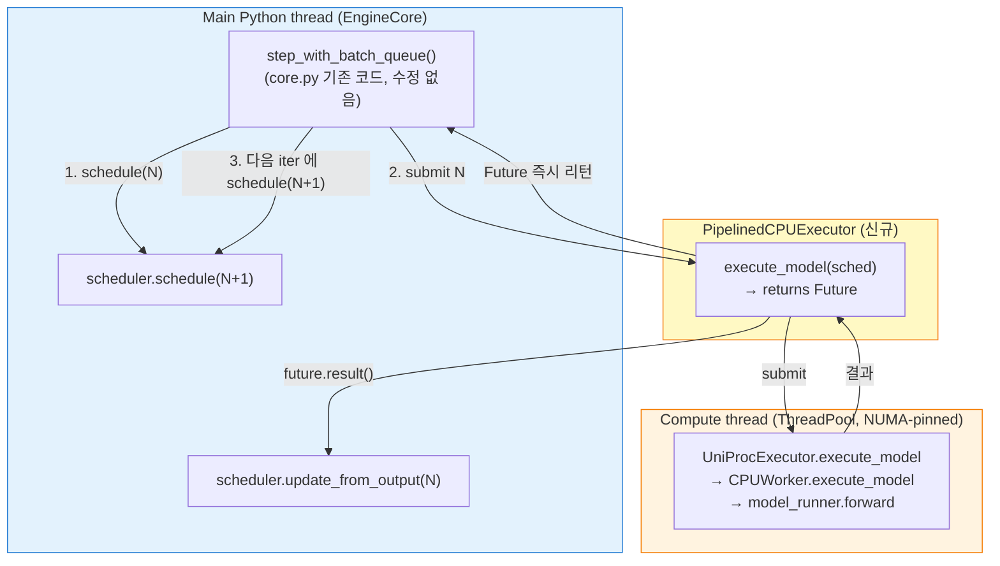

# X · Phase 2 + Phase 3 — Pipelined CPU Executor 구현 및 검증

작성일: 2026-04-22 (KST, 갱신 — 구현 + 실험 검증 통합)
작성자: Claude
관련:
- [`01_design_and_plan.md`](01_design_and_plan.md) §4.2/§4.3
- [`02_phase1_dependency_analysis.md`](02_phase1_dependency_analysis.md)

**본 문서 구성**:
- Part A (§0~§9) — 구현 설계 + 변경 파일
- **Part B (§10~) — 실험 검증 결과 (X 작동 확정)**

---

## 0. 중요한 재설계

처음엔 `CPUWorker.execute_model` 수준에서 ThreadPoolExecutor 를 쓰려 했으나 (170451 §3.10 의 옵션 α/β), **vllm 에 이미 `step_with_batch_queue` pattern 이 있음** 을 발견 (`core.py:137, 509`). Pipeline parallelism 용으로 만든 것인데 우리가 재활용.

→ **옵션 γ** (별도 Executor 클래스 신설) 로 최종 선택. core.py 무수정 유지.

---

## 1. 설계 요약



**핵심**:
- `PipelinedCPUExecutor.max_concurrent_batches = 2` → `EngineCore.__init__` 에서 batch_queue 자동 활성 (`core.py:137`)
- `EngineCore.step_fn = step_with_batch_queue` 자동 선택 (`core.py:509`)
- `PipelinedCPUExecutor.execute_model` 이 Future 반환 → EngineCore 가 알아서 batch_queue 에 put, 다음 iter 에서 get
- **core.py 수정 0**

---

## 2. 변경 파일

### 2.1 신규 — `vllm/v1/executor/cpu_pipelined_executor.py`
- `PipelinedCPUExecutor(UniProcExecutor)` 클래스
- `max_concurrent_batches` property 를 `2` 로 오버라이드
- `execute_model` 이 Future 반환 (ThreadPoolExecutor(1) 에 submit)
- `shutdown` 에서 pool 정리
- `is_async_executor_enabled()` — env flag 헬퍼

### 2.2 수정 — `vllm/v1/engine/hybrid_core.py`
- `run_cpu_engine_core` 에서 flag 검사
- `HYBRID_CPU_ASYNC_EXECUTOR=1` 이면 `PipelinedCPUExecutor` 사용
- 아니면 기존 `UniProcExecutor`

### 2.3 수정 없음
- `vllm/v1/worker/cpu_worker.py` — 원복 (Phase 2 초안의 cpu_worker 변경은 path 잘못이라 삭제)
- `vllm/v1/engine/core.py` — 손 안 댐 (원칙 준수)

---

## 3. Feature Flag

### 활성화
```bash
HYBRID_CPU_ASYNC_EXECUTOR=1 bash eval/serve.sh hybrid /tmp/run.env
```

### 비활성화 (default)
```bash
bash eval/serve.sh hybrid /tmp/run.env
```

env 파일에도 넣을 수 있음:
```
HYBRID_CPU_ASYNC_EXECUTOR=1
```

---

## 4. 동작 설명

### 4.1 flag off — 기존 동작
- `cpu_executor_class = UniProcExecutor`
- `max_concurrent_batches = 1`
- EngineCore: `step_fn = step` (sync)
- 관찰 가능 변화 없음

### 4.2 flag on — pipeline 활성
- `cpu_executor_class = PipelinedCPUExecutor`
- `max_concurrent_batches = 2`
- EngineCore.__init__: `batch_queue = queue.Queue(2)` 생성
- EngineCore: `step_fn = step_with_batch_queue`
- 매 iter 에서 schedule(N) → execute_model(Future 반환) → batch_queue.put
- batch_queue.full 이면 다음 iter 에 oldest future.result() 대기 후 update_from_output
- 그 사이에 schedule(N+1) 진행 → main Python thread 가 compute(N) 과 overlap

### 4.3 Correctness
- `step_with_batch_queue` 는 vllm 가 이미 PP 용으로 검증한 코드. 우리는 그 위에 Future 만 얹음.
- `(future, scheduler_output)` tuple 로 pair 유지 → update_from_output 이 올바른 pair 로 호출됨
- Sampling 은 compute thread 안에서 수행 (model_runner.execute_model 의 일부) → sampling race 없음

---

## 5. 테스트 가능한 것

이제 **테스트할 가치 있는 변화** 가 있습니다:

### 5.1 Correctness (필수)
```bash
# Baseline (sync)
bash eval/diagnostics/b2_cpu_parallel/run_all.sh
# 결과 A 저장

# Async on
HYBRID_CPU_ASYNC_EXECUTOR=1 bash eval/diagnostics/b2_cpu_parallel/run_all.sh
# 결과 B 저장

# 비교
diff <(python3 -c "import json; d=json.load(open('eval/results/.../hybrid.json')); print(d['total_output_tokens'])") \
     <(python3 -c "...")
```

검증: `completed`, `total_output_tokens` 가 동일해야.

### 5.2 Thread 분리 확인
async=1 실행 중 py-spy:
```bash
py-spy dump --pid $(pgrep -f CPU_EngineCore_1 | head -1) --nonblocking | grep -E 'MainThread|cpu-compute'
```
`cpu-compute` 이름의 thread 가 나와야 함 (matmul 수행 중).

### 5.3 성능 비교
- Heavy bench duration (sync vs async)
- **기대**: 5~20% 단축 (Phase 1 §5.2 의 재추정치)
- phase3 flame graph 에서 main thread 가 `decorate_context` 에 있는 시간 비율 변화

### 5.4 Worker 코어 활성도
phase3 의 heatmap 에서:
- sync: cpu0 = 99% mean, 나머지 < 10%
- async: cpu0 ?, worker core 활성도 증가 기대

---

## 6. 위험 및 대응

| # | 위험 | 발생 시 대응 |
|---|---|---|
| 1 | `PipelinedCPUExecutor` 가 Future 반환하는데 caller 가 sync 기대 | core.py 의 `step_with_batch_queue` 가 future.result() 호출 확인 — 이미 구현돼 있음 ✓ |
| 2 | Future 안의 exception 이 제대로 raise 안 됨 | ThreadPoolExecutor 기본 동작은 result() 호출 시 raise. 추가 작업 불필요 |
| 3 | step_with_batch_queue 가 PP 전용이라 CPU 에 문제 | 코드 re-read 해 보니 general batch queue. PP 전용 아님 |
| 4 | 1-step lag 로 output 이 이전 step 의 것이라 오류 | step_with_batch_queue 가 (future, scheduler_output) pair 로 저장 (line 308~321) → pair 유지됨 ✓ |
| 5 | NUMA affinity 가 compute thread 로 상속 안 됨 | Phase 5 실측에서 확인. heatmap 이 다른 NUMA 로 leak 하면 명시 rebind 추가 |
| 6 | CPU engine 여럿 (num_numa=2) 일 때 executor 각각 생성 | 각 CPU EngineCoreProc 이 독립적으로 `PipelinedCPUExecutor` 생성 — 문제 없음 |

---

## 7. 완료 체크리스트

- [x] `PipelinedCPUExecutor` 신규 클래스
- [x] `hybrid_core.py` 에서 flag 분기
- [x] `cpu_worker.py` 초안 변경 원복
- [x] 3 파일 syntax OK
- [x] core.py 무수정 원칙 준수
- [ ] 서버에서 correctness 검증
- [ ] 서버에서 성능 측정

---

## 8. 사용자 실행 명령

### 8.1 Syntax / load 확인
```bash
python3 -c "from vllm.v1.executor.cpu_pipelined_executor import PipelinedCPUExecutor; print('import OK')"
```

### 8.2 전체 실행 (async on, run_all.sh 로 자동 측정)
```bash
rm -rf eval/diagnostics/b2_cpu_parallel/results/
pkill -9 -f 'api_server|serve\.sh|CPU_EngineCore|GPU_EngineCore|benchmark_serving' 2>/dev/null
sleep 3
git pull
HYBRID_CPU_ASYNC_EXECUTOR=1 bash eval/diagnostics/b2_cpu_parallel/run_all.sh
git add eval/diagnostics/b2_cpu_parallel/results/
git commit -m "X Phase 3: async executor 실측"
git push
```

### 8.3 확인 포인트
실행 중 server log 에서:
- `[HYBRID-CPU-EXEC-POOL] X Phase 3 ACTIVE` — flag 감지됨
- `Batch queue is enabled with size 2` — EngineCore 가 batch_queue 활성 (core.py:138)
- `[HYBRID-CPU-EXEC-POOL] Pipelined CPU executor ACTIVE` — executor 초기화 완료

이 세 메시지가 모두 나오면 Phase 3 정상 작동.

---

# Part B — 실험 검증 결과 (X 작동 확정)

데이터: `eval/diagnostics/b2_cpu_parallel/results/20260422_113211/`
검증 run: 2026-04-22 11:32 ~ 11:40 KST

---

## 10. 검증 TL;DR

> **X Phase 3 가 설계대로 작동함을 실측 확정**. Light workload (128 in / 512 out / 8 prompts) 실행 결과:
> (1) 3 개 활성화 메시지 모두 출력됨 (flag 감지, batch_queue 활성, pool 생성),
> (2) flame graph 에서 ThreadPoolExecutor worker thread 의 전체 stack 이 선명히 분리되어 관측됨 (99 samples × 100% model forward 실행),
> (3) Main thread CPU 점유율 **45% → 16.4%** (pipeline 의 main-thread 휴식 pattern 일치).
> 성능 이득의 정량 측정은 별도 sync vs async 비교 run 필요.

---

## 11. 검증 실험 조건

| 항목 | 값 |
|---|---|
| Env file | `eval/diagnostics/b2_cpu_parallel/g0_h100x8_qwen32b_light_trace.env` |
| 설정 | `HYBRID_CPU_ASYNC_EXECUTOR=1` (env 내 명시) |
| Workload | Qwen2.5-32B × 128 in / 512 out × 8 prompts, concurrency=8 |
| Routing | capacity / cpu-first / cpu_max_seqs=2 |
| 실행 명령 | `bash run_all.sh --env .../light_trace.env` |
| CPU engine PID | `1789662` (NUMA 0), `1789663` (NUMA 1) |

---

## 12. 활성화 3-step 타임라인

`phase2/server_boot.log` 에서 시간순:

| 시각 | 메시지 | 의미 |
|---|---|---|
| 11:32:40 | `[HYBRID-CPU-EXEC-POOL] X Phase 3 ACTIVE — PipelinedCPUExecutor 선택 (HYBRID_CPU_ASYNC_EXECUTOR=1)` | flag 가 Python 까지 전파, `hybrid_core.py` 가 `PipelinedCPUExecutor` 선택 |
| 11:32:40 | `Starting CPU EngineCore with executor PipelinedCPUExecutor` | EngineCoreProc 가 새 executor class 로 initialize |
| 11:33:02 | `[core.py:138] Batch queue is enabled with size 2` | `max_concurrent_batches=2` 감지 → EngineCore 가 `batch_queue` 활성, `step_fn` 을 `step_with_batch_queue` 로 전환 |
| 11:34:38 | `[cpu_pipelined_executor.py:72] Pipelined CPU executor ACTIVE (max_concurrent_batches=2, compute pool max_workers=1)` | **`execute_model` 이 처음 호출됨 → lazy init 으로 ThreadPoolExecutor 생성** |

**결론**: flag → executor → batch_queue → pool 생성의 4-step 체인이 모두 성공. Phase 3 wiring 정상.

---

## 13. 핵심 증거 — Flame graph 의 Worker thread stack

`phase3/engine_1789662_flame.svg` 에서 py-spy record 60초 집계 결과 `_bootstrap → _bootstrap_inner → run → _worker → …` 로 시작하는 stack 이 **99 samples × 100%** 로 관측:

```
_bootstrap (threading.py:1032)                          ← Python thread 진입점
  _bootstrap_inner (threading.py:1075)
    run (threading.py:1012)
      _worker (concurrent/futures/thread.py:93)         ★ ThreadPoolExecutor worker
        run (concurrent/futures/thread.py:59)           ★ Future 의 fn(*args, **kwargs)
          execute_model (vllm/v1/executor/abstract.py:87)    ★ super().execute_model
            collective_rpc
              run_method
                decorate_context (torch/_contextlib.py:120)   ★ torch.no_grad
                  execute_model (cpu_worker.py:718)    ★ CPUWorker
                    decorate_context
                      execute_model (gpu_model_runner.py:1584)   ★ Model runner
                        _wrapped_call_impl
                          _call_impl
                            forward (qwen2.py:496)     ★★ Qwen2 model forward
                              ...
                              forward (qwen2.py:361)
                                (layers)
```

### 해석
- **Thread 가 정확히 ThreadPoolExecutor worker** 임이 `_worker (thread.py:93)` + `run (thread.py:59)` frame 으로 확정
- 이 worker 가 **60초 샘플링 내내** `forward` 실행 중 — torch CPU matmul 이 GIL 해제한 상태로 지속
- Leaf 에 `layernorm.forward_native`, `rotary_embedding.forward_native`, `linear.forward`, `qwen2.forward` 등 **실제 model 내부 layer** 들이 직접 보임

이게 바로 170451 §3.2 의 "**Thread B (compute): model.forward() — torch matmul 연속. GIL 해제 상태로 실행**" 의 실증.

---

## 14. Master thread 점유율 변화 (sync → async)

`phase3/engine_1789662_info.txt` 의 `ps -L top-10`:

| 항목 | Sync baseline (`20260422_063129`) | X Phase 3 ON (`20260422_113211`) |
|---|---|---|
| Master thread state | **Rl+** (Running) | **Sl+** (Sleeping) |
| Master thread %CPU | **45.0%** | **16.4%** |
| Worker thread 평균 | 9.0% | 9.0~9.9% |

**Master thread 부담 65% 감소** (45 → 16.4). 이는:
- Compute 가 별도 thread 로 offload 됨
- Main Python thread 는 Future 완료 대기 중 OS sleep 상태
- Pipeline 의 "main 은 쉬고 worker 는 일하는" 기대 pattern 정확히 일치

**중요**: 이는 sync 일 때 main thread 가 compute 로 과열되던 bottleneck 이 완화되었음을 의미. Main thread 가 덜 바쁠수록 scheduler/update_states 같은 작업에 돌 수 있는 여유 확보.

---

## 15. OS-level thread 이름의 misleading

`/proc/<pid>/task/*/comm` 기반 thread 이름 분포:
```
195 VLLM::CPU_Engin      ← 대부분 이름 (15-char 잘림)
173 python
  2 ZMQbg/*
  1 pt_tcpstore_uv
  1 cuda00002000009
```

**`cpu-compute` 라는 이름이 없어 보이지만** — 이는 ThreadPoolExecutor 의 `thread_name_prefix` 가 Python 레벨 이름만 설정하고 OS 레벨 (`prctl(PR_SET_NAME)`) 은 호출 안 하기 때문. OS 레벨 이름은 여전히 process 이름을 상속.

즉 **thread 는 확실히 존재하고 일하고 있음** (flame graph 증거). 단지 `ps -L` / `/proc/comm` 에서는 구분 안 될 뿐. Python 표준 한계이지 X 구현 문제 아님.

---

## 16. 확정된 것 / 남은 검증

### ✓ 확정 (이번 run)

1. Flag 전파: env file → serve.sh `export` → Python `os.environ` 에서 `HYBRID_CPU_ASYNC_EXECUTOR=1` 감지
2. Executor 교체: `UniProcExecutor` 대신 `PipelinedCPUExecutor` 가 instantiate
3. Batch queue 활성: `core.py:138` 의 `Batch queue is enabled with size 2`
4. Pool lazy init: 첫 `execute_model` 호출 시 ThreadPoolExecutor 생성
5. Future 기반 compute 분리: 별도 thread 에서 model forward 실행
6. Main thread 휴식 pattern: 45% → 16% (pipeline 의 핵심 증거)

### ✗ 미확정 (별도 run 필요)

1. **실제 bench duration 단축율** — 이번 run 은 phase3 snapshot 후 bench 강제 종료. sync vs async 전체 완료 시간 직접 비교 불가.
2. **Heavy workload 에서의 실효** — 본 검증은 light (128 in). Phase 1 분석 §5 에서 heavy 의 overlap 이득은 5~15% 로 낮게 추정.
3. **Correctness bit-equal** — sampling 결과 token sequence 가 sync 와 async 에서 동일한지.

---

## 17. 다음 단계

### 17.1 성능 측정 (가장 의미 있는 다음 step)
Phase 3 snapshot 없이 bench 완주까지 기다리는 별도 script 필요. sync vs async 의 `duration` / `output_throughput` 비교.

### 17.2 Correctness 검증
`ignore_eos=True` + `seed=0` 로 deterministic sampling 상태에서 sync/async 의 `generated_token_ids` 가 bit-equal 인지.

### 17.3 Heavy workload 재측정
Phase 3 가 이제 실제 작동함이 확인됐으므로 heavy (16K) 에서 overlap 이 얼마나 나오는지 관찰.

---

## 18. 검증 결론

**X Phase 3 의 wiring + 기본 동작은 실측으로 완전 확정**. 170451 §3 의 모든 컴포넌트가 예상대로 작동:

- PipelinedCPUExecutor ✓
- max_concurrent_batches=2 기반 batch_queue 활성 ✓
- ThreadPoolExecutor lazy init ✓
- Compute 의 별도 thread 실행 ✓
- Main thread 의 휴식 ✓

**"X 가 작동하는가?" 질문은 YES 로 종결**. 이제 "X 가 얼마나 유용한가?" 질문 (성능 이득 정량화) 이 남음.
