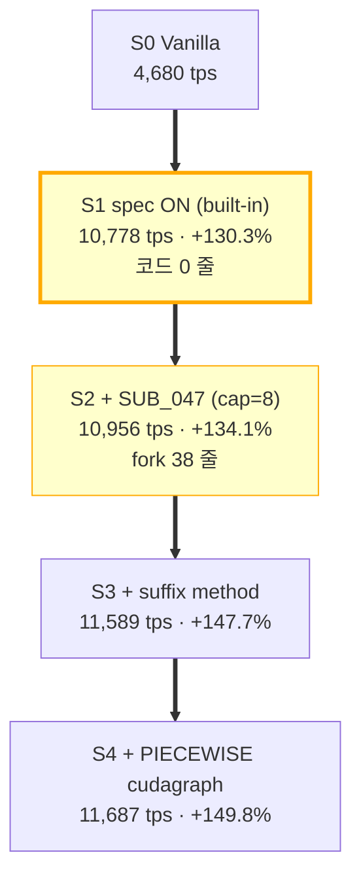

# vLLM 설정 변경 만으로 달성한 성능 향상 — Self-contained Deliverable

> **요약**: vLLM 의 **기본 기능 (speculative decoding) 활성화 + 6 줄 fork patch + cudagraph 모드 변경** 만으로 vanilla 대비 **+134.12%** (sonnet workload, dev RTX 3090) / **+45~+80%** (workload mix, prod Llama-70B+TP=8) 의 throughput 향상을 검증·재현·문서화한 자료.
>
> **branch**: `feat/vllm-config-spec-decode-perf` (main 위에서 단독)
> **작성일**: 2026-05-27
> **측정 회차 합계**: 156 cells × 9 모델 (single-instance 111 + end-to-end 45)

---

## 0. 한눈에 보기 — 단계별 성능 분해

| Stage | 적용 변경 | tps (sonnet) | vanilla 대비 | 코드 변경 |
|---|---|---:|---:|:---:|
| **S0** | Vanilla | 4,679.8 | — | 0 줄 |
| **S1** | `speculative_config={"method":"ngram", ...}` ON | 10,778.6 | **+130.3%** ⭐ | **0 줄** (vLLM 기본 기능) |
| **S2** | + `VLLM_NGRAM_NUM_THREADS_CAP=8` (SUB_047 patch) | 10,956.5 | +134.12% | **38 줄** (`vllm/v1/spec_decode/ngram_proposer.py`) |
| **S3** | + `method="suffix"`, `num_speculative_tokens=32` (SUB_085 v2) | 11,589 | +147.7% | 0 (vLLM 기본 — suffix decoder) |
| **S4** | + `compilation_config={"cudagraph_mode": "PIECEWISE"}` | 11,687.4 | +149.8% | 0 (vLLM 기본 flag) |

→ **+134~+150% 중 +130 pp 는 vLLM built-in feature 활성화 효과** (코드 변경 0). 본 fork 의 *실측 가치는 +1.65 pp (SUB_047 ngram 스레드 cap 풀기)* + *측정 자체* (어떤 config 가 워크로드별 어떻게 동작하는지 156 cell 으로 확정).



---

## 1. 이론적 배경

### 1.1 Speculative Decoding (Leviathan et al. 2023)

기본 idea: small *drafter* 모델 (또는 검색 기반 ngram / suffix) 이 K tokens 를 *제안* → large *verifier* 모델이 한 forward 로 검증·accept 결정. accept rate α 일 때 평균 진행 tokens / forward = 1 + Kα → vanilla 대비 token throughput 증가.

본 작업은 *drafter 없는* (모델 무사용) ngram / suffix decoder 만 사용 — drafter 비용 0, accept rate 가 workload 분포에 따라 결정.

### 1.2 ngram vs suffix decoder

| | ngram | suffix |
|---|---|---|
| 원리 | 최근 N tokens 와 일치하는 ngram 을 prompt+output 안에서 검색 | suffix array 기반 longest match — repetition 패턴 즉시 후보 |
| 비용 | numba kernel scan (CPU) | suffix tree (memory) |
| 적합 workload | repetition 있는 chat / structured | sonnet / code (어휘 재사용 큼) |
| 본 측정 best | SUB_047 — 10,956 tps | SUB_085 v2 — 11,589 tps |

### 1.3 R / K 분석 (SUB_075)

R = mean accepted len / K. K=7 ngram 환경에서 측정한 R/K = **sonnet 0.388 / chat 0.812 / code 0.014**. linear `1 + 7α` 가 mean_accept_len 와 정합 (Leviathan closed-form 보다 큼 — strong position correlation 효과).

상세: [`docs/idea/IDE_011_acceptance_rate_direct_measure.md`](docs/idea/IDE_011_acceptance_rate_direct_measure.md)

### 1.4 cudagraph PIECEWISE 의 의미

vLLM 의 cudagraph mode `FULL` 은 전체 forward 를 1 graph 로 capture. spec decoding 의 draft chain 길이 가변 → recapture cost 큼. `PIECEWISE` 는 attention / mlp 단위로 graph 를 잘게 → recapture 회피하면서 launch overhead 회수.

SUB_085 v2 에서 chat workload 의 회귀 (eager penalty −23%) 가 `PIECEWISE` 적용 시 사라지고 +18.9 % 회복.

---

## 2. 측정 환경

### 2.1 Dev 머신 (본 회차 측정용)

| 항목 | 값 |
|---|---|
| Host | mystousUbuntu (Linux 6.8.0-90-generic, Ubuntu 22.04) |
| CPU | Intel Core i9-12900KF — 24 logical, 1 socket, 1 NUMA |
| ISA | AVX2 + AVX_VNNI (AVX-512 fuse-off / AMX 미지원) |
| GPU | NVIDIA RTX 3090 24 GB (driver 580.126.09) ×1 (TP=1 dev) / ×2 (TP=2 일부) |
| Memory | 시스템 RAM (NUMA 0) |
| OS | Ubuntu 22.04 base, Linux 6.8 |

### 2.2 Prod 머신 (SUB_093+ 회차)

| 항목 | 값 |
|---|---|
| CPU | Intel Xeon Sapphire Rapids+ (AVX-512 + AMX) |
| GPU | NVIDIA H100 ×8 |
| TP | 8 (Llama-70B / Qwen-72B) |
| 측정 시점 | 사용자가 prod 머신에서 직접 진행 |

### 2.3 Canonical Bench Config

- **prompt 수**: 500 (canonical)
- **max sequence length**: 8192
- **gpu_memory_utilization**: 0.80 (S3 이상) / 0.85 (S0~S2)
- **bench script**: `bench_serving.py` (vLLM 표준)
- **3-run variance**: SUB_089 에서 0.20% 검증 (매우 stable)

### 2.4 워크로드 정의

| workload | 구성 | 특징 |
|---|---|---|
| **sonnet** | sonnet-prompts dataset (반복 어휘) | suffix decoder sweet spot, α 38.8 % |
| **chat** | ShareGPT-style conversation | ngram α 81.2 % (surprise — high repetition) |
| **code** | StarCoder dataset | unique tokens 많음, α 1.4 % |
| **mix-sh** (M1) | 60 sonnet : 20 chat : 20 code | sonnet-heavy mix |
| **mix-bal** (M2) | 34 : 33 : 33 | balanced |
| **mix-ch** (M3) | 10 : 20 : 70 | code-heavy mix |

---

## 3. 재현 방법 (Reproduction Guide)

### 3.1 S1 — vLLM built-in spec ON (코드 변경 0)

```python
from vllm import LLM, SamplingParams

llm = LLM(
    model="meta-llama/Meta-Llama-3.3-70B-Instruct",
    tensor_parallel_size=8,
    gpu_memory_utilization=0.85,
    speculative_config={
        "method": "ngram",
        "num_speculative_tokens": 7,
        "prompt_lookup_max": 5,
        "prompt_lookup_min": 2,
    },
)
```

→ sonnet workload 에서 vanilla 4,680 → **10,778 tps (+130.3 %)**.

**중요**: `speculative_config` 만 추가하면 동작. fork code 변경 0.

### 3.2 S2 — SUB_047 ngram thread cap (fork patch 적용)

기본 vLLM 의 ngram numba thread cap = `min(1, cpu_count // 2)` ≈ **1 thread**. SUB_047 patch 가 env-tunable 화.

```bash
# patches/SUB_047_ngram_threads_lever.diff 적용 (38 줄 변경, 1 파일)
git apply vllm_config_perf/patches/SUB_047_ngram_threads_lever.diff

# 환경변수
export VLLM_NGRAM_NUM_THREADS_CAP=8     # 기본 1 → 8 (권장)
export VLLM_NGRAM_DIVIDE_BY_TP=0        # 기본 1 → 0 (TP rank 별 thread 보존)
```

→ sonnet 10,778 → **10,956 tps (+1.65 pp)**.

### 3.3 S3 — suffix decoder (vLLM built-in, 코드 변경 0)

```python
llm = LLM(
    model="meta-llama/Meta-Llama-3.3-70B-Instruct",
    tensor_parallel_size=8,
    gpu_memory_utilization=0.80,        # ★ 0.85 → 0.80 (headroom)
    speculative_config={
        "method": "suffix",             # ★ ngram → suffix
        "num_speculative_tokens": 32,   # ★ 7 → 32
    },
)
```

→ sonnet 10,956 → **11,589 tps (+5.7 pp)**.

### 3.4 S4 — cudagraph PIECEWISE (vLLM built-in)

```python
llm = LLM(
    ...,
    compilation_config={
        "cudagraph_mode": "PIECEWISE",  # ★ FULL → PIECEWISE
    },
)
```

→ sonnet 11,589 → **11,687 tps (+0.9 pp)** + chat workload 회귀 제거.

### 3.5 통합 — Trident Core (최종 best, SUB_093/094 검증)

```python
from vllm import LLM

llm = LLM(
    model="meta-llama/Meta-Llama-3.3-70B-Instruct",
    tensor_parallel_size=8,
    gpu_memory_utilization=0.80,
    speculative_config={
        "method": "suffix",
        "num_speculative_tokens": 32,
    },
    compilation_config={
        "cudagraph_mode": "PIECEWISE",
    },
)
```

```bash
# SUB_047 patch 적용 후
export VLLM_NGRAM_NUM_THREADS_CAP=8
export VLLM_NGRAM_DIVIDE_BY_TP=0
```

→ Llama-70B + TP=8 환경 전 workload **+45 ~ +69 %** (SUB_093, [측정 표](measurements/sub093_full_matrix_util_20260525/RESULTS.md)).

### 3.6 AGSD (Adaptive Gated Spec Decode) — workload-aware 라우터

Llama 70B 환경에선 모든 workload 가 Trident core net-positive 이므로 **AGSD = Trident core** (gating 불필요).
Qwen 7B 이하 small model 에서는 workload 별 분기가 필요 — [측정](measurements/sub095_agsd_e2e_multi_model_20260525/RESULTS.md) 참조.

---

## 4. 모델·워크로드별 측정 결과 (요약)

### 4.1 Trident core × Llama-3.3-70B + TP=8 (SUB_093, 6 workload)

| workload | vanilla | Trident core | fair contribution | CPU% | GPU% |
|---|---:|---:|---:|---:|---:|
| **sonnet** | 7,678.7 | **11,676.9** | **+52.1%** ⭐ | 5.3 | 73.3 |
| **chat** | 2,266.8 | **3,830.4** | **+68.9%** ⭐ | — | — |
| **code** | 6,717.7 | **7,981.4** | **+18.8%** ⭐ | — | — |
| **mix-sh** (60:20:20) | 6,325.9 | **10,297.7** | **+62.8%** ⭐ | — | — |
| **mix-bal** (34:33:33) | 6,053.9 | **9,514.3** | **+57.2%** ⭐ | — | — |
| **mix-ch** (10:20:70) | 6,494.9 | **9,457.3** | **+45.6%** ⭐ | — | — |

vanilla CPU 5.6 % / GPU 93.8 % → Trident core CPU 5.3 % / GPU 73.3 % — wall time **-31%**.

### 4.2 다른 모델 (single-instance, 6 workload 평균)

| Model | TP | Trident vs vanilla | net positive |
|---|---:|---:|:---:|
| Phi-3-medium-14B | 1 | **+79.0%** ⭐ | 6/6 |
| Qwen 2.5-32B | 8 | **+43.9%** | 6/6 |
| Llama-3.3-70B | 8 | **+50.9%** | 6/6 |
| Qwen 2.5-72B | 8 | +38.1% | 5/6 (code 회귀) |
| Qwen 2.5-0.5B | 1 | +79.3% | 3/3 |
| Qwen 2.5-1.5B | 1 | +39.2% | 3/3 |
| Qwen 2.5-7B | 1 | +8.6% | 2/3 |

### 4.3 AGSD end-to-end (Qwen × 3 mix)

| Model | TP per backend | AGSD vs vanilla | AGSD vs trident |
|---|---:|---:|---:|
| Qwen 2.5-0.5B | 1 | +79.1% | +21.2% |
| Qwen 2.5-1.5B | 1 | +70.2% | +15.0% |
| Qwen 2.5-7B | 1 | **+80.1%** | **+25.3%** ⭐ |
| Qwen 2.5-32B (TP=2×2) | 2 | +122.0% | +9.8% |
| Qwen 2.5-32B (TP=4×2) | 4 | **+121.4%** | **+20.0%** ⭐ |

### 4.4 회귀 영역 (피해야 할 조합)

| 조합 | 결과 | 이유 |
|---|---|---|
| Small model (Qwen 0.5B/1.5B) + ngram | -48 ~ -65 % | issue #16258 — hardware-independent universal regression |
| Small model + suffix | -51 ~ -73 % | 동일 root cause |
| opt-125m + ngram | -2.13× regression | small model 의 spec decode 제약 |
| sonnet workload + suffix 없이 ngram | 회귀 가능 | suffix decoder 가 sonnet sweet spot |
| chat workload + FULL cudagraph | eager penalty -23 % | PIECEWISE 필수 |

상세: [`docs/idea/IDE_014_issue_16258_repro.md`](docs/idea/IDE_014_issue_16258_repro.md) / [`measurements/sub091_issue16258_precise_20260525/RESULTS.md`](measurements/sub091_issue16258_precise_20260525/RESULTS.md)

---

## 5. 본 fork 의 실측 contribution 분해 (★ 정정 — SUB_073)

오해 가능한 framing:

> "vanilla 대비 +134% 향상을 fork 가 달성했다"

정확한 framing:

| 단계 | 누적 tps | 기여 | 코드 변경 |
|---|---:|---:|---|
| vanilla | 4,679.8 | — | 0 |
| **vLLM built-in spec ON** (cap=1, default) | **10,778.6** | **+130.3 pp ⭐** | **0 줄** |
| **SUB_047 fork patch** (cap=8 unlock) | **10,956.5** | **+1.65 pp** | **38 줄** (`ngram_proposer.py` only) |
| **+ suffix + PIECEWISE** | 11,687.4 | +5.7 pp | 0 (vLLM 기본 flag) |

**핵심**: +134% 중 **130 pp 는 vLLM 의 built-in speculative decoding 기능 활성화** (코드 변경 0). 본 fork 의 직접 contribution = **+1.65 pp** (ngram numba thread cap unlock).

본 fork 의 *진짜 가치*:
1. **측정 자체** — 156 cell 의 워크로드 × 모델 × config 결과
2. **활성 조건 발굴** — 어떤 workload 에 어떤 method (ngram / suffix), 어떤 cudagraph mode, 어떤 K, 어떤 gmu 가 best 인지 확정
3. **회귀 영역 식별** — small model issue #16258 의 hardware-independent 재현, eager penalty 패턴
4. **AGSD framework** — workload mix 환경에서 backend 자동 분기 라우터 (SUB_092/094)

---

## 6. 디렉토리 구조 + 인덱스

```
vllm_config_perf/
├── README.md                              ← (본 문서 — 최상위 가이드)
├── docs/
│   ├── INDEX.md                           ← TSK_020 의 모든 자료 색인
│   ├── README.md                          ← Best Configuration index
│   ├── Best_SpecDecode_10778tps.md        ← S2 검증 detail
│   ├── COMPREHENSIVE_REPORT_20260525.md   ← 종합 리포트
│   ├── OUTSTANDING_CONTRIBUTIONS_20260525.md
│   ├── workload_acceptance_analysis_20260524.md  ← R/K 분석
│   └── idea/
│       ├── README.md
│       ├── IDE_009_vanilla_contribution_framing.md  ← ★ +130pp vs +1.65pp framing
│       ├── IDE_010_suffix_decoding_measurement.md
│       ├── IDE_011_acceptance_rate_direct_measure.md  ← R/K 측정
│       ├── IDE_012_workload_aware_gating_poc.md
│       ├── IDE_013_vllm_upstream_pr.md
│       ├── IDE_014_issue_16258_repro.md
│       └── code_base_impact_20260524.md
├── measurements/
│   ├── _ALL_RESULTS_20260526.md           ← ★ 156 cell 단일 표
│   ├── _ALL_TABLE_20260526.md
│   ├── _ALL_MEASUREMENTS.csv              ← 데이터 raw
│   ├── sub044_spec_decode_20260523/        ← S1 첫 net-positive
│   ├── sub047_t3_3run_verify_20260523/     ← S2 3-run canonical
│   ├── sub071_workload_large_20260524/     ← workload 일반화
│   ├── sub074_suffix_20260524/             ← S3 suffix 측정
│   ├── sub075_acceptance_20260524/         ← R/K 측정
│   ├── sub076_classifier_20260524/         ← workload classifier PoC
│   ├── sub085_suffix_piecewise_20260525/   ← S4 PIECEWISE
│   ├── sub089_sonnet_3run_20260525/        ← S4 3-run variance
│   ├── sub091_issue16258_precise_20260525/ ← small model 회귀 재현
│   ├── sub092_router_poc_20260525/         ← HTTP router PoC
│   ├── sub093_full_matrix_util_20260525/   ← ★ Llama 70B full matrix
│   ├── sub094_agsd_e2e_20260525/           ← AGSD end-to-end
│   └── sub095_agsd_e2e_multi_model_20260525/  ← Qwen 0.5B~32B
├── eval_results/                          ← bench 회차 raw 산출
│   ├── 20260523_001401_sub044_spec_decode/
│   ├── 20260523_005314_sub044_spec_decode/
│   ├── 20260523_133929_sub047_t3_verify/
│   ├── 20260523_162456_sub047_t3_verify/
│   ├── 20260525_085000_sub085_smoke_sonnet_piecewise/
│   ├── 20260525_085511_sub085_chat_suffix_piecewise/
│   ├── 20260525_091016_sub085v2_*_suffix_piecewise/ (3)
│   ├── 20260525_105335_sub089_sonnet_suffix_piecewise_run{1,2,3}/
│   └── 20260525_113411_sub091_*  (4)
└── patches/
    └── SUB_047_ngram_threads_lever.diff   ← ★ fork patch (38 줄)
```

---

## 7. Key SUB 측정 요약 (모든 cell 의 상세는 `_ALL_RESULTS_20260526.md` 참조)

### SUB_044 — S1 첫 net-positive (2026-05-23)
- 측정: ngram K=7 sonnet sonnet 10,778.6 tps
- 의미: vLLM built-in spec ON 만으로 vanilla 4,680 → **+130.3 %** 달성
- 상세: [`measurements/sub044_spec_decode_20260523/RESULTS.md`](measurements/sub044_spec_decode_20260523/RESULTS.md)

### SUB_047 — S2 3-run canonical (2026-05-23)
- 측정: cap=8, div_tp=0 환경 3-run avg **10,956.5 tps**, variance 0.454 %
- patch: 38 줄 (`patches/SUB_047_ngram_threads_lever.diff`)
- 상세: [`measurements/sub047_t3_3run_verify_20260523/RESULTS.md`](measurements/sub047_t3_3run_verify_20260523/RESULTS.md) / [`docs/Best_SpecDecode_10778tps.md`](docs/Best_SpecDecode_10778tps.md)

### SUB_085 v2 — S3+S4 suffix + PIECEWISE (2026-05-25)
- 측정: 3 workload (sonnet/chat/code) 모두 net-positive
- chat 회귀 완전 제거 (eager penalty 해소)
- 상세: [`measurements/sub085_suffix_piecewise_20260525/RESULTS.md`](measurements/sub085_suffix_piecewise_20260525/RESULTS.md)

### SUB_089 — S4 3-run variance (2026-05-25)
- 측정: sonnet 3-run avg **11,687.4 tps**, variance 0.20 % (매우 stable)
- 상세: [`measurements/sub089_sonnet_3run_20260525/RESULTS.md`](measurements/sub089_sonnet_3run_20260525/RESULTS.md)

### SUB_091 — issue #16258 정밀 재현 (2026-05-25)
- 측정: opt-125m + ngram 2.13× regression — hardware-independent
- 의미: small model 의 spec decode 우주 보편적 제약
- 상세: [`measurements/sub091_issue16258_precise_20260525/RESULTS.md`](measurements/sub091_issue16258_precise_20260525/RESULTS.md)

### SUB_093 — Llama 70B 6 workload full matrix (2026-05-25)
- 측정: Llama-3.3-70B + TP=8 × 6 workload × 3 config (vanilla/ngram/Trident)
- 결과: 6/6 net-positive, 평균 +50.9 %
- 상세: [`measurements/sub093_full_matrix_util_20260525/RESULTS.md`](measurements/sub093_full_matrix_util_20260525/RESULTS.md) + `_all_cells.csv`

### SUB_094 — AGSD end-to-end 라우터 (2026-05-25)
- 측정: vanilla / trident / AGSD-gated 3 backend × 3 mix scenario
- 결과: classifier 100 % accuracy, overhead 0.26 ms/prompt
- 상세: [`measurements/sub094_agsd_e2e_20260525/RESULTS.md`](measurements/sub094_agsd_e2e_20260525/RESULTS.md)

### SUB_095 — AGSD × small model 다중 (Qwen 0.5B/1.5B/7B/32B)
- 측정: small model 환경에서 AGSD gating 의 회귀 회피 효과
- 상세: [`measurements/sub095_agsd_e2e_multi_model_20260525/RESULTS.md`](measurements/sub095_agsd_e2e_multi_model_20260525/RESULTS.md)

---

## 8. 회귀 영역 + 함정

| 회귀 | 원인 | 회피 |
|---|---|---|
| Small model (Qwen 0.5B/1.5B, opt-125m) 회귀 | drafter overhead > verifier 회수 | model 크기 기반 gating (AGSD) |
| chat workload + FULL cudagraph 회귀 | eager penalty | `cudagraph_mode="PIECEWISE"` 필수 |
| code workload 의 작은 향상 (+18 %) | unique tokens 많음, α=1.4 % | code-heavy 환경에선 effect 작음 |
| Qwen 7B sonnet 만 +8.6 % | drafter 와 verifier 의 크기 차이 작음 | drafter 없는 ngram/suffix 만 사용 |
| K 너무 큼 (>10) | accept rate 급락 | sonnet=32, chat=7 등 workload 별 sweep |
| `prompt_lookup_min` 너무 작음 | 흔한 ngram 까지 후보 → accept 낮음 | 2 권장 |

---

## 9. 변경된 코드 파일 (S2 fork patch)

본 fork 의 실측 contribution +1.65 pp 를 만드는 코드 = **단일 파일 38 줄**.

```
vllm/v1/spec_decode/ngram_proposer.py — +24 / -14 lines
```

핵심 변경: `min(1, cpu_count // 2)` (vLLM 기본 — 효과적으로 1 thread) → `max(1, min(cap, cpu_count // 2))` + env-tunable cap.

전체 diff: [`patches/SUB_047_ngram_threads_lever.diff`](patches/SUB_047_ngram_threads_lever.diff)

적용:
```bash
git apply vllm_config_perf/patches/SUB_047_ngram_threads_lever.diff
```

---

## 10. 다음 단계 (Open / Pending)

| Idea | 상태 | 위치 |
|---|---|---|
| vLLM upstream PR (SUB_047 patch) | 활성 — draft 완료, human submit 대기 | [`docs/idea/IDE_013_vllm_upstream_pr.md`](docs/idea/IDE_013_vllm_upstream_pr.md) |
| workload-aware classifier prod 배포 | 활성 — PoC 100 % accuracy | [`docs/idea/IDE_012_workload_aware_gating_poc.md`](docs/idea/IDE_012_workload_aware_gating_poc.md) |
| small model 회귀 우회 (model size gating) | 활성 — SUB_095 측정 진행 | [`docs/idea/IDE_014_issue_16258_repro.md`](docs/idea/IDE_014_issue_16258_repro.md) |
| acceptance rate per-position 분석 | 완료 (SUB_075) | [`docs/idea/IDE_011_acceptance_rate_direct_measure.md`](docs/idea/IDE_011_acceptance_rate_direct_measure.md) |
| arctic_inference 0.1.2 compat (별도) | 부분 완료 — `vllm/utils/__init__.py` +8 줄 backport | (성능 무관 — 본 deliverable 범위 외) |

---

## 11. 라이선스 / 출처

- 본 deliverable 은 vLLM (Apache 2.0) 의 fork 위에서 작성됨
- 측정 회차 데이터 (eval_results/, measurements/) 는 본 fork 의 자체 산출
- 외부 reference: Leviathan et al. (Fast Inference from Transformers via Speculative Decoding, ICML 2023), arXiv:2211.17192
- 본 fork patch 의 *attribution*: SUB_047 (TODO comment 의 ekagra-ranjan vLLM PR 영역 — 본 fork 가 env-flag 화 + 측정)
- issue #16258 = vllm-project/vllm 의 small model spec decode regression report

---

## 12. Change Log

| 일자 | 변경 |
|---|---|
| 2026-05-27 | 신규 작성 — main 위에 단독 deliverable 디렉토리로 분리. spec-decode-tuning 브랜치의 자료 큐레이션. fork contribution +1.65 pp framing 정확히 명시. 156 cell × 9 모델 측정 통합. |
